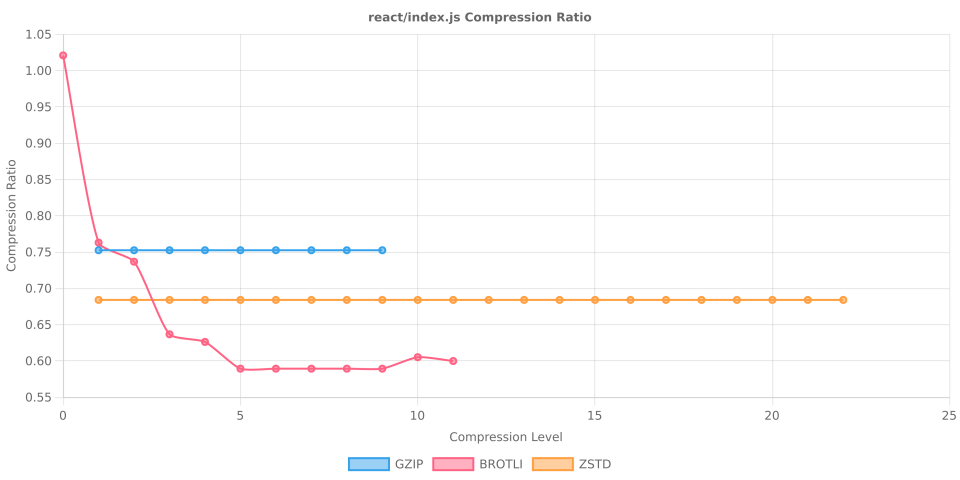

# Node Compression Benchmark

Last updated: 2025-10-14T06:11:00.864Z

This benchmark measures compression time, output size, and compression ratios for several popular npm packages across all gzip, Brotli, and Zstandard compression levels.

## jquery/dist/jquery.min.js

- Original size: 87533 bytes
- Chart: 

| Algorithm | Level | Time (ms) | Size (bytes) | Compression Ratio |
| --- | --- | --- | --- | --- |
| gzip | 1 | 2.490 | 34291 | 0.3917 |
| gzip | 2 | 2.538 | 33282 | 0.3802 |
| gzip | 3 | 1.954 | 32802 | 0.3747 |
| gzip | 4 | 2.219 | 31363 | 0.3583 |
| gzip | 5 | 2.581 | 30525 | 0.3487 |
| gzip | 6 | 2.911 | 30406 | 0.3474 |
| gzip | 7 | 3.291 | 30358 | 0.3468 |
| gzip | 8 | 3.528 | 30342 | 0.3466 |
| gzip | 9 | 3.729 | 30342 | 0.3466 |
| brotli | 0 | 1.572 | 36492 | 0.4169 |
| brotli | 1 | 3.819 | 35042 | 0.4003 |
| brotli | 2 | 3.221 | 32435 | 0.3705 |
| brotli | 3 | 3.036 | 32156 | 0.3674 |
| brotli | 4 | 5.069 | 31402 | 0.3587 |
| brotli | 5 | 7.232 | 29763 | 0.3400 |
| brotli | 6 | 11.844 | 29595 | 0.3381 |
| brotli | 7 | 31.892 | 29534 | 0.3374 |
| brotli | 8 | 69.625 | 29497 | 0.3370 |
| brotli | 9 | 130.416 | 29478 | 0.3368 |
| brotli | 10 | 72.030 | 27918 | 0.3189 |
| brotli | 11 | 183.136 | 27445 | 0.3135 |
| zstd | 1 | 3.020 | 32250 | 0.3684 |
| zstd | 2 | 0.885 | 32250 | 0.3684 |
| zstd | 3 | 0.802 | 32250 | 0.3684 |
| zstd | 4 | 1.062 | 32250 | 0.3684 |
| zstd | 5 | 3.431 | 32250 | 0.3684 |
| zstd | 6 | 0.890 | 32250 | 0.3684 |
| zstd | 7 | 0.997 | 32250 | 0.3684 |
| zstd | 8 | 3.248 | 32250 | 0.3684 |
| zstd | 9 | 1.977 | 32250 | 0.3684 |
| zstd | 10 | 0.944 | 32250 | 0.3684 |
| zstd | 11 | 1.011 | 32250 | 0.3684 |
| zstd | 12 | 0.697 | 32250 | 0.3684 |
| zstd | 13 | 0.745 | 32250 | 0.3684 |
| zstd | 14 | 0.730 | 32250 | 0.3684 |
| zstd | 15 | 0.720 | 32250 | 0.3684 |
| zstd | 16 | 0.708 | 32250 | 0.3684 |
| zstd | 17 | 0.712 | 32250 | 0.3684 |
| zstd | 18 | 2.656 | 32250 | 0.3684 |
| zstd | 19 | 3.514 | 32250 | 0.3684 |
| zstd | 20 | 3.297 | 32250 | 0.3684 |
| zstd | 21 | 4.509 | 32250 | 0.3684 |
| zstd | 22 | 4.828 | 32250 | 0.3684 |

## @expo-google-fonts/noto-sans-jp/NotoSansJP_400Regular.ttf

- Original size: 4548208 bytes
- Chart: 

| Algorithm | Level | Time (ms) | Size (bytes) | Compression Ratio |
| --- | --- | --- | --- | --- |
| gzip | 1 | 158.631 | 3944954 | 0.8674 |
| gzip | 2 | 161.823 | 3940832 | 0.8665 |
| gzip | 3 | 165.230 | 3939509 | 0.8662 |
| gzip | 4 | 178.715 | 3932798 | 0.8647 |
| gzip | 5 | 166.807 | 3927840 | 0.8636 |
| gzip | 6 | 167.197 | 3927057 | 0.8634 |
| gzip | 7 | 172.458 | 3926816 | 0.8634 |
| gzip | 8 | 213.748 | 3926489 | 0.8633 |
| gzip | 9 | 211.304 | 3926321 | 0.8633 |
| brotli | 0 | 19.812 | 4151807 | 0.9128 |
| brotli | 1 | 22.413 | 4096540 | 0.9007 |
| brotli | 2 | 56.265 | 4050843 | 0.8906 |
| brotli | 3 | 66.493 | 4041605 | 0.8886 |
| brotli | 4 | 80.881 | 4019269 | 0.8837 |
| brotli | 5 | 198.285 | 3913415 | 0.8604 |
| brotli | 6 | 357.069 | 3876835 | 0.8524 |
| brotli | 7 | 630.890 | 3845814 | 0.8456 |
| brotli | 8 | 706.079 | 3837329 | 0.8437 |
| brotli | 9 | 1883.928 | 3704181 | 0.8144 |
| brotli | 10 | 12231.290 | 3433866 | 0.7550 |
| brotli | 11 | 24753.577 | 3387424 | 0.7448 |
| zstd | 1 | 38.604 | 3989261 | 0.8771 |
| zstd | 2 | 38.582 | 3989261 | 0.8771 |
| zstd | 3 | 39.564 | 3989261 | 0.8771 |
| zstd | 4 | 38.526 | 3989261 | 0.8771 |
| zstd | 5 | 39.065 | 3989261 | 0.8771 |
| zstd | 6 | 38.673 | 3989261 | 0.8771 |
| zstd | 7 | 38.310 | 3989261 | 0.8771 |
| zstd | 8 | 37.811 | 3989261 | 0.8771 |
| zstd | 9 | 38.364 | 3989261 | 0.8771 |
| zstd | 10 | 38.615 | 3989261 | 0.8771 |
| zstd | 11 | 38.343 | 3989261 | 0.8771 |
| zstd | 12 | 48.501 | 3989261 | 0.8771 |
| zstd | 13 | 38.547 | 3989261 | 0.8771 |
| zstd | 14 | 37.037 | 3989261 | 0.8771 |
| zstd | 15 | 37.739 | 3989261 | 0.8771 |
| zstd | 16 | 37.387 | 3989261 | 0.8771 |
| zstd | 17 | 37.499 | 3989261 | 0.8771 |
| zstd | 18 | 37.552 | 3989261 | 0.8771 |
| zstd | 19 | 37.956 | 3989261 | 0.8771 |
| zstd | 20 | 38.471 | 3989261 | 0.8771 |
| zstd | 21 | 38.487 | 3989261 | 0.8771 |
| zstd | 22 | 37.403 | 3989261 | 0.8771 |

## react/index.js

- Original size: 190 bytes
- Chart: 

| Algorithm | Level | Time (ms) | Size (bytes) | Compression Ratio |
| --- | --- | --- | --- | --- |
| gzip | 1 | 0.385 | 143 | 0.7526 |
| gzip | 2 | 0.056 | 143 | 0.7526 |
| gzip | 3 | 0.062 | 143 | 0.7526 |
| gzip | 4 | 0.055 | 143 | 0.7526 |
| gzip | 5 | 0.037 | 143 | 0.7526 |
| gzip | 6 | 0.041 | 143 | 0.7526 |
| gzip | 7 | 0.028 | 143 | 0.7526 |
| gzip | 8 | 0.080 | 143 | 0.7526 |
| gzip | 9 | 0.025 | 143 | 0.7526 |
| brotli | 0 | 0.218 | 194 | 1.0211 |
| brotli | 1 | 0.058 | 145 | 0.7632 |
| brotli | 2 | 0.034 | 140 | 0.7368 |
| brotli | 3 | 0.054 | 121 | 0.6368 |
| brotli | 4 | 0.142 | 119 | 0.6263 |
| brotli | 5 | 0.096 | 112 | 0.5895 |
| brotli | 6 | 0.067 | 112 | 0.5895 |
| brotli | 7 | 0.050 | 112 | 0.5895 |
| brotli | 8 | 0.047 | 112 | 0.5895 |
| brotli | 9 | 4.116 | 112 | 0.5895 |
| brotli | 10 | 1.299 | 115 | 0.6053 |
| brotli | 11 | 1.171 | 114 | 0.6000 |
| zstd | 1 | 0.166 | 130 | 0.6842 |
| zstd | 2 | 0.041 | 130 | 0.6842 |
| zstd | 3 | 0.049 | 130 | 0.6842 |
| zstd | 4 | 0.038 | 130 | 0.6842 |
| zstd | 5 | 0.045 | 130 | 0.6842 |
| zstd | 6 | 0.032 | 130 | 0.6842 |
| zstd | 7 | 0.030 | 130 | 0.6842 |
| zstd | 8 | 0.078 | 130 | 0.6842 |
| zstd | 9 | 0.033 | 130 | 0.6842 |
| zstd | 10 | 0.058 | 130 | 0.6842 |
| zstd | 11 | 0.033 | 130 | 0.6842 |
| zstd | 12 | 0.057 | 130 | 0.6842 |
| zstd | 13 | 0.049 | 130 | 0.6842 |
| zstd | 14 | 0.032 | 130 | 0.6842 |
| zstd | 15 | 0.030 | 130 | 0.6842 |
| zstd | 16 | 0.031 | 130 | 0.6842 |
| zstd | 17 | 0.030 | 130 | 0.6842 |
| zstd | 18 | 0.030 | 130 | 0.6842 |
| zstd | 19 | 0.030 | 130 | 0.6842 |
| zstd | 20 | 0.030 | 130 | 0.6842 |
| zstd | 21 | 0.030 | 130 | 0.6842 |
| zstd | 22 | 0.030 | 130 | 0.6842 |

## moment/min/moment.min.js

- Original size: 58890 bytes
- Chart: 

| Algorithm | Level | Time (ms) | Size (bytes) | Compression Ratio |
| --- | --- | --- | --- | --- |
| gzip | 1 | 1.386 | 21216 | 0.3603 |
| gzip | 2 | 0.926 | 20666 | 0.3509 |
| gzip | 3 | 1.011 | 20354 | 0.3456 |
| gzip | 4 | 1.195 | 19475 | 0.3307 |
| gzip | 5 | 1.723 | 18991 | 0.3225 |
| gzip | 6 | 1.711 | 18892 | 0.3208 |
| gzip | 7 | 2.090 | 18860 | 0.3203 |
| gzip | 8 | 2.288 | 18845 | 0.3200 |
| gzip | 9 | 2.204 | 18845 | 0.3200 |
| brotli | 0 | 0.372 | 22733 | 0.3860 |
| brotli | 1 | 0.616 | 22170 | 0.3765 |
| brotli | 2 | 0.843 | 20291 | 0.3446 |
| brotli | 3 | 1.017 | 20119 | 0.3416 |
| brotli | 4 | 1.612 | 19713 | 0.3347 |
| brotli | 5 | 2.628 | 18447 | 0.3132 |
| brotli | 6 | 2.672 | 18343 | 0.3115 |
| brotli | 7 | 3.926 | 18239 | 0.3097 |
| brotli | 8 | 3.929 | 18216 | 0.3093 |
| brotli | 9 | 118.615 | 18172 | 0.3086 |
| brotli | 10 | 45.198 | 17405 | 0.2956 |
| brotli | 11 | 115.960 | 17004 | 0.2887 |
| zstd | 1 | 0.702 | 20298 | 0.3447 |
| zstd | 2 | 0.614 | 20298 | 0.3447 |
| zstd | 3 | 0.516 | 20298 | 0.3447 |
| zstd | 4 | 0.487 | 20298 | 0.3447 |
| zstd | 5 | 0.464 | 20298 | 0.3447 |
| zstd | 6 | 0.500 | 20298 | 0.3447 |
| zstd | 7 | 0.567 | 20298 | 0.3447 |
| zstd | 8 | 0.558 | 20298 | 0.3447 |
| zstd | 9 | 0.530 | 20298 | 0.3447 |
| zstd | 10 | 0.455 | 20298 | 0.3447 |
| zstd | 11 | 0.503 | 20298 | 0.3447 |
| zstd | 12 | 0.479 | 20298 | 0.3447 |
| zstd | 13 | 0.476 | 20298 | 0.3447 |
| zstd | 14 | 0.513 | 20298 | 0.3447 |
| zstd | 15 | 0.553 | 20298 | 0.3447 |
| zstd | 16 | 0.538 | 20298 | 0.3447 |
| zstd | 17 | 0.533 | 20298 | 0.3447 |
| zstd | 18 | 0.410 | 20298 | 0.3447 |
| zstd | 19 | 0.396 | 20298 | 0.3447 |
| zstd | 20 | 0.392 | 20298 | 0.3447 |
| zstd | 21 | 0.422 | 20298 | 0.3447 |
| zstd | 22 | 0.391 | 20298 | 0.3447 |

## vue/dist/vue.global.prod.js

- Original size: 159632 bytes
- Chart: 

| Algorithm | Level | Time (ms) | Size (bytes) | Compression Ratio |
| --- | --- | --- | --- | --- |
| gzip | 1 | 3.220 | 65356 | 0.4094 |
| gzip | 2 | 3.074 | 63714 | 0.3991 |
| gzip | 3 | 3.816 | 62869 | 0.3938 |
| gzip | 4 | 3.925 | 60555 | 0.3793 |
| gzip | 5 | 4.863 | 59000 | 0.3696 |
| gzip | 6 | 6.004 | 58718 | 0.3678 |
| gzip | 7 | 6.367 | 58679 | 0.3676 |
| gzip | 8 | 6.809 | 58664 | 0.3675 |
| gzip | 9 | 6.760 | 58664 | 0.3675 |
| brotli | 0 | 1.296 | 69659 | 0.4364 |
| brotli | 1 | 1.330 | 66737 | 0.4181 |
| brotli | 2 | 2.493 | 61654 | 0.3862 |
| brotli | 3 | 2.701 | 61073 | 0.3826 |
| brotli | 4 | 4.235 | 59860 | 0.3750 |
| brotli | 5 | 7.286 | 56680 | 0.3551 |
| brotli | 6 | 8.682 | 56313 | 0.3528 |
| brotli | 7 | 10.311 | 56043 | 0.3511 |
| brotli | 8 | 11.465 | 55935 | 0.3504 |
| brotli | 9 | 149.791 | 55876 | 0.3500 |
| brotli | 10 | 144.825 | 53247 | 0.3336 |
| brotli | 11 | 363.722 | 52239 | 0.3272 |
| zstd | 1 | 1.766 | 61375 | 0.3845 |
| zstd | 2 | 1.377 | 61375 | 0.3845 |
| zstd | 3 | 1.464 | 61375 | 0.3845 |
| zstd | 4 | 1.328 | 61375 | 0.3845 |
| zstd | 5 | 1.320 | 61375 | 0.3845 |
| zstd | 6 | 1.473 | 61375 | 0.3845 |
| zstd | 7 | 1.342 | 61375 | 0.3845 |
| zstd | 8 | 1.344 | 61375 | 0.3845 |
| zstd | 9 | 1.415 | 61375 | 0.3845 |
| zstd | 10 | 1.327 | 61375 | 0.3845 |
| zstd | 11 | 1.351 | 61375 | 0.3845 |
| zstd | 12 | 1.452 | 61375 | 0.3845 |
| zstd | 13 | 1.354 | 61375 | 0.3845 |
| zstd | 14 | 1.355 | 61375 | 0.3845 |
| zstd | 15 | 1.423 | 61375 | 0.3845 |
| zstd | 16 | 1.349 | 61375 | 0.3845 |
| zstd | 17 | 1.427 | 61375 | 0.3845 |
| zstd | 18 | 1.412 | 61375 | 0.3845 |
| zstd | 19 | 1.320 | 61375 | 0.3845 |
| zstd | 20 | 1.493 | 61375 | 0.3845 |
| zstd | 21 | 1.417 | 61375 | 0.3845 |
| zstd | 22 | 1.664 | 61375 | 0.3845 |

## lodash/lodash.min.js

- Original size: 73015 bytes
- Chart: 

| Algorithm | Level | Time (ms) | Size (bytes) | Compression Ratio |
| --- | --- | --- | --- | --- |
| gzip | 1 | 1.526 | 28848 | 0.3951 |
| gzip | 2 | 1.315 | 28250 | 0.3869 |
| gzip | 3 | 1.380 | 27778 | 0.3804 |
| gzip | 4 | 1.521 | 27025 | 0.3701 |
| gzip | 5 | 2.034 | 26172 | 0.3584 |
| gzip | 6 | 2.403 | 26014 | 0.3563 |
| gzip | 7 | 2.813 | 25988 | 0.3559 |
| gzip | 8 | 3.653 | 25968 | 0.3557 |
| gzip | 9 | 3.602 | 25968 | 0.3557 |
| brotli | 0 | 0.638 | 31067 | 0.4255 |
| brotli | 1 | 0.651 | 29876 | 0.4092 |
| brotli | 2 | 1.071 | 27471 | 0.3762 |
| brotli | 3 | 1.146 | 27246 | 0.3732 |
| brotli | 4 | 1.902 | 26751 | 0.3664 |
| brotli | 5 | 3.352 | 25220 | 0.3454 |
| brotli | 6 | 3.408 | 25102 | 0.3438 |
| brotli | 7 | 4.448 | 24969 | 0.3420 |
| brotli | 8 | 4.853 | 24946 | 0.3417 |
| brotli | 9 | 125.766 | 24897 | 0.3410 |
| brotli | 10 | 56.512 | 23428 | 0.3209 |
| brotli | 11 | 148.634 | 23089 | 0.3162 |
| zstd | 1 | 0.740 | 27523 | 0.3769 |
| zstd | 2 | 0.606 | 27523 | 0.3769 |
| zstd | 3 | 0.634 | 27523 | 0.3769 |
| zstd | 4 | 0.578 | 27523 | 0.3769 |
| zstd | 5 | 0.516 | 27523 | 0.3769 |
| zstd | 6 | 0.546 | 27523 | 0.3769 |
| zstd | 7 | 0.509 | 27523 | 0.3769 |
| zstd | 8 | 0.534 | 27523 | 0.3769 |
| zstd | 9 | 0.516 | 27523 | 0.3769 |
| zstd | 10 | 0.655 | 27523 | 0.3769 |
| zstd | 11 | 0.503 | 27523 | 0.3769 |
| zstd | 12 | 0.545 | 27523 | 0.3769 |
| zstd | 13 | 0.517 | 27523 | 0.3769 |
| zstd | 14 | 0.539 | 27523 | 0.3769 |
| zstd | 15 | 0.503 | 27523 | 0.3769 |
| zstd | 16 | 0.551 | 27523 | 0.3769 |
| zstd | 17 | 0.557 | 27523 | 0.3769 |
| zstd | 18 | 0.575 | 27523 | 0.3769 |
| zstd | 19 | 0.513 | 27523 | 0.3769 |
| zstd | 20 | 0.533 | 27523 | 0.3769 |
| zstd | 21 | 0.527 | 27523 | 0.3769 |
| zstd | 22 | 0.524 | 27523 | 0.3769 |

## normalize.css/normalize.css

- Original size: 6138 bytes
- Chart: 

| Algorithm | Level | Time (ms) | Size (bytes) | Compression Ratio |
| --- | --- | --- | --- | --- |
| gzip | 1 | 0.303 | 1915 | 0.3120 |
| gzip | 2 | 0.206 | 1866 | 0.3040 |
| gzip | 3 | 0.179 | 1845 | 0.3006 |
| gzip | 4 | 0.158 | 1758 | 0.2864 |
| gzip | 5 | 0.224 | 1722 | 0.2805 |
| gzip | 6 | 0.230 | 1722 | 0.2805 |
| gzip | 7 | 0.165 | 1722 | 0.2805 |
| gzip | 8 | 0.146 | 1720 | 0.2802 |
| gzip | 9 | 0.128 | 1720 | 0.2802 |
| brotli | 0 | 0.135 | 2089 | 0.3403 |
| brotli | 1 | 0.138 | 2056 | 0.3350 |
| brotli | 2 | 0.374 | 1909 | 0.3110 |
| brotli | 3 | 0.339 | 1834 | 0.2988 |
| brotli | 4 | 0.433 | 1694 | 0.2760 |
| brotli | 5 | 0.449 | 1557 | 0.2537 |
| brotli | 6 | 0.425 | 1559 | 0.2540 |
| brotli | 7 | 0.459 | 1555 | 0.2533 |
| brotli | 8 | 0.508 | 1555 | 0.2533 |
| brotli | 9 | 27.745 | 1557 | 0.2537 |
| brotli | 10 | 4.878 | 1431 | 0.2331 |
| brotli | 11 | 11.488 | 1398 | 0.2278 |
| zstd | 1 | 0.127 | 1853 | 0.3019 |
| zstd | 2 | 0.077 | 1853 | 0.3019 |
| zstd | 3 | 0.174 | 1853 | 0.3019 |
| zstd | 4 | 0.092 | 1853 | 0.3019 |
| zstd | 5 | 0.119 | 1853 | 0.3019 |
| zstd | 6 | 0.098 | 1853 | 0.3019 |
| zstd | 7 | 0.080 | 1853 | 0.3019 |
| zstd | 8 | 0.103 | 1853 | 0.3019 |
| zstd | 9 | 0.092 | 1853 | 0.3019 |
| zstd | 10 | 0.067 | 1853 | 0.3019 |
| zstd | 11 | 0.095 | 1853 | 0.3019 |
| zstd | 12 | 0.062 | 1853 | 0.3019 |
| zstd | 13 | 0.058 | 1853 | 0.3019 |
| zstd | 14 | 0.065 | 1853 | 0.3019 |
| zstd | 15 | 0.064 | 1853 | 0.3019 |
| zstd | 16 | 0.093 | 1853 | 0.3019 |
| zstd | 17 | 0.130 | 1853 | 0.3019 |
| zstd | 18 | 0.069 | 1853 | 0.3019 |
| zstd | 19 | 0.064 | 1853 | 0.3019 |
| zstd | 20 | 0.062 | 1853 | 0.3019 |
| zstd | 21 | 0.060 | 1853 | 0.3019 |
| zstd | 22 | 0.062 | 1853 | 0.3019 |

## bootstrap/dist/css/bootstrap.min.css

- Original size: 232111 bytes
- Chart: 

| Algorithm | Level | Time (ms) | Size (bytes) | Compression Ratio |
| --- | --- | --- | --- | --- |
| gzip | 1 | 2.068 | 41452 | 0.1786 |
| gzip | 2 | 1.862 | 38418 | 0.1655 |
| gzip | 3 | 2.016 | 36152 | 0.1558 |
| gzip | 4 | 2.416 | 33830 | 0.1457 |
| gzip | 5 | 3.098 | 31408 | 0.1353 |
| gzip | 6 | 3.899 | 30823 | 0.1328 |
| gzip | 7 | 4.714 | 30680 | 0.1322 |
| gzip | 8 | 6.424 | 30670 | 0.1321 |
| gzip | 9 | 6.398 | 30669 | 0.1321 |
| brotli | 0 | 0.811 | 43268 | 0.1864 |
| brotli | 1 | 0.948 | 39941 | 0.1721 |
| brotli | 2 | 1.698 | 36514 | 0.1573 |
| brotli | 3 | 2.119 | 34781 | 0.1498 |
| brotli | 4 | 3.103 | 33048 | 0.1424 |
| brotli | 5 | 4.636 | 28253 | 0.1217 |
| brotli | 6 | 5.097 | 27431 | 0.1182 |
| brotli | 7 | 6.507 | 26971 | 0.1162 |
| brotli | 8 | 7.501 | 26813 | 0.1155 |
| brotli | 9 | 116.690 | 26569 | 0.1145 |
| brotli | 10 | 151.807 | 23482 | 0.1012 |
| brotli | 11 | 463.642 | 22970 | 0.0990 |
| zstd | 1 | 1.176 | 34393 | 0.1482 |
| zstd | 2 | 0.949 | 34393 | 0.1482 |
| zstd | 3 | 1.021 | 34393 | 0.1482 |
| zstd | 4 | 0.843 | 34393 | 0.1482 |
| zstd | 5 | 0.879 | 34393 | 0.1482 |
| zstd | 6 | 0.860 | 34393 | 0.1482 |
| zstd | 7 | 0.865 | 34393 | 0.1482 |
| zstd | 8 | 0.917 | 34393 | 0.1482 |
| zstd | 9 | 0.825 | 34393 | 0.1482 |
| zstd | 10 | 0.823 | 34393 | 0.1482 |
| zstd | 11 | 0.826 | 34393 | 0.1482 |
| zstd | 12 | 0.906 | 34393 | 0.1482 |
| zstd | 13 | 0.911 | 34393 | 0.1482 |
| zstd | 14 | 0.870 | 34393 | 0.1482 |
| zstd | 15 | 0.879 | 34393 | 0.1482 |
| zstd | 16 | 0.887 | 34393 | 0.1482 |
| zstd | 17 | 0.938 | 34393 | 0.1482 |
| zstd | 18 | 0.863 | 34393 | 0.1482 |
| zstd | 19 | 0.890 | 34393 | 0.1482 |
| zstd | 20 | 0.867 | 34393 | 0.1482 |
| zstd | 21 | 0.937 | 34393 | 0.1482 |
| zstd | 22 | 0.851 | 34393 | 0.1482 |

## tailwindcss/stubs/config.full.js

- Original size: 24958 bytes
- Chart: 

| Algorithm | Level | Time (ms) | Size (bytes) | Compression Ratio |
| --- | --- | --- | --- | --- |
| gzip | 1 | 0.403 | 5347 | 0.2142 |
| gzip | 2 | 0.381 | 5209 | 0.2087 |
| gzip | 3 | 0.282 | 5129 | 0.2055 |
| gzip | 4 | 0.336 | 4798 | 0.1922 |
| gzip | 5 | 0.433 | 4607 | 0.1846 |
| gzip | 6 | 0.514 | 4567 | 0.1830 |
| gzip | 7 | 0.542 | 4544 | 0.1821 |
| gzip | 8 | 0.954 | 4548 | 0.1822 |
| gzip | 9 | 0.994 | 4548 | 0.1822 |
| brotli | 0 | 0.172 | 5742 | 0.2301 |
| brotli | 1 | 0.292 | 5634 | 0.2257 |
| brotli | 2 | 0.392 | 4904 | 0.1965 |
| brotli | 3 | 0.380 | 4796 | 0.1922 |
| brotli | 4 | 0.565 | 4682 | 0.1876 |
| brotli | 5 | 0.698 | 4270 | 0.1711 |
| brotli | 6 | 0.763 | 4247 | 0.1702 |
| brotli | 7 | 0.926 | 4230 | 0.1695 |
| brotli | 8 | 1.067 | 4221 | 0.1691 |
| brotli | 9 | 48.472 | 4189 | 0.1678 |
| brotli | 10 | 12.369 | 3941 | 0.1579 |
| brotli | 11 | 39.532 | 3833 | 0.1536 |
| zstd | 1 | 0.323 | 4958 | 0.1987 |
| zstd | 2 | 0.542 | 4958 | 0.1987 |
| zstd | 3 | 0.322 | 4958 | 0.1987 |
| zstd | 4 | 0.255 | 4958 | 0.1987 |
| zstd | 5 | 0.276 | 4958 | 0.1987 |
| zstd | 6 | 0.270 | 4958 | 0.1987 |
| zstd | 7 | 0.271 | 4958 | 0.1987 |
| zstd | 8 | 0.262 | 4958 | 0.1987 |
| zstd | 9 | 0.263 | 4958 | 0.1987 |
| zstd | 10 | 0.294 | 4958 | 0.1987 |
| zstd | 11 | 0.312 | 4958 | 0.1987 |
| zstd | 12 | 0.268 | 4958 | 0.1987 |
| zstd | 13 | 0.273 | 4958 | 0.1987 |
| zstd | 14 | 0.260 | 4958 | 0.1987 |
| zstd | 15 | 0.256 | 4958 | 0.1987 |
| zstd | 16 | 0.265 | 4958 | 0.1987 |
| zstd | 17 | 0.260 | 4958 | 0.1987 |
| zstd | 18 | 0.268 | 4958 | 0.1987 |
| zstd | 19 | 0.267 | 4958 | 0.1987 |
| zstd | 20 | 0.261 | 4958 | 0.1987 |
| zstd | 21 | 0.442 | 4958 | 0.1987 |
| zstd | 22 | 0.279 | 4958 | 0.1987 |
