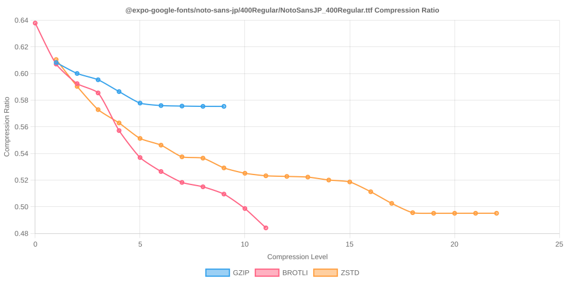
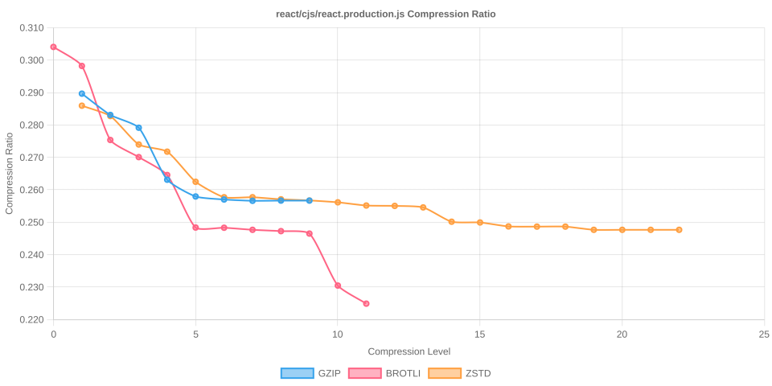
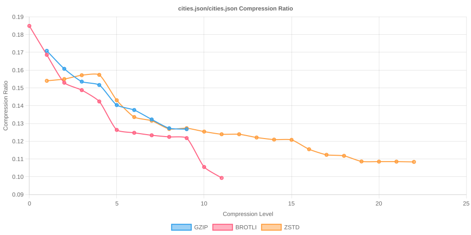
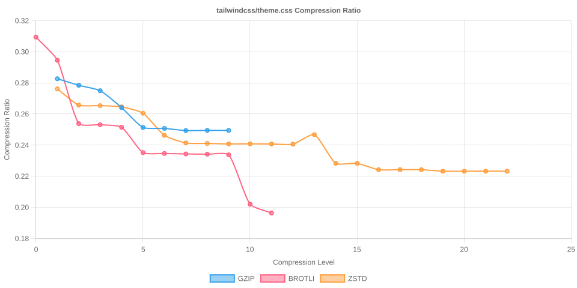

# Node Compression Benchmark

Last updated: 2025-12-13T00:47:13.705Z

This benchmark measures compression time, output size, and compression ratios for several popular npm packages across all gzip, Brotli, and Zstandard compression levels.

## jquery/dist/jquery.min.js

- Original size: 87,533 bytes
- Chart: 

| Algorithm | Level | Time (ms) | Size (bytes) | Compression Ratio |
| --- | --- | --- | --- | --- |
| gzip | 1 | 1.040 | 34,291 | 0.3917 |
| gzip | 2 | 1.130 | 33,282 | 0.3802 |
| gzip | 3 | 1.179 | 32,802 | 0.3747 |
| gzip | 4 | 1.348 | 31,363 | 0.3583 |
| gzip | 5 | 1.737 | 30,525 | 0.3487 |
| gzip | 6 | 2.046 | 30,406 | 0.3474 |
| gzip | 7 | 2.241 | 30,358 | 0.3468 |
| gzip | 8 | 2.558 | 30,342 | 0.3466 |
| gzip | 9 | 2.525 | 30,342 | 0.3466 |
| brotli | 0 | 0.407 | 36,492 | 0.4169 |
| brotli | 1 | 0.534 | 35,042 | 0.4003 |
| brotli | 2 | 0.861 | 32,435 | 0.3705 |
| brotli | 3 | 1.005 | 32,156 | 0.3674 |
| brotli | 4 | 1.650 | 31,402 | 0.3587 |
| brotli | 5 | 2.441 | 29,763 | 0.3400 |
| brotli | 6 | 2.482 | 29,595 | 0.3381 |
| brotli | 7 | 3.687 | 29,534 | 0.3374 |
| brotli | 8 | 3.184 | 29,497 | 0.3370 |
| brotli | 9 | 6.655 | 29,478 | 0.3368 |
| brotli | 10 | 42.249 | 27,918 | 0.3189 |
| brotli | 11 | 120.954 | 27,445 | 0.3135 |
| zstd | 1 | 0.341 | 34,450 | 0.3936 |
| zstd | 2 | 0.406 | 33,281 | 0.3802 |
| zstd | 3 | 0.458 | 32,250 | 0.3684 |
| zstd | 4 | 0.698 | 32,190 | 0.3677 |
| zstd | 5 | 1.431 | 31,247 | 0.3570 |
| zstd | 6 | 1.741 | 30,417 | 0.3475 |
| zstd | 7 | 2.031 | 30,146 | 0.3444 |
| zstd | 8 | 2.166 | 29,980 | 0.3425 |
| zstd | 9 | 2.435 | 29,839 | 0.3409 |
| zstd | 10 | 2.676 | 29,761 | 0.3400 |
| zstd | 11 | 4.741 | 29,660 | 0.3388 |
| zstd | 12 | 5.124 | 29,659 | 0.3388 |
| zstd | 13 | 7.092 | 29,522 | 0.3373 |
| zstd | 14 | 9.370 | 29,032 | 0.3317 |
| zstd | 15 | 10.158 | 29,030 | 0.3316 |
| zstd | 16 | 13.737 | 28,947 | 0.3307 |
| zstd | 17 | 13.838 | 28,947 | 0.3307 |
| zstd | 18 | 13.365 | 28,947 | 0.3307 |
| zstd | 19 | 25.356 | 28,896 | 0.3301 |
| zstd | 20 | 26.027 | 28,896 | 0.3301 |
| zstd | 21 | 26.159 | 28,896 | 0.3301 |
| zstd | 22 | 26.088 | 28,896 | 0.3301 |

## @expo-google-fonts/noto-sans-jp/400Regular/NotoSansJP_400Regular.ttf

- Original size: 5,450,308 bytes
- Chart: 

| Algorithm | Level | Time (ms) | Size (bytes) | Compression Ratio |
| --- | --- | --- | --- | --- |
| gzip | 1 | 83.890 | 3,315,019 | 0.6082 |
| gzip | 2 | 87.697 | 3,270,341 | 0.6000 |
| gzip | 3 | 91.674 | 3,244,654 | 0.5953 |
| gzip | 4 | 104.714 | 3,196,168 | 0.5864 |
| gzip | 5 | 121.032 | 3,149,241 | 0.5778 |
| gzip | 6 | 134.770 | 3,139,085 | 0.5759 |
| gzip | 7 | 142.265 | 3,137,019 | 0.5756 |
| gzip | 8 | 160.389 | 3,135,947 | 0.5754 |
| gzip | 9 | 171.132 | 3,135,848 | 0.5754 |
| brotli | 0 | 20.326 | 3,476,454 | 0.6378 |
| brotli | 1 | 28.428 | 3,308,794 | 0.6071 |
| brotli | 2 | 47.500 | 3,228,812 | 0.5924 |
| brotli | 3 | 61.926 | 3,190,772 | 0.5854 |
| brotli | 4 | 87.373 | 3,036,811 | 0.5572 |
| brotli | 5 | 229.524 | 2,926,500 | 0.5369 |
| brotli | 6 | 339.074 | 2,869,372 | 0.5265 |
| brotli | 7 | 500.940 | 2,824,711 | 0.5183 |
| brotli | 8 | 682.072 | 2,806,874 | 0.5150 |
| brotli | 9 | 931.727 | 2,777,066 | 0.5095 |
| brotli | 10 | 6471.708 | 2,717,974 | 0.4987 |
| brotli | 11 | 13628.625 | 2,638,845 | 0.4842 |
| zstd | 1 | 18.817 | 3,327,284 | 0.6105 |
| zstd | 2 | 23.240 | 3,217,557 | 0.5903 |
| zstd | 3 | 37.646 | 3,122,493 | 0.5729 |
| zstd | 4 | 40.346 | 3,067,941 | 0.5629 |
| zstd | 5 | 66.870 | 3,004,712 | 0.5513 |
| zstd | 6 | 79.663 | 2,977,265 | 0.5463 |
| zstd | 7 | 86.016 | 2,929,435 | 0.5375 |
| zstd | 8 | 104.457 | 2,924,034 | 0.5365 |
| zstd | 9 | 108.402 | 2,884,126 | 0.5292 |
| zstd | 10 | 135.654 | 2,862,234 | 0.5252 |
| zstd | 11 | 190.983 | 2,851,888 | 0.5233 |
| zstd | 12 | 221.005 | 2,849,333 | 0.5228 |
| zstd | 13 | 568.560 | 2,846,584 | 0.5223 |
| zstd | 14 | 560.784 | 2,834,540 | 0.5201 |
| zstd | 15 | 687.267 | 2,826,702 | 0.5186 |
| zstd | 16 | 914.150 | 2,786,628 | 0.5113 |
| zstd | 17 | 885.321 | 2,739,020 | 0.5025 |
| zstd | 18 | 1267.625 | 2,700,903 | 0.4956 |
| zstd | 19 | 1486.098 | 2,698,571 | 0.4951 |
| zstd | 20 | 1450.162 | 2,698,571 | 0.4951 |
| zstd | 21 | 1384.845 | 2,698,640 | 0.4951 |
| zstd | 22 | 1416.227 | 2,698,640 | 0.4951 |

## react/cjs/react.production.js

- Original size: 17,217 bytes
- Chart: 

| Algorithm | Level | Time (ms) | Size (bytes) | Compression Ratio |
| --- | --- | --- | --- | --- |
| gzip | 1 | 0.129 | 4,987 | 0.2897 |
| gzip | 2 | 0.135 | 4,874 | 0.2831 |
| gzip | 3 | 0.151 | 4,805 | 0.2791 |
| gzip | 4 | 0.187 | 4,530 | 0.2631 |
| gzip | 5 | 0.233 | 4,440 | 0.2579 |
| gzip | 6 | 0.268 | 4,425 | 0.2570 |
| gzip | 7 | 0.312 | 4,417 | 0.2565 |
| gzip | 8 | 0.454 | 4,418 | 0.2566 |
| gzip | 9 | 0.462 | 4,418 | 0.2566 |
| brotli | 0 | 0.062 | 5,234 | 0.3040 |
| brotli | 1 | 0.080 | 5,132 | 0.2981 |
| brotli | 2 | 0.133 | 4,740 | 0.2753 |
| brotli | 3 | 0.162 | 4,649 | 0.2700 |
| brotli | 4 | 0.291 | 4,555 | 0.2646 |
| brotli | 5 | 0.369 | 4,276 | 0.2484 |
| brotli | 6 | 0.372 | 4,275 | 0.2483 |
| brotli | 7 | 0.465 | 4,264 | 0.2477 |
| brotli | 8 | 0.472 | 4,257 | 0.2473 |
| brotli | 9 | 0.551 | 4,243 | 0.2464 |
| brotli | 10 | 7.129 | 3,968 | 0.2305 |
| brotli | 11 | 20.945 | 3,876 | 0.2251 |
| zstd | 1 | 0.075 | 4,924 | 0.2860 |
| zstd | 2 | 0.070 | 4,868 | 0.2827 |
| zstd | 3 | 0.099 | 4,718 | 0.2740 |
| zstd | 4 | 0.104 | 4,678 | 0.2717 |
| zstd | 5 | 0.227 | 4,518 | 0.2624 |
| zstd | 6 | 0.267 | 4,437 | 0.2577 |
| zstd | 7 | 0.285 | 4,435 | 0.2576 |
| zstd | 8 | 0.327 | 4,425 | 0.2570 |
| zstd | 9 | 0.358 | 4,419 | 0.2567 |
| zstd | 10 | 0.406 | 4,410 | 0.2561 |
| zstd | 11 | 0.670 | 4,393 | 0.2552 |
| zstd | 12 | 0.698 | 4,391 | 0.2550 |
| zstd | 13 | 0.949 | 4,381 | 0.2545 |
| zstd | 14 | 1.501 | 4,305 | 0.2500 |
| zstd | 15 | 1.581 | 4,302 | 0.2499 |
| zstd | 16 | 2.606 | 4,282 | 0.2487 |
| zstd | 17 | 2.749 | 4,281 | 0.2486 |
| zstd | 18 | 2.739 | 4,281 | 0.2486 |
| zstd | 19 | 5.334 | 4,263 | 0.2476 |
| zstd | 20 | 5.342 | 4,263 | 0.2476 |
| zstd | 21 | 5.357 | 4,263 | 0.2476 |
| zstd | 22 | 5.330 | 4,263 | 0.2476 |

## moment/min/moment.min.js

- Original size: 58,890 bytes
- Chart: 

| Algorithm | Level | Time (ms) | Size (bytes) | Compression Ratio |
| --- | --- | --- | --- | --- |
| gzip | 1 | 0.557 | 21,216 | 0.3603 |
| gzip | 2 | 0.594 | 20,666 | 0.3509 |
| gzip | 3 | 0.669 | 20,354 | 0.3456 |
| gzip | 4 | 0.789 | 19,475 | 0.3307 |
| gzip | 5 | 1.001 | 18,991 | 0.3225 |
| gzip | 6 | 1.229 | 18,892 | 0.3208 |
| gzip | 7 | 1.360 | 18,860 | 0.3203 |
| gzip | 8 | 1.605 | 18,845 | 0.3200 |
| gzip | 9 | 1.596 | 18,845 | 0.3200 |
| brotli | 0 | 0.219 | 22,733 | 0.3860 |
| brotli | 1 | 0.271 | 22,170 | 0.3765 |
| brotli | 2 | 0.520 | 20,291 | 0.3446 |
| brotli | 3 | 0.622 | 20,119 | 0.3416 |
| brotli | 4 | 0.990 | 19,713 | 0.3347 |
| brotli | 5 | 1.433 | 18,447 | 0.3132 |
| brotli | 6 | 1.526 | 18,343 | 0.3115 |
| brotli | 7 | 1.896 | 18,239 | 0.3097 |
| brotli | 8 | 1.957 | 18,216 | 0.3093 |
| brotli | 9 | 2.257 | 18,172 | 0.3086 |
| brotli | 10 | 26.021 | 17,405 | 0.2956 |
| brotli | 11 | 76.022 | 17,004 | 0.2887 |
| zstd | 1 | 0.206 | 21,483 | 0.3648 |
| zstd | 2 | 0.235 | 20,806 | 0.3533 |
| zstd | 3 | 0.288 | 20,298 | 0.3447 |
| zstd | 4 | 0.354 | 19,924 | 0.3383 |
| zstd | 5 | 0.723 | 19,309 | 0.3279 |
| zstd | 6 | 0.896 | 18,919 | 0.3213 |
| zstd | 7 | 1.058 | 18,815 | 0.3195 |
| zstd | 8 | 1.166 | 18,708 | 0.3177 |
| zstd | 9 | 1.286 | 18,638 | 0.3165 |
| zstd | 10 | 1.489 | 18,583 | 0.3156 |
| zstd | 11 | 2.478 | 18,520 | 0.3145 |
| zstd | 12 | 2.611 | 18,517 | 0.3144 |
| zstd | 13 | 3.734 | 18,417 | 0.3127 |
| zstd | 14 | 5.309 | 17,955 | 0.3049 |
| zstd | 15 | 5.627 | 17,942 | 0.3047 |
| zstd | 16 | 8.663 | 17,892 | 0.3038 |
| zstd | 17 | 8.936 | 17,892 | 0.3038 |
| zstd | 18 | 8.973 | 17,892 | 0.3038 |
| zstd | 19 | 17.570 | 17,845 | 0.3030 |
| zstd | 20 | 17.550 | 17,845 | 0.3030 |
| zstd | 21 | 17.527 | 17,845 | 0.3030 |
| zstd | 22 | 17.763 | 17,845 | 0.3030 |

## vue/dist/vue.global.prod.js

- Original size: 161,210 bytes
- Chart: 

| Algorithm | Level | Time (ms) | Size (bytes) | Compression Ratio |
| --- | --- | --- | --- | --- |
| gzip | 1 | 1.853 | 65,698 | 0.4075 |
| gzip | 2 | 1.986 | 64,066 | 0.3974 |
| gzip | 3 | 2.230 | 63,152 | 0.3917 |
| gzip | 4 | 2.562 | 60,820 | 0.3773 |
| gzip | 5 | 3.376 | 59,221 | 0.3674 |
| gzip | 6 | 4.207 | 58,946 | 0.3656 |
| gzip | 7 | 4.498 | 58,905 | 0.3654 |
| gzip | 8 | 4.849 | 58,890 | 0.3653 |
| gzip | 9 | 4.936 | 58,890 | 0.3653 |
| brotli | 0 | 0.712 | 69,955 | 0.4339 |
| brotli | 1 | 0.845 | 67,012 | 0.4157 |
| brotli | 2 | 1.593 | 61,925 | 0.3841 |
| brotli | 3 | 1.892 | 61,331 | 0.3804 |
| brotli | 4 | 2.931 | 60,166 | 0.3732 |
| brotli | 5 | 4.634 | 56,861 | 0.3527 |
| brotli | 6 | 5.085 | 56,537 | 0.3507 |
| brotli | 7 | 6.099 | 56,270 | 0.3490 |
| brotli | 8 | 6.740 | 56,186 | 0.3485 |
| brotli | 9 | 7.569 | 56,119 | 0.3481 |
| brotli | 10 | 95.323 | 53,508 | 0.3319 |
| brotli | 11 | 264.767 | 52,572 | 0.3261 |
| zstd | 1 | 0.644 | 64,911 | 0.4026 |
| zstd | 2 | 0.808 | 62,216 | 0.3859 |
| zstd | 3 | 1.018 | 61,629 | 0.3823 |
| zstd | 4 | 2.039 | 59,838 | 0.3712 |
| zstd | 5 | 2.291 | 59,293 | 0.3678 |
| zstd | 6 | 2.696 | 58,431 | 0.3625 |
| zstd | 7 | 2.977 | 57,629 | 0.3575 |
| zstd | 8 | 3.618 | 57,155 | 0.3545 |
| zstd | 9 | 4.214 | 56,900 | 0.3530 |
| zstd | 10 | 5.075 | 56,779 | 0.3522 |
| zstd | 11 | 8.564 | 56,525 | 0.3506 |
| zstd | 12 | 9.034 | 56,514 | 0.3506 |
| zstd | 13 | 14.959 | 55,536 | 0.3445 |
| zstd | 14 | 18.324 | 55,124 | 0.3419 |
| zstd | 15 | 19.166 | 55,102 | 0.3418 |
| zstd | 16 | 25.815 | 54,903 | 0.3406 |
| zstd | 17 | 26.064 | 54,903 | 0.3406 |
| zstd | 18 | 44.690 | 54,842 | 0.3402 |
| zstd | 19 | 44.459 | 54,842 | 0.3402 |
| zstd | 20 | 44.745 | 54,842 | 0.3402 |
| zstd | 21 | 47.773 | 54,842 | 0.3402 |
| zstd | 22 | 45.207 | 54,842 | 0.3402 |

## lodash/lodash.min.js

- Original size: 73,015 bytes
- Chart: 

| Algorithm | Level | Time (ms) | Size (bytes) | Compression Ratio |
| --- | --- | --- | --- | --- |
| gzip | 1 | 0.781 | 28,848 | 0.3951 |
| gzip | 2 | 0.857 | 28,250 | 0.3869 |
| gzip | 3 | 1.003 | 27,778 | 0.3804 |
| gzip | 4 | 1.101 | 27,025 | 0.3701 |
| gzip | 5 | 1.415 | 26,172 | 0.3584 |
| gzip | 6 | 1.774 | 26,014 | 0.3563 |
| gzip | 7 | 2.095 | 25,988 | 0.3559 |
| gzip | 8 | 2.841 | 25,968 | 0.3557 |
| gzip | 9 | 2.835 | 25,968 | 0.3557 |
| brotli | 0 | 0.312 | 31,067 | 0.4255 |
| brotli | 1 | 0.374 | 29,876 | 0.4092 |
| brotli | 2 | 0.689 | 27,471 | 0.3762 |
| brotli | 3 | 0.905 | 27,246 | 0.3732 |
| brotli | 4 | 1.334 | 26,751 | 0.3664 |
| brotli | 5 | 2.040 | 25,220 | 0.3454 |
| brotli | 6 | 2.153 | 25,102 | 0.3438 |
| brotli | 7 | 2.571 | 24,969 | 0.3420 |
| brotli | 8 | 2.776 | 24,946 | 0.3417 |
| brotli | 9 | 3.241 | 24,897 | 0.3410 |
| brotli | 10 | 40.065 | 23,428 | 0.3209 |
| brotli | 11 | 104.372 | 23,089 | 0.3162 |
| zstd | 1 | 0.278 | 29,043 | 0.3978 |
| zstd | 2 | 0.305 | 28,094 | 0.3848 |
| zstd | 3 | 0.368 | 27,523 | 0.3769 |
| zstd | 4 | 0.525 | 27,149 | 0.3718 |
| zstd | 5 | 0.851 | 26,575 | 0.3640 |
| zstd | 6 | 1.142 | 25,888 | 0.3546 |
| zstd | 7 | 1.357 | 25,718 | 0.3522 |
| zstd | 8 | 1.477 | 25,598 | 0.3506 |
| zstd | 9 | 1.673 | 25,509 | 0.3494 |
| zstd | 10 | 1.973 | 25,448 | 0.3485 |
| zstd | 11 | 3.254 | 25,374 | 0.3475 |
| zstd | 12 | 3.410 | 25,374 | 0.3475 |
| zstd | 13 | 5.310 | 25,232 | 0.3456 |
| zstd | 14 | 7.549 | 24,674 | 0.3379 |
| zstd | 15 | 7.812 | 24,659 | 0.3377 |
| zstd | 16 | 10.918 | 24,543 | 0.3361 |
| zstd | 17 | 10.931 | 24,543 | 0.3361 |
| zstd | 18 | 10.853 | 24,543 | 0.3361 |
| zstd | 19 | 20.763 | 24,504 | 0.3356 |
| zstd | 20 | 20.752 | 24,504 | 0.3356 |
| zstd | 21 | 20.886 | 24,504 | 0.3356 |
| zstd | 22 | 21.147 | 24,504 | 0.3356 |

## normalize.css/normalize.css

- Original size: 6,138 bytes
- Chart: 

| Algorithm | Level | Time (ms) | Size (bytes) | Compression Ratio |
| --- | --- | --- | --- | --- |
| gzip | 1 | 0.060 | 1,915 | 0.3120 |
| gzip | 2 | 0.045 | 1,866 | 0.3040 |
| gzip | 3 | 0.054 | 1,845 | 0.3006 |
| gzip | 4 | 0.063 | 1,758 | 0.2864 |
| gzip | 5 | 0.072 | 1,722 | 0.2805 |
| gzip | 6 | 0.061 | 1,722 | 0.2805 |
| gzip | 7 | 0.061 | 1,722 | 0.2805 |
| gzip | 8 | 0.063 | 1,720 | 0.2802 |
| gzip | 9 | 0.059 | 1,720 | 0.2802 |
| brotli | 0 | 0.029 | 2,089 | 0.3403 |
| brotli | 1 | 0.039 | 2,056 | 0.3350 |
| brotli | 2 | 0.058 | 1,909 | 0.3110 |
| brotli | 3 | 0.070 | 1,834 | 0.2988 |
| brotli | 4 | 0.140 | 1,694 | 0.2760 |
| brotli | 5 | 0.139 | 1,557 | 0.2537 |
| brotli | 6 | 0.135 | 1,559 | 0.2540 |
| brotli | 7 | 0.161 | 1,555 | 0.2533 |
| brotli | 8 | 0.152 | 1,555 | 0.2533 |
| brotli | 9 | 0.177 | 1,557 | 0.2537 |
| brotli | 10 | 3.063 | 1,431 | 0.2331 |
| brotli | 11 | 7.857 | 1,398 | 0.2278 |
| zstd | 1 | 0.047 | 1,906 | 0.3105 |
| zstd | 2 | 0.036 | 1,941 | 0.3162 |
| zstd | 3 | 0.043 | 1,853 | 0.3019 |
| zstd | 4 | 0.056 | 1,752 | 0.2854 |
| zstd | 5 | 0.066 | 1,743 | 0.2840 |
| zstd | 6 | 0.095 | 1,730 | 0.2819 |
| zstd | 7 | 0.080 | 1,729 | 0.2817 |
| zstd | 8 | 0.095 | 1,729 | 0.2817 |
| zstd | 9 | 0.157 | 1,728 | 0.2815 |
| zstd | 10 | 0.120 | 1,728 | 0.2815 |
| zstd | 11 | 0.279 | 1,722 | 0.2805 |
| zstd | 12 | 0.395 | 1,718 | 0.2799 |
| zstd | 13 | 0.623 | 1,703 | 0.2775 |
| zstd | 14 | 0.657 | 1,700 | 0.2770 |
| zstd | 15 | 0.872 | 1,700 | 0.2770 |
| zstd | 16 | 1.263 | 1,696 | 0.2763 |
| zstd | 17 | 1.521 | 1,697 | 0.2765 |
| zstd | 18 | 1.640 | 1,697 | 0.2765 |
| zstd | 19 | 1.642 | 1,697 | 0.2765 |
| zstd | 20 | 1.655 | 1,697 | 0.2765 |
| zstd | 21 | 1.631 | 1,697 | 0.2765 |
| zstd | 22 | 1.632 | 1,697 | 0.2765 |

## bootstrap/dist/css/bootstrap.min.css

- Original size: 232,111 bytes
- Chart: 

| Algorithm | Level | Time (ms) | Size (bytes) | Compression Ratio |
| --- | --- | --- | --- | --- |
| gzip | 1 | 1.117 | 41,452 | 0.1786 |
| gzip | 2 | 1.131 | 38,418 | 0.1655 |
| gzip | 3 | 1.347 | 36,152 | 0.1558 |
| gzip | 4 | 1.737 | 33,830 | 0.1457 |
| gzip | 5 | 2.174 | 31,408 | 0.1353 |
| gzip | 6 | 2.920 | 30,823 | 0.1328 |
| gzip | 7 | 3.568 | 30,680 | 0.1322 |
| gzip | 8 | 4.723 | 30,670 | 0.1321 |
| gzip | 9 | 4.814 | 30,669 | 0.1321 |
| brotli | 0 | 0.439 | 43,268 | 0.1864 |
| brotli | 1 | 0.614 | 39,941 | 0.1721 |
| brotli | 2 | 1.161 | 36,514 | 0.1573 |
| brotli | 3 | 1.431 | 34,781 | 0.1498 |
| brotli | 4 | 2.074 | 33,048 | 0.1424 |
| brotli | 5 | 2.958 | 28,253 | 0.1217 |
| brotli | 6 | 3.235 | 27,431 | 0.1182 |
| brotli | 7 | 3.901 | 26,971 | 0.1162 |
| brotli | 8 | 4.556 | 26,813 | 0.1155 |
| brotli | 9 | 5.502 | 26,569 | 0.1145 |
| brotli | 10 | 102.349 | 23,482 | 0.1012 |
| brotli | 11 | 325.560 | 22,970 | 0.0990 |
| zstd | 1 | 0.511 | 35,549 | 0.1532 |
| zstd | 2 | 0.575 | 34,301 | 0.1478 |
| zstd | 3 | 0.652 | 34,393 | 0.1482 |
| zstd | 4 | 2.214 | 30,973 | 0.1334 |
| zstd | 5 | 2.428 | 29,744 | 0.1281 |
| zstd | 6 | 2.737 | 29,727 | 0.1281 |
| zstd | 7 | 2.661 | 29,710 | 0.1280 |
| zstd | 8 | 2.956 | 28,645 | 0.1234 |
| zstd | 9 | 3.570 | 28,235 | 0.1216 |
| zstd | 10 | 4.605 | 28,044 | 0.1208 |
| zstd | 11 | 8.362 | 27,895 | 0.1202 |
| zstd | 12 | 10.289 | 27,805 | 0.1198 |
| zstd | 13 | 17.738 | 27,283 | 0.1175 |
| zstd | 14 | 22.430 | 26,828 | 0.1156 |
| zstd | 15 | 28.684 | 26,465 | 0.1140 |
| zstd | 16 | 58.010 | 26,071 | 0.1123 |
| zstd | 17 | 65.608 | 26,041 | 0.1122 |
| zstd | 18 | 87.797 | 26,008 | 0.1120 |
| zstd | 19 | 99.800 | 26,015 | 0.1121 |
| zstd | 20 | 103.322 | 26,014 | 0.1121 |
| zstd | 21 | 104.237 | 26,014 | 0.1121 |
| zstd | 22 | 102.994 | 26,014 | 0.1121 |

## cities.json/cities.json

- Original size: 21,953,388 bytes
- Chart: 

| Algorithm | Level | Time (ms) | Size (bytes) | Compression Ratio |
| --- | --- | --- | --- | --- |
| gzip | 1 | 91.035 | 3,751,261 | 0.1709 |
| gzip | 2 | 91.048 | 3,528,967 | 0.1607 |
| gzip | 3 | 108.460 | 3,370,979 | 0.1536 |
| gzip | 4 | 146.488 | 3,328,999 | 0.1516 |
| gzip | 5 | 171.282 | 3,081,077 | 0.1403 |
| gzip | 6 | 215.858 | 3,020,114 | 0.1376 |
| gzip | 7 | 322.596 | 2,903,542 | 0.1323 |
| gzip | 8 | 902.754 | 2,794,554 | 0.1273 |
| gzip | 9 | 1199.948 | 2,783,224 | 0.1268 |
| brotli | 0 | 42.815 | 4,059,162 | 0.1849 |
| brotli | 1 | 58.703 | 3,701,732 | 0.1686 |
| brotli | 2 | 105.802 | 3,357,390 | 0.1529 |
| brotli | 3 | 131.222 | 3,265,779 | 0.1488 |
| brotli | 4 | 162.994 | 3,125,451 | 0.1424 |
| brotli | 5 | 333.649 | 2,774,227 | 0.1264 |
| brotli | 6 | 412.416 | 2,738,409 | 0.1247 |
| brotli | 7 | 538.817 | 2,707,850 | 0.1233 |
| brotli | 8 | 705.747 | 2,687,842 | 0.1224 |
| brotli | 9 | 1003.402 | 2,673,141 | 0.1218 |
| brotli | 10 | 13682.491 | 2,315,778 | 0.1055 |
| brotli | 11 | 39999.376 | 2,180,828 | 0.0993 |
| zstd | 1 | 44.979 | 3,380,894 | 0.1540 |
| zstd | 2 | 55.639 | 3,402,497 | 0.1550 |
| zstd | 3 | 68.515 | 3,449,952 | 0.1571 |
| zstd | 4 | 71.237 | 3,454,596 | 0.1574 |
| zstd | 5 | 171.749 | 3,140,901 | 0.1431 |
| zstd | 6 | 226.964 | 2,932,855 | 0.1336 |
| zstd | 7 | 279.039 | 2,887,559 | 0.1315 |
| zstd | 8 | 333.594 | 2,785,481 | 0.1269 |
| zstd | 9 | 366.532 | 2,795,218 | 0.1273 |
| zstd | 10 | 434.257 | 2,753,222 | 0.1254 |
| zstd | 11 | 653.412 | 2,720,543 | 0.1239 |
| zstd | 12 | 685.739 | 2,720,412 | 0.1239 |
| zstd | 13 | 941.514 | 2,680,256 | 0.1221 |
| zstd | 14 | 1206.175 | 2,654,484 | 0.1209 |
| zstd | 15 | 1539.207 | 2,651,235 | 0.1208 |
| zstd | 16 | 3631.343 | 2,535,036 | 0.1155 |
| zstd | 17 | 4133.620 | 2,466,410 | 0.1123 |
| zstd | 18 | 5999.105 | 2,453,943 | 0.1118 |
| zstd | 19 | 10496.661 | 2,384,554 | 0.1086 |
| zstd | 20 | 10598.522 | 2,382,448 | 0.1085 |
| zstd | 21 | 10537.116 | 2,382,300 | 0.1085 |
| zstd | 22 | 10971.649 | 2,378,818 | 0.1084 |

## tailwindcss/theme.css

- Original size: 17,453 bytes
- Chart: 

| Algorithm | Level | Time (ms) | Size (bytes) | Compression Ratio |
| --- | --- | --- | --- | --- |
| gzip | 1 | 0.141 | 5,007 | 0.2869 |
| gzip | 2 | 0.135 | 4,953 | 0.2838 |
| gzip | 3 | 0.157 | 4,890 | 0.2802 |
| gzip | 4 | 0.193 | 4,704 | 0.2695 |
| gzip | 5 | 0.240 | 4,489 | 0.2572 |
| gzip | 6 | 0.306 | 4,479 | 0.2566 |
| gzip | 7 | 0.408 | 4,456 | 0.2553 |
| gzip | 8 | 0.509 | 4,457 | 0.2554 |
| gzip | 9 | 0.513 | 4,457 | 0.2554 |
| brotli | 0 | 0.058 | 5,501 | 0.3152 |
| brotli | 1 | 0.078 | 5,225 | 0.2994 |
| brotli | 2 | 0.141 | 4,543 | 0.2603 |
| brotli | 3 | 0.174 | 4,523 | 0.2592 |
| brotli | 4 | 0.280 | 4,510 | 0.2584 |
| brotli | 5 | 0.414 | 4,209 | 0.2412 |
| brotli | 6 | 0.461 | 4,201 | 0.2407 |
| brotli | 7 | 0.562 | 4,193 | 0.2402 |
| brotli | 8 | 0.639 | 4,190 | 0.2401 |
| brotli | 9 | 0.705 | 4,180 | 0.2395 |
| brotli | 10 | 6.986 | 3,615 | 0.2071 |
| brotli | 11 | 21.720 | 3,512 | 0.2012 |
| zstd | 1 | 0.068 | 4,919 | 0.2818 |
| zstd | 2 | 0.071 | 4,734 | 0.2712 |
| zstd | 3 | 0.102 | 4,726 | 0.2708 |
| zstd | 4 | 0.108 | 4,694 | 0.2690 |
| zstd | 5 | 0.197 | 4,621 | 0.2648 |
| zstd | 6 | 0.278 | 4,394 | 0.2518 |
| zstd | 7 | 0.299 | 4,308 | 0.2468 |
| zstd | 8 | 0.328 | 4,304 | 0.2466 |
| zstd | 9 | 0.407 | 4,299 | 0.2463 |
| zstd | 10 | 0.482 | 4,300 | 0.2464 |
| zstd | 11 | 0.574 | 4,295 | 0.2461 |
| zstd | 12 | 0.638 | 4,295 | 0.2461 |
| zstd | 13 | 0.926 | 4,386 | 0.2513 |
| zstd | 14 | 1.636 | 4,086 | 0.2341 |
| zstd | 15 | 1.721 | 4,082 | 0.2339 |
| zstd | 16 | 2.645 | 4,026 | 0.2307 |
| zstd | 17 | 2.625 | 4,026 | 0.2307 |
| zstd | 18 | 2.639 | 4,026 | 0.2307 |
| zstd | 19 | 5.203 | 4,003 | 0.2294 |
| zstd | 20 | 5.128 | 4,003 | 0.2294 |
| zstd | 21 | 5.179 | 4,003 | 0.2294 |
| zstd | 22 | 5.047 | 4,003 | 0.2294 |
