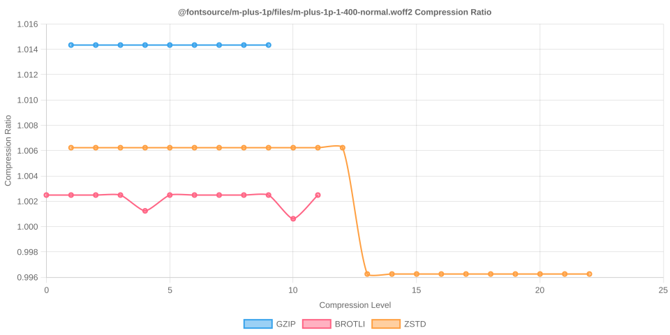

# Node Compression Benchmark

Last updated: 2026-04-14T22:50:57.856Z

This benchmark measures compression time, output size, and compression ratios for several popular npm packages across all gzip, Brotli, and Zstandard compression levels.

## Table of Contents

- [jquery/dist/jquery.min.js](#jquery-dist-jquery-min-js)
- [@expo-google-fonts/noto-sans-jp/400Regular/NotoSansJP_400Regular.ttf](#expo-google-fonts-noto-sans-jp-400regular-notosansjp-400regular-ttf)
- [@fontsource/m-plus-1p/files/m-plus-1p-1-400-normal.woff2](#fontsource-m-plus-1p-files-m-plus-1p-1-400-normal-woff2)
- [@codemirror/view/dist/index.js](#codemirror-view-dist-index-js)
- [react/cjs/react.production.js](#react-cjs-react-production-js)
- [dayjs/dayjs.min.js](#dayjs-dayjs-min-js)
- [vue/dist/vue.global.prod.js](#vue-dist-vue-global-prod-js)
- [lodash/lodash.min.js](#lodash-lodash-min-js)
- [@fortawesome/fontawesome-free/css/all.min.css](#fortawesome-fontawesome-free-css-all-min-css)
- [bootstrap/dist/css/bootstrap.min.css](#bootstrap-dist-css-bootstrap-min-css)
- [cities.json/cities.json](#cities-json-cities-json)
- [@sqlite.org/sqlite-wasm/dist/sqlite3.wasm](#sqlite-org-sqlite-wasm-dist-sqlite3-wasm)
- [tailwindcss/theme.css](#tailwindcss-theme-css)

Benchmark settings:

- Warmup runs per level: 1
- Minimum samples per level: 5
- Maximum samples per level: 25
- Target relative half-width (median-based robust estimate): 0.0500

<h2 id="jquery-dist-jquery-min-js">jquery/dist/jquery.min.js</h2>

- Original size: 78,748 bytes
- Chart: 

| Algorithm | Level | Time (ms) | Size (bytes) | Compression Ratio | Samples | Converged |
| --- | ---: | ---: | ---: | ---: | ---: | --- |
| gzip | 1 | 0.996 | 31,033 | 0.3941 | 5 | yes |
| gzip | 2 | 1.090 | 30,134 | 0.3827 | 5 | yes |
| gzip | 3 | 1.190 | 29,671 | 0.3768 | 5 | yes |
| gzip | 4 | 1.332 | 28,457 | 0.3614 | 5 | yes |
| gzip | 5 | 1.771 | 27,721 | 0.3520 | 5 | yes |
| gzip | 6 | 2.113 | 27,584 | 0.3503 | 5 | yes |
| gzip | 7 | 2.336 | 27,547 | 0.3498 | 5 | yes |
| gzip | 8 | 2.718 | 27,530 | 0.3496 | 5 | yes |
| gzip | 9 | 2.714 | 27,530 | 0.3496 | 5 | yes |
| brotli | 0 | 0.321 | 33,111 | 0.4205 | 16 | yes |
| brotli | 1 | 0.803 | 31,803 | 0.4039 | 5 | yes |
| brotli | 2 | 0.832 | 29,394 | 0.3733 | 10 | yes |
| brotli | 3 | 0.974 | 29,072 | 0.3692 | 5 | yes |
| brotli | 4 | 1.500 | 28,392 | 0.3605 | 5 | yes |
| brotli | 5 | 2.105 | 27,013 | 0.3430 | 5 | yes |
| brotli | 6 | 2.260 | 26,844 | 0.3409 | 11 | yes |
| brotli | 7 | 2.618 | 26,773 | 0.3400 | 5 | yes |
| brotli | 8 | 2.866 | 26,725 | 0.3394 | 14 | yes |
| brotli | 9 | 5.311 | 26,711 | 0.3392 | 8 | yes |
| brotli | 10 | 36.314 | 25,340 | 0.3218 | 5 | yes |
| brotli | 11 | 100.630 | 24,992 | 0.3174 | 5 | yes |
| zstd | 1 | 0.280 | 31,062 | 0.3944 | 25 | no |
| zstd | 2 | 0.278 | 30,069 | 0.3818 | 12 | yes |
| zstd | 3 | 0.620 | 29,214 | 0.3710 | 25 | no |
| zstd | 4 | 1.190 | 29,108 | 0.3696 | 5 | yes |
| zstd | 5 | 1.373 | 28,349 | 0.3600 | 5 | yes |
| zstd | 6 | 1.700 | 27,592 | 0.3504 | 5 | yes |
| zstd | 7 | 1.982 | 27,383 | 0.3477 | 5 | yes |
| zstd | 8 | 2.096 | 27,237 | 0.3459 | 5 | yes |
| zstd | 9 | 2.253 | 27,118 | 0.3444 | 5 | yes |
| zstd | 10 | 2.508 | 27,062 | 0.3437 | 5 | yes |
| zstd | 11 | 4.185 | 26,969 | 0.3425 | 5 | yes |
| zstd | 12 | 4.570 | 26,970 | 0.3425 | 5 | yes |
| zstd | 13 | 7.471 | 26,867 | 0.3412 | 5 | yes |
| zstd | 14 | 8.851 | 26,432 | 0.3357 | 11 | yes |
| zstd | 15 | 9.046 | 26,420 | 0.3355 | 5 | yes |
| zstd | 16 | 11.235 | 26,336 | 0.3344 | 8 | yes |
| zstd | 17 | 11.376 | 26,336 | 0.3344 | 6 | yes |
| zstd | 18 | 11.244 | 26,336 | 0.3344 | 6 | yes |
| zstd | 19 | 20.770 | 26,282 | 0.3337 | 5 | yes |
| zstd | 20 | 20.841 | 26,282 | 0.3337 | 5 | yes |
| zstd | 21 | 20.962 | 26,282 | 0.3337 | 5 | yes |
| zstd | 22 | 20.828 | 26,282 | 0.3337 | 5 | yes |

<h2 id="expo-google-fonts-noto-sans-jp-400regular-notosansjp-400regular-ttf">@expo-google-fonts/noto-sans-jp/400Regular/NotoSansJP_400Regular.ttf</h2>

- Original size: 5,472,784 bytes
- Chart: 

| Algorithm | Level | Time (ms) | Size (bytes) | Compression Ratio | Samples | Converged |
| --- | ---: | ---: | ---: | ---: | ---: | --- |
| gzip | 1 | 93.496 | 3,332,519 | 0.6089 | 5 | yes |
| gzip | 2 | 97.838 | 3,287,937 | 0.6008 | 5 | yes |
| gzip | 3 | 103.726 | 3,262,028 | 0.5960 | 5 | yes |
| gzip | 4 | 118.476 | 3,213,095 | 0.5871 | 6 | yes |
| gzip | 5 | 135.281 | 3,166,204 | 0.5785 | 5 | yes |
| gzip | 6 | 154.122 | 3,156,147 | 0.5767 | 5 | yes |
| gzip | 7 | 163.255 | 3,154,131 | 0.5763 | 5 | yes |
| gzip | 8 | 182.780 | 3,153,066 | 0.5761 | 5 | yes |
| gzip | 9 | 196.373 | 3,153,021 | 0.5761 | 5 | yes |
| brotli | 0 | 21.738 | 3,488,111 | 0.6374 | 5 | yes |
| brotli | 1 | 30.220 | 3,325,102 | 0.6076 | 5 | yes |
| brotli | 2 | 51.146 | 3,247,965 | 0.5935 | 5 | yes |
| brotli | 3 | 64.803 | 3,210,322 | 0.5866 | 5 | yes |
| brotli | 4 | 92.975 | 3,052,068 | 0.5577 | 5 | yes |
| brotli | 5 | 125.905 | 2,942,981 | 0.5377 | 5 | yes |
| brotli | 6 | 145.022 | 2,886,204 | 0.5274 | 5 | yes |
| brotli | 7 | 433.213 | 2,841,359 | 0.5192 | 5 | yes |
| brotli | 8 | 554.663 | 2,823,303 | 0.5159 | 5 | yes |
| brotli | 9 | 752.264 | 2,793,428 | 0.5104 | 5 | yes |
| brotli | 10 | 6620.345 | 2,728,891 | 0.4986 | 5 | yes |
| brotli | 11 | 13637.579 | 2,651,692 | 0.4845 | 5 | yes |
| zstd | 1 | 19.800 | 3,342,771 | 0.6108 | 5 | yes |
| zstd | 2 | 24.000 | 3,233,695 | 0.5909 | 5 | yes |
| zstd | 3 | 38.727 | 3,139,155 | 0.5736 | 5 | yes |
| zstd | 4 | 46.335 | 3,084,237 | 0.5636 | 5 | yes |
| zstd | 5 | 68.713 | 3,021,906 | 0.5522 | 5 | yes |
| zstd | 6 | 81.410 | 2,994,480 | 0.5472 | 5 | yes |
| zstd | 7 | 88.134 | 2,946,701 | 0.5384 | 5 | yes |
| zstd | 8 | 102.907 | 2,941,269 | 0.5374 | 5 | yes |
| zstd | 9 | 104.370 | 2,901,056 | 0.5301 | 5 | yes |
| zstd | 10 | 128.011 | 2,879,072 | 0.5261 | 5 | yes |
| zstd | 11 | 159.831 | 2,868,731 | 0.5242 | 5 | yes |
| zstd | 12 | 191.963 | 2,866,083 | 0.5237 | 6 | yes |
| zstd | 13 | 391.443 | 2,864,062 | 0.5233 | 5 | yes |
| zstd | 14 | 478.630 | 2,852,038 | 0.5211 | 5 | yes |
| zstd | 15 | 542.304 | 2,844,247 | 0.5197 | 5 | yes |
| zstd | 16 | 729.220 | 2,803,911 | 0.5123 | 5 | yes |
| zstd | 17 | 899.621 | 2,756,112 | 0.5036 | 6 | yes |
| zstd | 18 | 1159.242 | 2,713,297 | 0.4958 | 5 | yes |
| zstd | 19 | 1274.786 | 2,710,797 | 0.4953 | 5 | yes |
| zstd | 20 | 1240.717 | 2,710,797 | 0.4953 | 5 | yes |
| zstd | 21 | 1261.168 | 2,710,761 | 0.4953 | 5 | yes |
| zstd | 22 | 1264.821 | 2,710,761 | 0.4953 | 5 | yes |

<h2 id="fontsource-m-plus-1p-files-m-plus-1p-1-400-normal-woff2">@fontsource/m-plus-1p/files/m-plus-1p-1-400-normal.woff2</h2>

- Original size: 1,604 bytes
- Chart: 

| Algorithm | Level | Time (ms) | Size (bytes) | Compression Ratio | Samples | Converged |
| --- | ---: | ---: | ---: | ---: | ---: | --- |
| gzip | 1 | 0.035 | 1,627 | 1.0143 | 9 | yes |
| gzip | 2 | 0.046 | 1,627 | 1.0143 | 5 | yes |
| gzip | 3 | 0.034 | 1,627 | 1.0143 | 17 | yes |
| gzip | 4 | 0.056 | 1,627 | 1.0143 | 5 | yes |
| gzip | 5 | 0.034 | 1,627 | 1.0143 | 17 | yes |
| gzip | 6 | 0.033 | 1,627 | 1.0143 | 17 | yes |
| gzip | 7 | 0.052 | 1,627 | 1.0143 | 5 | yes |
| gzip | 8 | 0.034 | 1,627 | 1.0143 | 19 | yes |
| gzip | 9 | 0.040 | 1,627 | 1.0143 | 25 | no |
| brotli | 0 | 0.018 | 1,608 | 1.0025 | 25 | yes |
| brotli | 1 | 0.030 | 1,608 | 1.0025 | 9 | yes |
| brotli | 2 | 0.031 | 1,608 | 1.0025 | 5 | yes |
| brotli | 3 | 0.030 | 1,608 | 1.0025 | 25 | no |
| brotli | 4 | 0.039 | 1,606 | 1.0012 | 16 | yes |
| brotli | 5 | 0.039 | 1,608 | 1.0025 | 17 | yes |
| brotli | 6 | 0.039 | 1,608 | 1.0025 | 17 | yes |
| brotli | 7 | 0.039 | 1,608 | 1.0025 | 13 | yes |
| brotli | 8 | 0.039 | 1,608 | 1.0025 | 13 | yes |
| brotli | 9 | 0.055 | 1,608 | 1.0025 | 9 | yes |
| brotli | 10 | 2.520 | 1,605 | 1.0006 | 5 | yes |
| brotli | 11 | 3.330 | 1,608 | 1.0025 | 5 | yes |
| zstd | 1 | 0.021 | 1,614 | 1.0062 | 25 | no |
| zstd | 2 | 0.028 | 1,614 | 1.0062 | 5 | yes |
| zstd | 3 | 0.031 | 1,614 | 1.0062 | 5 | yes |
| zstd | 4 | 0.024 | 1,614 | 1.0062 | 17 | yes |
| zstd | 5 | 0.032 | 1,614 | 1.0062 | 25 | no |
| zstd | 6 | 0.031 | 1,614 | 1.0062 | 25 | no |
| zstd | 7 | 0.040 | 1,614 | 1.0062 | 5 | yes |
| zstd | 8 | 0.039 | 1,614 | 1.0062 | 5 | yes |
| zstd | 9 | 0.045 | 1,614 | 1.0062 | 5 | yes |
| zstd | 10 | 0.045 | 1,614 | 1.0062 | 5 | yes |
| zstd | 11 | 0.042 | 1,614 | 1.0062 | 13 | yes |
| zstd | 12 | 0.048 | 1,614 | 1.0062 | 16 | yes |
| zstd | 13 | 0.057 | 1,598 | 0.9963 | 12 | yes |
| zstd | 14 | 0.058 | 1,598 | 0.9963 | 25 | no |
| zstd | 15 | 0.057 | 1,598 | 0.9963 | 16 | yes |
| zstd | 16 | 0.087 | 1,598 | 0.9963 | 8 | yes |
| zstd | 17 | 0.086 | 1,598 | 0.9963 | 8 | yes |
| zstd | 18 | 0.087 | 1,598 | 0.9963 | 7 | yes |
| zstd | 19 | 0.088 | 1,598 | 0.9963 | 25 | no |
| zstd | 20 | 0.090 | 1,598 | 0.9963 | 5 | yes |
| zstd | 21 | 0.091 | 1,598 | 0.9963 | 23 | yes |
| zstd | 22 | 0.084 | 1,598 | 0.9963 | 10 | yes |

<h2 id="codemirror-view-dist-index-js">@codemirror/view/dist/index.js</h2>

- Original size: 485,932 bytes
- Chart: 

| Algorithm | Level | Time (ms) | Size (bytes) | Compression Ratio | Samples | Converged |
| --- | ---: | ---: | ---: | ---: | ---: | --- |
| gzip | 1 | 4.284 | 143,926 | 0.2962 | 5 | yes |
| gzip | 2 | 4.666 | 137,191 | 0.2823 | 5 | yes |
| gzip | 3 | 6.105 | 132,653 | 0.2730 | 5 | yes |
| gzip | 4 | 6.271 | 124,449 | 0.2561 | 5 | yes |
| gzip | 5 | 9.102 | 119,890 | 0.2467 | 5 | yes |
| gzip | 6 | 13.594 | 118,178 | 0.2432 | 5 | yes |
| gzip | 7 | 17.090 | 117,703 | 0.2422 | 5 | yes |
| gzip | 8 | 32.268 | 117,442 | 0.2417 | 5 | yes |
| gzip | 9 | 49.793 | 117,362 | 0.2415 | 5 | yes |
| brotli | 0 | 1.569 | 148,131 | 0.3048 | 5 | yes |
| brotli | 1 | 2.254 | 136,118 | 0.2801 | 5 | yes |
| brotli | 2 | 3.972 | 127,982 | 0.2634 | 5 | yes |
| brotli | 3 | 4.596 | 125,362 | 0.2580 | 5 | yes |
| brotli | 4 | 6.434 | 121,305 | 0.2496 | 5 | yes |
| brotli | 5 | 9.919 | 111,621 | 0.2297 | 5 | yes |
| brotli | 6 | 11.599 | 108,983 | 0.2243 | 5 | yes |
| brotli | 7 | 14.223 | 107,042 | 0.2203 | 5 | yes |
| brotli | 8 | 17.024 | 106,024 | 0.2182 | 5 | yes |
| brotli | 9 | 22.008 | 105,126 | 0.2163 | 5 | yes |
| brotli | 10 | 286.138 | 97,714 | 0.2011 | 5 | yes |
| brotli | 11 | 738.566 | 95,541 | 0.1966 | 5 | yes |
| zstd | 1 | 1.795 | 136,834 | 0.2816 | 5 | yes |
| zstd | 2 | 1.928 | 132,597 | 0.2729 | 5 | yes |
| zstd | 3 | 2.266 | 125,085 | 0.2574 | 5 | yes |
| zstd | 4 | 2.333 | 124,856 | 0.2569 | 6 | yes |
| zstd | 5 | 4.600 | 116,229 | 0.2392 | 5 | yes |
| zstd | 6 | 6.379 | 112,386 | 0.2313 | 5 | yes |
| zstd | 7 | 7.013 | 110,843 | 0.2281 | 5 | yes |
| zstd | 8 | 8.881 | 110,044 | 0.2265 | 5 | yes |
| zstd | 9 | 8.792 | 110,044 | 0.2265 | 5 | yes |
| zstd | 10 | 10.728 | 109,065 | 0.2244 | 5 | yes |
| zstd | 11 | 13.518 | 108,472 | 0.2232 | 5 | yes |
| zstd | 12 | 13.480 | 108,472 | 0.2232 | 5 | yes |
| zstd | 13 | 27.509 | 107,308 | 0.2208 | 5 | yes |
| zstd | 14 | 33.428 | 106,712 | 0.2196 | 5 | yes |
| zstd | 15 | 37.232 | 106,627 | 0.2194 | 5 | yes |
| zstd | 16 | 64.182 | 101,091 | 0.2080 | 5 | yes |
| zstd | 17 | 70.935 | 100,209 | 0.2062 | 5 | yes |
| zstd | 18 | 101.706 | 99,415 | 0.2046 | 5 | yes |
| zstd | 19 | 130.596 | 99,306 | 0.2044 | 5 | yes |
| zstd | 20 | 131.392 | 99,306 | 0.2044 | 5 | yes |
| zstd | 21 | 131.213 | 99,313 | 0.2044 | 5 | yes |
| zstd | 22 | 130.229 | 99,313 | 0.2044 | 5 | yes |

<h2 id="react-cjs-react-production-js">react/cjs/react.production.js</h2>

- Original size: 17,217 bytes
- Chart: 

| Algorithm | Level | Time (ms) | Size (bytes) | Compression Ratio | Samples | Converged |
| --- | ---: | ---: | ---: | ---: | ---: | --- |
| gzip | 1 | 0.069 | 4,987 | 0.2897 | 16 | yes |
| gzip | 2 | 0.072 | 4,874 | 0.2831 | 25 | yes |
| gzip | 3 | 0.080 | 4,806 | 0.2791 | 25 | no |
| gzip | 4 | 0.110 | 4,530 | 0.2631 | 21 | yes |
| gzip | 5 | 0.134 | 4,441 | 0.2579 | 25 | no |
| gzip | 6 | 0.180 | 4,425 | 0.2570 | 25 | no |
| gzip | 7 | 0.213 | 4,418 | 0.2566 | 18 | yes |
| gzip | 8 | 0.418 | 4,419 | 0.2567 | 12 | yes |
| gzip | 9 | 0.435 | 4,419 | 0.2567 | 5 | yes |
| brotli | 0 | 0.052 | 5,235 | 0.3041 | 13 | yes |
| brotli | 1 | 0.067 | 5,134 | 0.2982 | 13 | yes |
| brotli | 2 | 0.094 | 4,741 | 0.2754 | 13 | yes |
| brotli | 3 | 0.114 | 4,650 | 0.2701 | 16 | yes |
| brotli | 4 | 0.192 | 4,555 | 0.2646 | 16 | yes |
| brotli | 5 | 0.403 | 4,276 | 0.2484 | 5 | yes |
| brotli | 6 | 0.378 | 4,275 | 0.2483 | 13 | yes |
| brotli | 7 | 0.417 | 4,264 | 0.2477 | 6 | yes |
| brotli | 8 | 0.408 | 4,257 | 0.2473 | 5 | yes |
| brotli | 9 | 0.534 | 4,244 | 0.2465 | 5 | yes |
| brotli | 10 | 7.266 | 3,968 | 0.2305 | 5 | yes |
| brotli | 11 | 19.429 | 3,872 | 0.2249 | 5 | yes |
| zstd | 1 | 0.056 | 4,923 | 0.2859 | 5 | yes |
| zstd | 2 | 0.059 | 4,868 | 0.2827 | 9 | yes |
| zstd | 3 | 0.075 | 4,717 | 0.2740 | 9 | yes |
| zstd | 4 | 0.075 | 4,679 | 0.2718 | 25 | no |
| zstd | 5 | 0.142 | 4,519 | 0.2625 | 20 | yes |
| zstd | 6 | 0.184 | 4,437 | 0.2577 | 8 | yes |
| zstd | 7 | 0.205 | 4,437 | 0.2577 | 12 | yes |
| zstd | 8 | 0.228 | 4,426 | 0.2571 | 7 | yes |
| zstd | 9 | 0.295 | 4,420 | 0.2567 | 5 | yes |
| zstd | 10 | 0.335 | 4,410 | 0.2561 | 5 | yes |
| zstd | 11 | 0.636 | 4,393 | 0.2552 | 5 | yes |
| zstd | 12 | 0.648 | 4,391 | 0.2550 | 5 | yes |
| zstd | 13 | 0.954 | 4,383 | 0.2546 | 5 | yes |
| zstd | 14 | 1.431 | 4,307 | 0.2502 | 5 | yes |
| zstd | 15 | 1.516 | 4,303 | 0.2499 | 5 | yes |
| zstd | 16 | 2.214 | 4,282 | 0.2487 | 5 | yes |
| zstd | 17 | 2.309 | 4,281 | 0.2486 | 5 | yes |
| zstd | 18 | 2.313 | 4,281 | 0.2486 | 5 | yes |
| zstd | 19 | 4.535 | 4,264 | 0.2477 | 5 | yes |
| zstd | 20 | 4.533 | 4,264 | 0.2477 | 5 | yes |
| zstd | 21 | 4.523 | 4,264 | 0.2477 | 5 | yes |
| zstd | 22 | 4.553 | 4,264 | 0.2477 | 5 | yes |

<h2 id="dayjs-dayjs-min-js">dayjs/dayjs.min.js</h2>

- Original size: 7,160 bytes
- Chart: 

| Algorithm | Level | Time (ms) | Size (bytes) | Compression Ratio | Samples | Converged |
| --- | ---: | ---: | ---: | ---: | ---: | --- |
| gzip | 1 | 0.048 | 3,217 | 0.4493 | 22 | yes |
| gzip | 2 | 0.053 | 3,179 | 0.4440 | 25 | no |
| gzip | 3 | 0.051 | 3,150 | 0.4399 | 13 | yes |
| gzip | 4 | 0.062 | 3,092 | 0.4318 | 17 | yes |
| gzip | 5 | 0.067 | 3,047 | 0.4256 | 20 | yes |
| gzip | 6 | 0.070 | 3,041 | 0.4247 | 13 | yes |
| gzip | 7 | 0.075 | 3,039 | 0.4244 | 7 | yes |
| gzip | 8 | 0.078 | 3,039 | 0.4244 | 25 | no |
| gzip | 9 | 0.073 | 3,039 | 0.4244 | 9 | yes |
| brotli | 0 | 0.030 | 3,544 | 0.4950 | 12 | yes |
| brotli | 1 | 0.040 | 3,378 | 0.4718 | 8 | yes |
| brotli | 2 | 0.057 | 3,258 | 0.4550 | 13 | yes |
| brotli | 3 | 0.073 | 3,207 | 0.4479 | 13 | yes |
| brotli | 4 | 0.126 | 3,138 | 0.4383 | 16 | yes |
| brotli | 5 | 0.156 | 2,961 | 0.4135 | 19 | yes |
| brotli | 6 | 0.168 | 2,950 | 0.4120 | 14 | yes |
| brotli | 7 | 0.172 | 2,942 | 0.4109 | 16 | yes |
| brotli | 8 | 0.185 | 2,942 | 0.4109 | 8 | yes |
| brotli | 9 | 0.237 | 2,943 | 0.4110 | 21 | yes |
| brotli | 10 | 3.447 | 2,813 | 0.3929 | 5 | yes |
| brotli | 11 | 8.189 | 2,771 | 0.3870 | 5 | yes |
| zstd | 1 | 0.035 | 3,250 | 0.4539 | 19 | yes |
| zstd | 2 | 0.035 | 3,196 | 0.4464 | 20 | yes |
| zstd | 3 | 0.044 | 3,171 | 0.4429 | 9 | yes |
| zstd | 4 | 0.064 | 3,098 | 0.4327 | 9 | yes |
| zstd | 5 | 0.074 | 3,077 | 0.4297 | 25 | no |
| zstd | 6 | 0.083 | 3,055 | 0.4267 | 12 | yes |
| zstd | 7 | 0.097 | 3,050 | 0.4260 | 7 | yes |
| zstd | 8 | 0.098 | 3,050 | 0.4260 | 11 | yes |
| zstd | 9 | 0.190 | 3,050 | 0.4260 | 5 | yes |
| zstd | 10 | 0.120 | 3,050 | 0.4260 | 5 | yes |
| zstd | 11 | 0.232 | 3,041 | 0.4247 | 16 | yes |
| zstd | 12 | 0.364 | 3,009 | 0.4203 | 25 | no |
| zstd | 13 | 0.586 | 2,994 | 0.4182 | 5 | yes |
| zstd | 14 | 0.559 | 2,994 | 0.4182 | 5 | yes |
| zstd | 15 | 0.581 | 2,994 | 0.4182 | 5 | yes |
| zstd | 16 | 1.082 | 2,991 | 0.4177 | 5 | yes |
| zstd | 17 | 1.055 | 2,991 | 0.4177 | 5 | yes |
| zstd | 18 | 1.087 | 2,991 | 0.4177 | 5 | yes |
| zstd | 19 | 1.056 | 2,991 | 0.4177 | 5 | yes |
| zstd | 20 | 1.041 | 2,991 | 0.4177 | 5 | yes |
| zstd | 21 | 1.098 | 2,991 | 0.4177 | 5 | yes |
| zstd | 22 | 1.039 | 2,991 | 0.4177 | 5 | yes |

<h2 id="vue-dist-vue-global-prod-js">vue/dist/vue.global.prod.js</h2>

- Original size: 163,668 bytes
- Chart: 

| Algorithm | Level | Time (ms) | Size (bytes) | Compression Ratio | Samples | Converged |
| --- | ---: | ---: | ---: | ---: | ---: | --- |
| gzip | 1 | 2.063 | 66,705 | 0.4076 | 5 | yes |
| gzip | 2 | 2.222 | 65,090 | 0.3977 | 5 | yes |
| gzip | 3 | 2.551 | 64,098 | 0.3916 | 5 | yes |
| gzip | 4 | 2.826 | 61,763 | 0.3774 | 5 | yes |
| gzip | 5 | 3.901 | 60,115 | 0.3673 | 5 | yes |
| gzip | 6 | 4.874 | 59,851 | 0.3657 | 5 | yes |
| gzip | 7 | 5.325 | 59,811 | 0.3654 | 5 | yes |
| gzip | 8 | 5.773 | 59,795 | 0.3653 | 5 | yes |
| gzip | 9 | 5.751 | 59,795 | 0.3653 | 5 | yes |
| brotli | 0 | 0.600 | 70,918 | 0.4333 | 9 | yes |
| brotli | 1 | 0.911 | 68,052 | 0.4158 | 5 | yes |
| brotli | 2 | 1.729 | 62,794 | 0.3837 | 5 | yes |
| brotli | 3 | 2.052 | 62,228 | 0.3802 | 5 | yes |
| brotli | 4 | 3.100 | 61,075 | 0.3732 | 5 | yes |
| brotli | 5 | 4.443 | 57,725 | 0.3527 | 5 | yes |
| brotli | 6 | 4.938 | 57,374 | 0.3506 | 5 | yes |
| brotli | 7 | 6.033 | 57,109 | 0.3489 | 5 | yes |
| brotli | 8 | 6.335 | 57,015 | 0.3484 | 5 | yes |
| brotli | 9 | 7.617 | 56,928 | 0.3478 | 5 | yes |
| brotli | 10 | 103.977 | 54,189 | 0.3311 | 5 | yes |
| brotli | 11 | 263.397 | 53,226 | 0.3252 | 5 | yes |
| zstd | 1 | 0.647 | 65,987 | 0.4032 | 12 | yes |
| zstd | 2 | 0.882 | 63,119 | 0.3857 | 5 | yes |
| zstd | 3 | 1.074 | 62,505 | 0.3819 | 5 | yes |
| zstd | 4 | 1.836 | 60,689 | 0.3708 | 5 | yes |
| zstd | 5 | 2.101 | 60,183 | 0.3677 | 5 | yes |
| zstd | 6 | 2.661 | 59,274 | 0.3622 | 5 | yes |
| zstd | 7 | 3.033 | 58,475 | 0.3573 | 5 | yes |
| zstd | 8 | 3.734 | 57,997 | 0.3544 | 5 | yes |
| zstd | 9 | 4.233 | 57,744 | 0.3528 | 5 | yes |
| zstd | 10 | 5.096 | 57,617 | 0.3520 | 5 | yes |
| zstd | 11 | 8.835 | 57,324 | 0.3502 | 5 | yes |
| zstd | 12 | 9.012 | 57,311 | 0.3502 | 5 | yes |
| zstd | 13 | 15.175 | 56,313 | 0.3441 | 5 | yes |
| zstd | 14 | 17.646 | 55,866 | 0.3413 | 5 | yes |
| zstd | 15 | 17.863 | 55,859 | 0.3413 | 5 | yes |
| zstd | 16 | 23.492 | 55,686 | 0.3402 | 5 | yes |
| zstd | 17 | 23.390 | 55,686 | 0.3402 | 5 | yes |
| zstd | 18 | 39.636 | 55,612 | 0.3398 | 5 | yes |
| zstd | 19 | 39.475 | 55,612 | 0.3398 | 5 | yes |
| zstd | 20 | 39.710 | 55,612 | 0.3398 | 5 | yes |
| zstd | 21 | 39.786 | 55,612 | 0.3398 | 5 | yes |
| zstd | 22 | 39.416 | 55,612 | 0.3398 | 5 | yes |

<h2 id="lodash-lodash-min-js">lodash/lodash.min.js</h2>

- Original size: 73,234 bytes
- Chart: 

| Algorithm | Level | Time (ms) | Size (bytes) | Compression Ratio | Samples | Converged |
| --- | ---: | ---: | ---: | ---: | ---: | --- |
| gzip | 1 | 0.842 | 28,819 | 0.3935 | 5 | yes |
| gzip | 2 | 0.916 | 28,191 | 0.3849 | 5 | yes |
| gzip | 3 | 1.069 | 27,724 | 0.3786 | 5 | yes |
| gzip | 4 | 1.179 | 26,950 | 0.3680 | 5 | yes |
| gzip | 5 | 1.582 | 26,101 | 0.3564 | 5 | yes |
| gzip | 6 | 2.030 | 25,938 | 0.3542 | 5 | yes |
| gzip | 7 | 2.445 | 25,913 | 0.3538 | 5 | yes |
| gzip | 8 | 3.333 | 25,894 | 0.3536 | 5 | yes |
| gzip | 9 | 3.335 | 25,894 | 0.3536 | 5 | yes |
| brotli | 0 | 0.201 | 30,978 | 0.4230 | 13 | yes |
| brotli | 1 | 0.319 | 29,754 | 0.4063 | 15 | yes |
| brotli | 2 | 0.720 | 27,438 | 0.3747 | 5 | yes |
| brotli | 3 | 0.857 | 27,227 | 0.3718 | 5 | yes |
| brotli | 4 | 1.367 | 26,678 | 0.3643 | 5 | yes |
| brotli | 5 | 1.967 | 25,217 | 0.3443 | 5 | yes |
| brotli | 6 | 2.130 | 25,093 | 0.3426 | 5 | yes |
| brotli | 7 | 2.513 | 24,950 | 0.3407 | 5 | yes |
| brotli | 8 | 2.731 | 24,912 | 0.3402 | 5 | yes |
| brotli | 9 | 3.218 | 24,870 | 0.3396 | 5 | yes |
| brotli | 10 | 42.509 | 23,472 | 0.3205 | 5 | yes |
| brotli | 11 | 101.381 | 23,030 | 0.3145 | 5 | yes |
| zstd | 1 | 0.207 | 28,919 | 0.3949 | 9 | yes |
| zstd | 2 | 0.237 | 28,008 | 0.3824 | 10 | yes |
| zstd | 3 | 0.302 | 27,463 | 0.3750 | 9 | yes |
| zstd | 4 | 0.372 | 27,100 | 0.3700 | 25 | no |
| zstd | 5 | 0.817 | 26,525 | 0.3622 | 5 | yes |
| zstd | 6 | 1.140 | 25,834 | 0.3528 | 5 | yes |
| zstd | 7 | 1.342 | 25,663 | 0.3504 | 5 | yes |
| zstd | 8 | 1.487 | 25,557 | 0.3490 | 5 | yes |
| zstd | 9 | 1.664 | 25,466 | 0.3477 | 5 | yes |
| zstd | 10 | 1.981 | 25,397 | 0.3468 | 5 | yes |
| zstd | 11 | 3.368 | 25,317 | 0.3457 | 5 | yes |
| zstd | 12 | 3.598 | 25,315 | 0.3457 | 5 | yes |
| zstd | 13 | 5.382 | 25,185 | 0.3439 | 5 | yes |
| zstd | 14 | 7.474 | 24,642 | 0.3365 | 5 | yes |
| zstd | 15 | 7.564 | 24,606 | 0.3360 | 5 | yes |
| zstd | 16 | 9.769 | 24,499 | 0.3345 | 5 | yes |
| zstd | 17 | 9.897 | 24,499 | 0.3345 | 5 | yes |
| zstd | 18 | 9.819 | 24,499 | 0.3345 | 5 | yes |
| zstd | 19 | 18.697 | 24,463 | 0.3340 | 5 | yes |
| zstd | 20 | 18.766 | 24,463 | 0.3340 | 5 | yes |
| zstd | 21 | 18.721 | 24,463 | 0.3340 | 5 | yes |
| zstd | 22 | 18.725 | 24,463 | 0.3340 | 5 | yes |

<h2 id="fortawesome-fontawesome-free-css-all-min-css">@fortawesome/fontawesome-free/css/all.min.css</h2>

- Original size: 75,736 bytes
- Chart: 

| Algorithm | Level | Time (ms) | Size (bytes) | Compression Ratio | Samples | Converged |
| --- | ---: | ---: | ---: | ---: | ---: | --- |
| gzip | 1 | 0.644 | 23,605 | 0.3117 | 5 | yes |
| gzip | 2 | 0.745 | 23,403 | 0.3090 | 5 | yes |
| gzip | 3 | 0.894 | 23,219 | 0.3066 | 5 | yes |
| gzip | 4 | 0.992 | 21,952 | 0.2898 | 5 | yes |
| gzip | 5 | 1.400 | 21,126 | 0.2789 | 5 | yes |
| gzip | 6 | 2.173 | 20,973 | 0.2769 | 5 | yes |
| gzip | 7 | 2.927 | 20,888 | 0.2758 | 5 | yes |
| gzip | 8 | 8.732 | 20,678 | 0.2730 | 5 | yes |
| gzip | 9 | 8.827 | 20,676 | 0.2730 | 8 | yes |
| brotli | 0 | 0.180 | 25,901 | 0.3420 | 12 | yes |
| brotli | 1 | 0.318 | 23,906 | 0.3156 | 20 | yes |
| brotli | 2 | 0.660 | 21,594 | 0.2851 | 5 | yes |
| brotli | 3 | 0.794 | 21,570 | 0.2848 | 5 | yes |
| brotli | 4 | 1.170 | 21,297 | 0.2812 | 5 | yes |
| brotli | 5 | 1.709 | 20,309 | 0.2682 | 5 | yes |
| brotli | 6 | 1.961 | 20,220 | 0.2670 | 5 | yes |
| brotli | 7 | 2.339 | 20,137 | 0.2659 | 5 | yes |
| brotli | 8 | 2.733 | 20,088 | 0.2652 | 5 | yes |
| brotli | 9 | 3.542 | 20,013 | 0.2642 | 5 | yes |
| brotli | 10 | 31.018 | 17,574 | 0.2320 | 5 | yes |
| brotli | 11 | 89.572 | 17,022 | 0.2248 | 5 | yes |
| zstd | 1 | 0.209 | 22,639 | 0.2989 | 9 | yes |
| zstd | 2 | 0.232 | 22,433 | 0.2962 | 16 | yes |
| zstd | 3 | 0.263 | 22,208 | 0.2932 | 12 | yes |
| zstd | 4 | 0.410 | 22,181 | 0.2929 | 5 | yes |
| zstd | 5 | 0.722 | 21,579 | 0.2849 | 5 | yes |
| zstd | 6 | 1.044 | 20,795 | 0.2746 | 5 | yes |
| zstd | 7 | 1.273 | 20,334 | 0.2685 | 5 | yes |
| zstd | 8 | 1.447 | 20,295 | 0.2680 | 5 | yes |
| zstd | 9 | 1.783 | 20,230 | 0.2671 | 5 | yes |
| zstd | 10 | 2.388 | 20,178 | 0.2664 | 5 | yes |
| zstd | 11 | 3.325 | 20,032 | 0.2645 | 5 | yes |
| zstd | 12 | 4.306 | 20,012 | 0.2642 | 5 | yes |
| zstd | 13 | 5.036 | 19,719 | 0.2604 | 5 | yes |
| zstd | 14 | 6.940 | 18,964 | 0.2504 | 5 | yes |
| zstd | 15 | 8.178 | 18,878 | 0.2493 | 5 | yes |
| zstd | 16 | 10.593 | 18,772 | 0.2479 | 5 | yes |
| zstd | 17 | 14.104 | 18,740 | 0.2474 | 5 | yes |
| zstd | 18 | 22.759 | 18,740 | 0.2474 | 5 | yes |
| zstd | 19 | 20.105 | 18,755 | 0.2476 | 5 | yes |
| zstd | 20 | 24.065 | 18,717 | 0.2471 | 5 | yes |
| zstd | 21 | 38.639 | 18,701 | 0.2469 | 5 | yes |
| zstd | 22 | 45.919 | 18,702 | 0.2469 | 5 | yes |

<h2 id="bootstrap-dist-css-bootstrap-min-css">bootstrap/dist/css/bootstrap.min.css</h2>

- Original size: 232,111 bytes
- Chart: 

| Algorithm | Level | Time (ms) | Size (bytes) | Compression Ratio | Samples | Converged |
| --- | ---: | ---: | ---: | ---: | ---: | --- |
| gzip | 1 | 1.205 | 41,452 | 0.1786 | 5 | yes |
| gzip | 2 | 1.268 | 38,418 | 0.1655 | 5 | yes |
| gzip | 3 | 1.467 | 36,152 | 0.1558 | 5 | yes |
| gzip | 4 | 1.764 | 33,830 | 0.1457 | 5 | yes |
| gzip | 5 | 2.299 | 31,408 | 0.1353 | 5 | yes |
| gzip | 6 | 3.184 | 30,823 | 0.1328 | 5 | yes |
| gzip | 7 | 3.949 | 30,680 | 0.1322 | 5 | yes |
| gzip | 8 | 5.367 | 30,670 | 0.1321 | 5 | yes |
| gzip | 9 | 5.411 | 30,669 | 0.1321 | 5 | yes |
| brotli | 0 | 0.320 | 43,268 | 0.1864 | 17 | yes |
| brotli | 1 | 0.636 | 39,941 | 0.1721 | 5 | yes |
| brotli | 2 | 1.220 | 36,514 | 0.1573 | 5 | yes |
| brotli | 3 | 1.452 | 34,781 | 0.1498 | 5 | yes |
| brotli | 4 | 2.160 | 33,048 | 0.1424 | 5 | yes |
| brotli | 5 | 3.045 | 28,253 | 0.1217 | 5 | yes |
| brotli | 6 | 3.397 | 27,431 | 0.1182 | 5 | yes |
| brotli | 7 | 3.802 | 26,971 | 0.1162 | 5 | yes |
| brotli | 8 | 4.304 | 26,813 | 0.1155 | 5 | yes |
| brotli | 9 | 5.153 | 26,569 | 0.1145 | 5 | yes |
| brotli | 10 | 103.678 | 23,482 | 0.1012 | 5 | yes |
| brotli | 11 | 305.517 | 22,970 | 0.0990 | 5 | yes |
| zstd | 1 | 0.387 | 35,549 | 0.1532 | 20 | yes |
| zstd | 2 | 0.518 | 34,301 | 0.1478 | 8 | yes |
| zstd | 3 | 0.586 | 34,393 | 0.1482 | 5 | yes |
| zstd | 4 | 1.499 | 30,973 | 0.1334 | 5 | yes |
| zstd | 5 | 1.778 | 29,744 | 0.1281 | 5 | yes |
| zstd | 6 | 2.118 | 29,727 | 0.1281 | 5 | yes |
| zstd | 7 | 2.306 | 29,710 | 0.1280 | 5 | yes |
| zstd | 8 | 2.796 | 28,645 | 0.1234 | 5 | yes |
| zstd | 9 | 3.267 | 28,235 | 0.1216 | 5 | yes |
| zstd | 10 | 4.050 | 28,044 | 0.1208 | 5 | yes |
| zstd | 11 | 8.270 | 27,895 | 0.1202 | 5 | yes |
| zstd | 12 | 10.084 | 27,805 | 0.1198 | 5 | yes |
| zstd | 13 | 18.757 | 27,283 | 0.1175 | 5 | yes |
| zstd | 14 | 22.265 | 26,828 | 0.1156 | 5 | yes |
| zstd | 15 | 27.995 | 26,465 | 0.1140 | 5 | yes |
| zstd | 16 | 48.618 | 26,071 | 0.1123 | 5 | yes |
| zstd | 17 | 53.622 | 26,041 | 0.1122 | 5 | yes |
| zstd | 18 | 73.070 | 26,008 | 0.1120 | 5 | yes |
| zstd | 19 | 81.267 | 26,015 | 0.1121 | 5 | yes |
| zstd | 20 | 84.080 | 26,014 | 0.1121 | 5 | yes |
| zstd | 21 | 84.049 | 26,014 | 0.1121 | 5 | yes |
| zstd | 22 | 83.849 | 26,014 | 0.1121 | 5 | yes |

<h2 id="cities-json-cities-json">cities.json/cities.json</h2>

- Original size: 21,953,388 bytes
- Chart: 

| Algorithm | Level | Time (ms) | Size (bytes) | Compression Ratio | Samples | Converged |
| --- | ---: | ---: | ---: | ---: | ---: | --- |
| gzip | 1 | 99.295 | 3,751,261 | 0.1709 | 5 | yes |
| gzip | 2 | 99.545 | 3,528,967 | 0.1607 | 5 | yes |
| gzip | 3 | 121.290 | 3,370,979 | 0.1536 | 5 | yes |
| gzip | 4 | 143.972 | 3,328,999 | 0.1516 | 5 | yes |
| gzip | 5 | 174.105 | 3,081,077 | 0.1403 | 5 | yes |
| gzip | 6 | 230.790 | 3,020,114 | 0.1376 | 5 | yes |
| gzip | 7 | 360.859 | 2,903,542 | 0.1323 | 5 | yes |
| gzip | 8 | 1045.466 | 2,794,554 | 0.1273 | 5 | yes |
| gzip | 9 | 1393.815 | 2,783,224 | 0.1268 | 5 | yes |
| brotli | 0 | 44.395 | 4,059,162 | 0.1849 | 5 | yes |
| brotli | 1 | 65.135 | 3,701,732 | 0.1686 | 5 | yes |
| brotli | 2 | 117.130 | 3,357,390 | 0.1529 | 5 | yes |
| brotli | 3 | 137.601 | 3,265,779 | 0.1488 | 5 | yes |
| brotli | 4 | 186.289 | 3,125,451 | 0.1424 | 5 | yes |
| brotli | 5 | 310.655 | 2,774,227 | 0.1264 | 5 | yes |
| brotli | 6 | 365.675 | 2,738,409 | 0.1247 | 5 | yes |
| brotli | 7 | 524.550 | 2,707,850 | 0.1233 | 5 | yes |
| brotli | 8 | 671.180 | 2,687,842 | 0.1224 | 5 | yes |
| brotli | 9 | 888.331 | 2,673,141 | 0.1218 | 5 | yes |
| brotli | 10 | 14017.631 | 2,315,778 | 0.1055 | 5 | yes |
| brotli | 11 | 38742.376 | 2,180,828 | 0.0993 | 5 | yes |
| zstd | 1 | 45.752 | 3,380,894 | 0.1540 | 5 | yes |
| zstd | 2 | 54.553 | 3,402,497 | 0.1550 | 5 | yes |
| zstd | 3 | 68.435 | 3,449,952 | 0.1571 | 5 | yes |
| zstd | 4 | 73.824 | 3,454,596 | 0.1574 | 5 | yes |
| zstd | 5 | 147.309 | 3,140,901 | 0.1431 | 5 | yes |
| zstd | 6 | 207.111 | 2,932,855 | 0.1336 | 5 | yes |
| zstd | 7 | 236.130 | 2,887,559 | 0.1315 | 5 | yes |
| zstd | 8 | 300.112 | 2,785,481 | 0.1269 | 5 | yes |
| zstd | 9 | 311.198 | 2,795,218 | 0.1273 | 5 | yes |
| zstd | 10 | 406.299 | 2,753,222 | 0.1254 | 5 | yes |
| zstd | 11 | 572.567 | 2,720,543 | 0.1239 | 5 | yes |
| zstd | 12 | 602.377 | 2,720,412 | 0.1239 | 5 | yes |
| zstd | 13 | 861.762 | 2,680,256 | 0.1221 | 5 | yes |
| zstd | 14 | 1095.033 | 2,654,484 | 0.1209 | 5 | yes |
| zstd | 15 | 1407.438 | 2,651,235 | 0.1208 | 5 | yes |
| zstd | 16 | 3493.813 | 2,535,036 | 0.1155 | 5 | yes |
| zstd | 17 | 3950.686 | 2,466,410 | 0.1123 | 5 | yes |
| zstd | 18 | 5285.351 | 2,453,943 | 0.1118 | 5 | yes |
| zstd | 19 | 8716.534 | 2,384,554 | 0.1086 | 5 | yes |
| zstd | 20 | 8925.936 | 2,382,448 | 0.1085 | 5 | yes |
| zstd | 21 | 8974.339 | 2,382,300 | 0.1085 | 5 | yes |
| zstd | 22 | 9420.565 | 2,378,818 | 0.1084 | 5 | yes |

<h2 id="sqlite-org-sqlite-wasm-dist-sqlite3-wasm">@sqlite.org/sqlite-wasm/dist/sqlite3.wasm</h2>

- Original size: 859,730 bytes
- Chart: 

| Algorithm | Level | Time (ms) | Size (bytes) | Compression Ratio | Samples | Converged |
| --- | ---: | ---: | ---: | ---: | ---: | --- |
| gzip | 1 | 13.624 | 429,925 | 0.5001 | 5 | yes |
| gzip | 2 | 14.797 | 419,493 | 0.4879 | 5 | yes |
| gzip | 3 | 17.479 | 414,493 | 0.4821 | 5 | yes |
| gzip | 4 | 18.351 | 407,503 | 0.4740 | 5 | yes |
| gzip | 5 | 26.997 | 399,866 | 0.4651 | 5 | yes |
| gzip | 6 | 32.070 | 399,154 | 0.4643 | 5 | yes |
| gzip | 7 | 34.311 | 399,020 | 0.4641 | 5 | yes |
| gzip | 8 | 37.475 | 398,974 | 0.4641 | 5 | yes |
| gzip | 9 | 37.561 | 398,973 | 0.4641 | 5 | yes |
| brotli | 0 | 4.158 | 460,125 | 0.5352 | 5 | yes |
| brotli | 1 | 5.586 | 442,506 | 0.5147 | 5 | yes |
| brotli | 2 | 10.415 | 409,638 | 0.4765 | 5 | yes |
| brotli | 3 | 12.708 | 408,960 | 0.4757 | 5 | yes |
| brotli | 4 | 17.831 | 400,331 | 0.4656 | 5 | yes |
| brotli | 5 | 27.520 | 380,339 | 0.4424 | 5 | yes |
| brotli | 6 | 32.870 | 377,100 | 0.4386 | 5 | yes |
| brotli | 7 | 45.774 | 375,149 | 0.4364 | 5 | yes |
| brotli | 8 | 53.523 | 374,164 | 0.4352 | 5 | yes |
| brotli | 9 | 67.153 | 373,347 | 0.4343 | 5 | yes |
| brotli | 10 | 978.513 | 353,246 | 0.4109 | 5 | yes |
| brotli | 11 | 2061.126 | 344,353 | 0.4005 | 5 | yes |
| zstd | 1 | 3.242 | 457,015 | 0.5316 | 5 | yes |
| zstd | 2 | 4.108 | 426,694 | 0.4963 | 5 | yes |
| zstd | 3 | 5.669 | 411,278 | 0.4784 | 5 | yes |
| zstd | 4 | 6.537 | 408,051 | 0.4746 | 5 | yes |
| zstd | 5 | 10.796 | 397,246 | 0.4621 | 5 | yes |
| zstd | 6 | 14.556 | 390,015 | 0.4536 | 5 | yes |
| zstd | 7 | 15.775 | 388,562 | 0.4520 | 5 | yes |
| zstd | 8 | 19.344 | 386,566 | 0.4496 | 5 | yes |
| zstd | 9 | 19.991 | 386,404 | 0.4494 | 5 | yes |
| zstd | 10 | 23.887 | 385,609 | 0.4485 | 5 | yes |
| zstd | 11 | 29.012 | 385,152 | 0.4480 | 5 | yes |
| zstd | 12 | 27.428 | 385,152 | 0.4480 | 5 | yes |
| zstd | 13 | 54.445 | 383,952 | 0.4466 | 5 | yes |
| zstd | 14 | 55.872 | 383,886 | 0.4465 | 5 | yes |
| zstd | 15 | 57.288 | 383,877 | 0.4465 | 5 | yes |
| zstd | 16 | 95.218 | 369,550 | 0.4298 | 5 | yes |
| zstd | 17 | 121.881 | 362,382 | 0.4215 | 5 | yes |
| zstd | 18 | 153.571 | 358,220 | 0.4167 | 5 | yes |
| zstd | 19 | 174.165 | 358,047 | 0.4165 | 5 | yes |
| zstd | 20 | 167.804 | 358,047 | 0.4165 | 5 | yes |
| zstd | 21 | 169.099 | 358,041 | 0.4165 | 5 | yes |
| zstd | 22 | 171.706 | 358,041 | 0.4165 | 5 | yes |

<h2 id="tailwindcss-theme-css">tailwindcss/theme.css</h2>

- Original size: 19,480 bytes
- Chart: 

| Algorithm | Level | Time (ms) | Size (bytes) | Compression Ratio | Samples | Converged |
| --- | ---: | ---: | ---: | ---: | ---: | --- |
| gzip | 1 | 0.074 | 5,506 | 0.2826 | 19 | yes |
| gzip | 2 | 0.080 | 5,424 | 0.2784 | 23 | yes |
| gzip | 3 | 0.104 | 5,356 | 0.2749 | 25 | no |
| gzip | 4 | 0.124 | 5,145 | 0.2641 | 20 | yes |
| gzip | 5 | 0.150 | 4,896 | 0.2513 | 23 | yes |
| gzip | 6 | 0.312 | 4,884 | 0.2507 | 5 | yes |
| gzip | 7 | 0.486 | 4,857 | 0.2493 | 5 | yes |
| gzip | 8 | 0.676 | 4,859 | 0.2494 | 5 | yes |
| gzip | 9 | 0.666 | 4,859 | 0.2494 | 5 | yes |
| brotli | 0 | 0.055 | 6,028 | 0.3094 | 12 | yes |
| brotli | 1 | 0.075 | 5,737 | 0.2945 | 9 | yes |
| brotli | 2 | 0.107 | 4,944 | 0.2538 | 20 | yes |
| brotli | 3 | 0.131 | 4,930 | 0.2531 | 21 | yes |
| brotli | 4 | 0.204 | 4,898 | 0.2514 | 25 | yes |
| brotli | 5 | 0.446 | 4,581 | 0.2352 | 5 | yes |
| brotli | 6 | 0.435 | 4,570 | 0.2346 | 12 | yes |
| brotli | 7 | 0.557 | 4,564 | 0.2343 | 5 | yes |
| brotli | 8 | 0.606 | 4,561 | 0.2341 | 5 | yes |
| brotli | 9 | 0.729 | 4,553 | 0.2337 | 5 | yes |
| brotli | 10 | 7.685 | 3,934 | 0.2020 | 5 | yes |
| brotli | 11 | 22.381 | 3,824 | 0.1963 | 5 | yes |
| zstd | 1 | 0.057 | 5,379 | 0.2761 | 16 | yes |
| zstd | 2 | 0.062 | 5,176 | 0.2657 | 22 | yes |
| zstd | 3 | 0.079 | 5,169 | 0.2653 | 8 | yes |
| zstd | 4 | 0.082 | 5,154 | 0.2646 | 25 | no |
| zstd | 5 | 0.149 | 5,074 | 0.2605 | 9 | yes |
| zstd | 6 | 0.199 | 4,797 | 0.2463 | 9 | yes |
| zstd | 7 | 0.234 | 4,702 | 0.2414 | 23 | yes |
| zstd | 8 | 0.259 | 4,696 | 0.2411 | 11 | yes |
| zstd | 9 | 0.377 | 4,690 | 0.2408 | 5 | yes |
| zstd | 10 | 0.459 | 4,691 | 0.2408 | 7 | yes |
| zstd | 11 | 0.612 | 4,689 | 0.2407 | 5 | yes |
| zstd | 12 | 0.635 | 4,687 | 0.2406 | 5 | yes |
| zstd | 13 | 1.004 | 4,806 | 0.2467 | 5 | yes |
| zstd | 14 | 1.721 | 4,447 | 0.2283 | 5 | yes |
| zstd | 15 | 1.831 | 4,446 | 0.2282 | 5 | yes |
| zstd | 16 | 2.537 | 4,367 | 0.2242 | 5 | yes |
| zstd | 17 | 2.556 | 4,367 | 0.2242 | 5 | yes |
| zstd | 18 | 2.539 | 4,367 | 0.2242 | 5 | yes |
| zstd | 19 | 4.969 | 4,348 | 0.2232 | 5 | yes |
| zstd | 20 | 5.019 | 4,348 | 0.2232 | 5 | yes |
| zstd | 21 | 5.024 | 4,348 | 0.2232 | 5 | yes |
| zstd | 22 | 5.013 | 4,348 | 0.2232 | 5 | yes |
