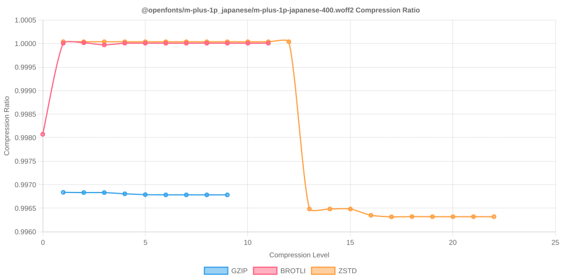
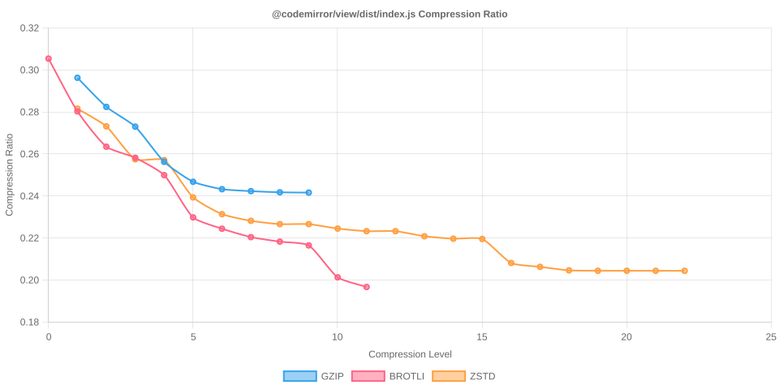
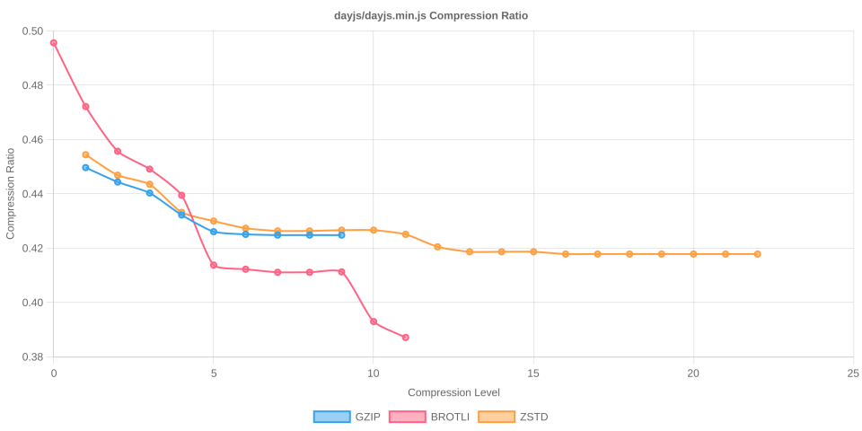
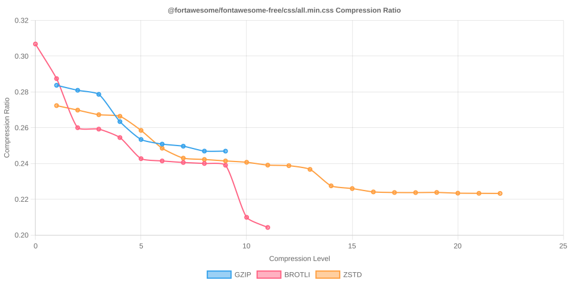
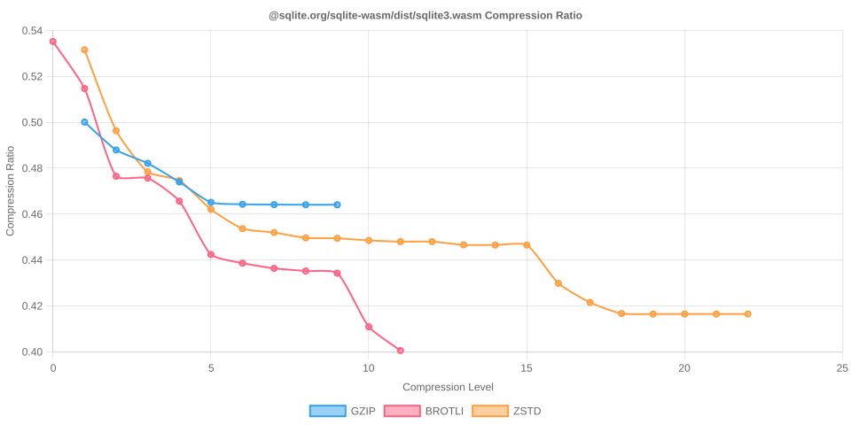

# Node Compression Benchmark

Last updated: 2026-04-15T02:48:55.034Z

This benchmark measures compression time, output size, and compression ratios for several popular npm packages across all gzip, Brotli, and Zstandard compression levels.

## Table of Contents

- [jquery/dist/jquery.min.js](#jquery-dist-jquery-min-js)
- [@expo-google-fonts/noto-sans-jp/400Regular/NotoSansJP_400Regular.ttf](#expo-google-fonts-noto-sans-jp-400regular-notosansjp-400regular-ttf)
- [@openfonts/m-plus-1p_japanese/m-plus-1p-japanese-400.woff2](#openfonts-m-plus-1p-japanese-m-plus-1p-japanese-400-woff2)
- [@codemirror/view/dist/index.js](#codemirror-view-dist-index-js)
- [react/cjs/react.production.js](#react-cjs-react-production-js)
- [dayjs/dayjs.min.js](#dayjs-dayjs-min-js)
- [vue/dist/vue.global.prod.js](#vue-dist-vue-global-prod-js)
- [lodash/lodash.min.js](#lodash-lodash-min-js)
- [@fortawesome/fontawesome-free/css/all.min.css](#fortawesome-fontawesome-free-css-all-min-css)
- [bootstrap/dist/css/bootstrap.min.css](#bootstrap-dist-css-bootstrap-min-css)
- [cities.json/cities.json](#cities-json-cities-json)
- [@sqlite.org/sqlite-wasm/dist/sqlite3.wasm](#sqlite-org-sqlite-wasm-dist-sqlite3-wasm)
- [tailwindcss/theme.css](#tailwindcss-theme-css)

Benchmark settings:

- Warmup runs per level: 1
- Minimum samples per level: 5
- Maximum samples per level: 25
- Target relative half-width (median-based robust estimate): 0.0500

<h2 id="jquery-dist-jquery-min-js">jquery/dist/jquery.min.js</h2>

- Original size: 78,748 bytes
- Chart: 

| Algorithm | Level | Time (ms) | Size (bytes) | Compression Ratio | Samples | Converged |
| --- | ---: | ---: | ---: | ---: | ---: | --- |
| gzip | 1 | 0.926 | 31,033 | 0.3941 | 5 | yes |
| gzip | 2 | 0.959 | 30,134 | 0.3827 | 9 | yes |
| gzip | 3 | 1.066 | 29,671 | 0.3768 | 5 | yes |
| gzip | 4 | 1.209 | 28,457 | 0.3614 | 5 | yes |
| gzip | 5 | 1.590 | 27,721 | 0.3520 | 5 | yes |
| gzip | 6 | 1.829 | 27,584 | 0.3503 | 5 | yes |
| gzip | 7 | 2.030 | 27,547 | 0.3498 | 5 | yes |
| gzip | 8 | 2.365 | 27,530 | 0.3496 | 5 | yes |
| gzip | 9 | 2.358 | 27,530 | 0.3496 | 5 | yes |
| brotli | 0 | 0.361 | 33,111 | 0.4205 | 8 | yes |
| brotli | 1 | 0.729 | 31,803 | 0.4039 | 5 | yes |
| brotli | 2 | 0.839 | 29,394 | 0.3733 | 11 | yes |
| brotli | 3 | 0.914 | 29,072 | 0.3692 | 5 | yes |
| brotli | 4 | 1.407 | 28,392 | 0.3605 | 5 | yes |
| brotli | 5 | 1.993 | 27,013 | 0.3430 | 5 | yes |
| brotli | 6 | 2.172 | 26,844 | 0.3409 | 5 | yes |
| brotli | 7 | 3.571 | 26,773 | 0.3400 | 5 | yes |
| brotli | 8 | 2.571 | 26,725 | 0.3394 | 24 | yes |
| brotli | 9 | 5.592 | 26,711 | 0.3392 | 5 | yes |
| brotli | 10 | 35.434 | 25,340 | 0.3218 | 5 | yes |
| brotli | 11 | 96.543 | 24,992 | 0.3174 | 5 | yes |
| zstd | 1 | 0.309 | 31,062 | 0.3944 | 5 | yes |
| zstd | 2 | 0.368 | 30,069 | 0.3818 | 25 | no |
| zstd | 3 | 0.408 | 29,214 | 0.3710 | 10 | yes |
| zstd | 4 | 1.045 | 29,108 | 0.3696 | 16 | yes |
| zstd | 5 | 1.265 | 28,349 | 0.3600 | 5 | yes |
| zstd | 6 | 1.586 | 27,592 | 0.3504 | 5 | yes |
| zstd | 7 | 1.835 | 27,383 | 0.3477 | 5 | yes |
| zstd | 8 | 1.946 | 27,237 | 0.3459 | 5 | yes |
| zstd | 9 | 2.132 | 27,118 | 0.3444 | 5 | yes |
| zstd | 10 | 2.408 | 27,062 | 0.3437 | 5 | yes |
| zstd | 11 | 4.005 | 26,969 | 0.3425 | 5 | yes |
| zstd | 12 | 3.646 | 26,970 | 0.3425 | 5 | yes |
| zstd | 13 | 6.425 | 26,867 | 0.3412 | 5 | yes |
| zstd | 14 | 8.762 | 26,432 | 0.3357 | 5 | yes |
| zstd | 15 | 9.233 | 26,420 | 0.3355 | 5 | yes |
| zstd | 16 | 12.214 | 26,336 | 0.3344 | 5 | yes |
| zstd | 17 | 12.096 | 26,336 | 0.3344 | 6 | yes |
| zstd | 18 | 12.404 | 26,336 | 0.3344 | 5 | yes |
| zstd | 19 | 23.093 | 26,282 | 0.3337 | 5 | yes |
| zstd | 20 | 22.496 | 26,282 | 0.3337 | 5 | yes |
| zstd | 21 | 23.259 | 26,282 | 0.3337 | 5 | yes |
| zstd | 22 | 23.213 | 26,282 | 0.3337 | 5 | yes |

<h2 id="expo-google-fonts-noto-sans-jp-400regular-notosansjp-400regular-ttf">@expo-google-fonts/noto-sans-jp/400Regular/NotoSansJP_400Regular.ttf</h2>

- Original size: 5,472,784 bytes
- Chart: 

| Algorithm | Level | Time (ms) | Size (bytes) | Compression Ratio | Samples | Converged |
| --- | ---: | ---: | ---: | ---: | ---: | --- |
| gzip | 1 | 84.794 | 3,332,519 | 0.6089 | 5 | yes |
| gzip | 2 | 86.966 | 3,287,937 | 0.6008 | 5 | yes |
| gzip | 3 | 93.812 | 3,262,028 | 0.5960 | 5 | yes |
| gzip | 4 | 105.526 | 3,213,095 | 0.5871 | 5 | yes |
| gzip | 5 | 123.370 | 3,166,204 | 0.5785 | 5 | yes |
| gzip | 6 | 133.113 | 3,156,147 | 0.5767 | 5 | yes |
| gzip | 7 | 141.922 | 3,154,131 | 0.5763 | 5 | yes |
| gzip | 8 | 159.504 | 3,153,066 | 0.5761 | 5 | yes |
| gzip | 9 | 171.952 | 3,153,021 | 0.5761 | 5 | yes |
| brotli | 0 | 20.791 | 3,488,111 | 0.6374 | 5 | yes |
| brotli | 1 | 28.790 | 3,325,102 | 0.6076 | 5 | yes |
| brotli | 2 | 50.240 | 3,247,965 | 0.5935 | 5 | yes |
| brotli | 3 | 64.892 | 3,210,322 | 0.5866 | 5 | yes |
| brotli | 4 | 93.133 | 3,052,068 | 0.5577 | 5 | yes |
| brotli | 5 | 125.743 | 2,942,981 | 0.5377 | 5 | yes |
| brotli | 6 | 149.320 | 2,886,204 | 0.5274 | 5 | yes |
| brotli | 7 | 429.734 | 2,841,359 | 0.5192 | 5 | yes |
| brotli | 8 | 589.075 | 2,823,303 | 0.5159 | 5 | yes |
| brotli | 9 | 778.165 | 2,793,428 | 0.5104 | 9 | yes |
| brotli | 10 | 6408.751 | 2,728,891 | 0.4986 | 5 | yes |
| brotli | 11 | 12815.097 | 2,651,692 | 0.4845 | 5 | yes |
| zstd | 1 | 18.997 | 3,342,771 | 0.6108 | 5 | yes |
| zstd | 2 | 23.782 | 3,233,695 | 0.5909 | 8 | yes |
| zstd | 3 | 40.473 | 3,139,155 | 0.5736 | 5 | yes |
| zstd | 4 | 43.044 | 3,084,237 | 0.5636 | 5 | yes |
| zstd | 5 | 65.987 | 3,021,906 | 0.5522 | 5 | yes |
| zstd | 6 | 79.083 | 2,994,480 | 0.5472 | 5 | yes |
| zstd | 7 | 85.746 | 2,946,701 | 0.5384 | 5 | yes |
| zstd | 8 | 99.491 | 2,941,269 | 0.5374 | 5 | yes |
| zstd | 9 | 105.215 | 2,901,056 | 0.5301 | 5 | yes |
| zstd | 10 | 136.735 | 2,879,072 | 0.5261 | 5 | yes |
| zstd | 11 | 167.637 | 2,868,731 | 0.5242 | 5 | yes |
| zstd | 12 | 188.924 | 2,866,083 | 0.5237 | 5 | yes |
| zstd | 13 | 452.295 | 2,864,062 | 0.5233 | 22 | yes |
| zstd | 14 | 481.559 | 2,852,038 | 0.5211 | 11 | yes |
| zstd | 15 | 537.509 | 2,844,247 | 0.5197 | 14 | yes |
| zstd | 16 | 742.022 | 2,803,911 | 0.5123 | 8 | yes |
| zstd | 17 | 872.826 | 2,756,112 | 0.5036 | 22 | yes |
| zstd | 18 | 1255.222 | 2,713,297 | 0.4958 | 7 | yes |
| zstd | 19 | 1431.662 | 2,710,797 | 0.4953 | 5 | yes |
| zstd | 20 | 1403.735 | 2,710,797 | 0.4953 | 5 | yes |
| zstd | 21 | 1337.029 | 2,710,761 | 0.4953 | 5 | yes |
| zstd | 22 | 1360.086 | 2,710,761 | 0.4953 | 5 | yes |

<h2 id="openfonts-m-plus-1p-japanese-m-plus-1p-japanese-400-woff2">@openfonts/m-plus-1p_japanese/m-plus-1p-japanese-400.woff2</h2>

- Original size: 614,780 bytes
- Chart: 

| Algorithm | Level | Time (ms) | Size (bytes) | Compression Ratio | Samples | Converged |
| --- | ---: | ---: | ---: | ---: | ---: | --- |
| gzip | 1 | 11.981 | 612,836 | 0.9968 | 5 | yes |
| gzip | 2 | 12.006 | 612,833 | 0.9968 | 5 | yes |
| gzip | 3 | 11.999 | 612,833 | 0.9968 | 5 | yes |
| gzip | 4 | 12.536 | 612,817 | 0.9968 | 5 | yes |
| gzip | 5 | 12.583 | 612,806 | 0.9968 | 5 | yes |
| gzip | 6 | 12.466 | 612,803 | 0.9968 | 5 | yes |
| gzip | 7 | 12.471 | 612,803 | 0.9968 | 5 | yes |
| gzip | 8 | 12.481 | 612,803 | 0.9968 | 5 | yes |
| gzip | 9 | 12.476 | 612,803 | 0.9968 | 5 | yes |
| brotli | 0 | 0.292 | 613,595 | 0.9981 | 5 | yes |
| brotli | 1 | 0.258 | 614,785 | 1.0000 | 12 | yes |
| brotli | 2 | 0.671 | 614,791 | 1.0000 | 9 | yes |
| brotli | 3 | 0.829 | 614,763 | 1.0000 | 5 | yes |
| brotli | 4 | 1.166 | 614,785 | 1.0000 | 5 | yes |
| brotli | 5 | 1.751 | 614,785 | 1.0000 | 5 | yes |
| brotli | 6 | 1.488 | 614,785 | 1.0000 | 14 | yes |
| brotli | 7 | 2.205 | 614,785 | 1.0000 | 12 | yes |
| brotli | 8 | 2.770 | 614,785 | 1.0000 | 5 | yes |
| brotli | 9 | 3.514 | 614,785 | 1.0000 | 8 | yes |
| brotli | 10 | 120.933 | 614,785 | 1.0000 | 5 | yes |
| brotli | 11 | 248.212 | 614,785 | 1.0000 | 5 | yes |
| zstd | 1 | 0.316 | 614,805 | 1.0000 | 12 | yes |
| zstd | 2 | 0.324 | 614,804 | 1.0000 | 5 | yes |
| zstd | 3 | 0.416 | 614,804 | 1.0000 | 5 | yes |
| zstd | 4 | 0.494 | 614,804 | 1.0000 | 5 | yes |
| zstd | 5 | 0.637 | 614,804 | 1.0000 | 8 | yes |
| zstd | 6 | 0.644 | 614,804 | 1.0000 | 8 | yes |
| zstd | 7 | 0.873 | 614,804 | 1.0000 | 5 | yes |
| zstd | 8 | 0.820 | 614,804 | 1.0000 | 7 | yes |
| zstd | 9 | 1.145 | 614,804 | 1.0000 | 5 | yes |
| zstd | 10 | 1.801 | 614,804 | 1.0000 | 25 | no |
| zstd | 11 | 1.151 | 614,804 | 1.0000 | 5 | yes |
| zstd | 12 | 1.181 | 614,804 | 1.0000 | 5 | yes |
| zstd | 13 | 4.892 | 612,619 | 0.9965 | 25 | no |
| zstd | 14 | 5.417 | 612,619 | 0.9965 | 6 | yes |
| zstd | 15 | 4.624 | 612,619 | 0.9965 | 25 | no |
| zstd | 16 | 18.256 | 612,536 | 0.9963 | 10 | yes |
| zstd | 17 | 18.078 | 612,516 | 0.9963 | 5 | yes |
| zstd | 18 | 22.205 | 612,519 | 0.9963 | 5 | yes |
| zstd | 19 | 26.784 | 612,518 | 0.9963 | 5 | yes |
| zstd | 20 | 27.589 | 612,518 | 0.9963 | 5 | yes |
| zstd | 21 | 26.256 | 612,518 | 0.9963 | 5 | yes |
| zstd | 22 | 25.602 | 612,518 | 0.9963 | 5 | yes |

<h2 id="codemirror-view-dist-index-js">@codemirror/view/dist/index.js</h2>

- Original size: 485,932 bytes
- Chart: 

| Algorithm | Level | Time (ms) | Size (bytes) | Compression Ratio | Samples | Converged |
| --- | ---: | ---: | ---: | ---: | ---: | --- |
| gzip | 1 | 3.828 | 143,926 | 0.2962 | 5 | yes |
| gzip | 2 | 4.168 | 137,191 | 0.2823 | 5 | yes |
| gzip | 3 | 5.386 | 132,653 | 0.2730 | 5 | yes |
| gzip | 4 | 5.744 | 124,449 | 0.2561 | 5 | yes |
| gzip | 5 | 8.018 | 119,890 | 0.2467 | 5 | yes |
| gzip | 6 | 11.616 | 118,178 | 0.2432 | 5 | yes |
| gzip | 7 | 14.713 | 117,703 | 0.2422 | 5 | yes |
| gzip | 8 | 27.488 | 117,442 | 0.2417 | 5 | yes |
| gzip | 9 | 42.607 | 117,362 | 0.2415 | 5 | yes |
| brotli | 0 | 1.528 | 148,131 | 0.3048 | 5 | yes |
| brotli | 1 | 2.086 | 136,118 | 0.2801 | 5 | yes |
| brotli | 2 | 3.902 | 127,982 | 0.2634 | 5 | yes |
| brotli | 3 | 4.446 | 125,362 | 0.2580 | 5 | yes |
| brotli | 4 | 6.507 | 121,305 | 0.2496 | 5 | yes |
| brotli | 5 | 10.155 | 111,621 | 0.2297 | 5 | yes |
| brotli | 6 | 11.569 | 108,983 | 0.2243 | 5 | yes |
| brotli | 7 | 13.821 | 107,042 | 0.2203 | 5 | yes |
| brotli | 8 | 16.710 | 106,024 | 0.2182 | 5 | yes |
| brotli | 9 | 21.789 | 105,126 | 0.2163 | 5 | yes |
| brotli | 10 | 280.028 | 97,714 | 0.2011 | 5 | yes |
| brotli | 11 | 704.147 | 95,541 | 0.1966 | 5 | yes |
| zstd | 1 | 1.654 | 136,834 | 0.2816 | 5 | yes |
| zstd | 2 | 1.810 | 132,597 | 0.2729 | 5 | yes |
| zstd | 3 | 2.300 | 125,085 | 0.2574 | 5 | yes |
| zstd | 4 | 2.493 | 124,856 | 0.2569 | 5 | yes |
| zstd | 5 | 4.815 | 116,229 | 0.2392 | 5 | yes |
| zstd | 6 | 6.480 | 112,386 | 0.2313 | 5 | yes |
| zstd | 7 | 7.414 | 110,843 | 0.2281 | 5 | yes |
| zstd | 8 | 8.977 | 110,044 | 0.2265 | 5 | yes |
| zstd | 9 | 8.941 | 110,044 | 0.2265 | 5 | yes |
| zstd | 10 | 11.132 | 109,065 | 0.2244 | 5 | yes |
| zstd | 11 | 14.149 | 108,472 | 0.2232 | 5 | yes |
| zstd | 12 | 14.335 | 108,472 | 0.2232 | 5 | yes |
| zstd | 13 | 26.726 | 107,308 | 0.2208 | 5 | yes |
| zstd | 14 | 31.428 | 106,712 | 0.2196 | 5 | yes |
| zstd | 15 | 34.664 | 106,627 | 0.2194 | 5 | yes |
| zstd | 16 | 65.854 | 101,091 | 0.2080 | 5 | yes |
| zstd | 17 | 69.913 | 100,209 | 0.2062 | 5 | yes |
| zstd | 18 | 117.795 | 99,415 | 0.2046 | 5 | yes |
| zstd | 19 | 152.210 | 99,306 | 0.2044 | 5 | yes |
| zstd | 20 | 148.823 | 99,306 | 0.2044 | 5 | yes |
| zstd | 21 | 144.380 | 99,313 | 0.2044 | 5 | yes |
| zstd | 22 | 144.192 | 99,313 | 0.2044 | 5 | yes |

<h2 id="react-cjs-react-production-js">react/cjs/react.production.js</h2>

- Original size: 17,217 bytes
- Chart: 

| Algorithm | Level | Time (ms) | Size (bytes) | Compression Ratio | Samples | Converged |
| --- | ---: | ---: | ---: | ---: | ---: | --- |
| gzip | 1 | 0.100 | 4,987 | 0.2897 | 25 | no |
| gzip | 2 | 0.130 | 4,874 | 0.2831 | 25 | no |
| gzip | 3 | 0.143 | 4,806 | 0.2791 | 20 | yes |
| gzip | 4 | 0.178 | 4,530 | 0.2631 | 10 | yes |
| gzip | 5 | 0.233 | 4,441 | 0.2579 | 6 | yes |
| gzip | 6 | 0.279 | 4,425 | 0.2570 | 5 | yes |
| gzip | 7 | 0.309 | 4,418 | 0.2566 | 5 | yes |
| gzip | 8 | 0.451 | 4,419 | 0.2567 | 5 | yes |
| gzip | 9 | 0.462 | 4,419 | 0.2567 | 5 | yes |
| brotli | 0 | 0.054 | 5,235 | 0.3041 | 8 | yes |
| brotli | 1 | 0.063 | 5,134 | 0.2982 | 13 | yes |
| brotli | 2 | 0.111 | 4,741 | 0.2754 | 20 | yes |
| brotli | 3 | 0.146 | 4,650 | 0.2701 | 12 | yes |
| brotli | 4 | 0.275 | 4,555 | 0.2646 | 5 | yes |
| brotli | 5 | 0.373 | 4,276 | 0.2484 | 5 | yes |
| brotli | 6 | 0.398 | 4,275 | 0.2483 | 5 | yes |
| brotli | 7 | 0.446 | 4,264 | 0.2477 | 5 | yes |
| brotli | 8 | 0.451 | 4,257 | 0.2473 | 5 | yes |
| brotli | 9 | 0.554 | 4,244 | 0.2465 | 5 | yes |
| brotli | 10 | 6.885 | 3,968 | 0.2305 | 5 | yes |
| brotli | 11 | 18.746 | 3,872 | 0.2249 | 5 | yes |
| zstd | 1 | 0.055 | 4,923 | 0.2859 | 9 | yes |
| zstd | 2 | 0.064 | 4,868 | 0.2827 | 22 | yes |
| zstd | 3 | 0.088 | 4,717 | 0.2740 | 10 | yes |
| zstd | 4 | 0.102 | 4,679 | 0.2718 | 23 | yes |
| zstd | 5 | 0.182 | 4,519 | 0.2625 | 9 | yes |
| zstd | 6 | 0.242 | 4,437 | 0.2577 | 5 | yes |
| zstd | 7 | 0.283 | 4,437 | 0.2577 | 5 | yes |
| zstd | 8 | 0.325 | 4,426 | 0.2571 | 5 | yes |
| zstd | 9 | 0.360 | 4,420 | 0.2567 | 5 | yes |
| zstd | 10 | 0.390 | 4,410 | 0.2561 | 5 | yes |
| zstd | 11 | 0.641 | 4,393 | 0.2552 | 5 | yes |
| zstd | 12 | 0.694 | 4,391 | 0.2550 | 5 | yes |
| zstd | 13 | 0.996 | 4,383 | 0.2546 | 5 | yes |
| zstd | 14 | 1.486 | 4,307 | 0.2502 | 5 | yes |
| zstd | 15 | 1.583 | 4,303 | 0.2499 | 5 | yes |
| zstd | 16 | 2.533 | 4,282 | 0.2487 | 5 | yes |
| zstd | 17 | 2.712 | 4,281 | 0.2486 | 5 | yes |
| zstd | 18 | 2.696 | 4,281 | 0.2486 | 5 | yes |
| zstd | 19 | 5.268 | 4,264 | 0.2477 | 5 | yes |
| zstd | 20 | 5.254 | 4,264 | 0.2477 | 5 | yes |
| zstd | 21 | 5.256 | 4,264 | 0.2477 | 5 | yes |
| zstd | 22 | 5.263 | 4,264 | 0.2477 | 5 | yes |

<h2 id="dayjs-dayjs-min-js">dayjs/dayjs.min.js</h2>

- Original size: 7,160 bytes
- Chart: 

| Algorithm | Level | Time (ms) | Size (bytes) | Compression Ratio | Samples | Converged |
| --- | ---: | ---: | ---: | ---: | ---: | --- |
| gzip | 1 | 0.070 | 3,217 | 0.4493 | 25 | no |
| gzip | 2 | 0.055 | 3,179 | 0.4440 | 25 | no |
| gzip | 3 | 0.061 | 3,150 | 0.4399 | 25 | no |
| gzip | 4 | 0.083 | 3,092 | 0.4318 | 25 | no |
| gzip | 5 | 0.076 | 3,047 | 0.4256 | 25 | no |
| gzip | 6 | 0.097 | 3,041 | 0.4247 | 16 | yes |
| gzip | 7 | 0.088 | 3,039 | 0.4244 | 17 | yes |
| gzip | 8 | 0.098 | 3,039 | 0.4244 | 25 | no |
| gzip | 9 | 0.082 | 3,039 | 0.4244 | 5 | yes |
| brotli | 0 | 0.031 | 3,544 | 0.4950 | 10 | yes |
| brotli | 1 | 0.039 | 3,378 | 0.4718 | 9 | yes |
| brotli | 2 | 0.058 | 3,258 | 0.4550 | 25 | yes |
| brotli | 3 | 0.087 | 3,207 | 0.4479 | 25 | no |
| brotli | 4 | 0.150 | 3,138 | 0.4383 | 12 | yes |
| brotli | 5 | 0.217 | 2,961 | 0.4135 | 5 | yes |
| brotli | 6 | 0.238 | 2,950 | 0.4120 | 5 | yes |
| brotli | 7 | 0.252 | 2,942 | 0.4109 | 5 | yes |
| brotli | 8 | 0.257 | 2,942 | 0.4109 | 5 | yes |
| brotli | 9 | 0.312 | 2,943 | 0.4110 | 5 | yes |
| brotli | 10 | 3.299 | 2,813 | 0.3929 | 5 | yes |
| brotli | 11 | 7.837 | 2,771 | 0.3870 | 5 | yes |
| zstd | 1 | 0.036 | 3,250 | 0.4539 | 15 | yes |
| zstd | 2 | 0.039 | 3,196 | 0.4464 | 16 | yes |
| zstd | 3 | 0.049 | 3,171 | 0.4429 | 12 | yes |
| zstd | 4 | 0.067 | 3,098 | 0.4327 | 25 | no |
| zstd | 5 | 0.084 | 3,077 | 0.4297 | 9 | yes |
| zstd | 6 | 0.095 | 3,055 | 0.4267 | 20 | yes |
| zstd | 7 | 0.118 | 3,050 | 0.4260 | 15 | yes |
| zstd | 8 | 0.111 | 3,050 | 0.4260 | 19 | yes |
| zstd | 9 | 0.191 | 3,050 | 0.4260 | 9 | yes |
| zstd | 10 | 0.170 | 3,050 | 0.4260 | 7 | yes |
| zstd | 11 | 0.371 | 3,041 | 0.4247 | 5 | yes |
| zstd | 12 | 0.486 | 3,009 | 0.4203 | 5 | yes |
| zstd | 13 | 0.665 | 2,994 | 0.4182 | 5 | yes |
| zstd | 14 | 0.671 | 2,994 | 0.4182 | 5 | yes |
| zstd | 15 | 0.677 | 2,994 | 0.4182 | 5 | yes |
| zstd | 16 | 1.291 | 2,991 | 0.4177 | 5 | yes |
| zstd | 17 | 1.307 | 2,991 | 0.4177 | 5 | yes |
| zstd | 18 | 1.292 | 2,991 | 0.4177 | 5 | yes |
| zstd | 19 | 1.275 | 2,991 | 0.4177 | 5 | yes |
| zstd | 20 | 1.290 | 2,991 | 0.4177 | 5 | yes |
| zstd | 21 | 1.312 | 2,991 | 0.4177 | 5 | yes |
| zstd | 22 | 1.283 | 2,991 | 0.4177 | 5 | yes |

<h2 id="vue-dist-vue-global-prod-js">vue/dist/vue.global.prod.js</h2>

- Original size: 163,668 bytes
- Chart: 

| Algorithm | Level | Time (ms) | Size (bytes) | Compression Ratio | Samples | Converged |
| --- | ---: | ---: | ---: | ---: | ---: | --- |
| gzip | 1 | 1.875 | 66,705 | 0.4076 | 5 | yes |
| gzip | 2 | 2.003 | 65,090 | 0.3977 | 5 | yes |
| gzip | 3 | 2.264 | 64,098 | 0.3916 | 5 | yes |
| gzip | 4 | 2.547 | 61,763 | 0.3774 | 5 | yes |
| gzip | 5 | 3.417 | 60,115 | 0.3673 | 5 | yes |
| gzip | 6 | 4.216 | 59,851 | 0.3657 | 5 | yes |
| gzip | 7 | 4.586 | 59,811 | 0.3654 | 5 | yes |
| gzip | 8 | 4.971 | 59,795 | 0.3653 | 5 | yes |
| gzip | 9 | 4.990 | 59,795 | 0.3653 | 5 | yes |
| brotli | 0 | 0.653 | 70,918 | 0.4333 | 5 | yes |
| brotli | 1 | 0.851 | 68,052 | 0.4158 | 5 | yes |
| brotli | 2 | 1.638 | 62,794 | 0.3837 | 5 | yes |
| brotli | 3 | 1.915 | 62,228 | 0.3802 | 5 | yes |
| brotli | 4 | 2.915 | 61,075 | 0.3732 | 5 | yes |
| brotli | 5 | 4.398 | 57,725 | 0.3527 | 5 | yes |
| brotli | 6 | 4.839 | 57,374 | 0.3506 | 5 | yes |
| brotli | 7 | 5.773 | 57,109 | 0.3489 | 5 | yes |
| brotli | 8 | 6.255 | 57,015 | 0.3484 | 5 | yes |
| brotli | 9 | 7.445 | 56,928 | 0.3478 | 5 | yes |
| brotli | 10 | 98.636 | 54,189 | 0.3311 | 5 | yes |
| brotli | 11 | 248.816 | 53,226 | 0.3252 | 5 | yes |
| zstd | 1 | 0.626 | 65,987 | 0.4032 | 7 | yes |
| zstd | 2 | 0.795 | 63,119 | 0.3857 | 5 | yes |
| zstd | 3 | 1.005 | 62,505 | 0.3819 | 5 | yes |
| zstd | 4 | 1.890 | 60,689 | 0.3708 | 5 | yes |
| zstd | 5 | 2.217 | 60,183 | 0.3677 | 5 | yes |
| zstd | 6 | 2.597 | 59,274 | 0.3622 | 5 | yes |
| zstd | 7 | 3.006 | 58,475 | 0.3573 | 5 | yes |
| zstd | 8 | 3.704 | 57,997 | 0.3544 | 5 | yes |
| zstd | 9 | 4.264 | 57,744 | 0.3528 | 5 | yes |
| zstd | 10 | 5.030 | 57,617 | 0.3520 | 5 | yes |
| zstd | 11 | 8.539 | 57,324 | 0.3502 | 5 | yes |
| zstd | 12 | 8.616 | 57,311 | 0.3502 | 5 | yes |
| zstd | 13 | 15.399 | 56,313 | 0.3441 | 5 | yes |
| zstd | 14 | 17.735 | 55,866 | 0.3413 | 5 | yes |
| zstd | 15 | 19.172 | 55,859 | 0.3413 | 5 | yes |
| zstd | 16 | 25.575 | 55,686 | 0.3402 | 5 | yes |
| zstd | 17 | 26.899 | 55,686 | 0.3402 | 5 | yes |
| zstd | 18 | 44.985 | 55,612 | 0.3398 | 5 | yes |
| zstd | 19 | 44.269 | 55,612 | 0.3398 | 5 | yes |
| zstd | 20 | 43.353 | 55,612 | 0.3398 | 5 | yes |
| zstd | 21 | 43.198 | 55,612 | 0.3398 | 5 | yes |
| zstd | 22 | 42.577 | 55,612 | 0.3398 | 5 | yes |

<h2 id="lodash-lodash-min-js">lodash/lodash.min.js</h2>

- Original size: 73,234 bytes
- Chart: 

| Algorithm | Level | Time (ms) | Size (bytes) | Compression Ratio | Samples | Converged |
| --- | ---: | ---: | ---: | ---: | ---: | --- |
| gzip | 1 | 0.774 | 28,819 | 0.3935 | 5 | yes |
| gzip | 2 | 0.847 | 28,191 | 0.3849 | 5 | yes |
| gzip | 3 | 0.961 | 27,724 | 0.3786 | 5 | yes |
| gzip | 4 | 1.073 | 26,950 | 0.3680 | 5 | yes |
| gzip | 5 | 1.386 | 26,101 | 0.3564 | 5 | yes |
| gzip | 6 | 1.763 | 25,938 | 0.3542 | 5 | yes |
| gzip | 7 | 2.115 | 25,913 | 0.3538 | 5 | yes |
| gzip | 8 | 2.856 | 25,894 | 0.3536 | 5 | yes |
| gzip | 9 | 2.876 | 25,894 | 0.3536 | 5 | yes |
| brotli | 0 | 0.280 | 30,978 | 0.4230 | 5 | yes |
| brotli | 1 | 0.381 | 29,754 | 0.4063 | 5 | yes |
| brotli | 2 | 0.690 | 27,438 | 0.3747 | 5 | yes |
| brotli | 3 | 0.807 | 27,227 | 0.3718 | 5 | yes |
| brotli | 4 | 1.322 | 26,678 | 0.3643 | 5 | yes |
| brotli | 5 | 1.901 | 25,217 | 0.3443 | 5 | yes |
| brotli | 6 | 2.069 | 25,093 | 0.3426 | 5 | yes |
| brotli | 7 | 2.433 | 24,950 | 0.3407 | 5 | yes |
| brotli | 8 | 2.666 | 24,912 | 0.3402 | 5 | yes |
| brotli | 9 | 3.224 | 24,870 | 0.3396 | 5 | yes |
| brotli | 10 | 40.283 | 23,472 | 0.3205 | 5 | yes |
| brotli | 11 | 97.412 | 23,030 | 0.3145 | 5 | yes |
| zstd | 1 | 0.260 | 28,919 | 0.3949 | 5 | yes |
| zstd | 2 | 0.304 | 28,008 | 0.3824 | 5 | yes |
| zstd | 3 | 0.375 | 27,463 | 0.3750 | 5 | yes |
| zstd | 4 | 0.475 | 27,100 | 0.3700 | 5 | yes |
| zstd | 5 | 0.847 | 26,525 | 0.3622 | 5 | yes |
| zstd | 6 | 1.132 | 25,834 | 0.3528 | 5 | yes |
| zstd | 7 | 1.349 | 25,663 | 0.3504 | 5 | yes |
| zstd | 8 | 1.502 | 25,557 | 0.3490 | 5 | yes |
| zstd | 9 | 1.721 | 25,466 | 0.3477 | 5 | yes |
| zstd | 10 | 1.997 | 25,397 | 0.3468 | 5 | yes |
| zstd | 11 | 3.274 | 25,317 | 0.3457 | 5 | yes |
| zstd | 12 | 3.434 | 25,315 | 0.3457 | 5 | yes |
| zstd | 13 | 5.577 | 25,185 | 0.3439 | 5 | yes |
| zstd | 14 | 7.643 | 24,642 | 0.3365 | 5 | yes |
| zstd | 15 | 7.845 | 24,606 | 0.3360 | 5 | yes |
| zstd | 16 | 10.852 | 24,499 | 0.3345 | 5 | yes |
| zstd | 17 | 10.891 | 24,499 | 0.3345 | 5 | yes |
| zstd | 18 | 10.933 | 24,499 | 0.3345 | 5 | yes |
| zstd | 19 | 20.653 | 24,463 | 0.3340 | 5 | yes |
| zstd | 20 | 20.748 | 24,463 | 0.3340 | 5 | yes |
| zstd | 21 | 20.778 | 24,463 | 0.3340 | 5 | yes |
| zstd | 22 | 20.511 | 24,463 | 0.3340 | 5 | yes |

<h2 id="fortawesome-fontawesome-free-css-all-min-css">@fortawesome/fontawesome-free/css/all.min.css</h2>

- Original size: 75,736 bytes
- Chart: 

| Algorithm | Level | Time (ms) | Size (bytes) | Compression Ratio | Samples | Converged |
| --- | ---: | ---: | ---: | ---: | ---: | --- |
| gzip | 1 | 0.575 | 23,605 | 0.3117 | 5 | yes |
| gzip | 2 | 0.665 | 23,403 | 0.3090 | 5 | yes |
| gzip | 3 | 0.793 | 23,219 | 0.3066 | 5 | yes |
| gzip | 4 | 0.908 | 21,952 | 0.2898 | 5 | yes |
| gzip | 5 | 1.241 | 21,126 | 0.2789 | 5 | yes |
| gzip | 6 | 1.890 | 20,973 | 0.2769 | 5 | yes |
| gzip | 7 | 2.534 | 20,888 | 0.2758 | 5 | yes |
| gzip | 8 | 7.612 | 20,678 | 0.2730 | 5 | yes |
| gzip | 9 | 7.781 | 20,676 | 0.2730 | 5 | yes |
| brotli | 0 | 0.267 | 25,901 | 0.3420 | 5 | yes |
| brotli | 1 | 0.375 | 23,906 | 0.3156 | 5 | yes |
| brotli | 2 | 0.639 | 21,594 | 0.2851 | 5 | yes |
| brotli | 3 | 0.751 | 21,570 | 0.2848 | 5 | yes |
| brotli | 4 | 1.151 | 21,297 | 0.2812 | 5 | yes |
| brotli | 5 | 1.697 | 20,309 | 0.2682 | 5 | yes |
| brotli | 6 | 1.915 | 20,220 | 0.2670 | 5 | yes |
| brotli | 7 | 2.280 | 20,137 | 0.2659 | 5 | yes |
| brotli | 8 | 2.673 | 20,088 | 0.2652 | 5 | yes |
| brotli | 9 | 3.480 | 20,013 | 0.2642 | 5 | yes |
| brotli | 10 | 29.625 | 17,574 | 0.2320 | 5 | yes |
| brotli | 11 | 88.409 | 17,022 | 0.2248 | 5 | yes |
| zstd | 1 | 0.261 | 22,639 | 0.2989 | 7 | yes |
| zstd | 2 | 0.293 | 22,433 | 0.2962 | 5 | yes |
| zstd | 3 | 0.363 | 22,208 | 0.2932 | 5 | yes |
| zstd | 4 | 0.421 | 22,181 | 0.2929 | 8 | yes |
| zstd | 5 | 0.814 | 21,579 | 0.2849 | 5 | yes |
| zstd | 6 | 1.065 | 20,795 | 0.2746 | 5 | yes |
| zstd | 7 | 1.304 | 20,334 | 0.2685 | 5 | yes |
| zstd | 8 | 1.477 | 20,295 | 0.2680 | 5 | yes |
| zstd | 9 | 1.894 | 20,230 | 0.2671 | 5 | yes |
| zstd | 10 | 2.443 | 20,178 | 0.2664 | 5 | yes |
| zstd | 11 | 3.295 | 20,032 | 0.2645 | 5 | yes |
| zstd | 12 | 4.290 | 20,012 | 0.2642 | 5 | yes |
| zstd | 13 | 5.128 | 19,719 | 0.2604 | 5 | yes |
| zstd | 14 | 7.464 | 18,964 | 0.2504 | 5 | yes |
| zstd | 15 | 8.324 | 18,878 | 0.2493 | 5 | yes |
| zstd | 16 | 11.711 | 18,772 | 0.2479 | 5 | yes |
| zstd | 17 | 14.951 | 18,740 | 0.2474 | 5 | yes |
| zstd | 18 | 21.704 | 18,740 | 0.2474 | 5 | yes |
| zstd | 19 | 22.498 | 18,755 | 0.2476 | 5 | yes |
| zstd | 20 | 26.333 | 18,717 | 0.2471 | 5 | yes |
| zstd | 21 | 37.529 | 18,701 | 0.2469 | 5 | yes |
| zstd | 22 | 43.691 | 18,702 | 0.2469 | 5 | yes |

<h2 id="bootstrap-dist-css-bootstrap-min-css">bootstrap/dist/css/bootstrap.min.css</h2>

- Original size: 232,111 bytes
- Chart: 

| Algorithm | Level | Time (ms) | Size (bytes) | Compression Ratio | Samples | Converged |
| --- | ---: | ---: | ---: | ---: | ---: | --- |
| gzip | 1 | 1.085 | 41,452 | 0.1786 | 5 | yes |
| gzip | 2 | 1.129 | 38,418 | 0.1655 | 5 | yes |
| gzip | 3 | 1.319 | 36,152 | 0.1558 | 5 | yes |
| gzip | 4 | 1.712 | 33,830 | 0.1457 | 5 | yes |
| gzip | 5 | 2.160 | 31,408 | 0.1353 | 5 | yes |
| gzip | 6 | 2.900 | 30,823 | 0.1328 | 5 | yes |
| gzip | 7 | 3.545 | 30,680 | 0.1322 | 5 | yes |
| gzip | 8 | 4.734 | 30,670 | 0.1321 | 5 | yes |
| gzip | 9 | 4.842 | 30,669 | 0.1321 | 5 | yes |
| brotli | 0 | 0.459 | 43,268 | 0.1864 | 5 | yes |
| brotli | 1 | 0.621 | 39,941 | 0.1721 | 6 | yes |
| brotli | 2 | 1.197 | 36,514 | 0.1573 | 5 | yes |
| brotli | 3 | 1.373 | 34,781 | 0.1498 | 5 | yes |
| brotli | 4 | 2.012 | 33,048 | 0.1424 | 5 | yes |
| brotli | 5 | 2.938 | 28,253 | 0.1217 | 5 | yes |
| brotli | 6 | 3.267 | 27,431 | 0.1182 | 5 | yes |
| brotli | 7 | 3.672 | 26,971 | 0.1162 | 5 | yes |
| brotli | 8 | 4.205 | 26,813 | 0.1155 | 5 | yes |
| brotli | 9 | 5.031 | 26,569 | 0.1145 | 5 | yes |
| brotli | 10 | 98.569 | 23,482 | 0.1012 | 5 | yes |
| brotli | 11 | 302.152 | 22,970 | 0.0990 | 5 | yes |
| zstd | 1 | 0.508 | 35,549 | 0.1532 | 5 | yes |
| zstd | 2 | 0.544 | 34,301 | 0.1478 | 5 | yes |
| zstd | 3 | 0.600 | 34,393 | 0.1482 | 5 | yes |
| zstd | 4 | 1.619 | 30,973 | 0.1334 | 5 | yes |
| zstd | 5 | 2.004 | 29,744 | 0.1281 | 9 | yes |
| zstd | 6 | 2.330 | 29,727 | 0.1281 | 5 | yes |
| zstd | 7 | 2.487 | 29,710 | 0.1280 | 5 | yes |
| zstd | 8 | 3.025 | 28,645 | 0.1234 | 5 | yes |
| zstd | 9 | 3.564 | 28,235 | 0.1216 | 6 | yes |
| zstd | 10 | 4.360 | 28,044 | 0.1208 | 5 | yes |
| zstd | 11 | 8.031 | 27,895 | 0.1202 | 5 | yes |
| zstd | 12 | 9.858 | 27,805 | 0.1198 | 5 | yes |
| zstd | 13 | 18.078 | 27,283 | 0.1175 | 5 | yes |
| zstd | 14 | 22.264 | 26,828 | 0.1156 | 5 | yes |
| zstd | 15 | 28.539 | 26,465 | 0.1140 | 5 | yes |
| zstd | 16 | 57.702 | 26,071 | 0.1123 | 5 | yes |
| zstd | 17 | 65.656 | 26,041 | 0.1122 | 5 | yes |
| zstd | 18 | 86.641 | 26,008 | 0.1120 | 5 | yes |
| zstd | 19 | 97.709 | 26,015 | 0.1121 | 5 | yes |
| zstd | 20 | 103.596 | 26,014 | 0.1121 | 5 | yes |
| zstd | 21 | 103.200 | 26,014 | 0.1121 | 5 | yes |
| zstd | 22 | 102.938 | 26,014 | 0.1121 | 5 | yes |

<h2 id="cities-json-cities-json">cities.json/cities.json</h2>

- Original size: 21,953,388 bytes
- Chart: 

| Algorithm | Level | Time (ms) | Size (bytes) | Compression Ratio | Samples | Converged |
| --- | ---: | ---: | ---: | ---: | ---: | --- |
| gzip | 1 | 90.973 | 3,751,261 | 0.1709 | 5 | yes |
| gzip | 2 | 91.014 | 3,528,967 | 0.1607 | 5 | yes |
| gzip | 3 | 108.728 | 3,370,979 | 0.1536 | 5 | yes |
| gzip | 4 | 146.255 | 3,328,999 | 0.1516 | 5 | yes |
| gzip | 5 | 171.124 | 3,081,077 | 0.1403 | 5 | yes |
| gzip | 6 | 216.919 | 3,020,114 | 0.1376 | 5 | yes |
| gzip | 7 | 322.470 | 2,903,542 | 0.1323 | 5 | yes |
| gzip | 8 | 905.362 | 2,794,554 | 0.1273 | 5 | yes |
| gzip | 9 | 1203.355 | 2,783,224 | 0.1268 | 5 | yes |
| brotli | 0 | 45.115 | 4,059,162 | 0.1849 | 5 | yes |
| brotli | 1 | 61.111 | 3,701,732 | 0.1686 | 5 | yes |
| brotli | 2 | 112.822 | 3,357,390 | 0.1529 | 5 | yes |
| brotli | 3 | 130.609 | 3,265,779 | 0.1488 | 5 | yes |
| brotli | 4 | 166.481 | 3,125,451 | 0.1424 | 5 | yes |
| brotli | 5 | 298.214 | 2,774,227 | 0.1264 | 5 | yes |
| brotli | 6 | 344.691 | 2,738,409 | 0.1247 | 5 | yes |
| brotli | 7 | 500.246 | 2,707,850 | 0.1233 | 5 | yes |
| brotli | 8 | 623.113 | 2,687,842 | 0.1224 | 5 | yes |
| brotli | 9 | 842.651 | 2,673,141 | 0.1218 | 5 | yes |
| brotli | 10 | 13341.768 | 2,315,778 | 0.1055 | 5 | yes |
| brotli | 11 | 37621.328 | 2,180,828 | 0.0993 | 5 | yes |
| zstd | 1 | 45.193 | 3,380,894 | 0.1540 | 5 | yes |
| zstd | 2 | 55.703 | 3,402,497 | 0.1550 | 5 | yes |
| zstd | 3 | 67.319 | 3,449,952 | 0.1571 | 5 | yes |
| zstd | 4 | 71.716 | 3,454,596 | 0.1574 | 5 | yes |
| zstd | 5 | 143.330 | 3,140,901 | 0.1431 | 5 | yes |
| zstd | 6 | 199.391 | 2,932,855 | 0.1336 | 5 | yes |
| zstd | 7 | 225.699 | 2,887,559 | 0.1315 | 5 | yes |
| zstd | 8 | 291.821 | 2,785,481 | 0.1269 | 5 | yes |
| zstd | 9 | 299.415 | 2,795,218 | 0.1273 | 5 | yes |
| zstd | 10 | 450.773 | 2,753,222 | 0.1254 | 5 | yes |
| zstd | 11 | 649.667 | 2,720,543 | 0.1239 | 5 | yes |
| zstd | 12 | 684.120 | 2,720,412 | 0.1239 | 5 | yes |
| zstd | 13 | 913.030 | 2,680,256 | 0.1221 | 5 | yes |
| zstd | 14 | 1106.735 | 2,654,484 | 0.1209 | 5 | yes |
| zstd | 15 | 1322.736 | 2,651,235 | 0.1208 | 7 | yes |
| zstd | 16 | 3380.075 | 2,535,036 | 0.1155 | 5 | yes |
| zstd | 17 | 3821.830 | 2,466,410 | 0.1123 | 5 | yes |
| zstd | 18 | 5343.690 | 2,453,943 | 0.1118 | 5 | yes |
| zstd | 19 | 9739.617 | 2,384,554 | 0.1086 | 5 | yes |
| zstd | 20 | 9972.476 | 2,382,448 | 0.1085 | 5 | yes |
| zstd | 21 | 9994.499 | 2,382,300 | 0.1085 | 5 | yes |
| zstd | 22 | 10567.332 | 2,378,818 | 0.1084 | 5 | yes |

<h2 id="sqlite-org-sqlite-wasm-dist-sqlite3-wasm">@sqlite.org/sqlite-wasm/dist/sqlite3.wasm</h2>

- Original size: 859,730 bytes
- Chart: 

| Algorithm | Level | Time (ms) | Size (bytes) | Compression Ratio | Samples | Converged |
| --- | ---: | ---: | ---: | ---: | ---: | --- |
| gzip | 1 | 12.223 | 429,925 | 0.5001 | 5 | yes |
| gzip | 2 | 13.254 | 419,493 | 0.4879 | 5 | yes |
| gzip | 3 | 15.351 | 414,493 | 0.4821 | 5 | yes |
| gzip | 4 | 16.409 | 407,503 | 0.4740 | 5 | yes |
| gzip | 5 | 23.406 | 399,866 | 0.4651 | 5 | yes |
| gzip | 6 | 27.678 | 399,154 | 0.4643 | 5 | yes |
| gzip | 7 | 29.282 | 399,020 | 0.4641 | 5 | yes |
| gzip | 8 | 32.186 | 398,974 | 0.4641 | 5 | yes |
| gzip | 9 | 32.396 | 398,973 | 0.4641 | 5 | yes |
| brotli | 0 | 3.926 | 460,125 | 0.5352 | 5 | yes |
| brotli | 1 | 5.363 | 442,506 | 0.5147 | 5 | yes |
| brotli | 2 | 9.967 | 409,638 | 0.4765 | 5 | yes |
| brotli | 3 | 11.998 | 408,960 | 0.4757 | 5 | yes |
| brotli | 4 | 17.703 | 400,331 | 0.4656 | 5 | yes |
| brotli | 5 | 26.794 | 380,339 | 0.4424 | 5 | yes |
| brotli | 6 | 31.137 | 377,100 | 0.4386 | 5 | yes |
| brotli | 7 | 44.574 | 375,149 | 0.4364 | 5 | yes |
| brotli | 8 | 54.000 | 374,164 | 0.4352 | 5 | yes |
| brotli | 9 | 67.243 | 373,347 | 0.4343 | 5 | yes |
| brotli | 10 | 912.926 | 353,246 | 0.4109 | 5 | yes |
| brotli | 11 | 1948.526 | 344,353 | 0.4005 | 5 | yes |
| zstd | 1 | 3.108 | 457,015 | 0.5316 | 5 | yes |
| zstd | 2 | 3.948 | 426,694 | 0.4963 | 5 | yes |
| zstd | 3 | 6.060 | 411,278 | 0.4784 | 5 | yes |
| zstd | 4 | 6.817 | 408,051 | 0.4746 | 5 | yes |
| zstd | 5 | 10.525 | 397,246 | 0.4621 | 5 | yes |
| zstd | 6 | 14.030 | 390,015 | 0.4536 | 5 | yes |
| zstd | 7 | 15.324 | 388,562 | 0.4520 | 5 | yes |
| zstd | 8 | 18.908 | 386,566 | 0.4496 | 5 | yes |
| zstd | 9 | 19.647 | 386,404 | 0.4494 | 5 | yes |
| zstd | 10 | 22.297 | 385,609 | 0.4485 | 5 | yes |
| zstd | 11 | 26.601 | 385,152 | 0.4480 | 5 | yes |
| zstd | 12 | 27.250 | 385,152 | 0.4480 | 5 | yes |
| zstd | 13 | 53.719 | 383,952 | 0.4466 | 5 | yes |
| zstd | 14 | 59.463 | 383,886 | 0.4465 | 5 | yes |
| zstd | 15 | 54.733 | 383,877 | 0.4465 | 5 | yes |
| zstd | 16 | 96.663 | 369,550 | 0.4298 | 6 | yes |
| zstd | 17 | 115.876 | 362,382 | 0.4215 | 5 | yes |
| zstd | 18 | 153.304 | 358,220 | 0.4167 | 5 | yes |
| zstd | 19 | 192.193 | 358,047 | 0.4165 | 5 | yes |
| zstd | 20 | 172.692 | 358,047 | 0.4165 | 5 | yes |
| zstd | 21 | 206.037 | 358,041 | 0.4165 | 10 | yes |
| zstd | 22 | 205.663 | 358,041 | 0.4165 | 5 | yes |

<h2 id="tailwindcss-theme-css">tailwindcss/theme.css</h2>

- Original size: 19,480 bytes
- Chart: 

| Algorithm | Level | Time (ms) | Size (bytes) | Compression Ratio | Samples | Converged |
| --- | ---: | ---: | ---: | ---: | ---: | --- |
| gzip | 1 | 0.104 | 5,506 | 0.2826 | 25 | no |
| gzip | 2 | 0.122 | 5,424 | 0.2784 | 25 | no |
| gzip | 3 | 0.173 | 5,356 | 0.2749 | 7 | yes |
| gzip | 4 | 0.209 | 5,145 | 0.2641 | 7 | yes |
| gzip | 5 | 0.279 | 4,896 | 0.2513 | 5 | yes |
| gzip | 6 | 0.374 | 4,884 | 0.2507 | 5 | yes |
| gzip | 7 | 0.496 | 4,857 | 0.2493 | 5 | yes |
| gzip | 8 | 0.655 | 4,859 | 0.2494 | 5 | yes |
| gzip | 9 | 0.642 | 4,859 | 0.2494 | 5 | yes |
| brotli | 0 | 0.059 | 6,028 | 0.3094 | 12 | yes |
| brotli | 1 | 0.071 | 5,737 | 0.2945 | 12 | yes |
| brotli | 2 | 0.133 | 4,944 | 0.2538 | 25 | no |
| brotli | 3 | 0.168 | 4,930 | 0.2531 | 12 | yes |
| brotli | 4 | 0.292 | 4,898 | 0.2514 | 5 | yes |
| brotli | 5 | 0.453 | 4,581 | 0.2352 | 5 | yes |
| brotli | 6 | 0.489 | 4,570 | 0.2346 | 5 | yes |
| brotli | 7 | 0.560 | 4,564 | 0.2343 | 5 | yes |
| brotli | 8 | 0.608 | 4,561 | 0.2341 | 5 | yes |
| brotli | 9 | 0.728 | 4,553 | 0.2337 | 5 | yes |
| brotli | 10 | 7.269 | 3,934 | 0.2020 | 5 | yes |
| brotli | 11 | 21.804 | 3,824 | 0.1963 | 5 | yes |
| zstd | 1 | 0.061 | 5,379 | 0.2761 | 13 | yes |
| zstd | 2 | 0.068 | 5,176 | 0.2657 | 10 | yes |
| zstd | 3 | 0.100 | 5,169 | 0.2653 | 9 | yes |
| zstd | 4 | 0.106 | 5,154 | 0.2646 | 7 | yes |
| zstd | 5 | 0.194 | 5,074 | 0.2605 | 9 | yes |
| zstd | 6 | 0.256 | 4,797 | 0.2463 | 19 | yes |
| zstd | 7 | 0.330 | 4,702 | 0.2414 | 5 | yes |
| zstd | 8 | 0.348 | 4,696 | 0.2411 | 5 | yes |
| zstd | 9 | 0.418 | 4,690 | 0.2408 | 7 | yes |
| zstd | 10 | 0.529 | 4,691 | 0.2408 | 5 | yes |
| zstd | 11 | 0.614 | 4,689 | 0.2407 | 5 | yes |
| zstd | 12 | 0.652 | 4,687 | 0.2406 | 5 | yes |
| zstd | 13 | 1.034 | 4,806 | 0.2467 | 5 | yes |
| zstd | 14 | 1.824 | 4,447 | 0.2283 | 5 | yes |
| zstd | 15 | 1.933 | 4,446 | 0.2282 | 5 | yes |
| zstd | 16 | 2.914 | 4,367 | 0.2242 | 5 | yes |
| zstd | 17 | 2.897 | 4,367 | 0.2242 | 5 | yes |
| zstd | 18 | 2.897 | 4,367 | 0.2242 | 5 | yes |
| zstd | 19 | 5.677 | 4,348 | 0.2232 | 5 | yes |
| zstd | 20 | 5.700 | 4,348 | 0.2232 | 5 | yes |
| zstd | 21 | 5.720 | 4,348 | 0.2232 | 5 | yes |
| zstd | 22 | 5.760 | 4,348 | 0.2232 | 5 | yes |
