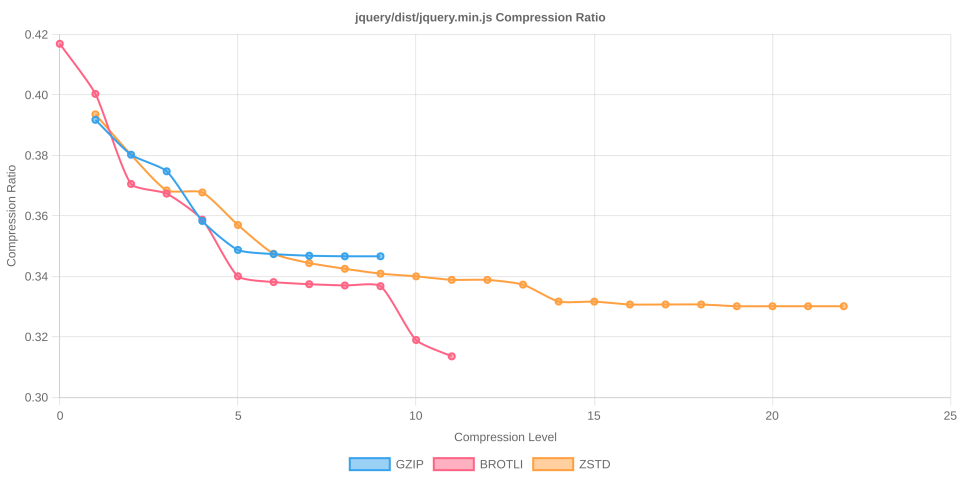
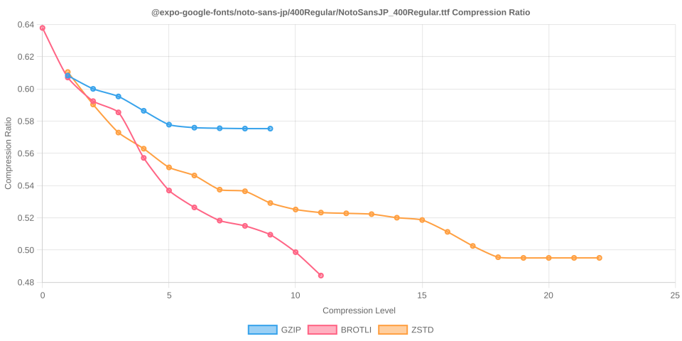
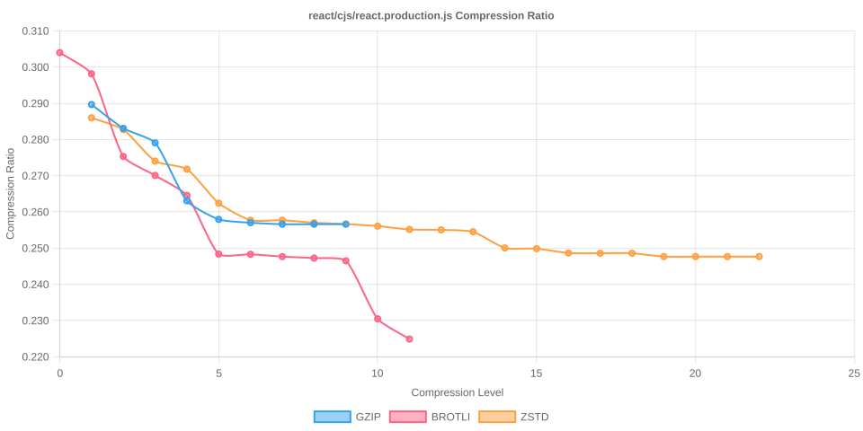
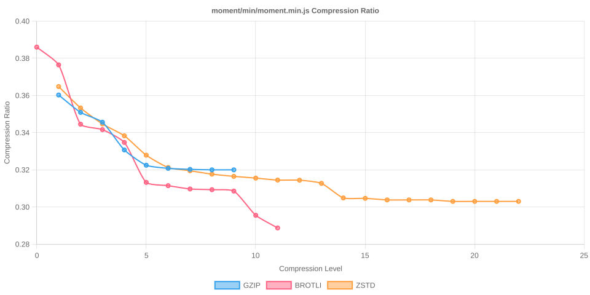
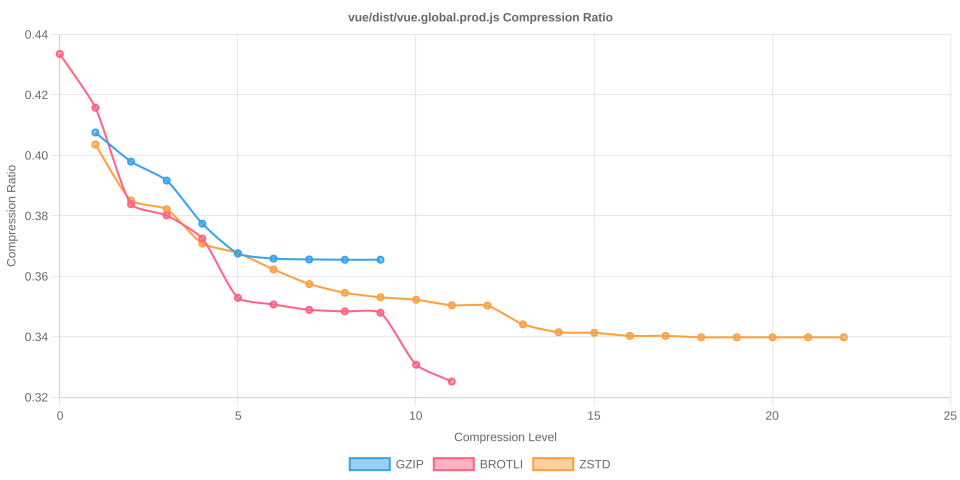
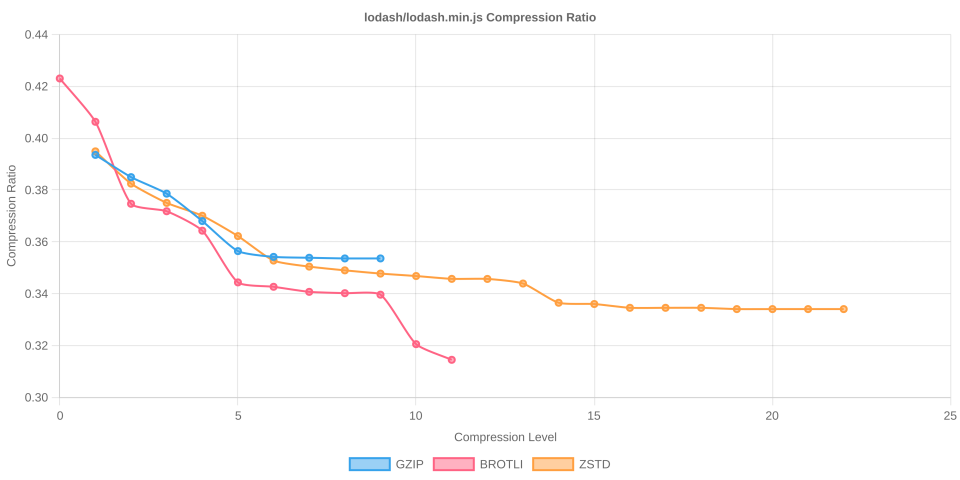
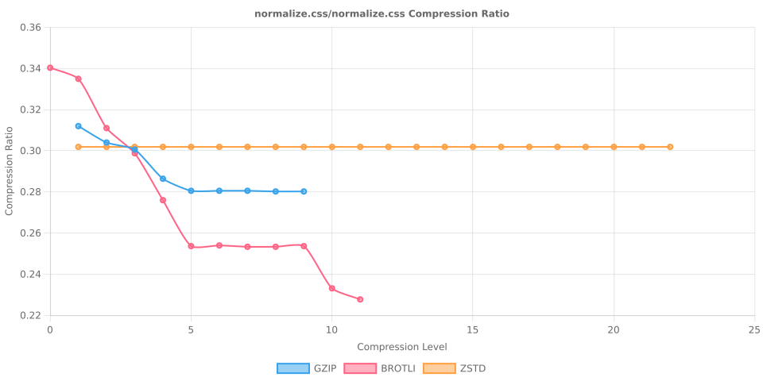
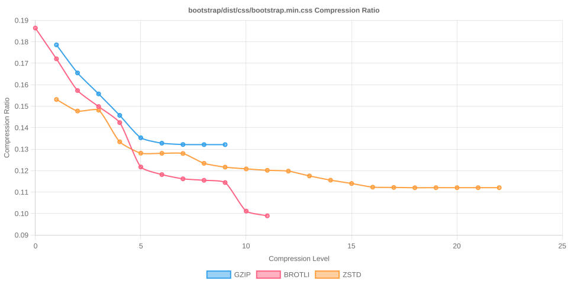
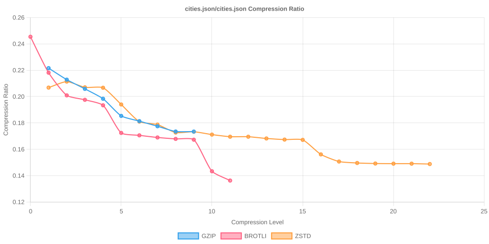
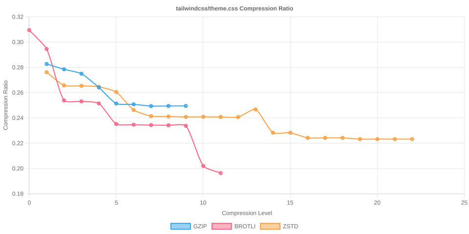

# Node Compression Benchmark

Last updated: 2026-03-15T23:56:10.922Z

This benchmark measures compression time, output size, and compression ratios for several popular npm packages across all gzip, Brotli, and Zstandard compression levels.

## jquery/dist/jquery.min.js

- Original size: 78,748 bytes
- Chart: 

| Algorithm | Level | Time (ms) | Size (bytes) | Compression Ratio |
| --- | --- | --- | --- | --- |
| gzip | 1 | 1.263 | 31,033 | 0.3941 |
| gzip | 2 | 1.381 | 30,134 | 0.3827 |
| gzip | 3 | 1.371 | 29,671 | 0.3768 |
| gzip | 4 | 1.236 | 28,457 | 0.3614 |
| gzip | 5 | 1.571 | 27,721 | 0.3520 |
| gzip | 6 | 2.227 | 27,584 | 0.3503 |
| gzip | 7 | 2.494 | 27,547 | 0.3498 |
| gzip | 8 | 2.343 | 27,530 | 0.3496 |
| gzip | 9 | 2.429 | 27,530 | 0.3496 |
| brotli | 0 | 0.456 | 33,111 | 0.4205 |
| brotli | 1 | 1.038 | 31,803 | 0.4039 |
| brotli | 2 | 1.217 | 29,394 | 0.3733 |
| brotli | 3 | 1.061 | 29,072 | 0.3692 |
| brotli | 4 | 1.468 | 28,392 | 0.3605 |
| brotli | 5 | 2.167 | 27,013 | 0.3430 |
| brotli | 6 | 2.508 | 26,844 | 0.3409 |
| brotli | 7 | 2.723 | 26,773 | 0.3400 |
| brotli | 8 | 3.020 | 26,725 | 0.3394 |
| brotli | 9 | 5.552 | 26,711 | 0.3392 |
| brotli | 10 | 36.926 | 25,340 | 0.3218 |
| brotli | 11 | 108.704 | 24,992 | 0.3174 |
| zstd | 1 | 0.324 | 31,062 | 0.3944 |
| zstd | 2 | 0.419 | 30,069 | 0.3818 |
| zstd | 3 | 0.432 | 29,214 | 0.3710 |
| zstd | 4 | 0.545 | 29,108 | 0.3696 |
| zstd | 5 | 0.942 | 28,349 | 0.3600 |
| zstd | 6 | 1.697 | 27,592 | 0.3504 |
| zstd | 7 | 1.968 | 27,383 | 0.3477 |
| zstd | 8 | 2.087 | 27,237 | 0.3459 |
| zstd | 9 | 2.288 | 27,118 | 0.3444 |
| zstd | 10 | 2.545 | 27,062 | 0.3437 |
| zstd | 11 | 4.349 | 26,969 | 0.3425 |
| zstd | 12 | 4.684 | 26,970 | 0.3425 |
| zstd | 13 | 6.599 | 26,867 | 0.3412 |
| zstd | 14 | 9.229 | 26,432 | 0.3357 |
| zstd | 15 | 9.339 | 26,420 | 0.3355 |
| zstd | 16 | 12.988 | 26,336 | 0.3344 |
| zstd | 17 | 12.838 | 26,336 | 0.3344 |
| zstd | 18 | 12.753 | 26,336 | 0.3344 |
| zstd | 19 | 23.661 | 26,282 | 0.3337 |
| zstd | 20 | 23.665 | 26,282 | 0.3337 |
| zstd | 21 | 24.053 | 26,282 | 0.3337 |
| zstd | 22 | 23.718 | 26,282 | 0.3337 |

## @expo-google-fonts/noto-sans-jp/400Regular/NotoSansJP_400Regular.ttf

- Original size: 5,472,784 bytes
- Chart: 

| Algorithm | Level | Time (ms) | Size (bytes) | Compression Ratio |
| --- | --- | --- | --- | --- |
| gzip | 1 | 84.366 | 3,332,519 | 0.6089 |
| gzip | 2 | 91.539 | 3,287,937 | 0.6008 |
| gzip | 3 | 92.819 | 3,262,028 | 0.5960 |
| gzip | 4 | 104.683 | 3,213,095 | 0.5871 |
| gzip | 5 | 119.898 | 3,166,204 | 0.5785 |
| gzip | 6 | 134.569 | 3,156,147 | 0.5767 |
| gzip | 7 | 143.612 | 3,154,131 | 0.5763 |
| gzip | 8 | 160.495 | 3,153,066 | 0.5761 |
| gzip | 9 | 172.194 | 3,153,021 | 0.5761 |
| brotli | 0 | 20.409 | 3,488,111 | 0.6374 |
| brotli | 1 | 28.569 | 3,325,102 | 0.6076 |
| brotli | 2 | 49.405 | 3,247,965 | 0.5935 |
| brotli | 3 | 62.563 | 3,210,322 | 0.5866 |
| brotli | 4 | 97.194 | 3,052,068 | 0.5577 |
| brotli | 5 | 245.533 | 2,942,981 | 0.5377 |
| brotli | 6 | 387.561 | 2,886,204 | 0.5274 |
| brotli | 7 | 632.811 | 2,841,359 | 0.5192 |
| brotli | 8 | 805.952 | 2,823,303 | 0.5159 |
| brotli | 9 | 1050.677 | 2,793,428 | 0.5104 |
| brotli | 10 | 7230.662 | 2,728,891 | 0.4986 |
| brotli | 11 | 13981.899 | 2,651,692 | 0.4845 |
| zstd | 1 | 18.697 | 3,342,771 | 0.6108 |
| zstd | 2 | 23.757 | 3,233,695 | 0.5909 |
| zstd | 3 | 38.386 | 3,139,155 | 0.5736 |
| zstd | 4 | 41.168 | 3,084,237 | 0.5636 |
| zstd | 5 | 68.554 | 3,021,906 | 0.5522 |
| zstd | 6 | 81.063 | 2,994,480 | 0.5472 |
| zstd | 7 | 96.337 | 2,946,701 | 0.5384 |
| zstd | 8 | 109.989 | 2,941,269 | 0.5374 |
| zstd | 9 | 122.928 | 2,901,056 | 0.5301 |
| zstd | 10 | 145.379 | 2,879,072 | 0.5261 |
| zstd | 11 | 221.174 | 2,868,731 | 0.5242 |
| zstd | 12 | 248.631 | 2,866,083 | 0.5237 |
| zstd | 13 | 575.378 | 2,864,062 | 0.5233 |
| zstd | 14 | 612.440 | 2,852,038 | 0.5211 |
| zstd | 15 | 692.930 | 2,844,247 | 0.5197 |
| zstd | 16 | 927.132 | 2,803,911 | 0.5123 |
| zstd | 17 | 1099.734 | 2,756,112 | 0.5036 |
| zstd | 18 | 1511.075 | 2,713,297 | 0.4958 |
| zstd | 19 | 1609.397 | 2,710,797 | 0.4953 |
| zstd | 20 | 1577.988 | 2,710,797 | 0.4953 |
| zstd | 21 | 1605.261 | 2,710,761 | 0.4953 |
| zstd | 22 | 1594.647 | 2,710,761 | 0.4953 |

## react/cjs/react.production.js

- Original size: 17,217 bytes
- Chart: 

| Algorithm | Level | Time (ms) | Size (bytes) | Compression Ratio |
| --- | --- | --- | --- | --- |
| gzip | 1 | 0.134 | 4,987 | 0.2897 |
| gzip | 2 | 0.137 | 4,874 | 0.2831 |
| gzip | 3 | 0.157 | 4,806 | 0.2791 |
| gzip | 4 | 0.195 | 4,530 | 0.2631 |
| gzip | 5 | 0.235 | 4,441 | 0.2579 |
| gzip | 6 | 0.283 | 4,425 | 0.2570 |
| gzip | 7 | 0.320 | 4,418 | 0.2566 |
| gzip | 8 | 0.455 | 4,419 | 0.2567 |
| gzip | 9 | 0.462 | 4,419 | 0.2567 |
| brotli | 0 | 0.072 | 5,235 | 0.3041 |
| brotli | 1 | 0.075 | 5,134 | 0.2982 |
| brotli | 2 | 0.142 | 4,741 | 0.2754 |
| brotli | 3 | 0.166 | 4,650 | 0.2701 |
| brotli | 4 | 0.297 | 4,555 | 0.2646 |
| brotli | 5 | 0.371 | 4,276 | 0.2484 |
| brotli | 6 | 0.375 | 4,275 | 0.2483 |
| brotli | 7 | 0.454 | 4,264 | 0.2477 |
| brotli | 8 | 0.481 | 4,257 | 0.2473 |
| brotli | 9 | 0.558 | 4,244 | 0.2465 |
| brotli | 10 | 7.042 | 3,969 | 0.2305 |
| brotli | 11 | 20.762 | 3,872 | 0.2249 |
| zstd | 1 | 0.065 | 4,923 | 0.2859 |
| zstd | 2 | 0.071 | 4,868 | 0.2827 |
| zstd | 3 | 0.092 | 4,717 | 0.2740 |
| zstd | 4 | 0.104 | 4,679 | 0.2718 |
| zstd | 5 | 0.221 | 4,519 | 0.2625 |
| zstd | 6 | 0.278 | 4,437 | 0.2577 |
| zstd | 7 | 0.312 | 4,437 | 0.2577 |
| zstd | 8 | 0.332 | 4,426 | 0.2571 |
| zstd | 9 | 0.371 | 4,420 | 0.2567 |
| zstd | 10 | 0.412 | 4,410 | 0.2561 |
| zstd | 11 | 0.666 | 4,393 | 0.2552 |
| zstd | 12 | 0.716 | 4,391 | 0.2550 |
| zstd | 13 | 0.963 | 4,382 | 0.2545 |
| zstd | 14 | 1.476 | 4,307 | 0.2502 |
| zstd | 15 | 1.592 | 4,303 | 0.2499 |
| zstd | 16 | 2.560 | 4,282 | 0.2487 |
| zstd | 17 | 2.725 | 4,281 | 0.2486 |
| zstd | 18 | 2.720 | 4,281 | 0.2486 |
| zstd | 19 | 5.335 | 4,264 | 0.2477 |
| zstd | 20 | 5.349 | 4,264 | 0.2477 |
| zstd | 21 | 5.349 | 4,264 | 0.2477 |
| zstd | 22 | 5.314 | 4,264 | 0.2477 |

## moment/min/moment.min.js

- Original size: 58,890 bytes
- Chart: 

| Algorithm | Level | Time (ms) | Size (bytes) | Compression Ratio |
| --- | --- | --- | --- | --- |
| gzip | 1 | 0.572 | 21,216 | 0.3603 |
| gzip | 2 | 0.612 | 20,666 | 0.3509 |
| gzip | 3 | 0.689 | 20,354 | 0.3456 |
| gzip | 4 | 0.818 | 19,475 | 0.3307 |
| gzip | 5 | 1.020 | 18,991 | 0.3225 |
| gzip | 6 | 1.213 | 18,892 | 0.3208 |
| gzip | 7 | 1.365 | 18,860 | 0.3203 |
| gzip | 8 | 1.628 | 18,845 | 0.3200 |
| gzip | 9 | 1.613 | 18,845 | 0.3200 |
| brotli | 0 | 0.219 | 22,733 | 0.3860 |
| brotli | 1 | 0.284 | 22,170 | 0.3765 |
| brotli | 2 | 0.552 | 20,291 | 0.3446 |
| brotli | 3 | 0.647 | 20,119 | 0.3416 |
| brotli | 4 | 0.981 | 19,713 | 0.3347 |
| brotli | 5 | 1.421 | 18,447 | 0.3132 |
| brotli | 6 | 1.526 | 18,343 | 0.3115 |
| brotli | 7 | 1.899 | 18,239 | 0.3097 |
| brotli | 8 | 2.141 | 18,216 | 0.3093 |
| brotli | 9 | 2.339 | 18,172 | 0.3086 |
| brotli | 10 | 26.388 | 17,405 | 0.2956 |
| brotli | 11 | 75.854 | 17,004 | 0.2887 |
| zstd | 1 | 0.217 | 21,483 | 0.3648 |
| zstd | 2 | 0.239 | 20,806 | 0.3533 |
| zstd | 3 | 0.289 | 20,298 | 0.3447 |
| zstd | 4 | 0.361 | 19,924 | 0.3383 |
| zstd | 5 | 0.741 | 19,309 | 0.3279 |
| zstd | 6 | 0.966 | 18,919 | 0.3213 |
| zstd | 7 | 1.106 | 18,815 | 0.3195 |
| zstd | 8 | 1.201 | 18,708 | 0.3177 |
| zstd | 9 | 1.298 | 18,638 | 0.3165 |
| zstd | 10 | 1.473 | 18,583 | 0.3156 |
| zstd | 11 | 2.531 | 18,520 | 0.3145 |
| zstd | 12 | 2.565 | 18,517 | 0.3144 |
| zstd | 13 | 3.785 | 18,417 | 0.3127 |
| zstd | 14 | 5.374 | 17,955 | 0.3049 |
| zstd | 15 | 5.768 | 17,942 | 0.3047 |
| zstd | 16 | 8.837 | 17,892 | 0.3038 |
| zstd | 17 | 9.080 | 17,892 | 0.3038 |
| zstd | 18 | 9.071 | 17,892 | 0.3038 |
| zstd | 19 | 18.002 | 17,845 | 0.3030 |
| zstd | 20 | 17.685 | 17,845 | 0.3030 |
| zstd | 21 | 17.704 | 17,845 | 0.3030 |
| zstd | 22 | 17.666 | 17,845 | 0.3030 |

## vue/dist/vue.global.prod.js

- Original size: 163,159 bytes
- Chart: 

| Algorithm | Level | Time (ms) | Size (bytes) | Compression Ratio |
| --- | --- | --- | --- | --- |
| gzip | 1 | 1.872 | 66,428 | 0.4071 |
| gzip | 2 | 2.029 | 64,867 | 0.3976 |
| gzip | 3 | 2.337 | 63,866 | 0.3914 |
| gzip | 4 | 2.611 | 61,558 | 0.3773 |
| gzip | 5 | 3.483 | 59,921 | 0.3673 |
| gzip | 6 | 4.274 | 59,654 | 0.3656 |
| gzip | 7 | 4.648 | 59,621 | 0.3654 |
| gzip | 8 | 5.008 | 59,603 | 0.3653 |
| gzip | 9 | 5.004 | 59,603 | 0.3653 |
| brotli | 0 | 0.637 | 70,699 | 0.4333 |
| brotli | 1 | 0.878 | 67,825 | 0.4157 |
| brotli | 2 | 1.620 | 62,609 | 0.3837 |
| brotli | 3 | 1.924 | 62,016 | 0.3801 |
| brotli | 4 | 2.938 | 60,794 | 0.3726 |
| brotli | 5 | 4.736 | 57,529 | 0.3526 |
| brotli | 6 | 5.350 | 57,142 | 0.3502 |
| brotli | 7 | 6.537 | 56,898 | 0.3487 |
| brotli | 8 | 7.131 | 56,817 | 0.3482 |
| brotli | 9 | 8.838 | 56,743 | 0.3478 |
| brotli | 10 | 99.322 | 53,968 | 0.3308 |
| brotli | 11 | 260.218 | 53,080 | 0.3253 |
| zstd | 1 | 0.639 | 65,799 | 0.4033 |
| zstd | 2 | 0.818 | 62,877 | 0.3854 |
| zstd | 3 | 1.012 | 62,366 | 0.3822 |
| zstd | 4 | 2.075 | 60,484 | 0.3707 |
| zstd | 5 | 2.140 | 59,962 | 0.3675 |
| zstd | 6 | 2.779 | 59,102 | 0.3622 |
| zstd | 7 | 3.150 | 58,275 | 0.3572 |
| zstd | 8 | 3.872 | 57,810 | 0.3543 |
| zstd | 9 | 4.422 | 57,552 | 0.3527 |
| zstd | 10 | 5.388 | 57,444 | 0.3521 |
| zstd | 11 | 9.405 | 57,155 | 0.3503 |
| zstd | 12 | 9.838 | 57,146 | 0.3502 |
| zstd | 13 | 16.866 | 56,125 | 0.3440 |
| zstd | 14 | 20.321 | 55,729 | 0.3416 |
| zstd | 15 | 21.314 | 55,719 | 0.3415 |
| zstd | 16 | 28.541 | 55,534 | 0.3404 |
| zstd | 17 | 28.775 | 55,534 | 0.3404 |
| zstd | 18 | 49.239 | 55,449 | 0.3398 |
| zstd | 19 | 50.861 | 55,449 | 0.3398 |
| zstd | 20 | 49.462 | 55,449 | 0.3398 |
| zstd | 21 | 47.628 | 55,449 | 0.3398 |
| zstd | 22 | 47.078 | 55,449 | 0.3398 |

## lodash/lodash.min.js

- Original size: 73,320 bytes
- Chart: 

| Algorithm | Level | Time (ms) | Size (bytes) | Compression Ratio |
| --- | --- | --- | --- | --- |
| gzip | 1 | 0.795 | 28,961 | 0.3950 |
| gzip | 2 | 0.857 | 28,338 | 0.3865 |
| gzip | 3 | 0.983 | 27,864 | 0.3800 |
| gzip | 4 | 1.107 | 27,117 | 0.3698 |
| gzip | 5 | 1.427 | 26,252 | 0.3580 |
| gzip | 6 | 1.802 | 26,089 | 0.3558 |
| gzip | 7 | 2.127 | 26,063 | 0.3555 |
| gzip | 8 | 2.884 | 26,045 | 0.3552 |
| gzip | 9 | 2.879 | 26,045 | 0.3552 |
| brotli | 0 | 0.285 | 31,176 | 0.4252 |
| brotli | 1 | 0.381 | 29,968 | 0.4087 |
| brotli | 2 | 0.690 | 27,578 | 0.3761 |
| brotli | 3 | 0.805 | 27,378 | 0.3734 |
| brotli | 4 | 1.343 | 26,850 | 0.3662 |
| brotli | 5 | 2.021 | 25,310 | 0.3452 |
| brotli | 6 | 2.163 | 25,195 | 0.3436 |
| brotli | 7 | 2.904 | 25,070 | 0.3419 |
| brotli | 8 | 3.288 | 25,038 | 0.3415 |
| brotli | 9 | 3.533 | 25,002 | 0.3410 |
| brotli | 10 | 39.401 | 23,593 | 0.3218 |
| brotli | 11 | 104.115 | 23,117 | 0.3153 |
| zstd | 1 | 0.280 | 29,125 | 0.3972 |
| zstd | 2 | 0.303 | 28,182 | 0.3844 |
| zstd | 3 | 0.370 | 27,635 | 0.3769 |
| zstd | 4 | 0.475 | 27,244 | 0.3716 |
| zstd | 5 | 0.940 | 26,643 | 0.3634 |
| zstd | 6 | 1.141 | 25,965 | 0.3541 |
| zstd | 7 | 1.375 | 25,807 | 0.3520 |
| zstd | 8 | 1.506 | 25,693 | 0.3504 |
| zstd | 9 | 1.718 | 25,603 | 0.3492 |
| zstd | 10 | 2.003 | 25,540 | 0.3483 |
| zstd | 11 | 3.366 | 25,466 | 0.3473 |
| zstd | 12 | 3.515 | 25,466 | 0.3473 |
| zstd | 13 | 5.449 | 25,330 | 0.3455 |
| zstd | 14 | 7.822 | 24,764 | 0.3378 |
| zstd | 15 | 8.147 | 24,754 | 0.3376 |
| zstd | 16 | 11.269 | 24,629 | 0.3359 |
| zstd | 17 | 11.319 | 24,629 | 0.3359 |
| zstd | 18 | 11.322 | 24,629 | 0.3359 |
| zstd | 19 | 21.371 | 24,592 | 0.3354 |
| zstd | 20 | 21.431 | 24,592 | 0.3354 |
| zstd | 21 | 21.295 | 24,592 | 0.3354 |
| zstd | 22 | 21.514 | 24,592 | 0.3354 |

## normalize.css/normalize.css

- Original size: 6,138 bytes
- Chart: 

| Algorithm | Level | Time (ms) | Size (bytes) | Compression Ratio |
| --- | --- | --- | --- | --- |
| gzip | 1 | 0.047 | 1,915 | 0.3120 |
| gzip | 2 | 0.049 | 1,866 | 0.3040 |
| gzip | 3 | 0.045 | 1,845 | 0.3006 |
| gzip | 4 | 0.068 | 1,758 | 0.2864 |
| gzip | 5 | 0.066 | 1,722 | 0.2805 |
| gzip | 6 | 0.063 | 1,722 | 0.2805 |
| gzip | 7 | 0.063 | 1,722 | 0.2805 |
| gzip | 8 | 0.063 | 1,720 | 0.2802 |
| gzip | 9 | 0.059 | 1,720 | 0.2802 |
| brotli | 0 | 0.032 | 2,089 | 0.3403 |
| brotli | 1 | 0.038 | 2,056 | 0.3350 |
| brotli | 2 | 0.054 | 1,909 | 0.3110 |
| brotli | 3 | 0.068 | 1,834 | 0.2988 |
| brotli | 4 | 0.125 | 1,694 | 0.2760 |
| brotli | 5 | 0.177 | 1,557 | 0.2537 |
| brotli | 6 | 0.133 | 1,559 | 0.2540 |
| brotli | 7 | 0.160 | 1,555 | 0.2533 |
| brotli | 8 | 0.155 | 1,555 | 0.2533 |
| brotli | 9 | 0.184 | 1,557 | 0.2537 |
| brotli | 10 | 2.988 | 1,431 | 0.2331 |
| brotli | 11 | 7.847 | 1,398 | 0.2278 |
| zstd | 1 | 0.041 | 1,906 | 0.3105 |
| zstd | 2 | 0.041 | 1,941 | 0.3162 |
| zstd | 3 | 0.042 | 1,853 | 0.3019 |
| zstd | 4 | 0.051 | 1,752 | 0.2854 |
| zstd | 5 | 0.075 | 1,743 | 0.2840 |
| zstd | 6 | 0.086 | 1,730 | 0.2819 |
| zstd | 7 | 0.088 | 1,729 | 0.2817 |
| zstd | 8 | 0.073 | 1,729 | 0.2817 |
| zstd | 9 | 0.161 | 1,728 | 0.2815 |
| zstd | 10 | 0.133 | 1,728 | 0.2815 |
| zstd | 11 | 0.295 | 1,722 | 0.2805 |
| zstd | 12 | 0.381 | 1,718 | 0.2799 |
| zstd | 13 | 0.635 | 1,703 | 0.2775 |
| zstd | 14 | 0.660 | 1,700 | 0.2770 |
| zstd | 15 | 0.852 | 1,700 | 0.2770 |
| zstd | 16 | 1.275 | 1,696 | 0.2763 |
| zstd | 17 | 1.509 | 1,697 | 0.2765 |
| zstd | 18 | 1.637 | 1,697 | 0.2765 |
| zstd | 19 | 1.633 | 1,697 | 0.2765 |
| zstd | 20 | 1.637 | 1,697 | 0.2765 |
| zstd | 21 | 1.634 | 1,697 | 0.2765 |
| zstd | 22 | 1.632 | 1,697 | 0.2765 |

## bootstrap/dist/css/bootstrap.min.css

- Original size: 232,111 bytes
- Chart: 

| Algorithm | Level | Time (ms) | Size (bytes) | Compression Ratio |
| --- | --- | --- | --- | --- |
| gzip | 1 | 1.083 | 41,452 | 0.1786 |
| gzip | 2 | 1.145 | 38,418 | 0.1655 |
| gzip | 3 | 1.325 | 36,152 | 0.1558 |
| gzip | 4 | 1.746 | 33,830 | 0.1457 |
| gzip | 5 | 2.184 | 31,408 | 0.1353 |
| gzip | 6 | 2.943 | 30,823 | 0.1328 |
| gzip | 7 | 3.584 | 30,680 | 0.1322 |
| gzip | 8 | 4.795 | 30,670 | 0.1321 |
| gzip | 9 | 4.820 | 30,669 | 0.1321 |
| brotli | 0 | 0.452 | 43,268 | 0.1864 |
| brotli | 1 | 0.613 | 39,941 | 0.1721 |
| brotli | 2 | 1.162 | 36,514 | 0.1573 |
| brotli | 3 | 1.405 | 34,781 | 0.1498 |
| brotli | 4 | 2.009 | 33,048 | 0.1424 |
| brotli | 5 | 2.910 | 28,253 | 0.1217 |
| brotli | 6 | 3.224 | 27,431 | 0.1182 |
| brotli | 7 | 4.286 | 26,971 | 0.1162 |
| brotli | 8 | 4.819 | 26,813 | 0.1155 |
| brotli | 9 | 5.580 | 26,569 | 0.1145 |
| brotli | 10 | 102.123 | 23,482 | 0.1012 |
| brotli | 11 | 326.670 | 22,970 | 0.0990 |
| zstd | 1 | 0.498 | 35,549 | 0.1532 |
| zstd | 2 | 0.565 | 34,301 | 0.1478 |
| zstd | 3 | 0.609 | 34,393 | 0.1482 |
| zstd | 4 | 1.907 | 30,973 | 0.1334 |
| zstd | 5 | 2.146 | 29,744 | 0.1281 |
| zstd | 6 | 2.720 | 29,727 | 0.1281 |
| zstd | 7 | 2.768 | 29,710 | 0.1280 |
| zstd | 8 | 3.252 | 28,645 | 0.1234 |
| zstd | 9 | 3.814 | 28,235 | 0.1216 |
| zstd | 10 | 4.811 | 28,044 | 0.1208 |
| zstd | 11 | 8.532 | 27,895 | 0.1202 |
| zstd | 12 | 10.445 | 27,805 | 0.1198 |
| zstd | 13 | 17.940 | 27,283 | 0.1175 |
| zstd | 14 | 22.559 | 26,828 | 0.1156 |
| zstd | 15 | 29.477 | 26,465 | 0.1140 |
| zstd | 16 | 59.165 | 26,071 | 0.1123 |
| zstd | 17 | 66.360 | 26,041 | 0.1122 |
| zstd | 18 | 88.669 | 26,008 | 0.1120 |
| zstd | 19 | 100.129 | 26,015 | 0.1121 |
| zstd | 20 | 105.231 | 26,014 | 0.1121 |
| zstd | 21 | 104.147 | 26,014 | 0.1121 |
| zstd | 22 | 104.948 | 26,014 | 0.1121 |

## cities.json/cities.json

- Original size: 21,953,388 bytes
- Chart: 

| Algorithm | Level | Time (ms) | Size (bytes) | Compression Ratio |
| --- | --- | --- | --- | --- |
| gzip | 1 | 90.307 | 3,751,261 | 0.1709 |
| gzip | 2 | 89.957 | 3,528,967 | 0.1607 |
| gzip | 3 | 108.157 | 3,370,979 | 0.1536 |
| gzip | 4 | 144.711 | 3,328,999 | 0.1516 |
| gzip | 5 | 170.013 | 3,081,077 | 0.1403 |
| gzip | 6 | 215.313 | 3,020,114 | 0.1376 |
| gzip | 7 | 322.247 | 2,903,542 | 0.1323 |
| gzip | 8 | 905.854 | 2,794,554 | 0.1273 |
| gzip | 9 | 1207.436 | 2,783,224 | 0.1268 |
| brotli | 0 | 43.151 | 4,059,162 | 0.1849 |
| brotli | 1 | 59.603 | 3,701,732 | 0.1686 |
| brotli | 2 | 111.298 | 3,357,390 | 0.1529 |
| brotli | 3 | 138.311 | 3,265,779 | 0.1488 |
| brotli | 4 | 202.961 | 3,125,451 | 0.1424 |
| brotli | 5 | 366.419 | 2,774,227 | 0.1264 |
| brotli | 6 | 456.318 | 2,738,409 | 0.1247 |
| brotli | 7 | 681.815 | 2,707,850 | 0.1233 |
| brotli | 8 | 783.683 | 2,687,842 | 0.1224 |
| brotli | 9 | 1076.584 | 2,673,141 | 0.1218 |
| brotli | 10 | 14153.006 | 2,315,778 | 0.1055 |
| brotli | 11 | 40642.792 | 2,180,828 | 0.0993 |
| zstd | 1 | 44.789 | 3,380,894 | 0.1540 |
| zstd | 2 | 54.905 | 3,402,497 | 0.1550 |
| zstd | 3 | 69.181 | 3,449,952 | 0.1571 |
| zstd | 4 | 71.555 | 3,454,596 | 0.1574 |
| zstd | 5 | 213.846 | 3,140,901 | 0.1431 |
| zstd | 6 | 263.289 | 2,932,855 | 0.1336 |
| zstd | 7 | 320.268 | 2,887,559 | 0.1315 |
| zstd | 8 | 386.761 | 2,785,481 | 0.1269 |
| zstd | 9 | 425.011 | 2,795,218 | 0.1273 |
| zstd | 10 | 516.210 | 2,753,222 | 0.1254 |
| zstd | 11 | 737.633 | 2,720,543 | 0.1239 |
| zstd | 12 | 777.490 | 2,720,412 | 0.1239 |
| zstd | 13 | 1086.554 | 2,680,256 | 0.1221 |
| zstd | 14 | 1339.883 | 2,654,484 | 0.1209 |
| zstd | 15 | 1835.036 | 2,651,235 | 0.1208 |
| zstd | 16 | 3904.660 | 2,535,036 | 0.1155 |
| zstd | 17 | 4592.419 | 2,466,410 | 0.1123 |
| zstd | 18 | 6225.490 | 2,453,943 | 0.1118 |
| zstd | 19 | 10934.589 | 2,384,554 | 0.1086 |
| zstd | 20 | 11213.966 | 2,382,448 | 0.1085 |
| zstd | 21 | 11301.103 | 2,382,300 | 0.1085 |
| zstd | 22 | 11351.651 | 2,378,818 | 0.1084 |

## tailwindcss/theme.css

- Original size: 19,480 bytes
- Chart: 

| Algorithm | Level | Time (ms) | Size (bytes) | Compression Ratio |
| --- | --- | --- | --- | --- |
| gzip | 1 | 0.142 | 5,506 | 0.2826 |
| gzip | 2 | 0.146 | 5,424 | 0.2784 |
| gzip | 3 | 0.180 | 5,356 | 0.2749 |
| gzip | 4 | 0.213 | 5,145 | 0.2641 |
| gzip | 5 | 0.271 | 4,896 | 0.2513 |
| gzip | 6 | 0.355 | 4,884 | 0.2507 |
| gzip | 7 | 0.483 | 4,857 | 0.2493 |
| gzip | 8 | 0.642 | 4,859 | 0.2494 |
| gzip | 9 | 0.644 | 4,859 | 0.2494 |
| brotli | 0 | 0.069 | 6,028 | 0.3094 |
| brotli | 1 | 0.084 | 5,737 | 0.2945 |
| brotli | 2 | 0.150 | 4,944 | 0.2538 |
| brotli | 3 | 0.181 | 4,930 | 0.2531 |
| brotli | 4 | 0.297 | 4,898 | 0.2514 |
| brotli | 5 | 0.455 | 4,581 | 0.2352 |
| brotli | 6 | 0.479 | 4,570 | 0.2346 |
| brotli | 7 | 0.603 | 4,564 | 0.2343 |
| brotli | 8 | 0.687 | 4,561 | 0.2341 |
| brotli | 9 | 0.806 | 4,553 | 0.2337 |
| brotli | 10 | 7.433 | 3,934 | 0.2020 |
| brotli | 11 | 23.824 | 3,824 | 0.1963 |
| zstd | 1 | 0.076 | 5,379 | 0.2761 |
| zstd | 2 | 0.088 | 5,176 | 0.2657 |
| zstd | 3 | 0.115 | 5,169 | 0.2653 |
| zstd | 4 | 0.108 | 5,154 | 0.2646 |
| zstd | 5 | 0.195 | 5,074 | 0.2605 |
| zstd | 6 | 0.259 | 4,797 | 0.2463 |
| zstd | 7 | 0.313 | 4,702 | 0.2414 |
| zstd | 8 | 0.354 | 4,696 | 0.2411 |
| zstd | 9 | 0.415 | 4,690 | 0.2408 |
| zstd | 10 | 0.503 | 4,691 | 0.2408 |
| zstd | 11 | 0.645 | 4,689 | 0.2407 |
| zstd | 12 | 0.690 | 4,687 | 0.2406 |
| zstd | 13 | 1.028 | 4,806 | 0.2467 |
| zstd | 14 | 1.844 | 4,447 | 0.2283 |
| zstd | 15 | 1.925 | 4,446 | 0.2282 |
| zstd | 16 | 2.987 | 4,367 | 0.2242 |
| zstd | 17 | 2.946 | 4,367 | 0.2242 |
| zstd | 18 | 2.945 | 4,367 | 0.2242 |
| zstd | 19 | 5.769 | 4,348 | 0.2232 |
| zstd | 20 | 5.793 | 4,348 | 0.2232 |
| zstd | 21 | 5.809 | 4,348 | 0.2232 |
| zstd | 22 | 5.817 | 4,348 | 0.2232 |
