# Node Compression Benchmark

Last updated: 2026-08-07T21:17:52.708Z

This benchmark measures compression time, output size, and compression ratios for several popular npm packages across all gzip, Brotli, and Zstandard compression levels.

## Table of Contents

- [jquery/dist/jquery.min.js](#jquery-dist-jquery-min-js)
- [@expo-google-fonts/noto-sans-jp/400Regular/NotoSansJP_400Regular.ttf](#expo-google-fonts-noto-sans-jp-400regular-notosansjp-400regular-ttf)
- [@openfonts/m-plus-1p_japanese/m-plus-1p-japanese-400.woff2](#openfonts-m-plus-1p-japanese-m-plus-1p-japanese-400-woff2)
- [@codemirror/view/dist/index.js](#codemirror-view-dist-index-js)
- [react/cjs/react.production.js](#react-cjs-react-production-js)
- [dayjs/dayjs.min.js](#dayjs-dayjs-min-js)
- [vue/dist/vue.global.prod.js](#vue-dist-vue-global-prod-js)
- [lodash/lodash.min.js](#lodash-lodash-min-js)
- [@fortawesome/fontawesome-free/css/all.min.css](#fortawesome-fontawesome-free-css-all-min-css)
- [bootstrap/dist/css/bootstrap.min.css](#bootstrap-dist-css-bootstrap-min-css)
- [cities.json/cities.json](#cities-json-cities-json)
- [@sqlite.org/sqlite-wasm/dist/sqlite3.wasm](#sqlite-org-sqlite-wasm-dist-sqlite3-wasm)
- [tailwindcss/theme.css](#tailwindcss-theme-css)

Benchmark settings:

- Warmup runs per level: 1
- Minimum samples per level: 5
- Maximum samples per level: 25
- Target relative half-width (median-based robust estimate): 0.0500

<h2 id="jquery-dist-jquery-min-js">jquery/dist/jquery.min.js</h2>

- Original size: 78,748 bytes
- Chart: 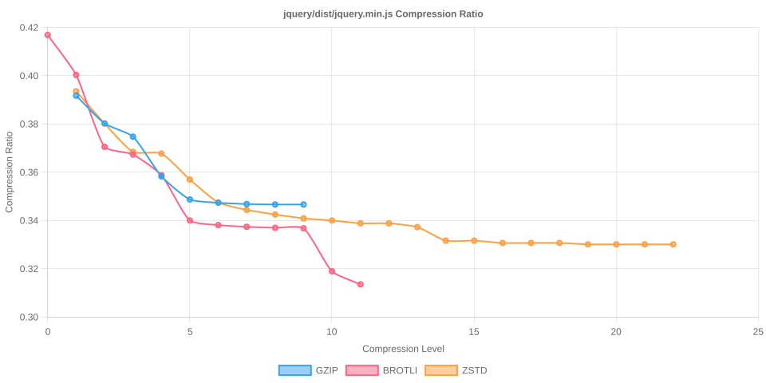

| Algorithm | Level | Time (ms) | Size (bytes) | Compression Ratio | Samples | Converged |
| --- | ---: | ---: | ---: | ---: | ---: | --- |
| gzip | 1 | 1.345 | 31,033 | 0.3941 | 5 | yes |
| gzip | 2 | 0.987 | 30,134 | 0.3827 | 11 | yes |
| gzip | 3 | 1.081 | 29,671 | 0.3768 | 5 | yes |
| gzip | 4 | 1.219 | 28,457 | 0.3614 | 5 | yes |
| gzip | 5 | 1.578 | 27,721 | 0.3520 | 5 | yes |
| gzip | 6 | 1.851 | 27,584 | 0.3503 | 5 | yes |
| gzip | 7 | 2.032 | 27,547 | 0.3498 | 5 | yes |
| gzip | 8 | 2.360 | 27,530 | 0.3496 | 5 | yes |
| gzip | 9 | 2.366 | 27,530 | 0.3496 | 5 | yes |
| brotli | 0 | 0.402 | 33,111 | 0.4205 | 5 | yes |
| brotli | 1 | 0.765 | 31,803 | 0.4039 | 5 | yes |
| brotli | 2 | 0.821 | 29,394 | 0.3733 | 5 | yes |
| brotli | 3 | 0.956 | 29,072 | 0.3692 | 5 | yes |
| brotli | 4 | 1.471 | 28,392 | 0.3605 | 5 | yes |
| brotli | 5 | 2.134 | 27,013 | 0.3430 | 5 | yes |
| brotli | 6 | 2.276 | 26,844 | 0.3409 | 5 | yes |
| brotli | 7 | 3.827 | 26,773 | 0.3400 | 5 | yes |
| brotli | 8 | 2.682 | 26,725 | 0.3394 | 5 | yes |
| brotli | 9 | 4.555 | 26,711 | 0.3392 | 5 | yes |
| brotli | 10 | 33.670 | 25,340 | 0.3218 | 5 | yes |
| brotli | 11 | 96.384 | 24,992 | 0.3174 | 5 | yes |
| zstd | 1 | 0.328 | 31,062 | 0.3944 | 7 | yes |
| zstd | 2 | 0.331 | 30,069 | 0.3818 | 8 | yes |
| zstd | 3 | 0.387 | 29,214 | 0.3710 | 5 | yes |
| zstd | 4 | 0.506 | 29,108 | 0.3696 | 5 | yes |
| zstd | 5 | 1.354 | 28,349 | 0.3600 | 5 | yes |
| zstd | 6 | 1.819 | 27,592 | 0.3504 | 5 | yes |
| zstd | 7 | 1.533 | 27,383 | 0.3477 | 5 | yes |
| zstd | 8 | 1.608 | 27,237 | 0.3459 | 5 | yes |
| zstd | 9 | 2.767 | 27,118 | 0.3444 | 5 | yes |
| zstd | 10 | 2.029 | 27,062 | 0.3437 | 13 | yes |
| zstd | 11 | 3.422 | 26,969 | 0.3425 | 5 | yes |
| zstd | 12 | 3.604 | 26,970 | 0.3425 | 5 | yes |
| zstd | 13 | 5.726 | 26,867 | 0.3412 | 5 | yes |
| zstd | 14 | 8.019 | 26,432 | 0.3357 | 5 | yes |
| zstd | 15 | 8.146 | 26,420 | 0.3355 | 5 | yes |
| zstd | 16 | 11.226 | 26,336 | 0.3344 | 5 | yes |
| zstd | 17 | 11.316 | 26,336 | 0.3344 | 13 | yes |
| zstd | 18 | 11.115 | 26,336 | 0.3344 | 5 | yes |
| zstd | 19 | 21.771 | 26,282 | 0.3337 | 5 | yes |
| zstd | 20 | 21.667 | 26,282 | 0.3337 | 5 | yes |
| zstd | 21 | 21.647 | 26,282 | 0.3337 | 5 | yes |
| zstd | 22 | 21.764 | 26,282 | 0.3337 | 5 | yes |

<h2 id="expo-google-fonts-noto-sans-jp-400regular-notosansjp-400regular-ttf">@expo-google-fonts/noto-sans-jp/400Regular/NotoSansJP_400Regular.ttf</h2>

- Original size: 5,472,784 bytes
- Chart: 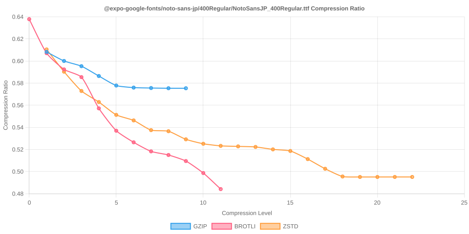

| Algorithm | Level | Time (ms) | Size (bytes) | Compression Ratio | Samples | Converged |
| --- | ---: | ---: | ---: | ---: | ---: | --- |
| gzip | 1 | 84.113 | 3,332,519 | 0.6089 | 5 | yes |
| gzip | 2 | 88.556 | 3,287,937 | 0.6008 | 5 | yes |
| gzip | 3 | 92.216 | 3,262,028 | 0.5960 | 5 | yes |
| gzip | 4 | 107.191 | 3,213,095 | 0.5871 | 5 | yes |
| gzip | 5 | 119.065 | 3,166,204 | 0.5785 | 5 | yes |
| gzip | 6 | 132.796 | 3,156,147 | 0.5767 | 5 | yes |
| gzip | 7 | 141.001 | 3,154,131 | 0.5763 | 5 | yes |
| gzip | 8 | 158.066 | 3,153,066 | 0.5761 | 5 | yes |
| gzip | 9 | 180.453 | 3,153,021 | 0.5761 | 5 | yes |
| brotli | 0 | 20.216 | 3,488,111 | 0.6374 | 5 | yes |
| brotli | 1 | 28.428 | 3,325,102 | 0.6076 | 5 | yes |
| brotli | 2 | 49.901 | 3,247,965 | 0.5935 | 5 | yes |
| brotli | 3 | 63.202 | 3,210,322 | 0.5866 | 5 | yes |
| brotli | 4 | 85.061 | 3,052,068 | 0.5577 | 5 | yes |
| brotli | 5 | 124.647 | 2,942,981 | 0.5377 | 5 | yes |
| brotli | 6 | 141.335 | 2,886,204 | 0.5274 | 5 | yes |
| brotli | 7 | 414.318 | 2,841,359 | 0.5192 | 5 | yes |
| brotli | 8 | 519.361 | 2,823,303 | 0.5159 | 5 | yes |
| brotli | 9 | 669.464 | 2,793,428 | 0.5104 | 5 | yes |
| brotli | 10 | 5869.948 | 2,728,891 | 0.4986 | 5 | yes |
| brotli | 11 | 12394.936 | 2,651,692 | 0.4845 | 5 | yes |
| zstd | 1 | 18.636 | 3,342,771 | 0.6108 | 5 | yes |
| zstd | 2 | 23.197 | 3,233,695 | 0.5909 | 5 | yes |
| zstd | 3 | 38.453 | 3,139,155 | 0.5736 | 5 | yes |
| zstd | 4 | 43.498 | 3,084,237 | 0.5636 | 5 | yes |
| zstd | 5 | 65.507 | 3,021,906 | 0.5522 | 5 | yes |
| zstd | 6 | 79.029 | 2,994,480 | 0.5472 | 5 | yes |
| zstd | 7 | 83.509 | 2,946,701 | 0.5384 | 5 | yes |
| zstd | 8 | 98.035 | 2,941,269 | 0.5374 | 5 | yes |
| zstd | 9 | 97.782 | 2,901,056 | 0.5301 | 5 | yes |
| zstd | 10 | 121.862 | 2,879,072 | 0.5261 | 5 | yes |
| zstd | 11 | 150.935 | 2,868,731 | 0.5242 | 5 | yes |
| zstd | 12 | 176.755 | 2,866,083 | 0.5237 | 5 | yes |
| zstd | 13 | 339.260 | 2,864,062 | 0.5233 | 5 | yes |
| zstd | 14 | 418.428 | 2,852,038 | 0.5211 | 5 | yes |
| zstd | 15 | 488.016 | 2,844,247 | 0.5197 | 5 | yes |
| zstd | 16 | 649.628 | 2,803,911 | 0.5123 | 5 | yes |
| zstd | 17 | 780.136 | 2,756,112 | 0.5036 | 5 | yes |
| zstd | 18 | 1110.512 | 2,713,297 | 0.4958 | 5 | yes |
| zstd | 19 | 1231.314 | 2,710,797 | 0.4953 | 5 | yes |
| zstd | 20 | 1240.440 | 2,710,797 | 0.4953 | 5 | yes |
| zstd | 21 | 1258.636 | 2,710,761 | 0.4953 | 5 | yes |
| zstd | 22 | 1247.294 | 2,710,761 | 0.4953 | 5 | yes |

<h2 id="openfonts-m-plus-1p-japanese-m-plus-1p-japanese-400-woff2">@openfonts/m-plus-1p_japanese/m-plus-1p-japanese-400.woff2</h2>

- Original size: 598,576 bytes
- Chart: 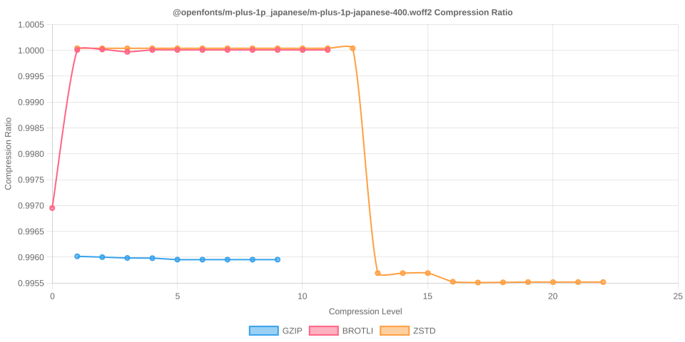

| Algorithm | Level | Time (ms) | Size (bytes) | Compression Ratio | Samples | Converged |
| --- | ---: | ---: | ---: | ---: | ---: | --- |
| gzip | 1 | 11.895 | 596,192 | 0.9960 | 5 | yes |
| gzip | 2 | 11.970 | 596,183 | 0.9960 | 5 | yes |
| gzip | 3 | 11.797 | 596,173 | 0.9960 | 5 | yes |
| gzip | 4 | 12.408 | 596,171 | 0.9960 | 5 | yes |
| gzip | 5 | 12.371 | 596,154 | 0.9960 | 5 | yes |
| gzip | 6 | 12.340 | 596,154 | 0.9960 | 5 | yes |
| gzip | 7 | 12.311 | 596,154 | 0.9960 | 5 | yes |
| gzip | 8 | 12.292 | 596,154 | 0.9960 | 5 | yes |
| gzip | 9 | 12.370 | 596,154 | 0.9960 | 5 | yes |
| brotli | 0 | 0.238 | 596,751 | 0.9970 | 7 | yes |
| brotli | 1 | 0.223 | 598,581 | 1.0000 | 10 | yes |
| brotli | 2 | 0.595 | 598,587 | 1.0000 | 5 | yes |
| brotli | 3 | 0.765 | 598,559 | 1.0000 | 6 | yes |
| brotli | 4 | 1.017 | 598,581 | 1.0000 | 5 | yes |
| brotli | 5 | 1.470 | 598,581 | 1.0000 | 6 | yes |
| brotli | 6 | 1.404 | 598,581 | 1.0000 | 9 | yes |
| brotli | 7 | 1.854 | 598,581 | 1.0000 | 5 | yes |
| brotli | 8 | 2.103 | 598,581 | 1.0000 | 5 | yes |
| brotli | 9 | 4.258 | 598,581 | 1.0000 | 6 | yes |
| brotli | 10 | 105.033 | 598,581 | 1.0000 | 5 | yes |
| brotli | 11 | 260.269 | 598,581 | 1.0000 | 5 | yes |
| zstd | 1 | 0.288 | 598,601 | 1.0000 | 25 | no |
| zstd | 2 | 0.288 | 598,600 | 1.0000 | 5 | yes |
| zstd | 3 | 0.307 | 598,600 | 1.0000 | 25 | no |
| zstd | 4 | 0.328 | 598,600 | 1.0000 | 10 | yes |
| zstd | 5 | 0.477 | 598,600 | 1.0000 | 5 | yes |
| zstd | 6 | 0.477 | 598,600 | 1.0000 | 5 | yes |
| zstd | 7 | 0.556 | 598,600 | 1.0000 | 5 | yes |
| zstd | 8 | 0.570 | 598,600 | 1.0000 | 5 | yes |
| zstd | 9 | 0.658 | 598,600 | 1.0000 | 5 | yes |
| zstd | 10 | 0.652 | 598,600 | 1.0000 | 20 | yes |
| zstd | 11 | 0.663 | 598,600 | 1.0000 | 7 | yes |
| zstd | 12 | 0.684 | 598,600 | 1.0000 | 5 | yes |
| zstd | 13 | 2.122 | 595,998 | 0.9957 | 5 | yes |
| zstd | 14 | 2.111 | 595,998 | 0.9957 | 5 | yes |
| zstd | 15 | 2.102 | 595,998 | 0.9957 | 5 | yes |
| zstd | 16 | 13.798 | 595,898 | 0.9955 | 5 | yes |
| zstd | 17 | 13.906 | 595,889 | 0.9955 | 5 | yes |
| zstd | 18 | 20.470 | 595,891 | 0.9955 | 5 | yes |
| zstd | 19 | 24.665 | 595,894 | 0.9955 | 5 | yes |
| zstd | 20 | 24.665 | 595,894 | 0.9955 | 5 | yes |
| zstd | 21 | 25.328 | 595,894 | 0.9955 | 5 | yes |
| zstd | 22 | 24.584 | 595,894 | 0.9955 | 5 | yes |

<h2 id="codemirror-view-dist-index-js">@codemirror/view/dist/index.js</h2>

- Original size: 490,802 bytes
- Chart: 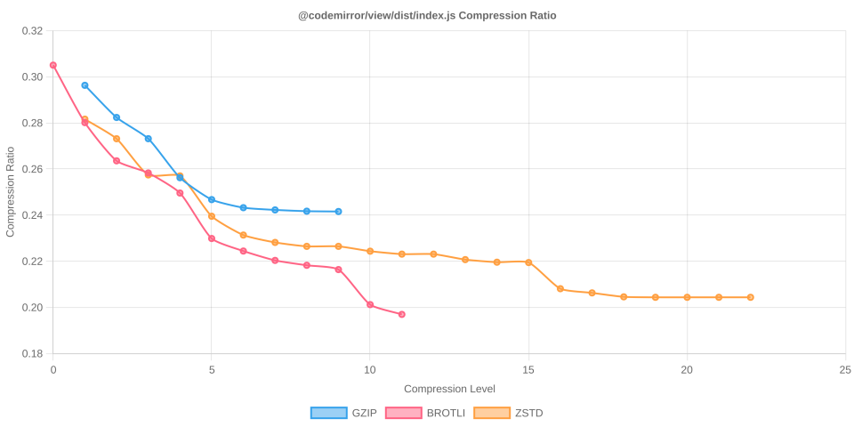

| Algorithm | Level | Time (ms) | Size (bytes) | Compression Ratio | Samples | Converged |
| --- | ---: | ---: | ---: | ---: | ---: | --- |
| gzip | 1 | 3.834 | 145,459 | 0.2964 | 5 | yes |
| gzip | 2 | 4.190 | 138,655 | 0.2825 | 5 | yes |
| gzip | 3 | 5.438 | 134,120 | 0.2733 | 5 | yes |
| gzip | 4 | 5.737 | 125,846 | 0.2564 | 5 | yes |
| gzip | 5 | 8.024 | 121,168 | 0.2469 | 5 | yes |
| gzip | 6 | 11.642 | 119,464 | 0.2434 | 5 | yes |
| gzip | 7 | 14.678 | 118,991 | 0.2424 | 5 | yes |
| gzip | 8 | 27.623 | 118,721 | 0.2419 | 5 | yes |
| gzip | 9 | 42.865 | 118,656 | 0.2418 | 5 | yes |
| brotli | 0 | 1.531 | 149,780 | 0.3052 | 5 | yes |
| brotli | 1 | 2.103 | 137,594 | 0.2803 | 5 | yes |
| brotli | 2 | 3.910 | 129,396 | 0.2636 | 5 | yes |
| brotli | 3 | 4.426 | 126,773 | 0.2583 | 5 | yes |
| brotli | 4 | 6.346 | 122,637 | 0.2499 | 5 | yes |
| brotli | 5 | 9.926 | 112,852 | 0.2299 | 5 | yes |
| brotli | 6 | 11.506 | 110,205 | 0.2245 | 5 | yes |
| brotli | 7 | 13.684 | 108,216 | 0.2205 | 5 | yes |
| brotli | 8 | 16.219 | 107,187 | 0.2184 | 5 | yes |
| brotli | 9 | 22.315 | 106,299 | 0.2166 | 5 | yes |
| brotli | 10 | 268.463 | 98,781 | 0.2013 | 5 | yes |
| brotli | 11 | 708.986 | 96,661 | 0.1969 | 5 | yes |
| zstd | 1 | 1.649 | 138,381 | 0.2819 | 5 | yes |
| zstd | 2 | 1.783 | 134,062 | 0.2731 | 5 | yes |
| zstd | 3 | 2.177 | 126,400 | 0.2575 | 8 | yes |
| zstd | 4 | 2.286 | 126,225 | 0.2572 | 5 | yes |
| zstd | 5 | 4.371 | 117,610 | 0.2396 | 5 | yes |
| zstd | 6 | 6.048 | 113,616 | 0.2315 | 5 | yes |
| zstd | 7 | 6.759 | 112,064 | 0.2283 | 5 | yes |
| zstd | 8 | 8.533 | 111,256 | 0.2267 | 5 | yes |
| zstd | 9 | 8.504 | 111,256 | 0.2267 | 5 | yes |
| zstd | 10 | 10.427 | 110,241 | 0.2246 | 5 | yes |
| zstd | 11 | 13.052 | 109,605 | 0.2233 | 5 | yes |
| zstd | 12 | 13.035 | 109,605 | 0.2233 | 5 | yes |
| zstd | 13 | 26.160 | 108,404 | 0.2209 | 5 | yes |
| zstd | 14 | 31.528 | 107,840 | 0.2197 | 5 | yes |
| zstd | 15 | 35.126 | 107,780 | 0.2196 | 5 | yes |
| zstd | 16 | 63.046 | 102,193 | 0.2082 | 5 | yes |
| zstd | 17 | 69.576 | 101,271 | 0.2063 | 5 | yes |
| zstd | 18 | 110.080 | 100,490 | 0.2047 | 5 | yes |
| zstd | 19 | 143.227 | 100,397 | 0.2046 | 5 | yes |
| zstd | 20 | 142.948 | 100,397 | 0.2046 | 5 | yes |
| zstd | 21 | 143.334 | 100,396 | 0.2046 | 5 | yes |
| zstd | 22 | 144.232 | 100,396 | 0.2046 | 5 | yes |

<h2 id="react-cjs-react-production-js">react/cjs/react.production.js</h2>

- Original size: 17,217 bytes
- Chart: 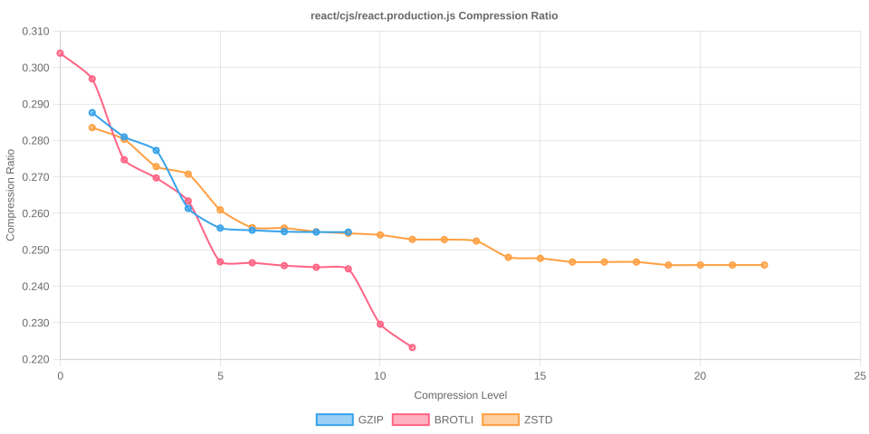

| Algorithm | Level | Time (ms) | Size (bytes) | Compression Ratio | Samples | Converged |
| --- | ---: | ---: | ---: | ---: | ---: | --- |
| gzip | 1 | 0.108 | 4,987 | 0.2897 | 25 | no |
| gzip | 2 | 0.113 | 4,874 | 0.2831 | 25 | no |
| gzip | 3 | 0.149 | 4,806 | 0.2791 | 8 | yes |
| gzip | 4 | 0.186 | 4,530 | 0.2631 | 5 | yes |
| gzip | 5 | 0.231 | 4,441 | 0.2579 | 6 | yes |
| gzip | 6 | 0.290 | 4,425 | 0.2570 | 5 | yes |
| gzip | 7 | 0.327 | 4,418 | 0.2566 | 5 | yes |
| gzip | 8 | 0.454 | 4,419 | 0.2567 | 5 | yes |
| gzip | 9 | 0.466 | 4,419 | 0.2567 | 5 | yes |
| brotli | 0 | 0.055 | 5,235 | 0.3041 | 22 | yes |
| brotli | 1 | 0.066 | 5,134 | 0.2982 | 25 | no |
| brotli | 2 | 0.122 | 4,741 | 0.2754 | 21 | yes |
| brotli | 3 | 0.159 | 4,650 | 0.2701 | 7 | yes |
| brotli | 4 | 0.270 | 4,555 | 0.2646 | 8 | yes |
| brotli | 5 | 0.383 | 4,276 | 0.2484 | 5 | yes |
| brotli | 6 | 0.397 | 4,275 | 0.2483 | 5 | yes |
| brotli | 7 | 0.440 | 4,264 | 0.2477 | 5 | yes |
| brotli | 8 | 0.452 | 4,257 | 0.2473 | 5 | yes |
| brotli | 9 | 2.207 | 4,244 | 0.2465 | 5 | yes |
| brotli | 10 | 6.832 | 3,968 | 0.2305 | 5 | yes |
| brotli | 11 | 18.571 | 3,873 | 0.2250 | 5 | yes |
| zstd | 1 | 0.052 | 4,923 | 0.2859 | 14 | yes |
| zstd | 2 | 0.057 | 4,868 | 0.2827 | 20 | yes |
| zstd | 3 | 0.073 | 4,717 | 0.2740 | 25 | no |
| zstd | 4 | 0.074 | 4,679 | 0.2718 | 16 | yes |
| zstd | 5 | 0.161 | 4,519 | 0.2625 | 5 | yes |
| zstd | 6 | 0.211 | 4,437 | 0.2577 | 8 | yes |
| zstd | 7 | 0.260 | 4,437 | 0.2577 | 5 | yes |
| zstd | 8 | 0.284 | 4,426 | 0.2571 | 5 | yes |
| zstd | 9 | 0.319 | 4,420 | 0.2567 | 5 | yes |
| zstd | 10 | 0.356 | 4,410 | 0.2561 | 5 | yes |
| zstd | 11 | 0.601 | 4,393 | 0.2552 | 5 | yes |
| zstd | 12 | 0.628 | 4,391 | 0.2550 | 5 | yes |
| zstd | 13 | 0.922 | 4,382 | 0.2545 | 5 | yes |
| zstd | 14 | 1.435 | 4,307 | 0.2502 | 5 | yes |
| zstd | 15 | 1.537 | 4,303 | 0.2499 | 5 | yes |
| zstd | 16 | 2.489 | 4,282 | 0.2487 | 5 | yes |
| zstd | 17 | 2.670 | 4,281 | 0.2486 | 5 | yes |
| zstd | 18 | 2.657 | 4,281 | 0.2486 | 5 | yes |
| zstd | 19 | 5.235 | 4,264 | 0.2477 | 5 | yes |
| zstd | 20 | 5.273 | 4,264 | 0.2477 | 5 | yes |
| zstd | 21 | 5.239 | 4,264 | 0.2477 | 5 | yes |
| zstd | 22 | 5.264 | 4,264 | 0.2477 | 5 | yes |

<h2 id="dayjs-dayjs-min-js">dayjs/dayjs.min.js</h2>

- Original size: 7,161 bytes
- Chart: 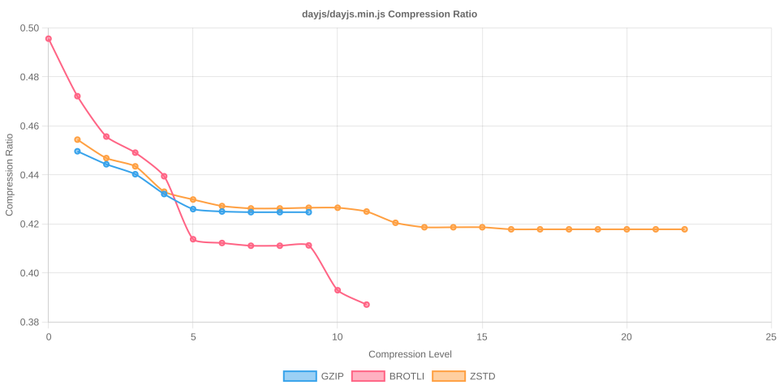

| Algorithm | Level | Time (ms) | Size (bytes) | Compression Ratio | Samples | Converged |
| --- | ---: | ---: | ---: | ---: | ---: | --- |
| gzip | 1 | 0.063 | 3,220 | 0.4497 | 25 | no |
| gzip | 2 | 0.058 | 3,182 | 0.4444 | 25 | no |
| gzip | 3 | 0.130 | 3,153 | 0.4403 | 5 | yes |
| gzip | 4 | 0.083 | 3,095 | 0.4322 | 25 | no |
| gzip | 5 | 0.078 | 3,051 | 0.4261 | 25 | no |
| gzip | 6 | 0.080 | 3,044 | 0.4251 | 22 | yes |
| gzip | 7 | 0.104 | 3,042 | 0.4248 | 25 | no |
| gzip | 8 | 0.102 | 3,042 | 0.4248 | 17 | yes |
| gzip | 9 | 0.089 | 3,042 | 0.4248 | 5 | yes |
| brotli | 0 | 0.031 | 3,549 | 0.4956 | 10 | yes |
| brotli | 1 | 0.039 | 3,381 | 0.4721 | 10 | yes |
| brotli | 2 | 0.061 | 3,263 | 0.4557 | 18 | yes |
| brotli | 3 | 0.078 | 3,216 | 0.4491 | 25 | no |
| brotli | 4 | 0.209 | 3,147 | 0.4395 | 5 | yes |
| brotli | 5 | 0.233 | 2,963 | 0.4138 | 21 | yes |
| brotli | 6 | 0.239 | 2,952 | 0.4122 | 8 | yes |
| brotli | 7 | 0.277 | 2,944 | 0.4111 | 5 | yes |
| brotli | 8 | 0.271 | 2,944 | 0.4111 | 5 | yes |
| brotli | 9 | 1.818 | 2,945 | 0.4113 | 7 | yes |
| brotli | 10 | 3.111 | 2,814 | 0.3930 | 5 | yes |
| brotli | 11 | 7.748 | 2,772 | 0.3871 | 5 | yes |
| zstd | 1 | 0.032 | 3,254 | 0.4544 | 25 | yes |
| zstd | 2 | 0.035 | 3,200 | 0.4469 | 21 | yes |
| zstd | 3 | 0.042 | 3,176 | 0.4435 | 11 | yes |
| zstd | 4 | 0.061 | 3,102 | 0.4332 | 12 | yes |
| zstd | 5 | 0.071 | 3,079 | 0.4300 | 25 | no |
| zstd | 6 | 0.089 | 3,060 | 0.4273 | 25 | no |
| zstd | 7 | 0.117 | 3,053 | 0.4263 | 5 | yes |
| zstd | 8 | 0.114 | 3,053 | 0.4263 | 25 | no |
| zstd | 9 | 0.155 | 3,055 | 0.4266 | 25 | no |
| zstd | 10 | 0.148 | 3,055 | 0.4266 | 9 | yes |
| zstd | 11 | 0.355 | 3,044 | 0.4251 | 5 | yes |
| zstd | 12 | 0.481 | 3,011 | 0.4205 | 5 | yes |
| zstd | 13 | 0.658 | 2,998 | 0.4187 | 5 | yes |
| zstd | 14 | 0.663 | 2,998 | 0.4187 | 5 | yes |
| zstd | 15 | 0.690 | 2,998 | 0.4187 | 5 | yes |
| zstd | 16 | 1.272 | 2,992 | 0.4178 | 5 | yes |
| zstd | 17 | 1.286 | 2,992 | 0.4178 | 5 | yes |
| zstd | 18 | 1.273 | 2,992 | 0.4178 | 5 | yes |
| zstd | 19 | 1.292 | 2,992 | 0.4178 | 5 | yes |
| zstd | 20 | 1.283 | 2,992 | 0.4178 | 5 | yes |
| zstd | 21 | 1.289 | 2,992 | 0.4178 | 5 | yes |
| zstd | 22 | 1.271 | 2,992 | 0.4178 | 5 | yes |

<h2 id="vue-dist-vue-global-prod-js">vue/dist/vue.global.prod.js</h2>

- Original size: 165,599 bytes
- Chart: 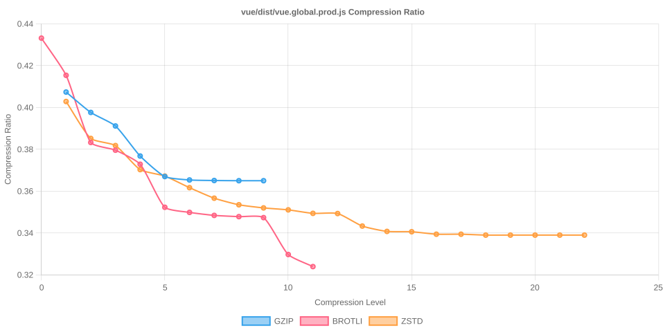

| Algorithm | Level | Time (ms) | Size (bytes) | Compression Ratio | Samples | Converged |
| --- | ---: | ---: | ---: | ---: | ---: | --- |
| gzip | 1 | 1.889 | 67,507 | 0.4077 | 5 | yes |
| gzip | 2 | 2.033 | 65,886 | 0.3979 | 5 | yes |
| gzip | 3 | 2.285 | 64,874 | 0.3918 | 5 | yes |
| gzip | 4 | 2.580 | 62,487 | 0.3773 | 5 | yes |
| gzip | 5 | 3.439 | 60,848 | 0.3674 | 5 | yes |
| gzip | 6 | 4.251 | 60,570 | 0.3658 | 5 | yes |
| gzip | 7 | 4.633 | 60,527 | 0.3655 | 5 | yes |
| gzip | 8 | 5.005 | 60,509 | 0.3654 | 5 | yes |
| gzip | 9 | 5.060 | 60,509 | 0.3654 | 5 | yes |
| brotli | 0 | 0.691 | 71,790 | 0.4335 | 5 | yes |
| brotli | 1 | 0.893 | 68,843 | 0.4157 | 5 | yes |
| brotli | 2 | 1.646 | 63,505 | 0.3835 | 5 | yes |
| brotli | 3 | 1.910 | 62,945 | 0.3801 | 5 | yes |
| brotli | 4 | 2.926 | 61,772 | 0.3730 | 5 | yes |
| brotli | 5 | 4.531 | 58,412 | 0.3527 | 5 | yes |
| brotli | 6 | 4.892 | 58,008 | 0.3503 | 5 | yes |
| brotli | 7 | 5.792 | 57,755 | 0.3488 | 5 | yes |
| brotli | 8 | 6.337 | 57,667 | 0.3482 | 5 | yes |
| brotli | 9 | 8.736 | 57,589 | 0.3478 | 5 | yes |
| brotli | 10 | 95.134 | 54,874 | 0.3314 | 5 | yes |
| brotli | 11 | 242.001 | 53,818 | 0.3250 | 5 | yes |
| zstd | 1 | 0.608 | 66,843 | 0.4036 | 5 | yes |
| zstd | 2 | 0.792 | 63,844 | 0.3855 | 5 | yes |
| zstd | 3 | 0.973 | 63,294 | 0.3822 | 5 | yes |
| zstd | 4 | 1.756 | 61,396 | 0.3708 | 5 | yes |
| zstd | 5 | 2.276 | 60,869 | 0.3676 | 5 | yes |
| zstd | 6 | 2.443 | 59,979 | 0.3622 | 9 | yes |
| zstd | 7 | 2.881 | 59,158 | 0.3572 | 5 | yes |
| zstd | 8 | 3.566 | 58,671 | 0.3543 | 5 | yes |
| zstd | 9 | 4.135 | 58,430 | 0.3528 | 5 | yes |
| zstd | 10 | 4.910 | 58,290 | 0.3520 | 5 | yes |
| zstd | 11 | 8.267 | 57,983 | 0.3501 | 5 | yes |
| zstd | 12 | 8.410 | 57,969 | 0.3501 | 5 | yes |
| zstd | 13 | 14.753 | 56,943 | 0.3439 | 5 | yes |
| zstd | 14 | 17.989 | 56,556 | 0.3415 | 5 | yes |
| zstd | 15 | 18.319 | 56,517 | 0.3413 | 5 | yes |
| zstd | 16 | 24.500 | 56,330 | 0.3402 | 5 | yes |
| zstd | 17 | 24.488 | 56,330 | 0.3402 | 5 | yes |
| zstd | 18 | 42.314 | 56,259 | 0.3397 | 5 | yes |
| zstd | 19 | 42.418 | 56,259 | 0.3397 | 5 | yes |
| zstd | 20 | 42.398 | 56,259 | 0.3397 | 5 | yes |
| zstd | 21 | 42.471 | 56,259 | 0.3397 | 5 | yes |
| zstd | 22 | 42.463 | 56,259 | 0.3397 | 5 | yes |

<h2 id="lodash-lodash-min-js">lodash/lodash.min.js</h2>

- Original size: 73,234 bytes
- Chart: 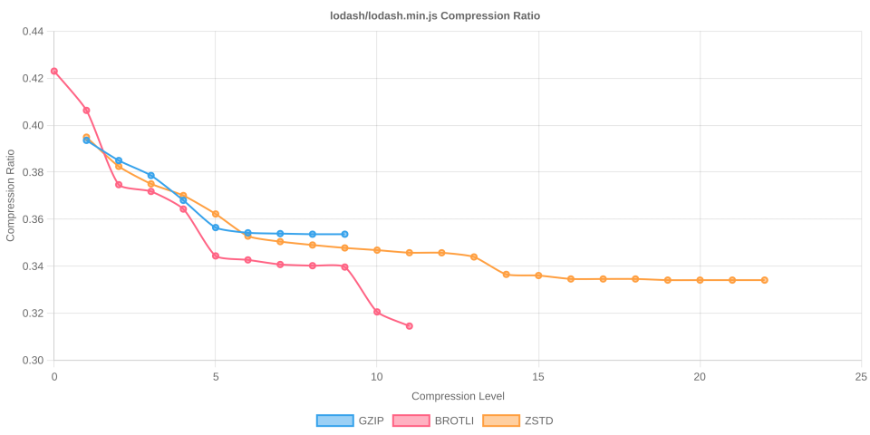

| Algorithm | Level | Time (ms) | Size (bytes) | Compression Ratio | Samples | Converged |
| --- | ---: | ---: | ---: | ---: | ---: | --- |
| gzip | 1 | 0.778 | 28,819 | 0.3935 | 5 | yes |
| gzip | 2 | 0.833 | 28,191 | 0.3849 | 5 | yes |
| gzip | 3 | 0.969 | 27,724 | 0.3786 | 5 | yes |
| gzip | 4 | 1.073 | 26,950 | 0.3680 | 5 | yes |
| gzip | 5 | 1.385 | 26,101 | 0.3564 | 5 | yes |
| gzip | 6 | 1.774 | 25,938 | 0.3542 | 5 | yes |
| gzip | 7 | 2.109 | 25,913 | 0.3538 | 5 | yes |
| gzip | 8 | 2.846 | 25,894 | 0.3536 | 5 | yes |
| gzip | 9 | 2.874 | 25,894 | 0.3536 | 5 | yes |
| brotli | 0 | 0.268 | 30,978 | 0.4230 | 9 | yes |
| brotli | 1 | 0.379 | 29,754 | 0.4063 | 5 | yes |
| brotli | 2 | 0.684 | 27,438 | 0.3747 | 5 | yes |
| brotli | 3 | 0.793 | 27,227 | 0.3718 | 5 | yes |
| brotli | 4 | 1.318 | 26,678 | 0.3643 | 5 | yes |
| brotli | 5 | 1.906 | 25,217 | 0.3443 | 5 | yes |
| brotli | 6 | 2.167 | 25,093 | 0.3426 | 5 | yes |
| brotli | 7 | 2.503 | 24,950 | 0.3407 | 5 | yes |
| brotli | 8 | 2.615 | 24,912 | 0.3402 | 5 | yes |
| brotli | 9 | 4.683 | 24,870 | 0.3396 | 5 | yes |
| brotli | 10 | 38.856 | 23,472 | 0.3205 | 5 | yes |
| brotli | 11 | 95.563 | 23,030 | 0.3145 | 5 | yes |
| zstd | 1 | 0.258 | 28,919 | 0.3949 | 5 | yes |
| zstd | 2 | 0.275 | 28,008 | 0.3824 | 10 | yes |
| zstd | 3 | 0.336 | 27,463 | 0.3750 | 9 | yes |
| zstd | 4 | 0.435 | 27,100 | 0.3700 | 5 | yes |
| zstd | 5 | 0.784 | 26,525 | 0.3622 | 5 | yes |
| zstd | 6 | 1.083 | 25,834 | 0.3528 | 5 | yes |
| zstd | 7 | 1.293 | 25,663 | 0.3504 | 5 | yes |
| zstd | 8 | 1.411 | 25,557 | 0.3490 | 5 | yes |
| zstd | 9 | 1.610 | 25,466 | 0.3477 | 5 | yes |
| zstd | 10 | 1.920 | 25,397 | 0.3468 | 5 | yes |
| zstd | 11 | 3.138 | 25,317 | 0.3457 | 5 | yes |
| zstd | 12 | 3.291 | 25,315 | 0.3457 | 5 | yes |
| zstd | 13 | 5.438 | 25,185 | 0.3439 | 5 | yes |
| zstd | 14 | 7.532 | 24,642 | 0.3365 | 5 | yes |
| zstd | 15 | 7.650 | 24,606 | 0.3360 | 5 | yes |
| zstd | 16 | 10.686 | 24,499 | 0.3345 | 5 | yes |
| zstd | 17 | 10.713 | 24,499 | 0.3345 | 5 | yes |
| zstd | 18 | 10.707 | 24,499 | 0.3345 | 5 | yes |
| zstd | 19 | 20.419 | 24,463 | 0.3340 | 5 | yes |
| zstd | 20 | 20.366 | 24,463 | 0.3340 | 5 | yes |
| zstd | 21 | 20.436 | 24,463 | 0.3340 | 5 | yes |
| zstd | 22 | 20.435 | 24,463 | 0.3340 | 5 | yes |

<h2 id="fortawesome-fontawesome-free-css-all-min-css">@fortawesome/fontawesome-free/css/all.min.css</h2>

- Original size: 90,336 bytes
- Chart: 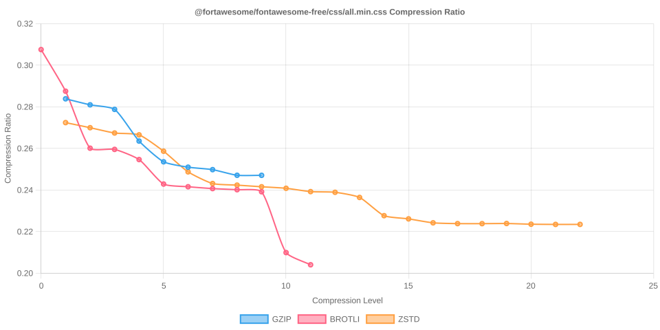

| Algorithm | Level | Time (ms) | Size (bytes) | Compression Ratio | Samples | Converged |
| --- | ---: | ---: | ---: | ---: | ---: | --- |
| gzip | 1 | 0.634 | 25,642 | 0.2839 | 5 | yes |
| gzip | 2 | 0.738 | 25,381 | 0.2810 | 5 | yes |
| gzip | 3 | 0.857 | 25,183 | 0.2788 | 5 | yes |
| gzip | 4 | 1.004 | 23,806 | 0.2635 | 5 | yes |
| gzip | 5 | 1.367 | 22,906 | 0.2536 | 5 | yes |
| gzip | 6 | 2.055 | 22,672 | 0.2510 | 5 | yes |
| gzip | 7 | 2.715 | 22,565 | 0.2498 | 5 | yes |
| gzip | 8 | 7.914 | 22,320 | 0.2471 | 5 | yes |
| gzip | 9 | 8.099 | 22,318 | 0.2471 | 5 | yes |
| brotli | 0 | 0.293 | 27,781 | 0.3075 | 6 | yes |
| brotli | 1 | 0.419 | 25,973 | 0.2875 | 5 | yes |
| brotli | 2 | 0.702 | 23,497 | 0.2601 | 5 | yes |
| brotli | 3 | 0.826 | 23,445 | 0.2595 | 5 | yes |
| brotli | 4 | 1.254 | 23,003 | 0.2546 | 5 | yes |
| brotli | 5 | 1.907 | 21,939 | 0.2429 | 5 | yes |
| brotli | 6 | 2.078 | 21,822 | 0.2416 | 5 | yes |
| brotli | 7 | 2.446 | 21,742 | 0.2407 | 5 | yes |
| brotli | 8 | 2.792 | 21,693 | 0.2401 | 5 | yes |
| brotli | 9 | 5.109 | 21,604 | 0.2392 | 5 | yes |
| brotli | 10 | 34.213 | 18,961 | 0.2099 | 5 | yes |
| brotli | 11 | 103.432 | 18,432 | 0.2040 | 5 | yes |
| zstd | 1 | 0.286 | 24,608 | 0.2724 | 6 | yes |
| zstd | 2 | 0.301 | 24,387 | 0.2700 | 5 | yes |
| zstd | 3 | 0.351 | 24,157 | 0.2674 | 5 | yes |
| zstd | 4 | 0.408 | 24,076 | 0.2665 | 5 | yes |
| zstd | 5 | 0.786 | 23,365 | 0.2586 | 5 | yes |
| zstd | 6 | 1.109 | 22,468 | 0.2487 | 5 | yes |
| zstd | 7 | 1.364 | 21,961 | 0.2431 | 5 | yes |
| zstd | 8 | 1.567 | 21,892 | 0.2423 | 5 | yes |
| zstd | 9 | 1.924 | 21,821 | 0.2416 | 5 | yes |
| zstd | 10 | 2.578 | 21,755 | 0.2408 | 5 | yes |
| zstd | 11 | 3.644 | 21,610 | 0.2392 | 5 | yes |
| zstd | 12 | 4.818 | 21,581 | 0.2389 | 5 | yes |
| zstd | 13 | 6.059 | 21,357 | 0.2364 | 5 | yes |
| zstd | 14 | 8.400 | 20,565 | 0.2277 | 5 | yes |
| zstd | 15 | 10.051 | 20,426 | 0.2261 | 5 | yes |
| zstd | 16 | 14.978 | 20,254 | 0.2242 | 5 | yes |
| zstd | 17 | 19.841 | 20,220 | 0.2238 | 5 | yes |
| zstd | 18 | 27.809 | 20,218 | 0.2238 | 5 | yes |
| zstd | 19 | 31.994 | 20,225 | 0.2239 | 5 | yes |
| zstd | 20 | 37.207 | 20,194 | 0.2235 | 5 | yes |
| zstd | 21 | 48.686 | 20,185 | 0.2234 | 5 | yes |
| zstd | 22 | 55.318 | 20,186 | 0.2235 | 5 | yes |

<h2 id="bootstrap-dist-css-bootstrap-min-css">bootstrap/dist/css/bootstrap.min.css</h2>

- Original size: 232,111 bytes
- Chart: 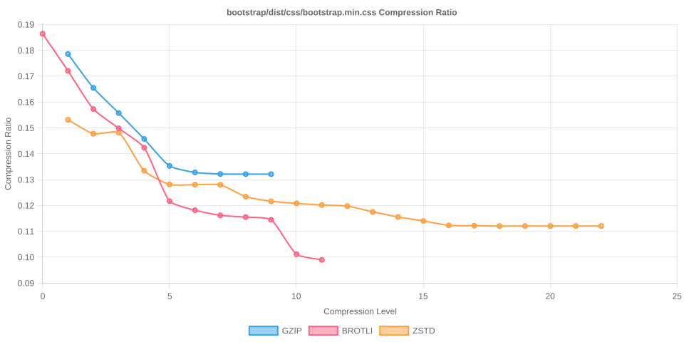

| Algorithm | Level | Time (ms) | Size (bytes) | Compression Ratio | Samples | Converged |
| --- | ---: | ---: | ---: | ---: | ---: | --- |
| gzip | 1 | 1.068 | 41,452 | 0.1786 | 5 | yes |
| gzip | 2 | 1.128 | 38,418 | 0.1655 | 5 | yes |
| gzip | 3 | 1.323 | 36,152 | 0.1558 | 5 | yes |
| gzip | 4 | 1.724 | 33,830 | 0.1457 | 5 | yes |
| gzip | 5 | 2.143 | 31,408 | 0.1353 | 5 | yes |
| gzip | 6 | 2.903 | 30,823 | 0.1328 | 5 | yes |
| gzip | 7 | 3.552 | 30,680 | 0.1322 | 5 | yes |
| gzip | 8 | 4.731 | 30,670 | 0.1321 | 5 | yes |
| gzip | 9 | 4.821 | 30,669 | 0.1321 | 5 | yes |
| brotli | 0 | 0.453 | 43,268 | 0.1864 | 5 | yes |
| brotli | 1 | 0.648 | 39,941 | 0.1721 | 5 | yes |
| brotli | 2 | 1.202 | 36,514 | 0.1573 | 5 | yes |
| brotli | 3 | 1.397 | 34,781 | 0.1498 | 5 | yes |
| brotli | 4 | 2.040 | 33,048 | 0.1424 | 5 | yes |
| brotli | 5 | 2.957 | 28,253 | 0.1217 | 5 | yes |
| brotli | 6 | 3.288 | 27,431 | 0.1182 | 5 | yes |
| brotli | 7 | 3.625 | 26,971 | 0.1162 | 5 | yes |
| brotli | 8 | 4.063 | 26,813 | 0.1155 | 5 | yes |
| brotli | 9 | 6.413 | 26,569 | 0.1145 | 5 | yes |
| brotli | 10 | 95.796 | 23,482 | 0.1012 | 5 | yes |
| brotli | 11 | 297.734 | 22,970 | 0.0990 | 5 | yes |
| zstd | 1 | 0.494 | 35,549 | 0.1532 | 5 | yes |
| zstd | 2 | 0.530 | 34,301 | 0.1478 | 5 | yes |
| zstd | 3 | 0.577 | 34,393 | 0.1482 | 5 | yes |
| zstd | 4 | 1.417 | 30,973 | 0.1334 | 5 | yes |
| zstd | 5 | 1.615 | 29,744 | 0.1281 | 24 | yes |
| zstd | 6 | 1.890 | 29,727 | 0.1281 | 5 | yes |
| zstd | 7 | 2.185 | 29,710 | 0.1280 | 5 | yes |
| zstd | 8 | 2.663 | 28,645 | 0.1234 | 5 | yes |
| zstd | 9 | 3.184 | 28,235 | 0.1216 | 5 | yes |
| zstd | 10 | 4.293 | 28,044 | 0.1208 | 5 | yes |
| zstd | 11 | 7.978 | 27,895 | 0.1202 | 5 | yes |
| zstd | 12 | 9.824 | 27,805 | 0.1198 | 5 | yes |
| zstd | 13 | 17.921 | 27,283 | 0.1175 | 5 | yes |
| zstd | 14 | 21.534 | 26,828 | 0.1156 | 5 | yes |
| zstd | 15 | 27.988 | 26,465 | 0.1140 | 5 | yes |
| zstd | 16 | 55.924 | 26,071 | 0.1123 | 5 | yes |
| zstd | 17 | 62.968 | 26,041 | 0.1122 | 5 | yes |
| zstd | 18 | 84.009 | 26,008 | 0.1120 | 5 | yes |
| zstd | 19 | 95.843 | 26,015 | 0.1121 | 5 | yes |
| zstd | 20 | 100.316 | 26,014 | 0.1121 | 5 | yes |
| zstd | 21 | 100.331 | 26,014 | 0.1121 | 5 | yes |
| zstd | 22 | 100.124 | 26,014 | 0.1121 | 5 | yes |

<h2 id="cities-json-cities-json">cities.json/cities.json</h2>

- Original size: 17,088,846 bytes
- Chart: 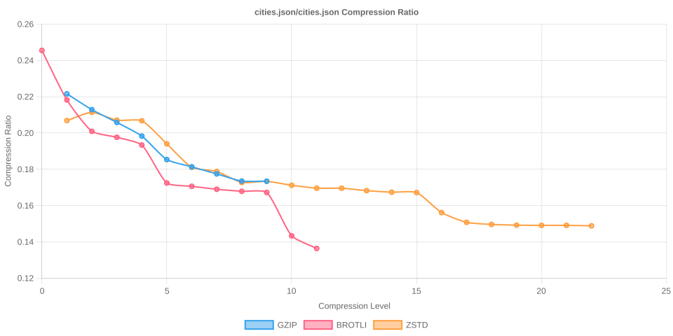

| Algorithm | Level | Time (ms) | Size (bytes) | Compression Ratio | Samples | Converged |
| --- | ---: | ---: | ---: | ---: | ---: | --- |
| gzip | 1 | 93.675 | 3,786,228 | 0.2216 | 5 | yes |
| gzip | 2 | 101.705 | 3,637,199 | 0.2128 | 5 | yes |
| gzip | 3 | 125.121 | 3,517,128 | 0.2058 | 5 | yes |
| gzip | 4 | 149.386 | 3,388,581 | 0.1983 | 5 | yes |
| gzip | 5 | 190.166 | 3,167,259 | 0.1853 | 5 | yes |
| gzip | 6 | 282.170 | 3,098,703 | 0.1813 | 5 | yes |
| gzip | 7 | 383.963 | 3,032,397 | 0.1774 | 5 | yes |
| gzip | 8 | 1075.760 | 2,964,487 | 0.1735 | 5 | yes |
| gzip | 9 | 1133.144 | 2,963,688 | 0.1734 | 5 | yes |
| brotli | 0 | 45.618 | 4,195,167 | 0.2455 | 5 | yes |
| brotli | 1 | 62.126 | 3,728,851 | 0.2182 | 5 | yes |
| brotli | 2 | 112.003 | 3,433,235 | 0.2009 | 5 | yes |
| brotli | 3 | 130.092 | 3,377,124 | 0.1976 | 5 | yes |
| brotli | 4 | 177.708 | 3,303,878 | 0.1933 | 5 | yes |
| brotli | 5 | 293.385 | 2,946,664 | 0.1724 | 5 | yes |
| brotli | 6 | 351.293 | 2,915,320 | 0.1706 | 5 | yes |
| brotli | 7 | 520.174 | 2,887,582 | 0.1690 | 5 | yes |
| brotli | 8 | 677.684 | 2,868,532 | 0.1679 | 5 | yes |
| brotli | 9 | 902.462 | 2,857,411 | 0.1672 | 5 | yes |
| brotli | 10 | 10016.902 | 2,448,858 | 0.1433 | 5 | yes |
| brotli | 11 | 27005.858 | 2,330,104 | 0.1364 | 5 | yes |
| zstd | 1 | 43.740 | 3,534,613 | 0.2068 | 5 | yes |
| zstd | 2 | 56.048 | 3,612,321 | 0.2114 | 5 | yes |
| zstd | 3 | 65.776 | 3,537,742 | 0.2070 | 5 | yes |
| zstd | 4 | 68.772 | 3,532,781 | 0.2067 | 5 | yes |
| zstd | 5 | 133.970 | 3,315,447 | 0.1940 | 5 | yes |
| zstd | 6 | 190.338 | 3,093,505 | 0.1810 | 5 | yes |
| zstd | 7 | 216.916 | 3,054,755 | 0.1788 | 5 | yes |
| zstd | 8 | 280.970 | 2,951,480 | 0.1727 | 5 | yes |
| zstd | 9 | 291.607 | 2,962,142 | 0.1733 | 5 | yes |
| zstd | 10 | 399.407 | 2,925,109 | 0.1712 | 5 | yes |
| zstd | 11 | 550.502 | 2,897,547 | 0.1696 | 5 | yes |
| zstd | 12 | 628.696 | 2,897,453 | 0.1696 | 5 | yes |
| zstd | 13 | 754.675 | 2,874,535 | 0.1682 | 5 | yes |
| zstd | 14 | 904.625 | 2,860,101 | 0.1674 | 5 | yes |
| zstd | 15 | 1191.662 | 2,856,465 | 0.1672 | 5 | yes |
| zstd | 16 | 2532.277 | 2,667,907 | 0.1561 | 5 | yes |
| zstd | 17 | 3234.732 | 2,576,011 | 0.1507 | 5 | yes |
| zstd | 18 | 5709.781 | 2,556,665 | 0.1496 | 5 | yes |
| zstd | 19 | 6188.824 | 2,549,586 | 0.1492 | 5 | yes |
| zstd | 20 | 6350.987 | 2,547,611 | 0.1491 | 5 | yes |
| zstd | 21 | 6331.002 | 2,547,611 | 0.1491 | 5 | yes |
| zstd | 22 | 6532.556 | 2,543,154 | 0.1488 | 5 | yes |

<h2 id="sqlite-org-sqlite-wasm-dist-sqlite3-wasm">@sqlite.org/sqlite-wasm/dist/sqlite3.wasm</h2>

- Original size: 859,730 bytes
- Chart: 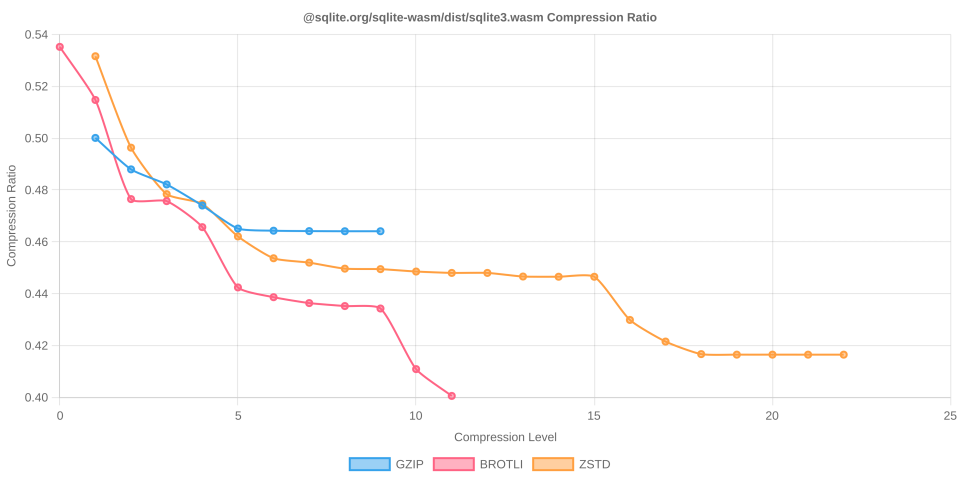

| Algorithm | Level | Time (ms) | Size (bytes) | Compression Ratio | Samples | Converged |
| --- | ---: | ---: | ---: | ---: | ---: | --- |
| gzip | 1 | 12.237 | 429,925 | 0.5001 | 5 | yes |
| gzip | 2 | 13.201 | 419,493 | 0.4879 | 5 | yes |
| gzip | 3 | 15.311 | 414,493 | 0.4821 | 5 | yes |
| gzip | 4 | 16.250 | 407,503 | 0.4740 | 5 | yes |
| gzip | 5 | 23.232 | 399,866 | 0.4651 | 5 | yes |
| gzip | 6 | 27.327 | 399,154 | 0.4643 | 5 | yes |
| gzip | 7 | 29.075 | 399,020 | 0.4641 | 5 | yes |
| gzip | 8 | 31.945 | 398,974 | 0.4641 | 5 | yes |
| gzip | 9 | 32.190 | 398,973 | 0.4641 | 5 | yes |
| brotli | 0 | 3.861 | 460,125 | 0.5352 | 5 | yes |
| brotli | 1 | 5.387 | 442,506 | 0.5147 | 5 | yes |
| brotli | 2 | 9.962 | 409,638 | 0.4765 | 5 | yes |
| brotli | 3 | 11.920 | 408,960 | 0.4757 | 5 | yes |
| brotli | 4 | 17.481 | 400,331 | 0.4656 | 5 | yes |
| brotli | 5 | 26.648 | 380,339 | 0.4424 | 5 | yes |
| brotli | 6 | 31.383 | 377,100 | 0.4386 | 5 | yes |
| brotli | 7 | 43.804 | 375,149 | 0.4364 | 5 | yes |
| brotli | 8 | 51.837 | 374,164 | 0.4352 | 5 | yes |
| brotli | 9 | 64.349 | 373,347 | 0.4343 | 5 | yes |
| brotli | 10 | 891.952 | 353,246 | 0.4109 | 5 | yes |
| brotli | 11 | 1922.684 | 344,353 | 0.4005 | 5 | yes |
| zstd | 1 | 3.066 | 457,015 | 0.5316 | 5 | yes |
| zstd | 2 | 3.876 | 426,694 | 0.4963 | 5 | yes |
| zstd | 3 | 5.843 | 411,278 | 0.4784 | 5 | yes |
| zstd | 4 | 6.355 | 408,051 | 0.4746 | 5 | yes |
| zstd | 5 | 10.147 | 397,246 | 0.4621 | 5 | yes |
| zstd | 6 | 13.903 | 390,015 | 0.4536 | 5 | yes |
| zstd | 7 | 14.832 | 388,562 | 0.4520 | 5 | yes |
| zstd | 8 | 18.349 | 386,566 | 0.4496 | 5 | yes |
| zstd | 9 | 18.530 | 386,404 | 0.4494 | 5 | yes |
| zstd | 10 | 21.307 | 385,609 | 0.4485 | 5 | yes |
| zstd | 11 | 25.002 | 385,152 | 0.4480 | 5 | yes |
| zstd | 12 | 25.144 | 385,152 | 0.4480 | 5 | yes |
| zstd | 13 | 46.067 | 383,952 | 0.4466 | 5 | yes |
| zstd | 14 | 46.804 | 383,886 | 0.4465 | 5 | yes |
| zstd | 15 | 47.107 | 383,877 | 0.4465 | 5 | yes |
| zstd | 16 | 87.315 | 369,550 | 0.4298 | 5 | yes |
| zstd | 17 | 108.911 | 362,382 | 0.4215 | 5 | yes |
| zstd | 18 | 147.233 | 358,220 | 0.4167 | 5 | yes |
| zstd | 19 | 162.241 | 358,047 | 0.4165 | 5 | yes |
| zstd | 20 | 164.518 | 358,047 | 0.4165 | 5 | yes |
| zstd | 21 | 163.684 | 358,041 | 0.4165 | 5 | yes |
| zstd | 22 | 164.644 | 358,041 | 0.4165 | 5 | yes |

<h2 id="tailwindcss-theme-css">tailwindcss/theme.css</h2>

- Original size: 19,586 bytes
- Chart: 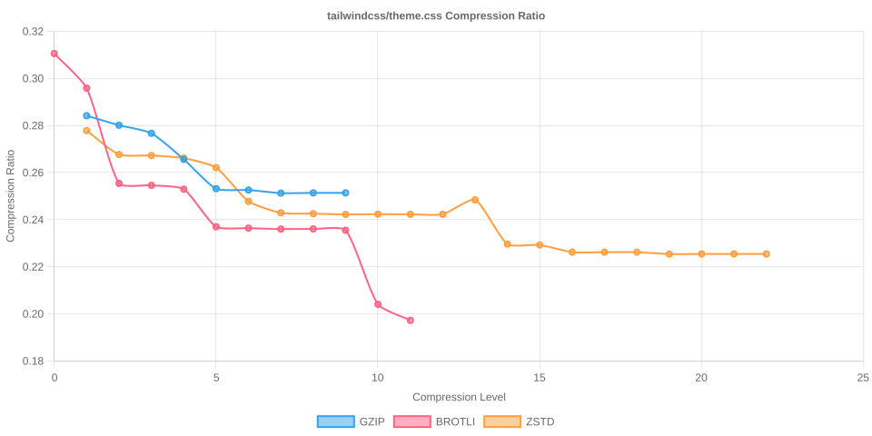

| Algorithm | Level | Time (ms) | Size (bytes) | Compression Ratio | Samples | Converged |
| --- | ---: | ---: | ---: | ---: | ---: | --- |
| gzip | 1 | 0.123 | 5,565 | 0.2841 | 25 | no |
| gzip | 2 | 0.145 | 5,486 | 0.2801 | 17 | yes |
| gzip | 3 | 0.173 | 5,419 | 0.2767 | 9 | yes |
| gzip | 4 | 0.203 | 5,202 | 0.2656 | 10 | yes |
| gzip | 5 | 0.278 | 4,958 | 0.2531 | 5 | yes |
| gzip | 6 | 0.367 | 4,947 | 0.2526 | 5 | yes |
| gzip | 7 | 0.495 | 4,921 | 0.2513 | 5 | yes |
| gzip | 8 | 0.660 | 4,923 | 0.2514 | 5 | yes |
| gzip | 9 | 0.643 | 4,923 | 0.2514 | 5 | yes |
| brotli | 0 | 0.062 | 6,082 | 0.3105 | 12 | yes |
| brotli | 1 | 0.080 | 5,794 | 0.2958 | 12 | yes |
| brotli | 2 | 0.159 | 5,002 | 0.2554 | 5 | yes |
| brotli | 3 | 0.172 | 4,986 | 0.2546 | 12 | yes |
| brotli | 4 | 0.294 | 4,954 | 0.2529 | 5 | yes |
| brotli | 5 | 0.463 | 4,641 | 0.2370 | 5 | yes |
| brotli | 6 | 0.493 | 4,630 | 0.2364 | 5 | yes |
| brotli | 7 | 0.565 | 4,622 | 0.2360 | 5 | yes |
| brotli | 8 | 0.606 | 4,623 | 0.2360 | 5 | yes |
| brotli | 9 | 0.711 | 4,612 | 0.2355 | 5 | yes |
| brotli | 10 | 7.206 | 3,996 | 0.2040 | 5 | yes |
| brotli | 11 | 21.657 | 3,863 | 0.1972 | 5 | yes |
| zstd | 1 | 0.058 | 5,441 | 0.2778 | 19 | yes |
| zstd | 2 | 0.063 | 5,242 | 0.2676 | 16 | yes |
| zstd | 3 | 0.080 | 5,234 | 0.2672 | 15 | yes |
| zstd | 4 | 0.084 | 5,212 | 0.2661 | 16 | yes |
| zstd | 5 | 0.196 | 5,133 | 0.2621 | 5 | yes |
| zstd | 6 | 0.245 | 4,853 | 0.2478 | 6 | yes |
| zstd | 7 | 0.293 | 4,757 | 0.2429 | 5 | yes |
| zstd | 8 | 0.345 | 4,750 | 0.2425 | 5 | yes |
| zstd | 9 | 0.403 | 4,744 | 0.2422 | 5 | yes |
| zstd | 10 | 0.491 | 4,746 | 0.2423 | 5 | yes |
| zstd | 11 | 0.602 | 4,745 | 0.2423 | 5 | yes |
| zstd | 12 | 0.645 | 4,745 | 0.2423 | 5 | yes |
| zstd | 13 | 1.005 | 4,865 | 0.2484 | 5 | yes |
| zstd | 14 | 1.820 | 4,497 | 0.2296 | 5 | yes |
| zstd | 15 | 1.919 | 4,490 | 0.2292 | 5 | yes |
| zstd | 16 | 2.876 | 4,430 | 0.2262 | 5 | yes |
| zstd | 17 | 2.874 | 4,430 | 0.2262 | 5 | yes |
| zstd | 18 | 2.880 | 4,430 | 0.2262 | 5 | yes |
| zstd | 19 | 5.641 | 4,414 | 0.2254 | 5 | yes |
| zstd | 20 | 5.685 | 4,415 | 0.2254 | 5 | yes |
| zstd | 21 | 5.689 | 4,415 | 0.2254 | 5 | yes |
| zstd | 22 | 5.678 | 4,415 | 0.2254 | 5 | yes |
