# Node Compression Benchmark

Last updated: 2026-10-01T13:44:15.499Z

This benchmark measures compression time, output size, and compression ratios for several popular npm packages across all gzip, Brotli, and Zstandard compression levels.

## Table of Contents

- [jquery/dist/jquery.min.js](#jquery-dist-jquery-min-js)
- [@expo-google-fonts/m-plus-1p/400Regular/MPLUS1p_400Regular.ttf](#expo-google-fonts-m-plus-1p-400regular-mplus1p-400regular-ttf)
- [@openfonts/m-plus-1p_japanese/m-plus-1p-japanese-400.woff2](#openfonts-m-plus-1p-japanese-m-plus-1p-japanese-400-woff2)
- [@codemirror/view/dist/index.js](#codemirror-view-dist-index-js)
- [react/cjs/react.production.js](#react-cjs-react-production-js)
- [dayjs/dayjs.min.js](#dayjs-dayjs-min-js)
- [vue/dist/vue.global.prod.js](#vue-dist-vue-global-prod-js)
- [lodash/lodash.min.js](#lodash-lodash-min-js)
- [@fortawesome/fontawesome-free/css/all.min.css](#fortawesome-fontawesome-free-css-all-min-css)
- [bootstrap/dist/css/bootstrap.min.css](#bootstrap-dist-css-bootstrap-min-css)
- [world-countries/dist/countries-unescaped.json](#world-countries-dist-countries-unescaped-json)
- [@sqlite.org/sqlite-wasm/dist/sqlite3.wasm](#sqlite-org-sqlite-wasm-dist-sqlite3-wasm)
- [tailwindcss/theme.css](#tailwindcss-theme-css)

Benchmark settings:

- Warmup runs per level: 1
- Fixed samples per level: 9
- Target relative interval radius: 0.0500
- Elapsed benchmark time: 239.7 seconds
- [Raw observations and environment](results/latest.json) · [Measurement methodology](BENCHMARK.md)
- Intervals have at least 95% coverage for independent, identically distributed samples. Precision met means both bounds are within the target distance of the observed median; it is not an accuracy guarantee.

<h2 id="jquery-dist-jquery-min-js">jquery/dist/jquery.min.js</h2>

- Original size: 78,748 bytes
- Chart: 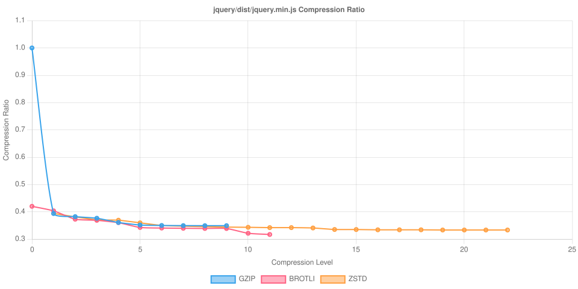

| Algorithm | Level | Time (ms) | Size (bytes) | Compression Ratio | Samples | Median CI (ms) | Precision met |
| --- | ---: | ---: | ---: | ---: | ---: | --- | --- |
| gzip | 0 | 0.192 | 78,776 | 1.0004 | 9 | 0.179–0.260 | no |
| gzip | 1 | 1.286 | 31,033 | 0.3941 | 9 | 1.268–1.324 | yes |
| gzip | 2 | 1.393 | 30,134 | 0.3827 | 9 | 1.387–1.434 | yes |
| gzip | 3 | 1.563 | 29,671 | 0.3768 | 9 | 1.552–1.585 | yes |
| gzip | 4 | 1.819 | 28,457 | 0.3614 | 9 | 1.793–1.882 | yes |
| gzip | 5 | 2.314 | 27,721 | 0.3520 | 9 | 2.304–2.338 | yes |
| gzip | 6 | 2.674 | 27,584 | 0.3503 | 9 | 2.667–2.701 | yes |
| gzip | 7 | 2.938 | 27,547 | 0.3498 | 9 | 2.931–2.953 | yes |
| gzip | 8 | 2.759 | 27,530 | 0.3496 | 9 | 2.752–2.774 | yes |
| gzip | 9 | 2.711 | 27,530 | 0.3496 | 9 | 2.682–2.755 | yes |
| brotli | 0 | 0.399 | 33,111 | 0.4205 | 9 | 0.330–0.436 | no |
| brotli | 1 | 0.846 | 31,803 | 0.4039 | 9 | 0.805–1.118 | no |
| brotli | 2 | 0.869 | 29,394 | 0.3733 | 9 | 0.850–0.901 | yes |
| brotli | 3 | 0.976 | 29,072 | 0.3692 | 9 | 0.960–1.052 | no |
| brotli | 4 | 1.430 | 28,392 | 0.3605 | 9 | 1.392–1.462 | yes |
| brotli | 5 | 2.062 | 27,013 | 0.3430 | 9 | 2.017–2.087 | yes |
| brotli | 6 | 2.260 | 26,844 | 0.3409 | 9 | 2.213–2.273 | yes |
| brotli | 7 | 3.861 | 26,773 | 0.3400 | 9 | 3.818–3.955 | yes |
| brotli | 8 | 2.751 | 26,725 | 0.3394 | 9 | 2.729–3.094 | no |
| brotli | 9 | 4.639 | 26,711 | 0.3392 | 9 | 4.541–4.870 | yes |
| brotli | 10 | 38.065 | 25,340 | 0.3218 | 9 | 36.639–38.592 | yes |
| brotli | 11 | 101.497 | 24,992 | 0.3174 | 9 | 100.437–128.551 | no |
| zstd | 1 | 0.386 | 31,062 | 0.3944 | 9 | 0.353–0.435 | no |
| zstd | 2 | 0.406 | 30,069 | 0.3818 | 9 | 0.375–0.482 | no |
| zstd | 3 | 0.476 | 29,214 | 0.3710 | 9 | 0.444–0.559 | no |
| zstd | 4 | 0.524 | 29,108 | 0.3696 | 9 | 0.484–0.641 | no |
| zstd | 5 | 0.896 | 28,349 | 0.3600 | 9 | 0.886–0.908 | yes |
| zstd | 6 | 1.209 | 27,592 | 0.3504 | 9 | 1.198–1.221 | yes |
| zstd | 7 | 1.480 | 27,383 | 0.3477 | 9 | 1.470–1.664 | no |
| zstd | 8 | 1.619 | 27,237 | 0.3459 | 9 | 1.613–1.643 | yes |
| zstd | 9 | 1.804 | 27,118 | 0.3444 | 9 | 1.797–1.828 | yes |
| zstd | 10 | 2.064 | 27,062 | 0.3437 | 9 | 2.034–2.091 | yes |
| zstd | 11 | 3.471 | 26,969 | 0.3425 | 9 | 3.389–3.787 | no |
| zstd | 12 | 3.547 | 26,970 | 0.3425 | 9 | 3.511–3.609 | yes |
| zstd | 13 | 5.620 | 26,867 | 0.3412 | 9 | 5.596–5.818 | yes |
| zstd | 14 | 7.758 | 26,432 | 0.3357 | 9 | 7.699–7.815 | yes |
| zstd | 15 | 7.862 | 26,420 | 0.3355 | 9 | 7.836–7.969 | yes |
| zstd | 16 | 10.413 | 26,336 | 0.3344 | 9 | 10.032–11.691 | no |
| zstd | 17 | 10.010 | 26,336 | 0.3344 | 9 | 9.954–10.119 | yes |
| zstd | 18 | 10.080 | 26,336 | 0.3344 | 9 | 9.976–10.220 | yes |
| zstd | 19 | 19.726 | 26,282 | 0.3337 | 9 | 19.661–20.001 | yes |
| zstd | 20 | 19.769 | 26,282 | 0.3337 | 9 | 19.620–21.939 | no |
| zstd | 21 | 19.611 | 26,282 | 0.3337 | 9 | 19.491–20.036 | yes |
| zstd | 22 | 19.781 | 26,282 | 0.3337 | 9 | 19.512–20.026 | yes |

<h2 id="expo-google-fonts-m-plus-1p-400regular-mplus1p-400regular-ttf">@expo-google-fonts/m-plus-1p/400Regular/MPLUS1p_400Regular.ttf</h2>

- Original size: 1,714,248 bytes
- Chart: 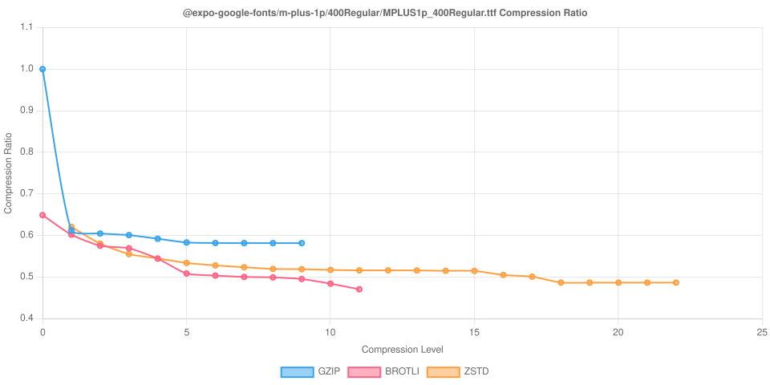

| Algorithm | Level | Time (ms) | Size (bytes) | Compression Ratio | Samples | Median CI (ms) | Precision met |
| --- | ---: | ---: | ---: | ---: | ---: | --- | --- |
| gzip | 0 | 1.282 | 1,714,526 | 1.0002 | 9 | 0.958–1.324 | no |
| gzip | 1 | 29.007 | 1,049,634 | 0.6123 | 9 | 28.749–29.882 | yes |
| gzip | 2 | 30.567 | 1,036,805 | 0.6048 | 9 | 30.495–31.652 | yes |
| gzip | 3 | 32.479 | 1,030,268 | 0.6010 | 9 | 32.372–32.616 | yes |
| gzip | 4 | 36.523 | 1,015,229 | 0.5922 | 9 | 36.429–37.131 | yes |
| gzip | 5 | 43.892 | 999,772 | 0.5832 | 9 | 43.795–43.982 | yes |
| gzip | 6 | 52.536 | 997,720 | 0.5820 | 9 | 51.894–52.721 | yes |
| gzip | 7 | 56.811 | 997,295 | 0.5818 | 9 | 56.739–58.406 | yes |
| gzip | 8 | 61.717 | 997,191 | 0.5817 | 9 | 61.660–61.877 | yes |
| gzip | 9 | 68.906 | 997,191 | 0.5817 | 9 | 68.550–69.192 | yes |
| brotli | 0 | 6.913 | 1,112,634 | 0.6491 | 9 | 6.907–7.036 | yes |
| brotli | 1 | 9.570 | 1,031,943 | 0.6020 | 9 | 9.521–9.733 | yes |
| brotli | 2 | 17.036 | 986,211 | 0.5753 | 9 | 16.920–17.701 | yes |
| brotli | 3 | 21.293 | 976,041 | 0.5694 | 9 | 21.125–21.808 | yes |
| brotli | 4 | 29.832 | 933,224 | 0.5444 | 9 | 29.403–30.262 | yes |
| brotli | 5 | 41.162 | 872,005 | 0.5087 | 9 | 40.931–41.505 | yes |
| brotli | 6 | 45.790 | 863,383 | 0.5037 | 9 | 44.681–46.748 | yes |
| brotli | 7 | 92.648 | 857,835 | 0.5004 | 9 | 91.600–94.040 | yes |
| brotli | 8 | 116.133 | 855,950 | 0.4993 | 9 | 111.473–125.913 | no |
| brotli | 9 | 143.207 | 849,266 | 0.4954 | 9 | 139.775–148.013 | yes |
| brotli | 10 | 2305.124 | 830,083 | 0.4842 | 9 | 2298.298–2334.298 | yes |
| brotli | 11 | 3949.152 | 806,920 | 0.4707 | 9 | 3937.482–3979.137 | yes |
| zstd | 1 | 6.339 | 1,063,995 | 0.6207 | 9 | 6.295–6.379 | yes |
| zstd | 2 | 7.644 | 995,049 | 0.5805 | 9 | 7.600–7.728 | yes |
| zstd | 3 | 10.803 | 951,924 | 0.5553 | 9 | 10.723–10.896 | yes |
| zstd | 4 | 11.314 | 934,018 | 0.5449 | 9 | 11.073–11.635 | yes |
| zstd | 5 | 20.108 | 915,542 | 0.5341 | 9 | 20.021–20.152 | yes |
| zstd | 6 | 24.367 | 905,207 | 0.5280 | 9 | 24.271–24.435 | yes |
| zstd | 7 | 25.590 | 897,707 | 0.5237 | 9 | 25.483–25.816 | yes |
| zstd | 8 | 30.205 | 890,668 | 0.5196 | 9 | 29.957–30.362 | yes |
| zstd | 9 | 30.476 | 889,701 | 0.5190 | 9 | 30.169–30.589 | yes |
| zstd | 10 | 35.394 | 886,752 | 0.5173 | 9 | 35.199–35.560 | yes |
| zstd | 11 | 43.896 | 884,967 | 0.5162 | 9 | 43.546–44.997 | yes |
| zstd | 12 | 43.692 | 884,967 | 0.5162 | 9 | 43.617–43.826 | yes |
| zstd | 13 | 94.852 | 884,574 | 0.5160 | 9 | 92.629–96.705 | yes |
| zstd | 14 | 98.983 | 882,969 | 0.5151 | 9 | 97.913–102.861 | yes |
| zstd | 15 | 112.120 | 882,565 | 0.5148 | 9 | 104.932–114.767 | no |
| zstd | 16 | 176.158 | 865,802 | 0.5051 | 9 | 172.415–182.070 | yes |
| zstd | 17 | 188.687 | 858,980 | 0.5011 | 9 | 182.894–193.405 | yes |
| zstd | 18 | 310.619 | 834,631 | 0.4869 | 9 | 299.170–319.601 | yes |
| zstd | 19 | 307.924 | 834,350 | 0.4867 | 9 | 293.270–312.307 | yes |
| zstd | 20 | 304.726 | 834,350 | 0.4867 | 9 | 294.656–315.117 | yes |
| zstd | 21 | 309.758 | 834,350 | 0.4867 | 9 | 296.750–319.388 | yes |
| zstd | 22 | 316.497 | 834,350 | 0.4867 | 9 | 311.559–322.887 | yes |

<h2 id="openfonts-m-plus-1p-japanese-m-plus-1p-japanese-400-woff2">@openfonts/m-plus-1p_japanese/m-plus-1p-japanese-400.woff2</h2>

- Original size: 598,576 bytes
- Chart: 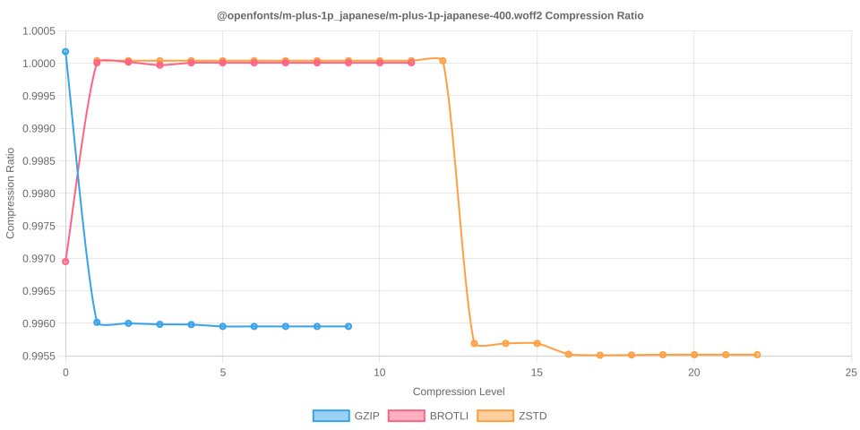

| Algorithm | Level | Time (ms) | Size (bytes) | Compression Ratio | Samples | Median CI (ms) | Precision met |
| --- | ---: | ---: | ---: | ---: | ---: | --- | --- |
| gzip | 0 | 0.331 | 598,684 | 1.0002 | 9 | 0.320–0.354 | no |
| gzip | 1 | 13.101 | 596,192 | 0.9960 | 9 | 13.082–13.176 | yes |
| gzip | 2 | 13.133 | 596,183 | 0.9960 | 9 | 13.094–13.154 | yes |
| gzip | 3 | 13.092 | 596,173 | 0.9960 | 9 | 13.073–13.137 | yes |
| gzip | 4 | 14.093 | 596,171 | 0.9960 | 9 | 14.064–14.182 | yes |
| gzip | 5 | 14.099 | 596,154 | 0.9960 | 9 | 14.079–14.177 | yes |
| gzip | 6 | 14.071 | 596,154 | 0.9960 | 9 | 14.053–14.101 | yes |
| gzip | 7 | 14.083 | 596,154 | 0.9960 | 9 | 14.031–14.125 | yes |
| gzip | 8 | 14.052 | 596,154 | 0.9960 | 9 | 14.024–14.093 | yes |
| gzip | 9 | 14.108 | 596,154 | 0.9960 | 9 | 14.058–14.353 | yes |
| brotli | 0 | 0.227 | 596,751 | 0.9970 | 9 | 0.223–0.248 | no |
| brotli | 1 | 0.217 | 598,581 | 1.0000 | 9 | 0.208–0.239 | no |
| brotli | 2 | 0.554 | 598,587 | 1.0000 | 9 | 0.526–0.567 | no |
| brotli | 3 | 0.730 | 598,559 | 1.0000 | 9 | 0.702–0.752 | yes |
| brotli | 4 | 0.946 | 598,581 | 1.0000 | 9 | 0.914–0.962 | yes |
| brotli | 5 | 1.458 | 598,581 | 1.0000 | 9 | 1.434–1.582 | no |
| brotli | 6 | 1.402 | 598,581 | 1.0000 | 9 | 1.366–1.742 | no |
| brotli | 7 | 1.903 | 598,581 | 1.0000 | 9 | 1.887–1.924 | yes |
| brotli | 8 | 1.969 | 598,581 | 1.0000 | 9 | 1.934–2.027 | yes |
| brotli | 9 | 4.271 | 598,581 | 1.0000 | 9 | 4.080–5.015 | no |
| brotli | 10 | 113.864 | 598,581 | 1.0000 | 9 | 113.756–114.185 | yes |
| brotli | 11 | 282.810 | 598,581 | 1.0000 | 9 | 281.349–285.194 | yes |
| zstd | 1 | 0.258 | 598,601 | 1.0000 | 9 | 0.240–0.302 | no |
| zstd | 2 | 0.283 | 598,600 | 1.0000 | 9 | 0.260–0.306 | no |
| zstd | 3 | 0.322 | 598,600 | 1.0000 | 9 | 0.279–0.334 | no |
| zstd | 4 | 0.303 | 598,600 | 1.0000 | 9 | 0.286–0.373 | no |
| zstd | 5 | 0.484 | 598,600 | 1.0000 | 9 | 0.451–1.401 | no |
| zstd | 6 | 0.460 | 598,600 | 1.0000 | 9 | 0.453–0.473 | yes |
| zstd | 7 | 0.674 | 598,600 | 1.0000 | 9 | 0.526–0.707 | no |
| zstd | 8 | 0.500 | 598,600 | 1.0000 | 9 | 0.494–0.520 | yes |
| zstd | 9 | 0.601 | 598,600 | 1.0000 | 9 | 0.586–1.008 | no |
| zstd | 10 | 0.607 | 598,600 | 1.0000 | 9 | 0.584–0.723 | no |
| zstd | 11 | 0.580 | 598,600 | 1.0000 | 9 | 0.566–0.606 | yes |
| zstd | 12 | 0.597 | 598,600 | 1.0000 | 9 | 0.578–0.619 | yes |
| zstd | 13 | 2.301 | 595,998 | 0.9957 | 9 | 2.203–2.460 | no |
| zstd | 14 | 2.295 | 595,998 | 0.9957 | 9 | 2.277–2.428 | no |
| zstd | 15 | 2.344 | 595,998 | 0.9957 | 9 | 2.242–2.400 | yes |
| zstd | 16 | 13.934 | 595,898 | 0.9955 | 9 | 13.871–14.187 | yes |
| zstd | 17 | 14.147 | 595,889 | 0.9955 | 9 | 14.013–14.357 | yes |
| zstd | 18 | 21.423 | 595,891 | 0.9955 | 9 | 20.060–21.945 | no |
| zstd | 19 | 25.301 | 595,894 | 0.9955 | 9 | 24.575–25.849 | yes |
| zstd | 20 | 24.678 | 595,894 | 0.9955 | 9 | 24.151–25.124 | yes |
| zstd | 21 | 24.261 | 595,894 | 0.9955 | 9 | 24.060–25.039 | yes |
| zstd | 22 | 24.765 | 595,894 | 0.9955 | 9 | 24.060–25.272 | yes |

<h2 id="codemirror-view-dist-index-js">@codemirror/view/dist/index.js</h2>

- Original size: 493,290 bytes
- Chart: 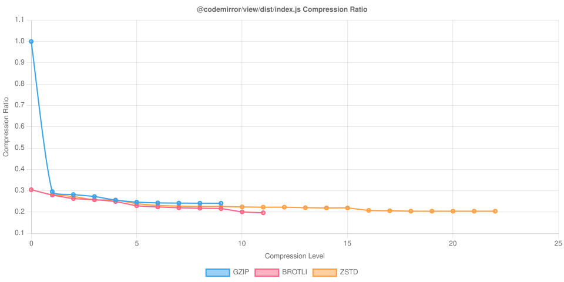

| Algorithm | Level | Time (ms) | Size (bytes) | Compression Ratio | Samples | Median CI (ms) | Precision met |
| --- | ---: | ---: | ---: | ---: | ---: | --- | --- |
| gzip | 0 | 0.268 | 493,383 | 1.0002 | 9 | 0.259–0.274 | yes |
| gzip | 1 | 4.290 | 146,149 | 0.2963 | 9 | 4.278–4.302 | yes |
| gzip | 2 | 4.731 | 139,274 | 0.2823 | 9 | 4.711–4.798 | yes |
| gzip | 3 | 6.244 | 134,733 | 0.2731 | 9 | 6.229–6.274 | yes |
| gzip | 4 | 6.344 | 126,385 | 0.2562 | 9 | 6.329–6.352 | yes |
| gzip | 5 | 9.304 | 121,702 | 0.2467 | 9 | 9.257–9.320 | yes |
| gzip | 6 | 13.731 | 119,973 | 0.2432 | 9 | 13.710–13.797 | yes |
| gzip | 7 | 17.557 | 119,497 | 0.2422 | 9 | 17.523–17.633 | yes |
| gzip | 8 | 33.028 | 119,223 | 0.2417 | 9 | 33.000–33.130 | yes |
| gzip | 9 | 51.201 | 119,156 | 0.2416 | 9 | 51.162–52.709 | yes |
| brotli | 0 | 1.577 | 150,465 | 0.3050 | 9 | 1.563–1.597 | yes |
| brotli | 1 | 2.203 | 138,172 | 0.2801 | 9 | 2.194–2.216 | yes |
| brotli | 2 | 4.057 | 129,999 | 0.2635 | 9 | 4.048–4.090 | yes |
| brotli | 3 | 4.742 | 127,405 | 0.2583 | 9 | 4.733–4.755 | yes |
| brotli | 4 | 6.593 | 123,107 | 0.2496 | 9 | 6.505–6.720 | yes |
| brotli | 5 | 10.220 | 113,382 | 0.2298 | 9 | 10.188–10.286 | yes |
| brotli | 6 | 11.771 | 110,700 | 0.2244 | 9 | 11.676–11.876 | yes |
| brotli | 7 | 14.876 | 108,697 | 0.2204 | 9 | 14.812–14.898 | yes |
| brotli | 8 | 18.272 | 107,649 | 0.2182 | 9 | 17.887–20.496 | no |
| brotli | 9 | 23.093 | 106,735 | 0.2164 | 9 | 23.042–23.163 | yes |
| brotli | 10 | 293.663 | 99,238 | 0.2012 | 9 | 292.488–295.332 | yes |
| brotli | 11 | 744.071 | 97,146 | 0.1969 | 9 | 743.360–754.611 | yes |
| zstd | 1 | 1.784 | 138,911 | 0.2816 | 9 | 1.754–1.796 | yes |
| zstd | 2 | 1.865 | 134,725 | 0.2731 | 9 | 1.851–1.883 | yes |
| zstd | 3 | 2.127 | 126,980 | 0.2574 | 9 | 2.076–2.289 | no |
| zstd | 4 | 2.426 | 126,776 | 0.2570 | 9 | 2.402–2.438 | yes |
| zstd | 5 | 4.646 | 118,141 | 0.2395 | 9 | 4.628–4.659 | yes |
| zstd | 6 | 6.346 | 114,119 | 0.2313 | 9 | 6.322–6.359 | yes |
| zstd | 7 | 7.047 | 112,542 | 0.2281 | 9 | 7.006–7.096 | yes |
| zstd | 8 | 8.888 | 111,701 | 0.2264 | 9 | 8.870–8.920 | yes |
| zstd | 9 | 8.889 | 111,701 | 0.2264 | 9 | 8.838–8.941 | yes |
| zstd | 10 | 10.624 | 110,666 | 0.2243 | 9 | 10.605–10.673 | yes |
| zstd | 11 | 13.072 | 110,040 | 0.2231 | 9 | 12.977–13.175 | yes |
| zstd | 12 | 13.112 | 110,040 | 0.2231 | 9 | 12.987–13.158 | yes |
| zstd | 13 | 27.399 | 108,868 | 0.2207 | 9 | 27.331–27.712 | yes |
| zstd | 14 | 33.071 | 108,312 | 0.2196 | 9 | 32.924–33.145 | yes |
| zstd | 15 | 36.901 | 108,238 | 0.2194 | 9 | 36.809–37.189 | yes |
| zstd | 16 | 65.418 | 102,642 | 0.2081 | 9 | 65.263–66.346 | yes |
| zstd | 17 | 73.510 | 101,748 | 0.2063 | 9 | 73.181–73.795 | yes |
| zstd | 18 | 105.877 | 100,901 | 0.2045 | 9 | 105.030–107.340 | yes |
| zstd | 19 | 136.251 | 100,801 | 0.2043 | 9 | 135.481–138.075 | yes |
| zstd | 20 | 135.178 | 100,801 | 0.2043 | 9 | 134.834–135.322 | yes |
| zstd | 21 | 136.165 | 100,801 | 0.2043 | 9 | 135.476–137.180 | yes |
| zstd | 22 | 135.913 | 100,801 | 0.2043 | 9 | 135.505–136.833 | yes |

<h2 id="react-cjs-react-production-js">react/cjs/react.production.js</h2>

- Original size: 18,040 bytes
- Chart: 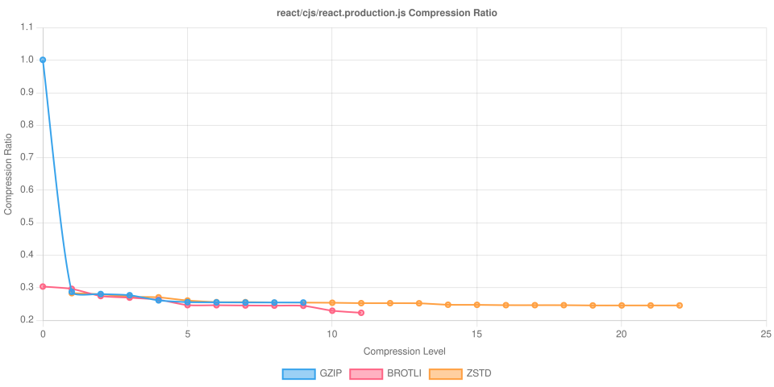

| Algorithm | Level | Time (ms) | Size (bytes) | Compression Ratio | Samples | Median CI (ms) | Precision met |
| --- | ---: | ---: | ---: | ---: | ---: | --- | --- |
| gzip | 0 | 0.018 | 18,063 | 1.0013 | 9 | 0.017–0.020 | no |
| gzip | 1 | 0.077 | 5,189 | 0.2876 | 9 | 0.072–0.134 | no |
| gzip | 2 | 0.090 | 5,069 | 0.2810 | 9 | 0.077–0.152 | no |
| gzip | 3 | 0.110 | 5,002 | 0.2773 | 9 | 0.088–0.152 | no |
| gzip | 4 | 0.131 | 4,715 | 0.2614 | 9 | 0.111–0.194 | no |
| gzip | 5 | 0.171 | 4,618 | 0.2560 | 9 | 0.139–0.254 | no |
| gzip | 6 | 0.191 | 4,607 | 0.2554 | 9 | 0.180–0.267 | no |
| gzip | 7 | 0.259 | 4,600 | 0.2550 | 9 | 0.216–0.330 | no |
| gzip | 8 | 0.462 | 4,598 | 0.2549 | 9 | 0.417–0.518 | no |
| gzip | 9 | 0.470 | 4,598 | 0.2549 | 9 | 0.425–0.514 | no |
| brotli | 0 | 0.059 | 5,483 | 0.3039 | 9 | 0.055–0.078 | no |
| brotli | 1 | 0.072 | 5,356 | 0.2969 | 9 | 0.070–0.100 | no |
| brotli | 2 | 0.108 | 4,956 | 0.2747 | 9 | 0.100–0.139 | no |
| brotli | 3 | 0.237 | 4,866 | 0.2697 | 9 | 0.198–0.275 | no |
| brotli | 4 | 0.249 | 4,752 | 0.2634 | 9 | 0.207–0.392 | no |
| brotli | 5 | 0.357 | 4,451 | 0.2467 | 9 | 0.314–0.406 | no |
| brotli | 6 | 0.418 | 4,446 | 0.2465 | 9 | 0.375–0.654 | no |
| brotli | 7 | 0.432 | 4,432 | 0.2457 | 9 | 0.405–0.476 | no |
| brotli | 8 | 0.454 | 4,424 | 0.2452 | 9 | 0.436–0.481 | no |
| brotli | 9 | 1.802 | 4,416 | 0.2448 | 9 | 1.786–1.862 | yes |
| brotli | 10 | 8.104 | 4,142 | 0.2296 | 9 | 8.075–8.166 | yes |
| brotli | 11 | 20.214 | 4,027 | 0.2232 | 9 | 20.148–20.281 | yes |
| zstd | 1 | 0.052 | 5,115 | 0.2835 | 9 | 0.050–0.063 | no |
| zstd | 2 | 0.057 | 5,057 | 0.2803 | 9 | 0.055–0.079 | no |
| zstd | 3 | 0.069 | 4,922 | 0.2728 | 9 | 0.067–0.084 | no |
| zstd | 4 | 0.074 | 4,885 | 0.2708 | 9 | 0.071–0.101 | no |
| zstd | 5 | 0.139 | 4,708 | 0.2610 | 9 | 0.137–0.155 | no |
| zstd | 6 | 0.174 | 4,620 | 0.2561 | 9 | 0.169–0.201 | no |
| zstd | 7 | 0.205 | 4,618 | 0.2560 | 9 | 0.196–0.244 | no |
| zstd | 8 | 0.219 | 4,600 | 0.2550 | 9 | 0.210–0.285 | no |
| zstd | 9 | 0.284 | 4,592 | 0.2545 | 9 | 0.258–0.324 | no |
| zstd | 10 | 0.337 | 4,584 | 0.2541 | 9 | 0.328–0.374 | no |
| zstd | 11 | 0.665 | 4,562 | 0.2529 | 9 | 0.657–0.694 | yes |
| zstd | 12 | 0.679 | 4,561 | 0.2528 | 9 | 0.669–0.693 | yes |
| zstd | 13 | 0.988 | 4,554 | 0.2524 | 9 | 0.961–0.991 | yes |
| zstd | 14 | 1.489 | 4,473 | 0.2479 | 9 | 1.485–1.502 | yes |
| zstd | 15 | 1.584 | 4,468 | 0.2477 | 9 | 1.572–1.596 | yes |
| zstd | 16 | 2.326 | 4,450 | 0.2467 | 9 | 2.315–2.334 | yes |
| zstd | 17 | 2.430 | 4,450 | 0.2467 | 9 | 2.421–2.449 | yes |
| zstd | 18 | 2.445 | 4,450 | 0.2467 | 9 | 2.427–2.469 | yes |
| zstd | 19 | 4.793 | 4,435 | 0.2458 | 9 | 4.774–4.818 | yes |
| zstd | 20 | 4.789 | 4,435 | 0.2458 | 9 | 4.770–4.811 | yes |
| zstd | 21 | 4.797 | 4,435 | 0.2458 | 9 | 4.783–4.821 | yes |
| zstd | 22 | 4.797 | 4,435 | 0.2458 | 9 | 4.791–4.803 | yes |

<h2 id="dayjs-dayjs-min-js">dayjs/dayjs.min.js</h2>

- Original size: 7,161 bytes
- Chart: 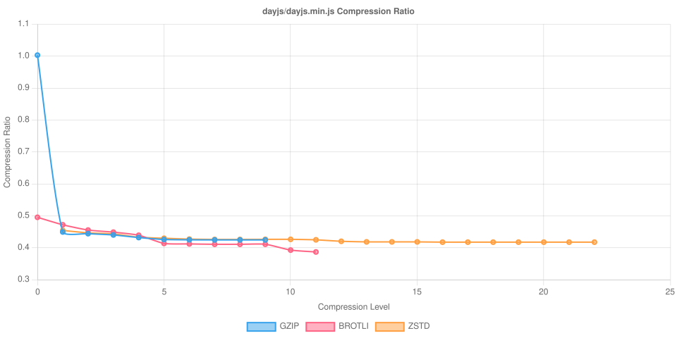

| Algorithm | Level | Time (ms) | Size (bytes) | Compression Ratio | Samples | Median CI (ms) | Precision met |
| --- | ---: | ---: | ---: | ---: | ---: | --- | --- |
| gzip | 0 | 0.015 | 7,184 | 1.0032 | 9 | 0.014–0.030 | no |
| gzip | 1 | 0.106 | 3,220 | 0.4497 | 9 | 0.092–0.138 | no |
| gzip | 2 | 0.061 | 3,182 | 0.4444 | 9 | 0.048–0.120 | no |
| gzip | 3 | 0.053 | 3,153 | 0.4403 | 9 | 0.051–0.078 | no |
| gzip | 4 | 0.065 | 3,095 | 0.4322 | 9 | 0.057–0.116 | no |
| gzip | 5 | 0.097 | 3,051 | 0.4261 | 9 | 0.077–0.139 | no |
| gzip | 6 | 0.071 | 3,044 | 0.4251 | 9 | 0.069–0.095 | no |
| gzip | 7 | 0.077 | 3,042 | 0.4248 | 9 | 0.074–0.098 | no |
| gzip | 8 | 0.079 | 3,042 | 0.4248 | 9 | 0.072–0.095 | no |
| gzip | 9 | 0.075 | 3,042 | 0.4248 | 9 | 0.072–0.084 | no |
| brotli | 0 | 0.031 | 3,549 | 0.4956 | 9 | 0.029–0.035 | no |
| brotli | 1 | 0.042 | 3,381 | 0.4721 | 9 | 0.040–0.058 | no |
| brotli | 2 | 0.059 | 3,263 | 0.4557 | 9 | 0.057–0.069 | no |
| brotli | 3 | 0.076 | 3,216 | 0.4491 | 9 | 0.073–0.101 | no |
| brotli | 4 | 0.134 | 3,147 | 0.4395 | 9 | 0.121–0.153 | no |
| brotli | 5 | 0.164 | 2,963 | 0.4138 | 9 | 0.160–0.199 | no |
| brotli | 6 | 0.178 | 2,952 | 0.4122 | 9 | 0.171–0.218 | no |
| brotli | 7 | 0.200 | 2,944 | 0.4111 | 9 | 0.174–0.266 | no |
| brotli | 8 | 0.200 | 2,944 | 0.4111 | 9 | 0.194–0.208 | yes |
| brotli | 9 | 1.542 | 2,945 | 0.4113 | 9 | 1.529–1.588 | yes |
| brotli | 10 | 3.284 | 2,814 | 0.3930 | 9 | 3.243–3.381 | yes |
| brotli | 11 | 8.048 | 2,772 | 0.3871 | 9 | 8.026–8.101 | yes |
| zstd | 1 | 0.032 | 3,254 | 0.4544 | 9 | 0.030–0.051 | no |
| zstd | 2 | 0.034 | 3,200 | 0.4469 | 9 | 0.031–0.059 | no |
| zstd | 3 | 0.040 | 3,176 | 0.4435 | 9 | 0.039–0.050 | no |
| zstd | 4 | 0.062 | 3,102 | 0.4332 | 9 | 0.060–0.089 | no |
| zstd | 5 | 0.071 | 3,079 | 0.4300 | 9 | 0.069–0.086 | no |
| zstd | 6 | 0.085 | 3,060 | 0.4273 | 9 | 0.082–0.100 | no |
| zstd | 7 | 0.097 | 3,053 | 0.4263 | 9 | 0.095–0.112 | no |
| zstd | 8 | 0.097 | 3,053 | 0.4263 | 9 | 0.095–0.104 | no |
| zstd | 9 | 0.149 | 3,055 | 0.4266 | 9 | 0.123–0.197 | no |
| zstd | 10 | 0.115 | 3,055 | 0.4266 | 9 | 0.114–0.129 | no |
| zstd | 11 | 0.267 | 3,044 | 0.4251 | 9 | 0.227–0.323 | no |
| zstd | 12 | 0.424 | 3,011 | 0.4205 | 9 | 0.403–0.469 | no |
| zstd | 13 | 0.562 | 2,998 | 0.4187 | 9 | 0.534–0.604 | no |
| zstd | 14 | 0.545 | 2,998 | 0.4187 | 9 | 0.536–0.554 | yes |
| zstd | 15 | 0.613 | 2,998 | 0.4187 | 9 | 0.562–0.907 | no |
| zstd | 16 | 1.046 | 2,992 | 0.4178 | 9 | 1.035–1.079 | yes |
| zstd | 17 | 1.138 | 2,992 | 0.4178 | 9 | 1.103–1.189 | yes |
| zstd | 18 | 1.038 | 2,992 | 0.4178 | 9 | 1.022–1.081 | yes |
| zstd | 19 | 1.037 | 2,992 | 0.4178 | 9 | 1.027–1.113 | no |
| zstd | 20 | 1.052 | 2,992 | 0.4178 | 9 | 1.047–1.079 | yes |
| zstd | 21 | 1.040 | 2,992 | 0.4178 | 9 | 1.031–1.110 | no |
| zstd | 22 | 1.033 | 2,992 | 0.4178 | 9 | 1.024–1.062 | yes |

<h2 id="vue-dist-vue-global-prod-js">vue/dist/vue.global.prod.js</h2>

- Original size: 168,331 bytes
- Chart: 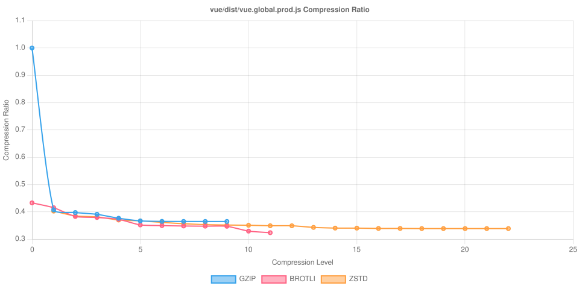

| Algorithm | Level | Time (ms) | Size (bytes) | Compression Ratio | Samples | Median CI (ms) | Precision met |
| --- | ---: | ---: | ---: | ---: | ---: | --- | --- |
| gzip | 0 | 0.107 | 168,374 | 1.0003 | 9 | 0.098–0.112 | no |
| gzip | 1 | 2.090 | 68,573 | 0.4074 | 9 | 2.085–2.112 | yes |
| gzip | 2 | 2.287 | 66,933 | 0.3976 | 9 | 2.275–2.290 | yes |
| gzip | 3 | 2.628 | 65,843 | 0.3912 | 9 | 2.619–2.640 | yes |
| gzip | 4 | 2.900 | 63,425 | 0.3768 | 9 | 2.889–2.912 | yes |
| gzip | 5 | 3.982 | 61,773 | 0.3670 | 9 | 3.975–3.997 | yes |
| gzip | 6 | 5.007 | 61,499 | 0.3653 | 9 | 4.999–5.019 | yes |
| gzip | 7 | 5.491 | 61,455 | 0.3651 | 9 | 5.473–5.560 | yes |
| gzip | 8 | 5.939 | 61,439 | 0.3650 | 9 | 5.929–5.947 | yes |
| gzip | 9 | 5.939 | 61,439 | 0.3650 | 9 | 5.929–5.966 | yes |
| brotli | 0 | 0.627 | 72,913 | 0.4332 | 9 | 0.607–0.698 | no |
| brotli | 1 | 0.970 | 69,920 | 0.4154 | 9 | 0.953–0.992 | yes |
| brotli | 2 | 1.769 | 64,516 | 0.3833 | 9 | 1.761–1.774 | yes |
| brotli | 3 | 2.085 | 63,895 | 0.3796 | 9 | 2.075–2.096 | yes |
| brotli | 4 | 3.037 | 62,764 | 0.3729 | 9 | 3.011–3.061 | yes |
| brotli | 5 | 4.528 | 59,301 | 0.3523 | 9 | 4.465–4.642 | yes |
| brotli | 6 | 5.248 | 58,889 | 0.3498 | 9 | 5.186–5.288 | yes |
| brotli | 7 | 6.291 | 58,648 | 0.3484 | 9 | 6.270–6.338 | yes |
| brotli | 8 | 6.838 | 58,548 | 0.3478 | 9 | 6.799–6.855 | yes |
| brotli | 9 | 9.263 | 58,469 | 0.3473 | 9 | 9.071–9.614 | yes |
| brotli | 10 | 100.482 | 55,499 | 0.3297 | 9 | 100.274–100.605 | yes |
| brotli | 11 | 271.671 | 54,528 | 0.3239 | 9 | 271.612–272.398 | yes |
| zstd | 1 | 0.627 | 67,813 | 0.4029 | 9 | 0.616–0.677 | no |
| zstd | 2 | 0.805 | 64,841 | 0.3852 | 9 | 0.797–0.840 | yes |
| zstd | 3 | 0.973 | 64,266 | 0.3818 | 9 | 0.965–1.010 | yes |
| zstd | 4 | 1.851 | 62,332 | 0.3703 | 9 | 1.845–1.870 | yes |
| zstd | 5 | 2.095 | 61,810 | 0.3672 | 9 | 2.086–2.119 | yes |
| zstd | 6 | 2.525 | 60,879 | 0.3617 | 9 | 2.508–2.544 | yes |
| zstd | 7 | 2.970 | 60,032 | 0.3566 | 9 | 2.966–2.985 | yes |
| zstd | 8 | 3.747 | 59,502 | 0.3535 | 9 | 3.724–3.774 | yes |
| zstd | 9 | 4.361 | 59,250 | 0.3520 | 9 | 4.352–4.379 | yes |
| zstd | 10 | 5.138 | 59,093 | 0.3511 | 9 | 5.096–5.184 | yes |
| zstd | 11 | 8.980 | 58,812 | 0.3494 | 9 | 8.902–9.003 | yes |
| zstd | 12 | 9.152 | 58,797 | 0.3493 | 9 | 9.087–9.183 | yes |
| zstd | 13 | 15.718 | 57,790 | 0.3433 | 9 | 15.701–15.803 | yes |
| zstd | 14 | 18.508 | 57,359 | 0.3408 | 9 | 18.411–18.580 | yes |
| zstd | 15 | 18.660 | 57,332 | 0.3406 | 9 | 18.590–18.682 | yes |
| zstd | 16 | 23.417 | 57,134 | 0.3394 | 9 | 23.339–23.639 | yes |
| zstd | 17 | 23.287 | 57,134 | 0.3394 | 9 | 23.219–23.552 | yes |
| zstd | 18 | 39.510 | 57,062 | 0.3390 | 9 | 39.354–39.740 | yes |
| zstd | 19 | 39.556 | 57,062 | 0.3390 | 9 | 39.221–39.829 | yes |
| zstd | 20 | 39.551 | 57,062 | 0.3390 | 9 | 39.369–39.868 | yes |
| zstd | 21 | 39.373 | 57,062 | 0.3390 | 9 | 39.234–39.747 | yes |
| zstd | 22 | 39.456 | 57,062 | 0.3390 | 9 | 39.232–39.787 | yes |

<h2 id="lodash-lodash-min-js">lodash/lodash.min.js</h2>

- Original size: 73,234 bytes
- Chart: 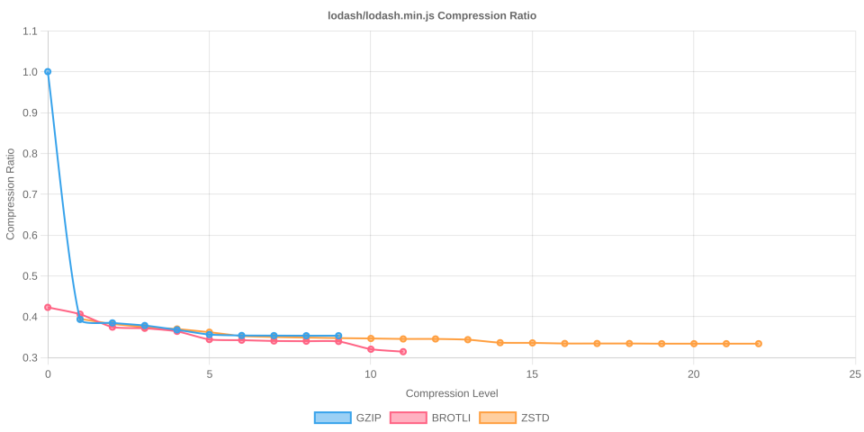

| Algorithm | Level | Time (ms) | Size (bytes) | Compression Ratio | Samples | Median CI (ms) | Precision met |
| --- | ---: | ---: | ---: | ---: | ---: | --- | --- |
| gzip | 0 | 0.050 | 73,262 | 1.0004 | 9 | 0.047–0.060 | no |
| gzip | 1 | 0.841 | 28,819 | 0.3935 | 9 | 0.831–0.860 | yes |
| gzip | 2 | 0.922 | 28,191 | 0.3849 | 9 | 0.917–0.931 | yes |
| gzip | 3 | 1.083 | 27,724 | 0.3786 | 9 | 1.080–1.099 | yes |
| gzip | 4 | 1.185 | 26,950 | 0.3680 | 9 | 1.174–1.204 | yes |
| gzip | 5 | 1.576 | 26,101 | 0.3564 | 9 | 1.562–1.581 | yes |
| gzip | 6 | 2.037 | 25,938 | 0.3542 | 9 | 2.028–2.057 | yes |
| gzip | 7 | 2.447 | 25,913 | 0.3538 | 9 | 2.438–2.464 | yes |
| gzip | 8 | 3.350 | 25,894 | 0.3536 | 9 | 3.321–3.360 | yes |
| gzip | 9 | 3.319 | 25,894 | 0.3536 | 9 | 3.295–3.367 | yes |
| brotli | 0 | 0.200 | 30,978 | 0.4230 | 9 | 0.198–0.256 | no |
| brotli | 1 | 0.336 | 29,754 | 0.4063 | 9 | 0.306–0.389 | no |
| brotli | 2 | 0.720 | 27,438 | 0.3747 | 9 | 0.708–0.979 | no |
| brotli | 3 | 0.854 | 27,227 | 0.3718 | 9 | 0.843–0.892 | yes |
| brotli | 4 | 1.320 | 26,678 | 0.3643 | 9 | 1.310–1.347 | yes |
| brotli | 5 | 1.936 | 25,217 | 0.3443 | 9 | 1.927–1.976 | yes |
| brotli | 6 | 2.094 | 25,093 | 0.3426 | 9 | 2.072–2.117 | yes |
| brotli | 7 | 2.551 | 24,950 | 0.3407 | 9 | 2.543–2.563 | yes |
| brotli | 8 | 2.730 | 24,912 | 0.3402 | 9 | 2.702–2.773 | yes |
| brotli | 9 | 4.501 | 24,870 | 0.3396 | 9 | 4.463–4.608 | yes |
| brotli | 10 | 41.173 | 23,472 | 0.3205 | 9 | 41.017–41.336 | yes |
| brotli | 11 | 99.540 | 23,030 | 0.3145 | 9 | 99.427–99.679 | yes |
| zstd | 1 | 0.195 | 28,919 | 0.3949 | 9 | 0.192–0.238 | no |
| zstd | 2 | 0.236 | 28,008 | 0.3824 | 9 | 0.220–0.295 | no |
| zstd | 3 | 0.285 | 27,463 | 0.3750 | 9 | 0.264–0.351 | no |
| zstd | 4 | 0.395 | 27,100 | 0.3700 | 9 | 0.334–0.449 | no |
| zstd | 5 | 0.774 | 26,525 | 0.3622 | 9 | 0.765–0.801 | yes |
| zstd | 6 | 1.087 | 25,834 | 0.3528 | 9 | 1.066–1.097 | yes |
| zstd | 7 | 1.304 | 25,663 | 0.3504 | 9 | 1.291–1.314 | yes |
| zstd | 8 | 1.430 | 25,557 | 0.3490 | 9 | 1.423–1.442 | yes |
| zstd | 9 | 1.649 | 25,466 | 0.3477 | 9 | 1.642–1.662 | yes |
| zstd | 10 | 1.919 | 25,397 | 0.3468 | 9 | 1.898–1.933 | yes |
| zstd | 11 | 3.302 | 25,317 | 0.3457 | 9 | 3.261–3.326 | yes |
| zstd | 12 | 3.306 | 25,315 | 0.3457 | 9 | 3.293–3.369 | yes |
| zstd | 13 | 5.250 | 25,185 | 0.3439 | 9 | 5.206–5.269 | yes |
| zstd | 14 | 7.535 | 24,642 | 0.3365 | 9 | 7.518–7.624 | yes |
| zstd | 15 | 7.573 | 24,606 | 0.3360 | 9 | 7.564–7.614 | yes |
| zstd | 16 | 9.867 | 24,499 | 0.3345 | 9 | 9.847–9.916 | yes |
| zstd | 17 | 9.905 | 24,499 | 0.3345 | 9 | 9.877–9.954 | yes |
| zstd | 18 | 9.864 | 24,499 | 0.3345 | 9 | 9.842–9.890 | yes |
| zstd | 19 | 18.812 | 24,463 | 0.3340 | 9 | 18.800–18.880 | yes |
| zstd | 20 | 18.818 | 24,463 | 0.3340 | 9 | 18.781–18.871 | yes |
| zstd | 21 | 18.846 | 24,463 | 0.3340 | 9 | 18.775–18.925 | yes |
| zstd | 22 | 18.858 | 24,463 | 0.3340 | 9 | 18.783–18.916 | yes |

<h2 id="fortawesome-fontawesome-free-css-all-min-css">@fortawesome/fontawesome-free/css/all.min.css</h2>

- Original size: 90,336 bytes
- Chart: 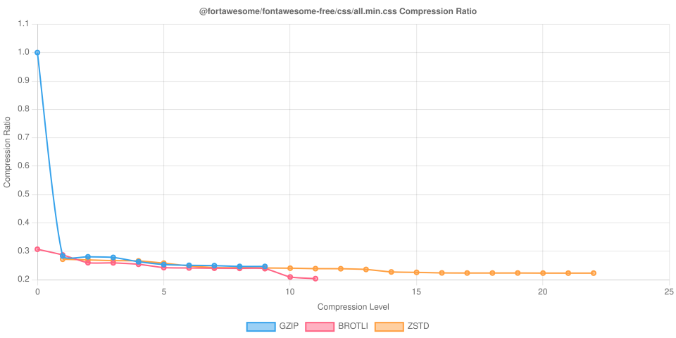

| Algorithm | Level | Time (ms) | Size (bytes) | Compression Ratio | Samples | Median CI (ms) | Precision met |
| --- | ---: | ---: | ---: | ---: | ---: | --- | --- |
| gzip | 0 | 0.058 | 90,364 | 1.0003 | 9 | 0.054–0.062 | no |
| gzip | 1 | 0.704 | 25,642 | 0.2839 | 9 | 0.697–0.723 | yes |
| gzip | 2 | 0.806 | 25,381 | 0.2810 | 9 | 0.804–0.825 | yes |
| gzip | 3 | 0.961 | 25,183 | 0.2788 | 9 | 0.955–0.970 | yes |
| gzip | 4 | 1.098 | 23,806 | 0.2635 | 9 | 1.092–1.108 | yes |
| gzip | 5 | 1.528 | 22,906 | 0.2536 | 9 | 1.517–1.546 | yes |
| gzip | 6 | 2.364 | 22,672 | 0.2510 | 9 | 2.358–2.402 | yes |
| gzip | 7 | 3.179 | 22,565 | 0.2498 | 9 | 3.169–3.196 | yes |
| gzip | 8 | 9.286 | 22,320 | 0.2471 | 9 | 9.272–9.295 | yes |
| gzip | 9 | 9.088 | 22,318 | 0.2471 | 9 | 9.078–9.112 | yes |
| brotli | 0 | 0.197 | 27,781 | 0.3075 | 9 | 0.188–0.252 | no |
| brotli | 1 | 0.375 | 25,973 | 0.2875 | 9 | 0.333–0.415 | no |
| brotli | 2 | 0.729 | 23,497 | 0.2601 | 9 | 0.718–0.751 | yes |
| brotli | 3 | 0.872 | 23,445 | 0.2595 | 9 | 0.859–0.880 | yes |
| brotli | 4 | 1.279 | 23,003 | 0.2546 | 9 | 1.263–1.299 | yes |
| brotli | 5 | 1.910 | 21,939 | 0.2429 | 9 | 1.884–2.072 | no |
| brotli | 6 | 2.151 | 21,822 | 0.2416 | 9 | 2.118–2.210 | yes |
| brotli | 7 | 2.597 | 21,742 | 0.2407 | 9 | 2.578–2.639 | yes |
| brotli | 8 | 3.016 | 21,693 | 0.2401 | 9 | 3.004–3.056 | yes |
| brotli | 9 | 5.054 | 21,604 | 0.2392 | 9 | 5.018–5.097 | yes |
| brotli | 10 | 36.324 | 18,961 | 0.2099 | 9 | 36.160–36.386 | yes |
| brotli | 11 | 106.328 | 18,432 | 0.2040 | 9 | 106.274–106.388 | yes |
| zstd | 1 | 0.222 | 24,608 | 0.2724 | 9 | 0.213–0.278 | no |
| zstd | 2 | 0.241 | 24,387 | 0.2700 | 9 | 0.232–0.298 | no |
| zstd | 3 | 0.285 | 24,157 | 0.2674 | 9 | 0.266–0.346 | no |
| zstd | 4 | 0.303 | 24,076 | 0.2665 | 9 | 0.291–0.394 | no |
| zstd | 5 | 0.771 | 23,365 | 0.2586 | 9 | 0.764–0.806 | yes |
| zstd | 6 | 1.107 | 22,468 | 0.2487 | 9 | 1.102–1.151 | yes |
| zstd | 7 | 1.366 | 21,961 | 0.2431 | 9 | 1.358–1.385 | yes |
| zstd | 8 | 1.585 | 21,892 | 0.2423 | 9 | 1.565–1.600 | yes |
| zstd | 9 | 1.978 | 21,821 | 0.2416 | 9 | 1.974–1.993 | yes |
| zstd | 10 | 2.532 | 21,755 | 0.2408 | 9 | 2.520–2.567 | yes |
| zstd | 11 | 3.688 | 21,610 | 0.2392 | 9 | 3.670–3.727 | yes |
| zstd | 12 | 4.921 | 21,581 | 0.2389 | 9 | 4.919–4.964 | yes |
| zstd | 13 | 5.949 | 21,357 | 0.2364 | 9 | 5.911–6.021 | yes |
| zstd | 14 | 8.317 | 20,565 | 0.2277 | 9 | 8.273–8.355 | yes |
| zstd | 15 | 9.946 | 20,426 | 0.2261 | 9 | 9.915–10.027 | yes |
| zstd | 16 | 13.551 | 20,254 | 0.2242 | 9 | 13.507–13.622 | yes |
| zstd | 17 | 18.210 | 20,220 | 0.2238 | 9 | 18.143–18.272 | yes |
| zstd | 18 | 27.927 | 20,218 | 0.2238 | 9 | 27.878–28.045 | yes |
| zstd | 19 | 27.930 | 20,225 | 0.2239 | 9 | 27.845–28.061 | yes |
| zstd | 20 | 32.716 | 20,194 | 0.2235 | 9 | 32.634–32.779 | yes |
| zstd | 21 | 47.862 | 20,185 | 0.2234 | 9 | 47.830–47.927 | yes |
| zstd | 22 | 55.710 | 20,186 | 0.2235 | 9 | 55.688–55.833 | yes |

<h2 id="bootstrap-dist-css-bootstrap-min-css">bootstrap/dist/css/bootstrap.min.css</h2>

- Original size: 232,111 bytes
- Chart: 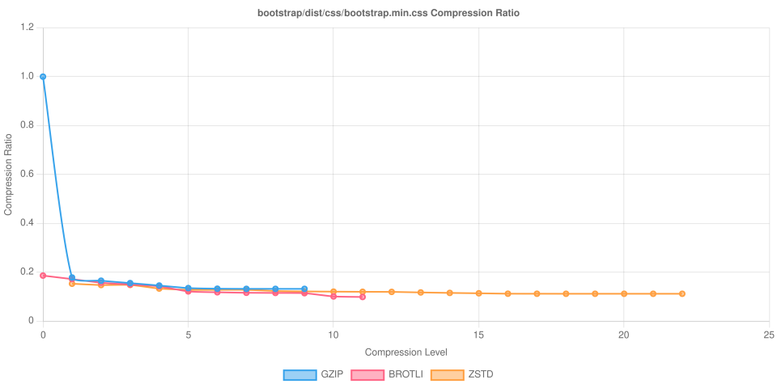

| Algorithm | Level | Time (ms) | Size (bytes) | Compression Ratio | Samples | Median CI (ms) | Precision met |
| --- | ---: | ---: | ---: | ---: | ---: | --- | --- |
| gzip | 0 | 0.138 | 232,164 | 1.0002 | 9 | 0.133–0.148 | no |
| gzip | 1 | 1.188 | 41,452 | 0.1786 | 9 | 1.179–1.200 | yes |
| gzip | 2 | 1.254 | 38,418 | 0.1655 | 9 | 1.249–1.262 | yes |
| gzip | 3 | 1.476 | 36,152 | 0.1558 | 9 | 1.464–1.500 | yes |
| gzip | 4 | 1.745 | 33,830 | 0.1457 | 9 | 1.743–1.760 | yes |
| gzip | 5 | 2.300 | 31,408 | 0.1353 | 9 | 2.282–2.403 | yes |
| gzip | 6 | 3.206 | 30,823 | 0.1328 | 9 | 3.194–3.221 | yes |
| gzip | 7 | 4.000 | 30,680 | 0.1322 | 9 | 3.985–4.029 | yes |
| gzip | 8 | 5.386 | 30,670 | 0.1321 | 9 | 5.365–5.418 | yes |
| gzip | 9 | 5.460 | 30,669 | 0.1321 | 9 | 5.442–5.515 | yes |
| brotli | 0 | 0.326 | 43,268 | 0.1864 | 9 | 0.311–0.419 | no |
| brotli | 1 | 0.637 | 39,941 | 0.1721 | 9 | 0.612–0.665 | yes |
| brotli | 2 | 1.215 | 36,514 | 0.1573 | 9 | 1.210–1.238 | yes |
| brotli | 3 | 1.446 | 34,781 | 0.1498 | 9 | 1.439–1.455 | yes |
| brotli | 4 | 2.109 | 33,048 | 0.1424 | 9 | 2.082–2.133 | yes |
| brotli | 5 | 3.069 | 28,253 | 0.1217 | 9 | 3.053–3.115 | yes |
| brotli | 6 | 3.412 | 27,431 | 0.1182 | 9 | 3.383–3.495 | yes |
| brotli | 7 | 3.801 | 26,971 | 0.1162 | 9 | 3.791–3.821 | yes |
| brotli | 8 | 4.328 | 26,813 | 0.1155 | 9 | 4.324–4.366 | yes |
| brotli | 9 | 6.565 | 26,569 | 0.1145 | 9 | 6.533–6.664 | yes |
| brotli | 10 | 101.017 | 23,482 | 0.1012 | 9 | 100.681–101.450 | yes |
| brotli | 11 | 302.062 | 22,970 | 0.0990 | 9 | 301.811–302.316 | yes |
| zstd | 1 | 0.420 | 35,549 | 0.1532 | 9 | 0.381–0.493 | no |
| zstd | 2 | 0.503 | 34,301 | 0.1478 | 9 | 0.471–0.542 | no |
| zstd | 3 | 0.531 | 34,393 | 0.1482 | 9 | 0.494–0.573 | no |
| zstd | 4 | 1.430 | 30,973 | 0.1334 | 9 | 1.420–1.454 | yes |
| zstd | 5 | 1.697 | 29,744 | 0.1281 | 9 | 1.685–1.712 | yes |
| zstd | 6 | 1.952 | 29,727 | 0.1281 | 9 | 1.945–1.982 | yes |
| zstd | 7 | 2.152 | 29,710 | 0.1280 | 9 | 2.140–2.165 | yes |
| zstd | 8 | 2.699 | 28,645 | 0.1234 | 9 | 2.679–2.724 | yes |
| zstd | 9 | 3.267 | 28,235 | 0.1216 | 9 | 3.253–3.306 | yes |
| zstd | 10 | 3.948 | 28,044 | 0.1208 | 9 | 3.934–3.960 | yes |
| zstd | 11 | 8.117 | 27,895 | 0.1202 | 9 | 8.107–8.156 | yes |
| zstd | 12 | 9.974 | 27,805 | 0.1198 | 9 | 9.937–10.043 | yes |
| zstd | 13 | 18.587 | 27,283 | 0.1175 | 9 | 18.539–18.682 | yes |
| zstd | 14 | 22.469 | 26,828 | 0.1156 | 9 | 22.396–22.562 | yes |
| zstd | 15 | 28.312 | 26,465 | 0.1140 | 9 | 28.273–28.375 | yes |
| zstd | 16 | 47.884 | 26,071 | 0.1123 | 9 | 47.777–48.090 | yes |
| zstd | 17 | 52.819 | 26,041 | 0.1122 | 9 | 52.612–53.022 | yes |
| zstd | 18 | 72.054 | 26,008 | 0.1120 | 9 | 71.974–72.385 | yes |
| zstd | 19 | 80.237 | 26,015 | 0.1121 | 9 | 80.172–80.509 | yes |
| zstd | 20 | 83.368 | 26,014 | 0.1121 | 9 | 83.287–83.547 | yes |
| zstd | 21 | 83.279 | 26,014 | 0.1121 | 9 | 83.195–83.400 | yes |
| zstd | 22 | 83.354 | 26,014 | 0.1121 | 9 | 83.222–83.471 | yes |

<h2 id="world-countries-dist-countries-unescaped-json">world-countries/dist/countries-unescaped.json</h2>

- Original size: 615,946 bytes
- Chart: 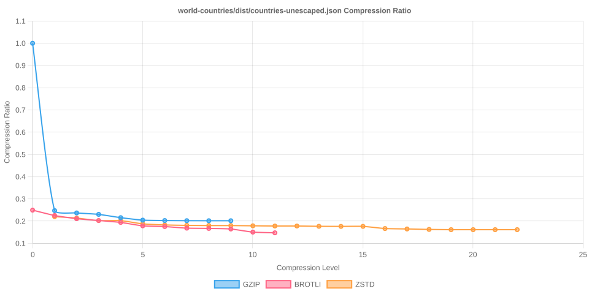

| Algorithm | Level | Time (ms) | Size (bytes) | Compression Ratio | Samples | Median CI (ms) | Precision met |
| --- | ---: | ---: | ---: | ---: | ---: | --- | --- |
| gzip | 0 | 0.347 | 616,054 | 1.0002 | 9 | 0.335–0.357 | yes |
| gzip | 1 | 4.199 | 152,340 | 0.2473 | 9 | 4.189–4.205 | yes |
| gzip | 2 | 4.467 | 145,913 | 0.2369 | 9 | 4.447–4.862 | no |
| gzip | 3 | 5.329 | 141,899 | 0.2304 | 9 | 5.310–5.375 | yes |
| gzip | 4 | 6.047 | 132,790 | 0.2156 | 9 | 6.039–6.062 | yes |
| gzip | 5 | 8.093 | 125,989 | 0.2045 | 9 | 8.081–8.179 | yes |
| gzip | 6 | 10.462 | 124,806 | 0.2026 | 9 | 10.420–10.473 | yes |
| gzip | 7 | 14.300 | 124,380 | 0.2019 | 9 | 14.242–14.314 | yes |
| gzip | 8 | 22.314 | 124,262 | 0.2017 | 9 | 22.275–22.344 | yes |
| gzip | 9 | 22.369 | 124,261 | 0.2017 | 9 | 22.340–22.394 | yes |
| brotli | 0 | 1.588 | 153,668 | 0.2495 | 9 | 1.572–1.596 | yes |
| brotli | 1 | 2.264 | 138,763 | 0.2253 | 9 | 2.263–2.277 | yes |
| brotli | 2 | 4.074 | 129,972 | 0.2110 | 9 | 4.065–4.111 | yes |
| brotli | 3 | 4.774 | 124,918 | 0.2028 | 9 | 4.766–4.799 | yes |
| brotli | 4 | 6.448 | 119,620 | 0.1942 | 9 | 6.420–6.484 | yes |
| brotli | 5 | 9.747 | 110,145 | 0.1788 | 9 | 9.623–9.899 | yes |
| brotli | 6 | 11.107 | 108,159 | 0.1756 | 9 | 11.047–11.419 | yes |
| brotli | 7 | 14.202 | 103,756 | 0.1684 | 9 | 14.182–14.287 | yes |
| brotli | 8 | 16.714 | 102,997 | 0.1672 | 9 | 16.565–16.940 | yes |
| brotli | 9 | 21.853 | 101,406 | 0.1646 | 9 | 21.768–22.349 | yes |
| brotli | 10 | 357.538 | 92,766 | 0.1506 | 9 | 355.918–359.972 | yes |
| brotli | 11 | 957.570 | 90,842 | 0.1475 | 9 | 956.757–960.816 | yes |
| zstd | 1 | 1.667 | 135,634 | 0.2202 | 9 | 1.655–1.711 | yes |
| zstd | 2 | 1.796 | 131,675 | 0.2138 | 9 | 1.789–1.836 | yes |
| zstd | 3 | 1.987 | 124,682 | 0.2024 | 9 | 1.982–2.024 | yes |
| zstd | 4 | 2.260 | 124,515 | 0.2022 | 9 | 2.242–2.278 | yes |
| zstd | 5 | 4.716 | 115,616 | 0.1877 | 9 | 4.658–4.763 | yes |
| zstd | 6 | 6.267 | 112,622 | 0.1828 | 9 | 6.232–6.288 | yes |
| zstd | 7 | 6.857 | 111,386 | 0.1808 | 9 | 6.795–6.874 | yes |
| zstd | 8 | 8.645 | 110,885 | 0.1800 | 9 | 8.619–8.735 | yes |
| zstd | 9 | 8.867 | 110,856 | 0.1800 | 9 | 8.833–8.913 | yes |
| zstd | 10 | 10.586 | 110,262 | 0.1790 | 9 | 10.491–10.692 | yes |
| zstd | 11 | 12.996 | 109,660 | 0.1780 | 9 | 12.964–13.117 | yes |
| zstd | 12 | 12.941 | 109,660 | 0.1780 | 9 | 12.899–13.052 | yes |
| zstd | 13 | 24.057 | 108,855 | 0.1767 | 9 | 23.839–24.135 | yes |
| zstd | 14 | 28.475 | 108,631 | 0.1764 | 9 | 28.150–28.762 | yes |
| zstd | 15 | 31.824 | 108,683 | 0.1764 | 9 | 31.486–32.007 | yes |
| zstd | 16 | 74.337 | 102,692 | 0.1667 | 9 | 73.674–75.001 | yes |
| zstd | 17 | 82.421 | 101,496 | 0.1648 | 9 | 81.536–83.116 | yes |
| zstd | 18 | 124.887 | 100,215 | 0.1627 | 9 | 124.348–125.328 | yes |
| zstd | 19 | 166.908 | 99,575 | 0.1617 | 9 | 166.641–167.019 | yes |
| zstd | 20 | 166.828 | 99,575 | 0.1617 | 9 | 166.673–167.172 | yes |
| zstd | 21 | 166.966 | 99,575 | 0.1617 | 9 | 166.794–167.721 | yes |
| zstd | 22 | 167.485 | 99,575 | 0.1617 | 9 | 166.999–168.134 | yes |

<h2 id="sqlite-org-sqlite-wasm-dist-sqlite3-wasm">@sqlite.org/sqlite-wasm/dist/sqlite3.wasm</h2>

- Original size: 859,730 bytes
- Chart: 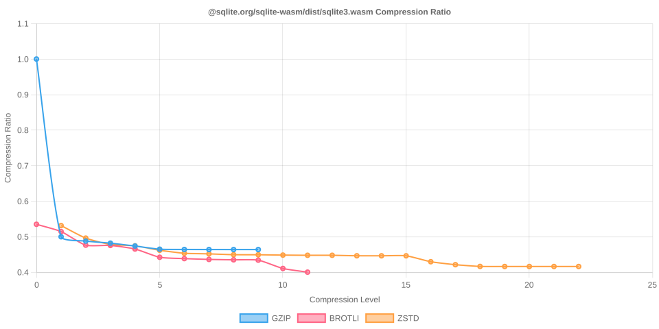

| Algorithm | Level | Time (ms) | Size (bytes) | Compression Ratio | Samples | Median CI (ms) | Precision met |
| --- | ---: | ---: | ---: | ---: | ---: | --- | --- |
| gzip | 0 | 0.476 | 859,878 | 1.0002 | 9 | 0.446–0.519 | no |
| gzip | 1 | 13.609 | 429,925 | 0.5001 | 9 | 13.602–13.644 | yes |
| gzip | 2 | 14.826 | 419,493 | 0.4879 | 9 | 14.822–15.107 | yes |
| gzip | 3 | 17.572 | 414,493 | 0.4821 | 9 | 17.510–17.654 | yes |
| gzip | 4 | 18.347 | 407,503 | 0.4740 | 9 | 18.263–18.488 | yes |
| gzip | 5 | 27.025 | 399,866 | 0.4651 | 9 | 26.959–27.089 | yes |
| gzip | 6 | 32.133 | 399,154 | 0.4643 | 9 | 32.105–32.200 | yes |
| gzip | 7 | 34.259 | 399,020 | 0.4641 | 9 | 34.173–34.617 | yes |
| gzip | 8 | 37.559 | 398,974 | 0.4641 | 9 | 37.538–37.594 | yes |
| gzip | 9 | 37.312 | 398,973 | 0.4641 | 9 | 37.231–37.660 | yes |
| brotli | 0 | 4.099 | 460,125 | 0.5352 | 9 | 4.066–4.109 | yes |
| brotli | 1 | 5.889 | 442,506 | 0.5147 | 9 | 5.657–6.447 | no |
| brotli | 2 | 10.719 | 409,638 | 0.4765 | 9 | 10.678–10.735 | yes |
| brotli | 3 | 12.874 | 408,960 | 0.4757 | 9 | 12.781–13.009 | yes |
| brotli | 4 | 17.650 | 400,331 | 0.4656 | 9 | 17.606–18.132 | yes |
| brotli | 5 | 27.979 | 380,339 | 0.4424 | 9 | 27.900–28.100 | yes |
| brotli | 6 | 32.987 | 377,100 | 0.4386 | 9 | 32.368–33.438 | yes |
| brotli | 7 | 49.245 | 375,149 | 0.4364 | 9 | 48.971–49.560 | yes |
| brotli | 8 | 56.740 | 374,164 | 0.4352 | 9 | 55.751–58.440 | yes |
| brotli | 9 | 68.107 | 373,347 | 0.4343 | 9 | 67.949–68.387 | yes |
| brotli | 10 | 979.653 | 353,246 | 0.4109 | 9 | 976.265–985.457 | yes |
| brotli | 11 | 2089.080 | 344,353 | 0.4005 | 9 | 2085.854–2094.822 | yes |
| zstd | 1 | 3.231 | 457,015 | 0.5316 | 9 | 3.229–3.249 | yes |
| zstd | 2 | 4.094 | 426,694 | 0.4963 | 9 | 4.076–4.131 | yes |
| zstd | 3 | 6.118 | 411,278 | 0.4784 | 9 | 6.097–6.185 | yes |
| zstd | 4 | 6.967 | 408,051 | 0.4746 | 9 | 6.953–7.012 | yes |
| zstd | 5 | 10.741 | 397,246 | 0.4621 | 9 | 10.645–10.817 | yes |
| zstd | 6 | 14.581 | 390,015 | 0.4536 | 9 | 14.454–14.649 | yes |
| zstd | 7 | 15.597 | 388,562 | 0.4520 | 9 | 15.507–15.638 | yes |
| zstd | 8 | 19.226 | 386,566 | 0.4496 | 9 | 19.166–19.280 | yes |
| zstd | 9 | 19.486 | 386,404 | 0.4494 | 9 | 19.463–19.562 | yes |
| zstd | 10 | 22.154 | 385,609 | 0.4485 | 9 | 22.112–22.255 | yes |
| zstd | 11 | 26.724 | 385,152 | 0.4480 | 9 | 26.610–26.908 | yes |
| zstd | 12 | 26.781 | 385,152 | 0.4480 | 9 | 26.660–26.896 | yes |
| zstd | 13 | 53.696 | 383,952 | 0.4466 | 9 | 53.224–55.160 | yes |
| zstd | 14 | 57.264 | 383,886 | 0.4465 | 9 | 55.512–58.881 | yes |
| zstd | 15 | 56.397 | 383,877 | 0.4465 | 9 | 55.868–58.699 | yes |
| zstd | 16 | 96.958 | 369,550 | 0.4298 | 9 | 96.089–97.327 | yes |
| zstd | 17 | 126.680 | 362,382 | 0.4215 | 9 | 123.023–127.787 | yes |
| zstd | 18 | 161.278 | 358,220 | 0.4167 | 9 | 155.693–166.958 | yes |
| zstd | 19 | 194.095 | 358,047 | 0.4165 | 9 | 185.890–214.939 | no |
| zstd | 20 | 192.420 | 358,047 | 0.4165 | 9 | 178.237–195.371 | no |
| zstd | 21 | 179.162 | 358,041 | 0.4165 | 9 | 176.644–181.450 | yes |
| zstd | 22 | 186.363 | 358,041 | 0.4165 | 9 | 184.646–186.665 | yes |

<h2 id="tailwindcss-theme-css">tailwindcss/theme.css</h2>

- Original size: 19,586 bytes
- Chart: 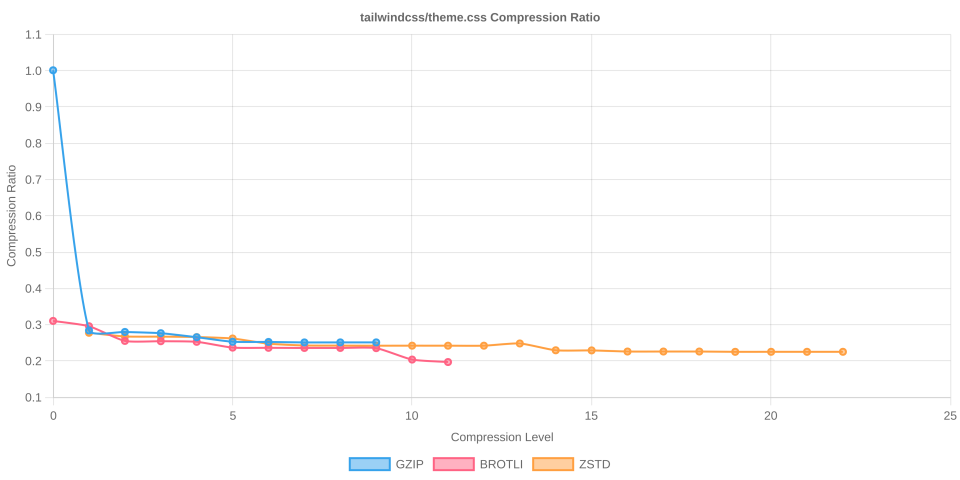

| Algorithm | Level | Time (ms) | Size (bytes) | Compression Ratio | Samples | Median CI (ms) | Precision met |
| --- | ---: | ---: | ---: | ---: | ---: | --- | --- |
| gzip | 0 | 0.019 | 19,609 | 1.0012 | 9 | 0.017–0.020 | no |
| gzip | 1 | 0.108 | 5,565 | 0.2841 | 9 | 0.085–0.151 | no |
| gzip | 2 | 0.106 | 5,486 | 0.2801 | 9 | 0.090–0.151 | no |
| gzip | 3 | 0.118 | 5,419 | 0.2767 | 9 | 0.099–0.176 | no |
| gzip | 4 | 0.156 | 5,202 | 0.2656 | 9 | 0.132–0.246 | no |
| gzip | 5 | 0.252 | 4,958 | 0.2531 | 9 | 0.222–0.307 | no |
| gzip | 6 | 0.341 | 4,947 | 0.2526 | 9 | 0.307–0.370 | no |
| gzip | 7 | 0.502 | 4,921 | 0.2513 | 9 | 0.480–0.523 | yes |
| gzip | 8 | 0.689 | 4,923 | 0.2514 | 9 | 0.668–0.712 | yes |
| gzip | 9 | 0.693 | 4,923 | 0.2514 | 9 | 0.671–0.856 | no |
| brotli | 0 | 0.058 | 6,082 | 0.3105 | 9 | 0.056–0.077 | no |
| brotli | 1 | 0.077 | 5,794 | 0.2958 | 9 | 0.075–0.089 | no |
| brotli | 2 | 0.110 | 5,002 | 0.2554 | 9 | 0.103–0.159 | no |
| brotli | 3 | 0.155 | 4,986 | 0.2546 | 9 | 0.131–0.178 | no |
| brotli | 4 | 0.237 | 4,954 | 0.2529 | 9 | 0.208–0.312 | no |
| brotli | 5 | 0.433 | 4,641 | 0.2370 | 9 | 0.395–0.540 | no |
| brotli | 6 | 0.461 | 4,630 | 0.2364 | 9 | 0.433–0.524 | no |
| brotli | 7 | 0.597 | 4,622 | 0.2360 | 9 | 0.565–0.617 | no |
| brotli | 8 | 0.633 | 4,623 | 0.2360 | 9 | 0.621–0.669 | no |
| brotli | 9 | 0.751 | 4,612 | 0.2355 | 9 | 0.737–0.780 | yes |
| brotli | 10 | 7.579 | 3,996 | 0.2040 | 9 | 7.552–7.600 | yes |
| brotli | 11 | 22.576 | 3,863 | 0.1972 | 9 | 22.441–22.670 | yes |
| zstd | 1 | 0.056 | 5,441 | 0.2778 | 9 | 0.052–0.099 | no |
| zstd | 2 | 0.059 | 5,242 | 0.2676 | 9 | 0.057–0.078 | no |
| zstd | 3 | 0.070 | 5,234 | 0.2672 | 9 | 0.068–0.083 | no |
| zstd | 4 | 0.072 | 5,212 | 0.2661 | 9 | 0.072–0.084 | no |
| zstd | 5 | 0.139 | 5,133 | 0.2621 | 9 | 0.137–0.181 | no |
| zstd | 6 | 0.192 | 4,853 | 0.2478 | 9 | 0.181–0.229 | no |
| zstd | 7 | 0.223 | 4,757 | 0.2429 | 9 | 0.213–0.281 | no |
| zstd | 8 | 0.254 | 4,750 | 0.2425 | 9 | 0.241–0.305 | no |
| zstd | 9 | 0.338 | 4,744 | 0.2422 | 9 | 0.324–0.377 | no |
| zstd | 10 | 0.428 | 4,746 | 0.2423 | 9 | 0.419–0.477 | no |
| zstd | 11 | 0.607 | 4,745 | 0.2423 | 9 | 0.590–0.624 | yes |
| zstd | 12 | 0.653 | 4,745 | 0.2423 | 9 | 0.639–0.678 | yes |
| zstd | 13 | 0.968 | 4,865 | 0.2484 | 9 | 0.961–0.994 | yes |
| zstd | 14 | 1.754 | 4,497 | 0.2296 | 9 | 1.729–1.780 | yes |
| zstd | 15 | 1.839 | 4,490 | 0.2292 | 9 | 1.835–1.858 | yes |
| zstd | 16 | 2.552 | 4,430 | 0.2262 | 9 | 2.540–2.560 | yes |
| zstd | 17 | 2.548 | 4,430 | 0.2262 | 9 | 2.543–2.557 | yes |
| zstd | 18 | 2.558 | 4,430 | 0.2262 | 9 | 2.540–2.565 | yes |
| zstd | 19 | 5.006 | 4,414 | 0.2254 | 9 | 4.995–5.027 | yes |
| zstd | 20 | 5.053 | 4,415 | 0.2254 | 9 | 5.047–5.090 | yes |
| zstd | 21 | 5.055 | 4,415 | 0.2254 | 9 | 5.042–5.091 | yes |
| zstd | 22 | 5.440 | 4,415 | 0.2254 | 9 | 5.075–5.468 | no |
