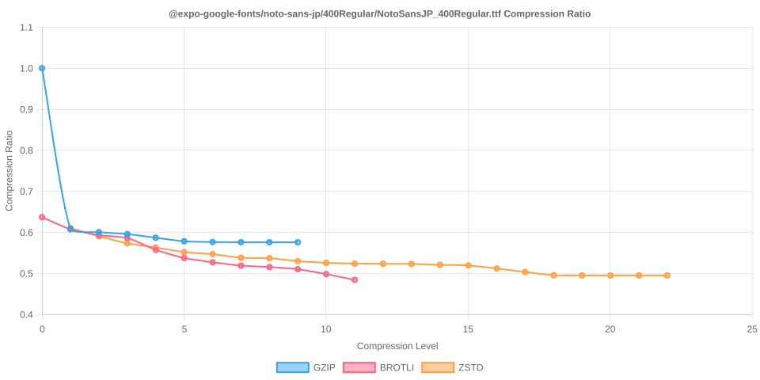
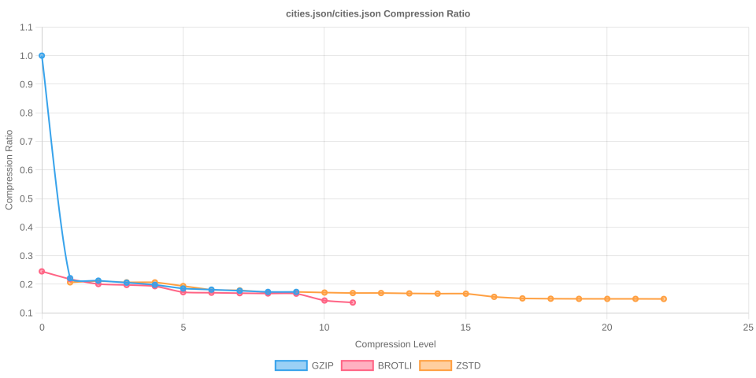

# Node Compression Benchmark

Last updated: 2026-09-27T21:15:03.800Z

This benchmark measures compression time, output size, and compression ratios for several popular npm packages across all gzip, Brotli, and Zstandard compression levels.

## Table of Contents

- [jquery/dist/jquery.min.js](#jquery-dist-jquery-min-js)
- [@expo-google-fonts/noto-sans-jp/400Regular/NotoSansJP_400Regular.ttf](#expo-google-fonts-noto-sans-jp-400regular-notosansjp-400regular-ttf)
- [@openfonts/m-plus-1p_japanese/m-plus-1p-japanese-400.woff2](#openfonts-m-plus-1p-japanese-m-plus-1p-japanese-400-woff2)
- [@codemirror/view/dist/index.js](#codemirror-view-dist-index-js)
- [react/cjs/react.production.js](#react-cjs-react-production-js)
- [dayjs/dayjs.min.js](#dayjs-dayjs-min-js)
- [vue/dist/vue.global.prod.js](#vue-dist-vue-global-prod-js)
- [lodash/lodash.min.js](#lodash-lodash-min-js)
- [@fortawesome/fontawesome-free/css/all.min.css](#fortawesome-fontawesome-free-css-all-min-css)
- [bootstrap/dist/css/bootstrap.min.css](#bootstrap-dist-css-bootstrap-min-css)
- [cities.json/cities.json](#cities-json-cities-json)
- [@sqlite.org/sqlite-wasm/dist/sqlite3.wasm](#sqlite-org-sqlite-wasm-dist-sqlite3-wasm)
- [tailwindcss/theme.css](#tailwindcss-theme-css)

Benchmark settings:

- Warmup runs per level: 1
- Minimum samples per level: 5
- Maximum samples per level: 25
- Target relative half-width (median-based robust estimate): 0.0500

<h2 id="jquery-dist-jquery-min-js">jquery/dist/jquery.min.js</h2>

- Original size: 78,748 bytes
- Chart: 

| Algorithm | Level | Time (ms) | Size (bytes) | Compression Ratio | Samples | Converged |
| --- | ---: | ---: | ---: | ---: | ---: | --- |
| gzip | 1 | 0.879 | 31,033 | 0.3941 | 5 | yes |
| gzip | 2 | 0.949 | 30,134 | 0.3827 | 5 | yes |
| gzip | 3 | 1.007 | 29,671 | 0.3768 | 5 | yes |
| gzip | 4 | 1.110 | 28,457 | 0.3614 | 5 | yes |
| gzip | 5 | 1.439 | 27,721 | 0.3520 | 5 | yes |
| gzip | 6 | 1.703 | 27,584 | 0.3503 | 5 | yes |
| gzip | 7 | 1.850 | 27,547 | 0.3498 | 5 | yes |
| gzip | 8 | 2.055 | 27,530 | 0.3496 | 5 | yes |
| gzip | 9 | 2.079 | 27,530 | 0.3496 | 5 | yes |
| brotli | 0 | 0.301 | 33,111 | 0.4205 | 23 | yes |
| brotli | 1 | 0.520 | 31,803 | 0.4039 | 5 | yes |
| brotli | 2 | 0.733 | 29,394 | 0.3733 | 5 | yes |
| brotli | 3 | 1.228 | 29,072 | 0.3692 | 14 | yes |
| brotli | 4 | 1.874 | 28,392 | 0.3605 | 5 | yes |
| brotli | 5 | 2.870 | 27,013 | 0.3430 | 5 | yes |
| brotli | 6 | 2.968 | 26,844 | 0.3409 | 7 | yes |
| brotli | 7 | 4.524 | 26,773 | 0.3400 | 8 | yes |
| brotli | 8 | 3.458 | 26,725 | 0.3394 | 6 | yes |
| brotli | 9 | 3.971 | 26,711 | 0.3392 | 9 | yes |
| brotli | 10 | 29.438 | 25,340 | 0.3218 | 5 | yes |
| brotli | 11 | 84.784 | 24,992 | 0.3174 | 5 | yes |
| zstd | 1 | 0.233 | 31,062 | 0.3944 | 25 | no |
| zstd | 2 | 0.256 | 30,069 | 0.3818 | 23 | yes |
| zstd | 3 | 0.318 | 29,214 | 0.3710 | 5 | yes |
| zstd | 4 | 0.392 | 29,108 | 0.3696 | 8 | yes |
| zstd | 5 | 0.778 | 28,349 | 0.3600 | 5 | yes |
| zstd | 6 | 0.994 | 27,592 | 0.3504 | 5 | yes |
| zstd | 7 | 1.251 | 27,383 | 0.3477 | 5 | yes |
| zstd | 8 | 1.312 | 27,237 | 0.3459 | 5 | yes |
| zstd | 9 | 1.508 | 27,118 | 0.3444 | 5 | yes |
| zstd | 10 | 1.645 | 27,062 | 0.3437 | 5 | yes |
| zstd | 11 | 3.254 | 26,969 | 0.3425 | 5 | yes |
| zstd | 12 | 3.388 | 26,970 | 0.3425 | 5 | yes |
| zstd | 13 | 4.933 | 26,867 | 0.3412 | 5 | yes |
| zstd | 14 | 6.605 | 26,432 | 0.3357 | 5 | yes |
| zstd | 15 | 6.693 | 26,420 | 0.3355 | 5 | yes |
| zstd | 16 | 8.647 | 26,336 | 0.3344 | 9 | yes |
| zstd | 17 | 8.617 | 26,336 | 0.3344 | 5 | yes |
| zstd | 18 | 8.525 | 26,336 | 0.3344 | 5 | yes |
| zstd | 19 | 16.685 | 26,282 | 0.3337 | 5 | yes |
| zstd | 20 | 16.731 | 26,282 | 0.3337 | 5 | yes |
| zstd | 21 | 16.739 | 26,282 | 0.3337 | 5 | yes |
| zstd | 22 | 16.685 | 26,282 | 0.3337 | 5 | yes |

<h2 id="expo-google-fonts-noto-sans-jp-400regular-notosansjp-400regular-ttf">@expo-google-fonts/noto-sans-jp/400Regular/NotoSansJP_400Regular.ttf</h2>

- Original size: 5,472,784 bytes
- Chart: 

| Algorithm | Level | Time (ms) | Size (bytes) | Compression Ratio | Samples | Converged |
| --- | ---: | ---: | ---: | ---: | ---: | --- |
| gzip | 1 | 80.042 | 3,332,519 | 0.6089 | 5 | yes |
| gzip | 2 | 82.781 | 3,287,937 | 0.6008 | 5 | yes |
| gzip | 3 | 88.847 | 3,262,028 | 0.5960 | 5 | yes |
| gzip | 4 | 94.903 | 3,213,095 | 0.5871 | 5 | yes |
| gzip | 5 | 111.299 | 3,166,204 | 0.5785 | 5 | yes |
| gzip | 6 | 124.771 | 3,156,147 | 0.5767 | 5 | yes |
| gzip | 7 | 134.098 | 3,154,131 | 0.5763 | 5 | yes |
| gzip | 8 | 149.328 | 3,153,066 | 0.5761 | 5 | yes |
| gzip | 9 | 160.820 | 3,153,021 | 0.5761 | 5 | yes |
| brotli | 0 | 17.723 | 3,488,111 | 0.6374 | 5 | yes |
| brotli | 1 | 21.916 | 3,325,102 | 0.6076 | 5 | yes |
| brotli | 2 | 40.498 | 3,247,965 | 0.5935 | 5 | yes |
| brotli | 3 | 51.406 | 3,210,322 | 0.5866 | 5 | yes |
| brotli | 4 | 81.125 | 3,052,068 | 0.5577 | 5 | yes |
| brotli | 5 | 105.855 | 2,942,981 | 0.5377 | 5 | yes |
| brotli | 6 | 128.795 | 2,886,204 | 0.5274 | 5 | yes |
| brotli | 7 | 437.684 | 2,841,359 | 0.5192 | 5 | yes |
| brotli | 8 | 552.924 | 2,823,303 | 0.5159 | 5 | yes |
| brotli | 9 | 701.584 | 2,793,428 | 0.5104 | 5 | yes |
| brotli | 10 | 5466.318 | 2,728,891 | 0.4986 | 5 | yes |
| brotli | 11 | 11229.653 | 2,651,692 | 0.4845 | 5 | yes |
| zstd | 1 | 15.617 | 3,342,771 | 0.6108 | 5 | yes |
| zstd | 2 | 18.809 | 3,233,695 | 0.5909 | 5 | yes |
| zstd | 3 | 27.104 | 3,139,155 | 0.5736 | 5 | yes |
| zstd | 4 | 41.179 | 3,084,237 | 0.5636 | 5 | yes |
| zstd | 5 | 53.631 | 3,021,906 | 0.5522 | 5 | yes |
| zstd | 6 | 64.493 | 2,994,480 | 0.5472 | 5 | yes |
| zstd | 7 | 73.203 | 2,946,701 | 0.5384 | 5 | yes |
| zstd | 8 | 83.160 | 2,941,269 | 0.5374 | 5 | yes |
| zstd | 9 | 81.496 | 2,901,056 | 0.5301 | 5 | yes |
| zstd | 10 | 96.732 | 2,879,072 | 0.5261 | 5 | yes |
| zstd | 11 | 131.512 | 2,868,731 | 0.5242 | 5 | yes |
| zstd | 12 | 136.513 | 2,866,083 | 0.5237 | 5 | yes |
| zstd | 13 | 293.578 | 2,864,062 | 0.5233 | 5 | yes |
| zstd | 14 | 363.512 | 2,852,038 | 0.5211 | 5 | yes |
| zstd | 15 | 445.380 | 2,844,247 | 0.5197 | 5 | yes |
| zstd | 16 | 567.975 | 2,803,911 | 0.5123 | 5 | yes |
| zstd | 17 | 742.534 | 2,756,112 | 0.5036 | 5 | yes |
| zstd | 18 | 965.091 | 2,713,297 | 0.4958 | 5 | yes |
| zstd | 19 | 1048.433 | 2,710,797 | 0.4953 | 5 | yes |
| zstd | 20 | 1077.967 | 2,710,797 | 0.4953 | 5 | yes |
| zstd | 21 | 1099.511 | 2,710,761 | 0.4953 | 5 | yes |
| zstd | 22 | 1095.469 | 2,710,761 | 0.4953 | 5 | yes |

<h2 id="openfonts-m-plus-1p-japanese-m-plus-1p-japanese-400-woff2">@openfonts/m-plus-1p_japanese/m-plus-1p-japanese-400.woff2</h2>

- Original size: 598,576 bytes
- Chart: 

| Algorithm | Level | Time (ms) | Size (bytes) | Compression Ratio | Samples | Converged |
| --- | ---: | ---: | ---: | ---: | ---: | --- |
| gzip | 1 | 10.575 | 596,192 | 0.9960 | 5 | yes |
| gzip | 2 | 10.566 | 596,183 | 0.9960 | 5 | yes |
| gzip | 3 | 10.552 | 596,173 | 0.9960 | 5 | yes |
| gzip | 4 | 10.963 | 596,171 | 0.9960 | 5 | yes |
| gzip | 5 | 10.940 | 596,154 | 0.9960 | 5 | yes |
| gzip | 6 | 10.991 | 596,154 | 0.9960 | 5 | yes |
| gzip | 7 | 10.969 | 596,154 | 0.9960 | 5 | yes |
| gzip | 8 | 10.937 | 596,154 | 0.9960 | 5 | yes |
| gzip | 9 | 11.004 | 596,154 | 0.9960 | 5 | yes |
| brotli | 0 | 0.236 | 596,751 | 0.9970 | 19 | yes |
| brotli | 1 | 0.253 | 598,581 | 1.0000 | 5 | yes |
| brotli | 2 | 0.543 | 598,587 | 1.0000 | 6 | yes |
| brotli | 3 | 0.647 | 598,559 | 1.0000 | 6 | yes |
| brotli | 4 | 0.718 | 598,581 | 1.0000 | 5 | yes |
| brotli | 5 | 1.516 | 598,581 | 1.0000 | 9 | yes |
| brotli | 6 | 1.637 | 598,581 | 1.0000 | 25 | no |
| brotli | 7 | 1.862 | 598,581 | 1.0000 | 5 | yes |
| brotli | 8 | 1.907 | 598,581 | 1.0000 | 9 | yes |
| brotli | 9 | 4.175 | 598,581 | 1.0000 | 7 | yes |
| brotli | 10 | 93.463 | 598,581 | 1.0000 | 5 | yes |
| brotli | 11 | 216.508 | 598,581 | 1.0000 | 5 | yes |
| zstd | 1 | 0.314 | 598,601 | 1.0000 | 5 | yes |
| zstd | 2 | 0.305 | 598,600 | 1.0000 | 18 | yes |
| zstd | 3 | 0.423 | 598,600 | 1.0000 | 25 | no |
| zstd | 4 | 0.417 | 598,600 | 1.0000 | 5 | yes |
| zstd | 5 | 0.472 | 598,600 | 1.0000 | 5 | yes |
| zstd | 6 | 0.500 | 598,600 | 1.0000 | 6 | yes |
| zstd | 7 | 0.559 | 598,600 | 1.0000 | 5 | yes |
| zstd | 8 | 0.568 | 598,600 | 1.0000 | 5 | yes |
| zstd | 9 | 0.731 | 598,600 | 1.0000 | 5 | yes |
| zstd | 10 | 0.733 | 598,600 | 1.0000 | 5 | yes |
| zstd | 11 | 0.848 | 598,600 | 1.0000 | 6 | yes |
| zstd | 12 | 0.820 | 598,600 | 1.0000 | 5 | yes |
| zstd | 13 | 2.611 | 595,998 | 0.9957 | 5 | yes |
| zstd | 14 | 2.560 | 595,998 | 0.9957 | 5 | yes |
| zstd | 15 | 2.593 | 595,998 | 0.9957 | 5 | yes |
| zstd | 16 | 13.606 | 595,898 | 0.9955 | 5 | yes |
| zstd | 17 | 13.689 | 595,889 | 0.9955 | 5 | yes |
| zstd | 18 | 18.151 | 595,891 | 0.9955 | 5 | yes |
| zstd | 19 | 21.947 | 595,894 | 0.9955 | 5 | yes |
| zstd | 20 | 21.875 | 595,894 | 0.9955 | 5 | yes |
| zstd | 21 | 21.953 | 595,894 | 0.9955 | 5 | yes |
| zstd | 22 | 21.917 | 595,894 | 0.9955 | 5 | yes |

<h2 id="codemirror-view-dist-index-js">@codemirror/view/dist/index.js</h2>

- Original size: 493,290 bytes
- Chart: 

| Algorithm | Level | Time (ms) | Size (bytes) | Compression Ratio | Samples | Converged |
| --- | ---: | ---: | ---: | ---: | ---: | --- |
| gzip | 1 | 3.785 | 146,149 | 0.2963 | 5 | yes |
| gzip | 2 | 4.140 | 139,274 | 0.2823 | 5 | yes |
| gzip | 3 | 5.058 | 134,733 | 0.2731 | 5 | yes |
| gzip | 4 | 5.224 | 126,385 | 0.2562 | 5 | yes |
| gzip | 5 | 7.427 | 121,702 | 0.2467 | 5 | yes |
| gzip | 6 | 10.614 | 119,973 | 0.2432 | 5 | yes |
| gzip | 7 | 13.336 | 119,497 | 0.2422 | 5 | yes |
| gzip | 8 | 27.494 | 119,223 | 0.2417 | 5 | yes |
| gzip | 9 | 42.227 | 119,156 | 0.2416 | 5 | yes |
| brotli | 0 | 1.387 | 150,465 | 0.3050 | 5 | yes |
| brotli | 1 | 1.809 | 138,172 | 0.2801 | 5 | yes |
| brotli | 2 | 3.344 | 129,999 | 0.2635 | 5 | yes |
| brotli | 3 | 3.806 | 127,405 | 0.2583 | 5 | yes |
| brotli | 4 | 5.054 | 123,107 | 0.2496 | 5 | yes |
| brotli | 5 | 8.043 | 113,382 | 0.2298 | 5 | yes |
| brotli | 6 | 9.289 | 110,700 | 0.2244 | 5 | yes |
| brotli | 7 | 11.318 | 108,697 | 0.2204 | 5 | yes |
| brotli | 8 | 13.189 | 107,649 | 0.2182 | 5 | yes |
| brotli | 9 | 20.184 | 106,735 | 0.2164 | 5 | yes |
| brotli | 10 | 246.140 | 99,238 | 0.2012 | 5 | yes |
| brotli | 11 | 633.918 | 97,146 | 0.1969 | 5 | yes |
| zstd | 1 | 1.467 | 138,911 | 0.2816 | 5 | yes |
| zstd | 2 | 1.571 | 134,725 | 0.2731 | 5 | yes |
| zstd | 3 | 1.690 | 126,980 | 0.2574 | 5 | yes |
| zstd | 4 | 1.902 | 126,776 | 0.2570 | 5 | yes |
| zstd | 5 | 3.594 | 118,141 | 0.2395 | 5 | yes |
| zstd | 6 | 4.976 | 114,119 | 0.2313 | 5 | yes |
| zstd | 7 | 5.743 | 112,542 | 0.2281 | 5 | yes |
| zstd | 8 | 7.335 | 111,701 | 0.2264 | 5 | yes |
| zstd | 9 | 7.349 | 111,701 | 0.2264 | 5 | yes |
| zstd | 10 | 8.548 | 110,666 | 0.2243 | 5 | yes |
| zstd | 11 | 10.376 | 110,040 | 0.2231 | 5 | yes |
| zstd | 12 | 10.506 | 110,040 | 0.2231 | 5 | yes |
| zstd | 13 | 25.390 | 108,868 | 0.2207 | 5 | yes |
| zstd | 14 | 30.715 | 108,312 | 0.2196 | 5 | yes |
| zstd | 15 | 34.358 | 108,238 | 0.2194 | 5 | yes |
| zstd | 16 | 57.868 | 102,642 | 0.2081 | 5 | yes |
| zstd | 17 | 64.340 | 101,748 | 0.2063 | 5 | yes |
| zstd | 18 | 90.353 | 100,901 | 0.2045 | 5 | yes |
| zstd | 19 | 115.961 | 100,801 | 0.2043 | 6 | yes |
| zstd | 20 | 115.229 | 100,801 | 0.2043 | 5 | yes |
| zstd | 21 | 115.339 | 100,801 | 0.2043 | 5 | yes |
| zstd | 22 | 115.539 | 100,801 | 0.2043 | 5 | yes |

<h2 id="react-cjs-react-production-js">react/cjs/react.production.js</h2>

- Original size: 18,040 bytes
- Chart: 

| Algorithm | Level | Time (ms) | Size (bytes) | Compression Ratio | Samples | Converged |
| --- | ---: | ---: | ---: | ---: | ---: | --- |
| gzip | 1 | 0.109 | 5,189 | 0.2876 | 25 | no |
| gzip | 2 | 0.133 | 5,069 | 0.2810 | 5 | yes |
| gzip | 3 | 0.133 | 5,002 | 0.2773 | 13 | yes |
| gzip | 4 | 0.165 | 4,715 | 0.2614 | 5 | yes |
| gzip | 5 | 0.222 | 4,618 | 0.2560 | 5 | yes |
| gzip | 6 | 0.259 | 4,607 | 0.2554 | 5 | yes |
| gzip | 7 | 0.304 | 4,600 | 0.2550 | 5 | yes |
| gzip | 8 | 0.406 | 4,598 | 0.2549 | 5 | yes |
| gzip | 9 | 0.416 | 4,598 | 0.2549 | 5 | yes |
| brotli | 0 | 0.042 | 5,483 | 0.3039 | 19 | yes |
| brotli | 1 | 0.061 | 5,356 | 0.2969 | 24 | yes |
| brotli | 2 | 0.103 | 4,956 | 0.2747 | 13 | yes |
| brotli | 3 | 0.143 | 4,866 | 0.2697 | 7 | yes |
| brotli | 4 | 0.226 | 4,752 | 0.2634 | 5 | yes |
| brotli | 5 | 0.323 | 4,451 | 0.2467 | 5 | yes |
| brotli | 6 | 0.339 | 4,446 | 0.2465 | 5 | yes |
| brotli | 7 | 0.381 | 4,432 | 0.2457 | 5 | yes |
| brotli | 8 | 0.398 | 4,424 | 0.2452 | 5 | yes |
| brotli | 9 | 1.982 | 4,416 | 0.2448 | 18 | yes |
| brotli | 10 | 6.827 | 4,142 | 0.2296 | 5 | yes |
| brotli | 11 | 17.324 | 4,027 | 0.2232 | 5 | yes |
| zstd | 1 | 0.041 | 5,115 | 0.2835 | 18 | yes |
| zstd | 2 | 0.047 | 5,057 | 0.2803 | 8 | yes |
| zstd | 3 | 0.054 | 4,922 | 0.2728 | 10 | yes |
| zstd | 4 | 0.055 | 4,885 | 0.2708 | 13 | yes |
| zstd | 5 | 0.116 | 4,708 | 0.2610 | 24 | yes |
| zstd | 6 | 0.171 | 4,620 | 0.2561 | 6 | yes |
| zstd | 7 | 0.232 | 4,618 | 0.2560 | 5 | yes |
| zstd | 8 | 0.241 | 4,600 | 0.2550 | 5 | yes |
| zstd | 9 | 0.278 | 4,592 | 0.2545 | 5 | yes |
| zstd | 10 | 0.302 | 4,584 | 0.2541 | 5 | yes |
| zstd | 11 | 0.628 | 4,562 | 0.2529 | 5 | yes |
| zstd | 12 | 0.673 | 4,561 | 0.2528 | 5 | yes |
| zstd | 13 | 0.900 | 4,554 | 0.2524 | 5 | yes |
| zstd | 14 | 1.317 | 4,473 | 0.2479 | 5 | yes |
| zstd | 15 | 1.386 | 4,468 | 0.2477 | 5 | yes |
| zstd | 16 | 1.995 | 4,450 | 0.2467 | 5 | yes |
| zstd | 17 | 2.085 | 4,450 | 0.2467 | 5 | yes |
| zstd | 18 | 2.096 | 4,450 | 0.2467 | 5 | yes |
| zstd | 19 | 4.121 | 4,435 | 0.2458 | 10 | yes |
| zstd | 20 | 4.100 | 4,435 | 0.2458 | 5 | yes |
| zstd | 21 | 4.911 | 4,435 | 0.2458 | 6 | yes |
| zstd | 22 | 4.099 | 4,435 | 0.2458 | 8 | yes |

<h2 id="dayjs-dayjs-min-js">dayjs/dayjs.min.js</h2>

- Original size: 7,161 bytes
- Chart: 

| Algorithm | Level | Time (ms) | Size (bytes) | Compression Ratio | Samples | Converged |
| --- | ---: | ---: | ---: | ---: | ---: | --- |
| gzip | 1 | 0.048 | 3,220 | 0.4497 | 25 | no |
| gzip | 2 | 0.047 | 3,182 | 0.4444 | 25 | no |
| gzip | 3 | 0.046 | 3,153 | 0.4403 | 25 | no |
| gzip | 4 | 0.060 | 3,095 | 0.4322 | 25 | no |
| gzip | 5 | 0.088 | 3,051 | 0.4261 | 25 | no |
| gzip | 6 | 0.083 | 3,044 | 0.4251 | 25 | no |
| gzip | 7 | 0.100 | 3,042 | 0.4248 | 25 | no |
| gzip | 8 | 0.093 | 3,042 | 0.4248 | 19 | yes |
| gzip | 9 | 0.089 | 3,042 | 0.4248 | 9 | yes |
| brotli | 0 | 0.023 | 3,549 | 0.4956 | 9 | yes |
| brotli | 1 | 0.033 | 3,381 | 0.4721 | 23 | yes |
| brotli | 2 | 0.046 | 3,263 | 0.4557 | 25 | no |
| brotli | 3 | 0.058 | 3,216 | 0.4491 | 25 | no |
| brotli | 4 | 0.126 | 3,147 | 0.4395 | 10 | yes |
| brotli | 5 | 0.171 | 2,963 | 0.4138 | 23 | yes |
| brotli | 6 | 0.187 | 2,952 | 0.4122 | 5 | yes |
| brotli | 7 | 0.207 | 2,944 | 0.4111 | 11 | yes |
| brotli | 8 | 0.215 | 2,944 | 0.4111 | 6 | yes |
| brotli | 9 | 1.744 | 2,945 | 0.4113 | 8 | yes |
| brotli | 10 | 2.729 | 2,814 | 0.3930 | 5 | yes |
| brotli | 11 | 6.950 | 2,772 | 0.3871 | 5 | yes |
| zstd | 1 | 0.025 | 3,254 | 0.4544 | 25 | no |
| zstd | 2 | 0.026 | 3,200 | 0.4469 | 18 | yes |
| zstd | 3 | 0.031 | 3,176 | 0.4435 | 17 | yes |
| zstd | 4 | 0.050 | 3,102 | 0.4332 | 25 | no |
| zstd | 5 | 0.076 | 3,079 | 0.4300 | 6 | yes |
| zstd | 6 | 0.071 | 3,060 | 0.4273 | 16 | yes |
| zstd | 7 | 0.087 | 3,053 | 0.4263 | 9 | yes |
| zstd | 8 | 0.079 | 3,053 | 0.4263 | 16 | yes |
| zstd | 9 | 0.157 | 3,055 | 0.4266 | 9 | yes |
| zstd | 10 | 0.157 | 3,055 | 0.4266 | 6 | yes |
| zstd | 11 | 0.291 | 3,044 | 0.4251 | 5 | yes |
| zstd | 12 | 0.406 | 3,011 | 0.4205 | 5 | yes |
| zstd | 13 | 0.522 | 2,998 | 0.4187 | 5 | yes |
| zstd | 14 | 0.527 | 2,998 | 0.4187 | 5 | yes |
| zstd | 15 | 0.522 | 2,998 | 0.4187 | 5 | yes |
| zstd | 16 | 1.011 | 2,992 | 0.4178 | 5 | yes |
| zstd | 17 | 1.017 | 2,992 | 0.4178 | 5 | yes |
| zstd | 18 | 0.992 | 2,992 | 0.4178 | 5 | yes |
| zstd | 19 | 1.009 | 2,992 | 0.4178 | 5 | yes |
| zstd | 20 | 0.981 | 2,992 | 0.4178 | 5 | yes |
| zstd | 21 | 0.995 | 2,992 | 0.4178 | 5 | yes |
| zstd | 22 | 1.008 | 2,992 | 0.4178 | 5 | yes |

<h2 id="vue-dist-vue-global-prod-js">vue/dist/vue.global.prod.js</h2>

- Original size: 168,331 bytes
- Chart: 

| Algorithm | Level | Time (ms) | Size (bytes) | Compression Ratio | Samples | Converged |
| --- | ---: | ---: | ---: | ---: | ---: | --- |
| gzip | 1 | 1.853 | 68,573 | 0.4074 | 5 | yes |
| gzip | 2 | 2.010 | 66,933 | 0.3976 | 5 | yes |
| gzip | 3 | 2.195 | 65,843 | 0.3912 | 5 | yes |
| gzip | 4 | 2.405 | 63,425 | 0.3768 | 5 | yes |
| gzip | 5 | 3.302 | 61,773 | 0.3670 | 5 | yes |
| gzip | 6 | 4.048 | 61,499 | 0.3653 | 5 | yes |
| gzip | 7 | 4.422 | 61,455 | 0.3651 | 5 | yes |
| gzip | 8 | 4.746 | 61,439 | 0.3650 | 5 | yes |
| gzip | 9 | 4.739 | 61,439 | 0.3650 | 5 | yes |
| brotli | 0 | 0.582 | 72,913 | 0.4332 | 5 | yes |
| brotli | 1 | 0.757 | 69,920 | 0.4154 | 5 | yes |
| brotli | 2 | 1.523 | 64,516 | 0.3833 | 5 | yes |
| brotli | 3 | 1.810 | 63,895 | 0.3796 | 5 | yes |
| brotli | 4 | 2.459 | 62,764 | 0.3729 | 5 | yes |
| brotli | 5 | 3.697 | 59,301 | 0.3523 | 5 | yes |
| brotli | 6 | 4.120 | 58,889 | 0.3498 | 5 | yes |
| brotli | 7 | 5.096 | 58,648 | 0.3484 | 5 | yes |
| brotli | 8 | 5.398 | 58,548 | 0.3478 | 5 | yes |
| brotli | 9 | 8.012 | 58,469 | 0.3473 | 5 | yes |
| brotli | 10 | 80.069 | 55,499 | 0.3297 | 5 | yes |
| brotli | 11 | 222.090 | 54,528 | 0.3239 | 5 | yes |
| zstd | 1 | 0.592 | 67,813 | 0.4029 | 5 | yes |
| zstd | 2 | 0.756 | 64,841 | 0.3852 | 5 | yes |
| zstd | 3 | 0.855 | 64,266 | 0.3818 | 5 | yes |
| zstd | 4 | 1.449 | 62,332 | 0.3703 | 5 | yes |
| zstd | 5 | 1.616 | 61,810 | 0.3672 | 5 | yes |
| zstd | 6 | 2.045 | 60,879 | 0.3617 | 5 | yes |
| zstd | 7 | 2.428 | 60,032 | 0.3566 | 5 | yes |
| zstd | 8 | 3.082 | 59,502 | 0.3535 | 5 | yes |
| zstd | 9 | 3.616 | 59,250 | 0.3520 | 5 | yes |
| zstd | 10 | 4.113 | 59,093 | 0.3511 | 5 | yes |
| zstd | 11 | 7.879 | 58,812 | 0.3494 | 5 | yes |
| zstd | 12 | 8.172 | 58,797 | 0.3493 | 5 | yes |
| zstd | 13 | 13.364 | 57,790 | 0.3433 | 5 | yes |
| zstd | 14 | 15.711 | 57,359 | 0.3408 | 5 | yes |
| zstd | 15 | 15.902 | 57,332 | 0.3406 | 5 | yes |
| zstd | 16 | 20.363 | 57,134 | 0.3394 | 5 | yes |
| zstd | 17 | 20.361 | 57,134 | 0.3394 | 5 | yes |
| zstd | 18 | 34.213 | 57,062 | 0.3390 | 5 | yes |
| zstd | 19 | 34.199 | 57,062 | 0.3390 | 5 | yes |
| zstd | 20 | 34.434 | 57,062 | 0.3390 | 5 | yes |
| zstd | 21 | 34.311 | 57,062 | 0.3390 | 5 | yes |
| zstd | 22 | 34.270 | 57,062 | 0.3390 | 5 | yes |

<h2 id="lodash-lodash-min-js">lodash/lodash.min.js</h2>

- Original size: 73,234 bytes
- Chart: 

| Algorithm | Level | Time (ms) | Size (bytes) | Compression Ratio | Samples | Converged |
| --- | ---: | ---: | ---: | ---: | ---: | --- |
| gzip | 1 | 0.772 | 28,819 | 0.3935 | 5 | yes |
| gzip | 2 | 0.913 | 28,191 | 0.3849 | 5 | yes |
| gzip | 3 | 0.936 | 27,724 | 0.3786 | 5 | yes |
| gzip | 4 | 1.027 | 26,950 | 0.3680 | 5 | yes |
| gzip | 5 | 1.322 | 26,101 | 0.3564 | 5 | yes |
| gzip | 6 | 1.670 | 25,938 | 0.3542 | 5 | yes |
| gzip | 7 | 1.915 | 25,913 | 0.3538 | 5 | yes |
| gzip | 8 | 2.545 | 25,894 | 0.3536 | 5 | yes |
| gzip | 9 | 2.577 | 25,894 | 0.3536 | 5 | yes |
| brotli | 0 | 0.224 | 30,978 | 0.4230 | 5 | yes |
| brotli | 1 | 0.303 | 29,754 | 0.4063 | 5 | yes |
| brotli | 2 | 0.596 | 27,438 | 0.3747 | 5 | yes |
| brotli | 3 | 0.693 | 27,227 | 0.3718 | 5 | yes |
| brotli | 4 | 1.050 | 26,678 | 0.3643 | 5 | yes |
| brotli | 5 | 1.591 | 25,217 | 0.3443 | 5 | yes |
| brotli | 6 | 1.758 | 25,093 | 0.3426 | 5 | yes |
| brotli | 7 | 2.160 | 24,950 | 0.3407 | 5 | yes |
| brotli | 8 | 2.260 | 24,912 | 0.3402 | 5 | yes |
| brotli | 9 | 4.464 | 24,870 | 0.3396 | 6 | yes |
| brotli | 10 | 34.157 | 23,472 | 0.3205 | 5 | yes |
| brotli | 11 | 85.005 | 23,030 | 0.3145 | 5 | yes |
| zstd | 1 | 0.213 | 28,919 | 0.3949 | 7 | yes |
| zstd | 2 | 0.220 | 28,008 | 0.3824 | 16 | yes |
| zstd | 3 | 0.275 | 27,463 | 0.3750 | 5 | yes |
| zstd | 4 | 0.341 | 27,100 | 0.3700 | 6 | yes |
| zstd | 5 | 0.627 | 26,525 | 0.3622 | 5 | yes |
| zstd | 6 | 0.883 | 25,834 | 0.3528 | 5 | yes |
| zstd | 7 | 1.047 | 25,663 | 0.3504 | 5 | yes |
| zstd | 8 | 1.189 | 25,557 | 0.3490 | 5 | yes |
| zstd | 9 | 1.370 | 25,466 | 0.3477 | 5 | yes |
| zstd | 10 | 1.534 | 25,397 | 0.3468 | 5 | yes |
| zstd | 11 | 3.014 | 25,317 | 0.3457 | 12 | yes |
| zstd | 12 | 3.189 | 25,315 | 0.3457 | 5 | yes |
| zstd | 13 | 4.637 | 25,185 | 0.3439 | 5 | yes |
| zstd | 14 | 6.441 | 24,642 | 0.3365 | 5 | yes |
| zstd | 15 | 6.472 | 24,606 | 0.3360 | 5 | yes |
| zstd | 16 | 8.442 | 24,499 | 0.3345 | 5 | yes |
| zstd | 17 | 8.481 | 24,499 | 0.3345 | 5 | yes |
| zstd | 18 | 8.450 | 24,499 | 0.3345 | 5 | yes |
| zstd | 19 | 16.167 | 24,463 | 0.3340 | 5 | yes |
| zstd | 20 | 16.054 | 24,463 | 0.3340 | 5 | yes |
| zstd | 21 | 16.052 | 24,463 | 0.3340 | 5 | yes |
| zstd | 22 | 16.022 | 24,463 | 0.3340 | 5 | yes |

<h2 id="fortawesome-fontawesome-free-css-all-min-css">@fortawesome/fontawesome-free/css/all.min.css</h2>

- Original size: 90,336 bytes
- Chart: 

| Algorithm | Level | Time (ms) | Size (bytes) | Compression Ratio | Samples | Converged |
| --- | ---: | ---: | ---: | ---: | ---: | --- |
| gzip | 1 | 0.616 | 25,642 | 0.2839 | 5 | yes |
| gzip | 2 | 0.699 | 25,381 | 0.2810 | 5 | yes |
| gzip | 3 | 0.798 | 25,183 | 0.2788 | 5 | yes |
| gzip | 4 | 0.910 | 23,806 | 0.2635 | 5 | yes |
| gzip | 5 | 1.252 | 22,906 | 0.2536 | 5 | yes |
| gzip | 6 | 1.873 | 22,672 | 0.2510 | 5 | yes |
| gzip | 7 | 2.526 | 22,565 | 0.2498 | 5 | yes |
| gzip | 8 | 10.097 | 22,320 | 0.2471 | 5 | yes |
| gzip | 9 | 10.167 | 22,318 | 0.2471 | 5 | yes |
| brotli | 0 | 0.234 | 27,781 | 0.3075 | 7 | yes |
| brotli | 1 | 0.345 | 25,973 | 0.2875 | 5 | yes |
| brotli | 2 | 0.632 | 23,497 | 0.2601 | 5 | yes |
| brotli | 3 | 0.710 | 23,445 | 0.2595 | 5 | yes |
| brotli | 4 | 1.047 | 23,003 | 0.2546 | 5 | yes |
| brotli | 5 | 1.505 | 21,939 | 0.2429 | 5 | yes |
| brotli | 6 | 1.769 | 21,822 | 0.2416 | 5 | yes |
| brotli | 7 | 2.087 | 21,742 | 0.2407 | 5 | yes |
| brotli | 8 | 2.368 | 21,693 | 0.2401 | 5 | yes |
| brotli | 9 | 4.713 | 21,604 | 0.2392 | 5 | yes |
| brotli | 10 | 30.080 | 18,961 | 0.2099 | 5 | yes |
| brotli | 11 | 91.401 | 18,432 | 0.2040 | 5 | yes |
| zstd | 1 | 0.237 | 24,608 | 0.2724 | 23 | yes |
| zstd | 2 | 0.251 | 24,387 | 0.2700 | 7 | yes |
| zstd | 3 | 0.282 | 24,157 | 0.2674 | 9 | yes |
| zstd | 4 | 0.340 | 24,076 | 0.2665 | 5 | yes |
| zstd | 5 | 0.617 | 23,365 | 0.2586 | 5 | yes |
| zstd | 6 | 0.911 | 22,468 | 0.2487 | 5 | yes |
| zstd | 7 | 1.078 | 21,961 | 0.2431 | 5 | yes |
| zstd | 8 | 1.293 | 21,892 | 0.2423 | 5 | yes |
| zstd | 9 | 1.606 | 21,821 | 0.2416 | 5 | yes |
| zstd | 10 | 1.947 | 21,755 | 0.2408 | 5 | yes |
| zstd | 11 | 3.517 | 21,610 | 0.2392 | 5 | yes |
| zstd | 12 | 4.889 | 21,581 | 0.2389 | 6 | yes |
| zstd | 13 | 5.243 | 21,357 | 0.2364 | 5 | yes |
| zstd | 14 | 7.123 | 20,565 | 0.2277 | 5 | yes |
| zstd | 15 | 8.659 | 20,426 | 0.2261 | 5 | yes |
| zstd | 16 | 11.751 | 20,254 | 0.2242 | 5 | yes |
| zstd | 17 | 15.898 | 20,220 | 0.2238 | 5 | yes |
| zstd | 18 | 24.615 | 20,218 | 0.2238 | 5 | yes |
| zstd | 19 | 23.555 | 20,225 | 0.2239 | 5 | yes |
| zstd | 20 | 28.010 | 20,194 | 0.2235 | 5 | yes |
| zstd | 21 | 40.807 | 20,185 | 0.2234 | 5 | yes |
| zstd | 22 | 49.214 | 20,186 | 0.2235 | 5 | yes |

<h2 id="bootstrap-dist-css-bootstrap-min-css">bootstrap/dist/css/bootstrap.min.css</h2>

- Original size: 232,111 bytes
- Chart: 

| Algorithm | Level | Time (ms) | Size (bytes) | Compression Ratio | Samples | Converged |
| --- | ---: | ---: | ---: | ---: | ---: | --- |
| gzip | 1 | 1.044 | 41,452 | 0.1786 | 5 | yes |
| gzip | 2 | 1.088 | 38,418 | 0.1655 | 5 | yes |
| gzip | 3 | 1.272 | 36,152 | 0.1558 | 5 | yes |
| gzip | 4 | 1.499 | 33,830 | 0.1457 | 5 | yes |
| gzip | 5 | 1.886 | 31,408 | 0.1353 | 5 | yes |
| gzip | 6 | 2.575 | 30,823 | 0.1328 | 5 | yes |
| gzip | 7 | 3.113 | 30,680 | 0.1322 | 5 | yes |
| gzip | 8 | 4.166 | 30,670 | 0.1321 | 5 | yes |
| gzip | 9 | 4.208 | 30,669 | 0.1321 | 5 | yes |
| brotli | 0 | 0.389 | 43,268 | 0.1864 | 5 | yes |
| brotli | 1 | 0.529 | 39,941 | 0.1721 | 5 | yes |
| brotli | 2 | 1.035 | 36,514 | 0.1573 | 5 | yes |
| brotli | 3 | 1.204 | 34,781 | 0.1498 | 5 | yes |
| brotli | 4 | 1.690 | 33,048 | 0.1424 | 5 | yes |
| brotli | 5 | 2.487 | 28,253 | 0.1217 | 6 | yes |
| brotli | 6 | 2.734 | 27,431 | 0.1182 | 5 | yes |
| brotli | 7 | 3.100 | 26,971 | 0.1162 | 5 | yes |
| brotli | 8 | 3.405 | 26,813 | 0.1155 | 5 | yes |
| brotli | 9 | 5.765 | 26,569 | 0.1145 | 6 | yes |
| brotli | 10 | 85.136 | 23,482 | 0.1012 | 5 | yes |
| brotli | 11 | 257.921 | 22,970 | 0.0990 | 5 | yes |
| zstd | 1 | 0.410 | 35,549 | 0.1532 | 5 | yes |
| zstd | 2 | 0.447 | 34,301 | 0.1478 | 5 | yes |
| zstd | 3 | 0.459 | 34,393 | 0.1482 | 5 | yes |
| zstd | 4 | 1.114 | 30,973 | 0.1334 | 5 | yes |
| zstd | 5 | 1.302 | 29,744 | 0.1281 | 5 | yes |
| zstd | 6 | 1.585 | 29,727 | 0.1281 | 5 | yes |
| zstd | 7 | 1.766 | 29,710 | 0.1280 | 5 | yes |
| zstd | 8 | 2.236 | 28,645 | 0.1234 | 5 | yes |
| zstd | 9 | 2.742 | 28,235 | 0.1216 | 5 | yes |
| zstd | 10 | 3.071 | 28,044 | 0.1208 | 5 | yes |
| zstd | 11 | 7.816 | 27,895 | 0.1202 | 5 | yes |
| zstd | 12 | 9.618 | 27,805 | 0.1198 | 5 | yes |
| zstd | 13 | 17.025 | 27,283 | 0.1175 | 5 | yes |
| zstd | 14 | 20.122 | 26,828 | 0.1156 | 5 | yes |
| zstd | 15 | 25.417 | 26,465 | 0.1140 | 5 | yes |
| zstd | 16 | 41.518 | 26,071 | 0.1123 | 5 | yes |
| zstd | 17 | 45.274 | 26,041 | 0.1122 | 5 | yes |
| zstd | 18 | 62.510 | 26,008 | 0.1120 | 5 | yes |
| zstd | 19 | 68.666 | 26,015 | 0.1121 | 5 | yes |
| zstd | 20 | 71.296 | 26,014 | 0.1121 | 5 | yes |
| zstd | 21 | 70.869 | 26,014 | 0.1121 | 5 | yes |
| zstd | 22 | 71.092 | 26,014 | 0.1121 | 5 | yes |

<h2 id="cities-json-cities-json">cities.json/cities.json</h2>

- Original size: 17,142,887 bytes
- Chart: 

| Algorithm | Level | Time (ms) | Size (bytes) | Compression Ratio | Samples | Converged |
| --- | ---: | ---: | ---: | ---: | ---: | --- |
| gzip | 1 | 92.929 | 3,798,872 | 0.2216 | 5 | yes |
| gzip | 2 | 100.631 | 3,648,515 | 0.2128 | 5 | yes |
| gzip | 3 | 119.361 | 3,528,210 | 0.2058 | 5 | yes |
| gzip | 4 | 131.589 | 3,399,518 | 0.1983 | 5 | yes |
| gzip | 5 | 172.695 | 3,176,921 | 0.1853 | 5 | yes |
| gzip | 6 | 255.735 | 3,108,674 | 0.1813 | 5 | yes |
| gzip | 7 | 351.843 | 3,041,678 | 0.1774 | 5 | yes |
| gzip | 8 | 1053.090 | 2,973,564 | 0.1735 | 5 | yes |
| gzip | 9 | 1100.141 | 2,972,718 | 0.1734 | 5 | yes |
| brotli | 0 | 39.604 | 4,204,341 | 0.2453 | 5 | yes |
| brotli | 1 | 52.119 | 3,740,942 | 0.2182 | 5 | yes |
| brotli | 2 | 94.872 | 3,444,381 | 0.2009 | 5 | yes |
| brotli | 3 | 109.026 | 3,388,809 | 0.1977 | 5 | yes |
| brotli | 4 | 164.336 | 3,315,562 | 0.1934 | 5 | yes |
| brotli | 5 | 255.898 | 2,955,446 | 0.1724 | 5 | yes |
| brotli | 6 | 311.598 | 2,923,464 | 0.1705 | 5 | yes |
| brotli | 7 | 471.603 | 2,896,501 | 0.1690 | 5 | yes |
| brotli | 8 | 601.690 | 2,877,699 | 0.1679 | 5 | yes |
| brotli | 9 | 800.363 | 2,867,032 | 0.1672 | 5 | yes |
| brotli | 10 | 9329.892 | 2,457,267 | 0.1433 | 5 | yes |
| brotli | 11 | 24950.065 | 2,335,742 | 0.1363 | 5 | yes |
| zstd | 1 | 36.147 | 3,545,737 | 0.2068 | 5 | yes |
| zstd | 2 | 44.542 | 3,623,783 | 0.2114 | 5 | yes |
| zstd | 3 | 57.664 | 3,548,801 | 0.2070 | 5 | yes |
| zstd | 4 | 70.774 | 3,544,084 | 0.2067 | 5 | yes |
| zstd | 5 | 115.554 | 3,325,770 | 0.1940 | 5 | yes |
| zstd | 6 | 164.661 | 3,103,254 | 0.1810 | 5 | yes |
| zstd | 7 | 193.130 | 3,064,165 | 0.1787 | 5 | yes |
| zstd | 8 | 253.588 | 2,960,667 | 0.1727 | 5 | yes |
| zstd | 9 | 257.510 | 2,971,362 | 0.1733 | 5 | yes |
| zstd | 10 | 323.938 | 2,934,210 | 0.1712 | 5 | yes |
| zstd | 11 | 469.043 | 2,906,614 | 0.1696 | 5 | yes |
| zstd | 12 | 487.794 | 2,906,476 | 0.1695 | 5 | yes |
| zstd | 13 | 751.878 | 2,883,090 | 0.1682 | 5 | yes |
| zstd | 14 | 893.500 | 2,868,621 | 0.1673 | 5 | yes |
| zstd | 15 | 1174.828 | 2,864,993 | 0.1671 | 5 | yes |
| zstd | 16 | 2528.993 | 2,676,541 | 0.1561 | 5 | yes |
| zstd | 17 | 3193.236 | 2,583,840 | 0.1507 | 5 | yes |
| zstd | 18 | 4954.000 | 2,564,714 | 0.1496 | 5 | yes |
| zstd | 19 | 5547.306 | 2,557,683 | 0.1492 | 5 | yes |
| zstd | 20 | 5754.752 | 2,555,786 | 0.1491 | 5 | yes |
| zstd | 21 | 5738.343 | 2,555,786 | 0.1491 | 5 | yes |
| zstd | 22 | 5984.030 | 2,551,081 | 0.1488 | 5 | yes |

<h2 id="sqlite-org-sqlite-wasm-dist-sqlite3-wasm">@sqlite.org/sqlite-wasm/dist/sqlite3.wasm</h2>

- Original size: 859,730 bytes
- Chart: 

| Algorithm | Level | Time (ms) | Size (bytes) | Compression Ratio | Samples | Converged |
| --- | ---: | ---: | ---: | ---: | ---: | --- |
| gzip | 1 | 11.794 | 429,925 | 0.5001 | 5 | yes |
| gzip | 2 | 12.789 | 419,493 | 0.4879 | 5 | yes |
| gzip | 3 | 14.743 | 414,493 | 0.4821 | 5 | yes |
| gzip | 4 | 15.376 | 407,503 | 0.4740 | 5 | yes |
| gzip | 5 | 22.471 | 399,866 | 0.4651 | 5 | yes |
| gzip | 6 | 26.429 | 399,154 | 0.4643 | 5 | yes |
| gzip | 7 | 27.962 | 399,020 | 0.4641 | 5 | yes |
| gzip | 8 | 30.665 | 398,974 | 0.4641 | 5 | yes |
| gzip | 9 | 30.607 | 398,973 | 0.4641 | 5 | yes |
| brotli | 0 | 3.346 | 460,125 | 0.5352 | 5 | yes |
| brotli | 1 | 4.305 | 442,506 | 0.5147 | 5 | yes |
| brotli | 2 | 8.909 | 409,638 | 0.4765 | 5 | yes |
| brotli | 3 | 10.339 | 408,960 | 0.4757 | 5 | yes |
| brotli | 4 | 14.665 | 400,331 | 0.4656 | 5 | yes |
| brotli | 5 | 22.854 | 380,339 | 0.4424 | 5 | yes |
| brotli | 6 | 26.496 | 377,100 | 0.4386 | 5 | yes |
| brotli | 7 | 37.187 | 375,149 | 0.4364 | 8 | yes |
| brotli | 8 | 42.159 | 374,164 | 0.4352 | 5 | yes |
| brotli | 9 | 50.477 | 373,347 | 0.4343 | 5 | yes |
| brotli | 10 | 795.979 | 353,246 | 0.4109 | 5 | yes |
| brotli | 11 | 1682.703 | 344,353 | 0.4005 | 5 | yes |
| zstd | 1 | 2.556 | 457,015 | 0.5316 | 5 | yes |
| zstd | 2 | 3.293 | 426,694 | 0.4963 | 5 | yes |
| zstd | 3 | 4.224 | 411,278 | 0.4784 | 5 | yes |
| zstd | 4 | 5.179 | 408,051 | 0.4746 | 5 | yes |
| zstd | 5 | 8.298 | 397,246 | 0.4621 | 5 | yes |
| zstd | 6 | 11.339 | 390,015 | 0.4536 | 5 | yes |
| zstd | 7 | 12.616 | 388,562 | 0.4520 | 5 | yes |
| zstd | 8 | 15.674 | 386,566 | 0.4496 | 5 | yes |
| zstd | 9 | 15.803 | 386,404 | 0.4494 | 5 | yes |
| zstd | 10 | 17.911 | 385,609 | 0.4485 | 5 | yes |
| zstd | 11 | 21.761 | 385,152 | 0.4480 | 5 | yes |
| zstd | 12 | 21.710 | 385,152 | 0.4480 | 5 | yes |
| zstd | 13 | 46.906 | 383,952 | 0.4466 | 5 | yes |
| zstd | 14 | 48.074 | 383,886 | 0.4465 | 5 | yes |
| zstd | 15 | 48.471 | 383,877 | 0.4465 | 5 | yes |
| zstd | 16 | 80.741 | 369,550 | 0.4298 | 5 | yes |
| zstd | 17 | 101.586 | 362,382 | 0.4215 | 5 | yes |
| zstd | 18 | 129.946 | 358,220 | 0.4167 | 5 | yes |
| zstd | 19 | 144.252 | 358,047 | 0.4165 | 5 | yes |
| zstd | 20 | 145.156 | 358,047 | 0.4165 | 5 | yes |
| zstd | 21 | 144.396 | 358,041 | 0.4165 | 5 | yes |
| zstd | 22 | 144.896 | 358,041 | 0.4165 | 5 | yes |

<h2 id="tailwindcss-theme-css">tailwindcss/theme.css</h2>

- Original size: 19,586 bytes
- Chart: 

| Algorithm | Level | Time (ms) | Size (bytes) | Compression Ratio | Samples | Converged |
| --- | ---: | ---: | ---: | ---: | ---: | --- |
| gzip | 1 | 0.117 | 5,565 | 0.2841 | 25 | no |
| gzip | 2 | 0.137 | 5,486 | 0.2801 | 5 | yes |
| gzip | 3 | 0.151 | 5,419 | 0.2767 | 17 | yes |
| gzip | 4 | 0.182 | 5,202 | 0.2656 | 6 | yes |
| gzip | 5 | 0.248 | 4,958 | 0.2531 | 10 | yes |
| gzip | 6 | 0.346 | 4,947 | 0.2526 | 5 | yes |
| gzip | 7 | 0.448 | 4,921 | 0.2513 | 5 | yes |
| gzip | 8 | 0.620 | 4,923 | 0.2514 | 5 | yes |
| gzip | 9 | 0.625 | 4,923 | 0.2514 | 5 | yes |
| brotli | 0 | 0.044 | 6,082 | 0.3105 | 17 | yes |
| brotli | 1 | 0.064 | 5,794 | 0.2958 | 16 | yes |
| brotli | 2 | 0.113 | 5,002 | 0.2554 | 25 | no |
| brotli | 3 | 0.164 | 4,986 | 0.2546 | 5 | yes |
| brotli | 4 | 0.243 | 4,954 | 0.2529 | 5 | yes |
| brotli | 5 | 0.366 | 4,641 | 0.2370 | 7 | yes |
| brotli | 6 | 0.421 | 4,630 | 0.2364 | 5 | yes |
| brotli | 7 | 0.476 | 4,622 | 0.2360 | 5 | yes |
| brotli | 8 | 0.532 | 4,623 | 0.2360 | 5 | yes |
| brotli | 9 | 0.631 | 4,612 | 0.2355 | 5 | yes |
| brotli | 10 | 6.429 | 3,996 | 0.2040 | 5 | yes |
| brotli | 11 | 19.629 | 3,863 | 0.1972 | 5 | yes |
| zstd | 1 | 0.043 | 5,441 | 0.2778 | 16 | yes |
| zstd | 2 | 0.049 | 5,242 | 0.2676 | 7 | yes |
| zstd | 3 | 0.061 | 5,234 | 0.2672 | 7 | yes |
| zstd | 4 | 0.060 | 5,212 | 0.2661 | 11 | yes |
| zstd | 5 | 0.125 | 5,133 | 0.2621 | 5 | yes |
| zstd | 6 | 0.191 | 4,853 | 0.2478 | 5 | yes |
| zstd | 7 | 0.225 | 4,757 | 0.2429 | 5 | yes |
| zstd | 8 | 0.257 | 4,750 | 0.2425 | 5 | yes |
| zstd | 9 | 0.312 | 4,744 | 0.2422 | 6 | yes |
| zstd | 10 | 0.372 | 4,746 | 0.2423 | 5 | yes |
| zstd | 11 | 0.564 | 4,745 | 0.2423 | 5 | yes |
| zstd | 12 | 0.630 | 4,745 | 0.2423 | 5 | yes |
| zstd | 13 | 0.909 | 4,865 | 0.2484 | 5 | yes |
| zstd | 14 | 1.563 | 4,497 | 0.2296 | 5 | yes |
| zstd | 15 | 1.682 | 4,490 | 0.2292 | 5 | yes |
| zstd | 16 | 2.312 | 4,430 | 0.2262 | 5 | yes |
| zstd | 17 | 2.294 | 4,430 | 0.2262 | 5 | yes |
| zstd | 18 | 2.292 | 4,430 | 0.2262 | 5 | yes |
| zstd | 19 | 4.474 | 4,414 | 0.2254 | 5 | yes |
| zstd | 20 | 4.544 | 4,415 | 0.2254 | 5 | yes |
| zstd | 21 | 4.521 | 4,415 | 0.2254 | 5 | yes |
| zstd | 22 | 4.523 | 4,415 | 0.2254 | 5 | yes |
