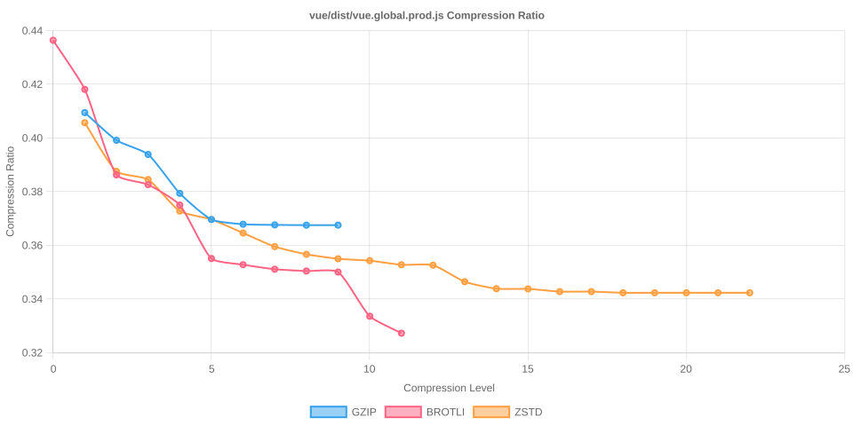

# Node Compression Benchmark

Last updated: 2025-10-14T13:42:01.842Z

This benchmark measures compression time, output size, and compression ratios for several popular npm packages across all gzip, Brotli, and Zstandard compression levels.

## jquery/dist/jquery.min.js

- Original size: 87,533 bytes
- Chart: 

| Algorithm | Level | Time (ms) | Size (bytes) | Compression Ratio |
| --- | --- | --- | --- | --- |
| gzip | 1 | 1.041 | 34291 | 0.3917 |
| gzip | 2 | 1.097 | 33282 | 0.3802 |
| gzip | 3 | 1.198 | 32802 | 0.3747 |
| gzip | 4 | 1.346 | 31363 | 0.3583 |
| gzip | 5 | 1.770 | 30525 | 0.3487 |
| gzip | 6 | 2.055 | 30406 | 0.3474 |
| gzip | 7 | 2.241 | 30358 | 0.3468 |
| gzip | 8 | 2.530 | 30342 | 0.3466 |
| gzip | 9 | 2.537 | 30342 | 0.3466 |
| brotli | 0 | 0.410 | 36492 | 0.4169 |
| brotli | 1 | 0.813 | 35042 | 0.4003 |
| brotli | 2 | 0.843 | 32435 | 0.3705 |
| brotli | 3 | 1.031 | 32156 | 0.3674 |
| brotli | 4 | 1.591 | 31402 | 0.3587 |
| brotli | 5 | 2.401 | 29763 | 0.3400 |
| brotli | 6 | 2.532 | 29595 | 0.3381 |
| brotli | 7 | 4.250 | 29534 | 0.3374 |
| brotli | 8 | 3.084 | 29497 | 0.3370 |
| brotli | 9 | 7.642 | 29478 | 0.3368 |
| brotli | 10 | 41.172 | 27918 | 0.3189 |
| brotli | 11 | 119.236 | 27445 | 0.3135 |
| zstd | 1 | 0.345 | 34450 | 0.3936 |
| zstd | 2 | 0.443 | 33281 | 0.3802 |
| zstd | 3 | 0.450 | 32250 | 0.3684 |
| zstd | 4 | 0.588 | 32190 | 0.3677 |
| zstd | 5 | 1.388 | 31247 | 0.3570 |
| zstd | 6 | 1.732 | 30417 | 0.3475 |
| zstd | 7 | 2.009 | 30146 | 0.3444 |
| zstd | 8 | 2.142 | 29980 | 0.3425 |
| zstd | 9 | 2.405 | 29839 | 0.3409 |
| zstd | 10 | 2.641 | 29761 | 0.3400 |
| zstd | 11 | 4.660 | 29660 | 0.3388 |
| zstd | 12 | 5.043 | 29659 | 0.3388 |
| zstd | 13 | 7.091 | 29522 | 0.3373 |
| zstd | 14 | 9.289 | 29032 | 0.3317 |
| zstd | 15 | 9.969 | 29030 | 0.3316 |
| zstd | 16 | 13.854 | 28947 | 0.3307 |
| zstd | 17 | 13.093 | 28947 | 0.3307 |
| zstd | 18 | 13.729 | 28947 | 0.3307 |
| zstd | 19 | 26.035 | 28896 | 0.3301 |
| zstd | 20 | 25.958 | 28896 | 0.3301 |
| zstd | 21 | 25.873 | 28896 | 0.3301 |
| zstd | 22 | 25.580 | 28896 | 0.3301 |

## @expo-google-fonts/noto-sans-jp/400Regular/NotoSansJP_400Regular.ttf

- Original size: 5,450,308 bytes
- Chart: 

| Algorithm | Level | Time (ms) | Size (bytes) | Compression Ratio |
| --- | --- | --- | --- | --- |
| gzip | 1 | 85.211 | 3315019 | 0.6082 |
| gzip | 2 | 88.425 | 3270341 | 0.6000 |
| gzip | 3 | 93.073 | 3244654 | 0.5953 |
| gzip | 4 | 105.077 | 3196168 | 0.5864 |
| gzip | 5 | 120.218 | 3149241 | 0.5778 |
| gzip | 6 | 134.335 | 3139085 | 0.5759 |
| gzip | 7 | 143.014 | 3137019 | 0.5756 |
| gzip | 8 | 160.795 | 3135947 | 0.5754 |
| gzip | 9 | 172.847 | 3135848 | 0.5754 |
| brotli | 0 | 20.210 | 3476454 | 0.6378 |
| brotli | 1 | 28.575 | 3308794 | 0.6071 |
| brotli | 2 | 49.376 | 3228812 | 0.5924 |
| brotli | 3 | 62.837 | 3190772 | 0.5854 |
| brotli | 4 | 85.239 | 3036811 | 0.5572 |
| brotli | 5 | 230.178 | 2926500 | 0.5369 |
| brotli | 6 | 326.560 | 2869372 | 0.5265 |
| brotli | 7 | 481.243 | 2824711 | 0.5183 |
| brotli | 8 | 612.075 | 2806874 | 0.5150 |
| brotli | 9 | 852.229 | 2777066 | 0.5095 |
| brotli | 10 | 6098.797 | 2717974 | 0.4987 |
| brotli | 11 | 13591.330 | 2638845 | 0.4842 |
| zstd | 1 | 18.784 | 3327284 | 0.6105 |
| zstd | 2 | 23.811 | 3217557 | 0.5903 |
| zstd | 3 | 38.709 | 3122493 | 0.5729 |
| zstd | 4 | 42.596 | 3067941 | 0.5629 |
| zstd | 5 | 67.242 | 3004712 | 0.5513 |
| zstd | 6 | 80.527 | 2977265 | 0.5463 |
| zstd | 7 | 87.634 | 2929435 | 0.5375 |
| zstd | 8 | 102.613 | 2924034 | 0.5365 |
| zstd | 9 | 103.333 | 2884126 | 0.5292 |
| zstd | 10 | 116.824 | 2862234 | 0.5252 |
| zstd | 11 | 183.930 | 2851888 | 0.5233 |
| zstd | 12 | 208.954 | 2849333 | 0.5228 |
| zstd | 13 | 383.334 | 2846584 | 0.5223 |
| zstd | 14 | 497.799 | 2834540 | 0.5201 |
| zstd | 15 | 589.945 | 2826702 | 0.5186 |
| zstd | 16 | 724.738 | 2786628 | 0.5113 |
| zstd | 17 | 876.022 | 2739020 | 0.5025 |
| zstd | 18 | 1235.580 | 2700903 | 0.4956 |
| zstd | 19 | 1323.609 | 2698571 | 0.4951 |
| zstd | 20 | 1285.779 | 2698571 | 0.4951 |
| zstd | 21 | 1367.868 | 2698640 | 0.4951 |
| zstd | 22 | 1348.705 | 2698640 | 0.4951 |

## react/cjs/react.production.js

- Original size: 17,217 bytes
- Chart: 

| Algorithm | Level | Time (ms) | Size (bytes) | Compression Ratio |
| --- | --- | --- | --- | --- |
| gzip | 1 | 0.127 | 4987 | 0.2897 |
| gzip | 2 | 0.133 | 4874 | 0.2831 |
| gzip | 3 | 0.155 | 4805 | 0.2791 |
| gzip | 4 | 0.190 | 4530 | 0.2631 |
| gzip | 5 | 0.234 | 4440 | 0.2579 |
| gzip | 6 | 0.274 | 4425 | 0.2570 |
| gzip | 7 | 0.319 | 4417 | 0.2565 |
| gzip | 8 | 0.466 | 4418 | 0.2566 |
| gzip | 9 | 0.477 | 4418 | 0.2566 |
| brotli | 0 | 0.066 | 5234 | 0.3040 |
| brotli | 1 | 0.071 | 5132 | 0.2981 |
| brotli | 2 | 0.138 | 4740 | 0.2753 |
| brotli | 3 | 0.171 | 4649 | 0.2700 |
| brotli | 4 | 0.286 | 4555 | 0.2646 |
| brotli | 5 | 0.374 | 4276 | 0.2484 |
| brotli | 6 | 0.372 | 4275 | 0.2483 |
| brotli | 7 | 0.450 | 4264 | 0.2477 |
| brotli | 8 | 0.465 | 4257 | 0.2473 |
| brotli | 9 | 0.552 | 4243 | 0.2464 |
| brotli | 10 | 7.132 | 3968 | 0.2305 |
| brotli | 11 | 20.814 | 3876 | 0.2251 |
| zstd | 1 | 0.072 | 4924 | 0.2860 |
| zstd | 2 | 0.073 | 4868 | 0.2827 |
| zstd | 3 | 0.100 | 4717 | 0.2740 |
| zstd | 4 | 0.101 | 4678 | 0.2717 |
| zstd | 5 | 0.221 | 4518 | 0.2624 |
| zstd | 6 | 0.238 | 4437 | 0.2577 |
| zstd | 7 | 0.309 | 4435 | 0.2576 |
| zstd | 8 | 0.330 | 4425 | 0.2570 |
| zstd | 9 | 0.358 | 4419 | 0.2567 |
| zstd | 10 | 0.411 | 4410 | 0.2561 |
| zstd | 11 | 0.653 | 4393 | 0.2552 |
| zstd | 12 | 0.680 | 4391 | 0.2550 |
| zstd | 13 | 0.945 | 4381 | 0.2545 |
| zstd | 14 | 1.471 | 4305 | 0.2500 |
| zstd | 15 | 1.560 | 4302 | 0.2499 |
| zstd | 16 | 2.531 | 4281 | 0.2486 |
| zstd | 17 | 2.702 | 4280 | 0.2486 |
| zstd | 18 | 2.702 | 4280 | 0.2486 |
| zstd | 19 | 5.282 | 4263 | 0.2476 |
| zstd | 20 | 5.272 | 4263 | 0.2476 |
| zstd | 21 | 5.279 | 4263 | 0.2476 |
| zstd | 22 | 5.268 | 4263 | 0.2476 |

## moment/min/moment.min.js

- Original size: 58,890 bytes
- Chart: 

| Algorithm | Level | Time (ms) | Size (bytes) | Compression Ratio |
| --- | --- | --- | --- | --- |
| gzip | 1 | 0.553 | 21216 | 0.3603 |
| gzip | 2 | 0.605 | 20666 | 0.3509 |
| gzip | 3 | 0.690 | 20354 | 0.3456 |
| gzip | 4 | 0.800 | 19475 | 0.3307 |
| gzip | 5 | 1.002 | 18991 | 0.3225 |
| gzip | 6 | 1.203 | 18892 | 0.3208 |
| gzip | 7 | 1.352 | 18860 | 0.3203 |
| gzip | 8 | 1.613 | 18845 | 0.3200 |
| gzip | 9 | 1.604 | 18845 | 0.3200 |
| brotli | 0 | 0.207 | 22733 | 0.3860 |
| brotli | 1 | 0.272 | 22170 | 0.3765 |
| brotli | 2 | 0.516 | 20291 | 0.3446 |
| brotli | 3 | 0.638 | 20119 | 0.3416 |
| brotli | 4 | 0.977 | 19713 | 0.3347 |
| brotli | 5 | 1.429 | 18447 | 0.3132 |
| brotli | 6 | 1.505 | 18343 | 0.3115 |
| brotli | 7 | 1.789 | 18239 | 0.3097 |
| brotli | 8 | 1.887 | 18216 | 0.3093 |
| brotli | 9 | 2.270 | 18172 | 0.3086 |
| brotli | 10 | 25.956 | 17405 | 0.2956 |
| brotli | 11 | 75.434 | 17004 | 0.2887 |
| zstd | 1 | 0.201 | 21483 | 0.3648 |
| zstd | 2 | 0.234 | 20806 | 0.3533 |
| zstd | 3 | 0.284 | 20298 | 0.3447 |
| zstd | 4 | 0.345 | 19924 | 0.3383 |
| zstd | 5 | 0.722 | 19309 | 0.3279 |
| zstd | 6 | 0.922 | 18919 | 0.3213 |
| zstd | 7 | 1.097 | 18815 | 0.3195 |
| zstd | 8 | 1.165 | 18708 | 0.3177 |
| zstd | 9 | 1.267 | 18638 | 0.3165 |
| zstd | 10 | 1.461 | 18583 | 0.3156 |
| zstd | 11 | 2.515 | 18520 | 0.3145 |
| zstd | 12 | 2.514 | 18517 | 0.3144 |
| zstd | 13 | 3.775 | 18417 | 0.3127 |
| zstd | 14 | 5.320 | 17955 | 0.3049 |
| zstd | 15 | 5.639 | 17942 | 0.3047 |
| zstd | 16 | 8.540 | 17892 | 0.3038 |
| zstd | 17 | 8.810 | 17892 | 0.3038 |
| zstd | 18 | 8.852 | 17892 | 0.3038 |
| zstd | 19 | 17.348 | 17845 | 0.3030 |
| zstd | 20 | 17.374 | 17845 | 0.3030 |
| zstd | 21 | 17.339 | 17845 | 0.3030 |
| zstd | 22 | 17.376 | 17845 | 0.3030 |

## vue/dist/vue.global.prod.js

- Original size: 159,632 bytes
- Chart: 

| Algorithm | Level | Time (ms) | Size (bytes) | Compression Ratio |
| --- | --- | --- | --- | --- |
| gzip | 1 | 1.827 | 65356 | 0.4094 |
| gzip | 2 | 1.990 | 63714 | 0.3991 |
| gzip | 3 | 2.262 | 62869 | 0.3938 |
| gzip | 4 | 2.545 | 60555 | 0.3793 |
| gzip | 5 | 3.370 | 59000 | 0.3696 |
| gzip | 6 | 4.124 | 58718 | 0.3678 |
| gzip | 7 | 4.508 | 58679 | 0.3676 |
| gzip | 8 | 4.834 | 58664 | 0.3675 |
| gzip | 9 | 4.858 | 58664 | 0.3675 |
| brotli | 0 | 0.630 | 69659 | 0.4364 |
| brotli | 1 | 0.842 | 66737 | 0.4181 |
| brotli | 2 | 1.578 | 61654 | 0.3862 |
| brotli | 3 | 1.882 | 61073 | 0.3826 |
| brotli | 4 | 2.880 | 59860 | 0.3750 |
| brotli | 5 | 4.638 | 56680 | 0.3551 |
| brotli | 6 | 5.039 | 56313 | 0.3528 |
| brotli | 7 | 5.993 | 56043 | 0.3511 |
| brotli | 8 | 6.425 | 55935 | 0.3504 |
| brotli | 9 | 7.872 | 55876 | 0.3500 |
| brotli | 10 | 95.666 | 53247 | 0.3336 |
| brotli | 11 | 251.947 | 52239 | 0.3272 |
| zstd | 1 | 0.613 | 64755 | 0.4057 |
| zstd | 2 | 0.783 | 61864 | 0.3875 |
| zstd | 3 | 0.981 | 61375 | 0.3845 |
| zstd | 4 | 1.998 | 59500 | 0.3727 |
| zstd | 5 | 2.012 | 59001 | 0.3696 |
| zstd | 6 | 2.592 | 58197 | 0.3646 |
| zstd | 7 | 2.930 | 57387 | 0.3595 |
| zstd | 8 | 3.667 | 56930 | 0.3566 |
| zstd | 9 | 4.125 | 56664 | 0.3550 |
| zstd | 10 | 4.866 | 56551 | 0.3543 |
| zstd | 11 | 8.249 | 56308 | 0.3527 |
| zstd | 12 | 8.408 | 56282 | 0.3526 |
| zstd | 13 | 14.302 | 55299 | 0.3464 |
| zstd | 14 | 17.077 | 54885 | 0.3438 |
| zstd | 15 | 18.605 | 54873 | 0.3437 |
| zstd | 16 | 25.081 | 54712 | 0.3427 |
| zstd | 17 | 24.557 | 54712 | 0.3427 |
| zstd | 18 | 42.498 | 54641 | 0.3423 |
| zstd | 19 | 42.785 | 54641 | 0.3423 |
| zstd | 20 | 42.384 | 54641 | 0.3423 |
| zstd | 21 | 42.314 | 54641 | 0.3423 |
| zstd | 22 | 42.344 | 54641 | 0.3423 |

## lodash/lodash.min.js

- Original size: 73,015 bytes
- Chart: 

| Algorithm | Level | Time (ms) | Size (bytes) | Compression Ratio |
| --- | --- | --- | --- | --- |
| gzip | 1 | 0.777 | 28848 | 0.3951 |
| gzip | 2 | 0.851 | 28250 | 0.3869 |
| gzip | 3 | 0.969 | 27778 | 0.3804 |
| gzip | 4 | 1.086 | 27025 | 0.3701 |
| gzip | 5 | 1.397 | 26172 | 0.3584 |
| gzip | 6 | 1.776 | 26014 | 0.3563 |
| gzip | 7 | 2.092 | 25988 | 0.3559 |
| gzip | 8 | 2.852 | 25968 | 0.3557 |
| gzip | 9 | 2.852 | 25968 | 0.3557 |
| brotli | 0 | 0.274 | 31067 | 0.4255 |
| brotli | 1 | 0.367 | 29876 | 0.4092 |
| brotli | 2 | 0.670 | 27471 | 0.3762 |
| brotli | 3 | 0.796 | 27246 | 0.3732 |
| brotli | 4 | 1.320 | 26751 | 0.3664 |
| brotli | 5 | 2.009 | 25220 | 0.3454 |
| brotli | 6 | 2.120 | 25102 | 0.3438 |
| brotli | 7 | 2.660 | 24969 | 0.3420 |
| brotli | 8 | 2.928 | 24946 | 0.3417 |
| brotli | 9 | 3.242 | 24897 | 0.3410 |
| brotli | 10 | 38.700 | 23428 | 0.3209 |
| brotli | 11 | 103.425 | 23089 | 0.3162 |
| zstd | 1 | 0.257 | 29043 | 0.3978 |
| zstd | 2 | 0.302 | 28094 | 0.3848 |
| zstd | 3 | 0.367 | 27523 | 0.3769 |
| zstd | 4 | 0.463 | 27149 | 0.3718 |
| zstd | 5 | 0.945 | 26575 | 0.3640 |
| zstd | 6 | 1.182 | 25888 | 0.3546 |
| zstd | 7 | 1.385 | 25718 | 0.3522 |
| zstd | 8 | 1.446 | 25598 | 0.3506 |
| zstd | 9 | 1.641 | 25509 | 0.3494 |
| zstd | 10 | 1.921 | 25448 | 0.3485 |
| zstd | 11 | 3.250 | 25374 | 0.3475 |
| zstd | 12 | 3.510 | 25374 | 0.3475 |
| zstd | 13 | 5.386 | 25232 | 0.3456 |
| zstd | 14 | 7.667 | 24674 | 0.3379 |
| zstd | 15 | 7.871 | 24659 | 0.3377 |
| zstd | 16 | 10.769 | 24543 | 0.3361 |
| zstd | 17 | 10.768 | 24543 | 0.3361 |
| zstd | 18 | 10.789 | 24543 | 0.3361 |
| zstd | 19 | 20.508 | 24504 | 0.3356 |
| zstd | 20 | 20.561 | 24504 | 0.3356 |
| zstd | 21 | 20.557 | 24504 | 0.3356 |
| zstd | 22 | 20.544 | 24504 | 0.3356 |

## normalize.css/normalize.css

- Original size: 6,138 bytes
- Chart: 

| Algorithm | Level | Time (ms) | Size (bytes) | Compression Ratio |
| --- | --- | --- | --- | --- |
| gzip | 1 | 0.047 | 1915 | 0.3120 |
| gzip | 2 | 0.047 | 1866 | 0.3040 |
| gzip | 3 | 0.043 | 1845 | 0.3006 |
| gzip | 4 | 0.069 | 1758 | 0.2864 |
| gzip | 5 | 0.064 | 1722 | 0.2805 |
| gzip | 6 | 0.059 | 1722 | 0.2805 |
| gzip | 7 | 0.061 | 1722 | 0.2805 |
| gzip | 8 | 0.062 | 1720 | 0.2802 |
| gzip | 9 | 0.059 | 1720 | 0.2802 |
| brotli | 0 | 0.029 | 2089 | 0.3403 |
| brotli | 1 | 0.032 | 2056 | 0.3350 |
| brotli | 2 | 0.056 | 1909 | 0.3110 |
| brotli | 3 | 0.063 | 1834 | 0.2988 |
| brotli | 4 | 0.124 | 1694 | 0.2760 |
| brotli | 5 | 0.137 | 1557 | 0.2537 |
| brotli | 6 | 0.127 | 1559 | 0.2540 |
| brotli | 7 | 0.160 | 1555 | 0.2533 |
| brotli | 8 | 0.151 | 1555 | 0.2533 |
| brotli | 9 | 0.177 | 1557 | 0.2537 |
| brotli | 10 | 3.035 | 1431 | 0.2331 |
| brotli | 11 | 7.844 | 1398 | 0.2278 |
| zstd | 1 | 0.037 | 1906 | 0.3105 |
| zstd | 2 | 0.035 | 1941 | 0.3162 |
| zstd | 3 | 0.041 | 1853 | 0.3019 |
| zstd | 4 | 0.048 | 1752 | 0.2854 |
| zstd | 5 | 0.058 | 1743 | 0.2840 |
| zstd | 6 | 0.075 | 1730 | 0.2819 |
| zstd | 7 | 0.072 | 1729 | 0.2817 |
| zstd | 8 | 0.069 | 1729 | 0.2817 |
| zstd | 9 | 0.177 | 1728 | 0.2815 |
| zstd | 10 | 0.134 | 1728 | 0.2815 |
| zstd | 11 | 0.291 | 1722 | 0.2805 |
| zstd | 12 | 0.373 | 1718 | 0.2799 |
| zstd | 13 | 0.632 | 1703 | 0.2775 |
| zstd | 14 | 0.650 | 1700 | 0.2770 |
| zstd | 15 | 0.842 | 1700 | 0.2770 |
| zstd | 16 | 1.271 | 1696 | 0.2763 |
| zstd | 17 | 1.512 | 1697 | 0.2765 |
| zstd | 18 | 1.633 | 1697 | 0.2765 |
| zstd | 19 | 1.624 | 1697 | 0.2765 |
| zstd | 20 | 1.633 | 1697 | 0.2765 |
| zstd | 21 | 1.622 | 1697 | 0.2765 |
| zstd | 22 | 1.626 | 1697 | 0.2765 |

## bootstrap/dist/css/bootstrap.min.css

- Original size: 232,111 bytes
- Chart: 

| Algorithm | Level | Time (ms) | Size (bytes) | Compression Ratio |
| --- | --- | --- | --- | --- |
| gzip | 1 | 1.070 | 41452 | 0.1786 |
| gzip | 2 | 1.137 | 38418 | 0.1655 |
| gzip | 3 | 1.319 | 36152 | 0.1558 |
| gzip | 4 | 1.734 | 33830 | 0.1457 |
| gzip | 5 | 2.177 | 31408 | 0.1353 |
| gzip | 6 | 2.951 | 30823 | 0.1328 |
| gzip | 7 | 3.587 | 30680 | 0.1322 |
| gzip | 8 | 4.788 | 30670 | 0.1321 |
| gzip | 9 | 4.858 | 30669 | 0.1321 |
| brotli | 0 | 0.437 | 43268 | 0.1864 |
| brotli | 1 | 0.621 | 39941 | 0.1721 |
| brotli | 2 | 1.128 | 36514 | 0.1573 |
| brotli | 3 | 1.435 | 34781 | 0.1498 |
| brotli | 4 | 2.042 | 33048 | 0.1424 |
| brotli | 5 | 2.910 | 28253 | 0.1217 |
| brotli | 6 | 3.215 | 27431 | 0.1182 |
| brotli | 7 | 3.911 | 26971 | 0.1162 |
| brotli | 8 | 4.440 | 26813 | 0.1155 |
| brotli | 9 | 5.365 | 26569 | 0.1145 |
| brotli | 10 | 98.645 | 23482 | 0.1012 |
| brotli | 11 | 322.417 | 22970 | 0.0990 |
| zstd | 1 | 0.495 | 35549 | 0.1532 |
| zstd | 2 | 0.549 | 34301 | 0.1478 |
| zstd | 3 | 0.588 | 34393 | 0.1482 |
| zstd | 4 | 1.965 | 30973 | 0.1334 |
| zstd | 5 | 1.874 | 29744 | 0.1281 |
| zstd | 6 | 2.389 | 29727 | 0.1281 |
| zstd | 7 | 2.414 | 29710 | 0.1280 |
| zstd | 8 | 3.130 | 28645 | 0.1234 |
| zstd | 9 | 3.395 | 28235 | 0.1216 |
| zstd | 10 | 4.398 | 28044 | 0.1208 |
| zstd | 11 | 8.206 | 27895 | 0.1202 |
| zstd | 12 | 10.018 | 27805 | 0.1198 |
| zstd | 13 | 17.340 | 27283 | 0.1175 |
| zstd | 14 | 21.608 | 26828 | 0.1156 |
| zstd | 15 | 28.089 | 26465 | 0.1140 |
| zstd | 16 | 56.680 | 26071 | 0.1123 |
| zstd | 17 | 63.875 | 26041 | 0.1122 |
| zstd | 18 | 85.682 | 26008 | 0.1120 |
| zstd | 19 | 96.621 | 26015 | 0.1121 |
| zstd | 20 | 101.223 | 26014 | 0.1121 |
| zstd | 21 | 100.933 | 26014 | 0.1121 |
| zstd | 22 | 101.564 | 26014 | 0.1121 |

## tailwindcss/theme.css

- Original size: 17,453 bytes
- Chart: 

| Algorithm | Level | Time (ms) | Size (bytes) | Compression Ratio |
| --- | --- | --- | --- | --- |
| gzip | 1 | 0.127 | 5007 | 0.2869 |
| gzip | 2 | 0.148 | 4953 | 0.2838 |
| gzip | 3 | 0.153 | 4890 | 0.2802 |
| gzip | 4 | 0.197 | 4704 | 0.2695 |
| gzip | 5 | 0.239 | 4489 | 0.2572 |
| gzip | 6 | 0.316 | 4479 | 0.2566 |
| gzip | 7 | 0.418 | 4456 | 0.2553 |
| gzip | 8 | 0.505 | 4457 | 0.2554 |
| gzip | 9 | 0.504 | 4457 | 0.2554 |
| brotli | 0 | 0.056 | 5501 | 0.3152 |
| brotli | 1 | 0.075 | 5225 | 0.2994 |
| brotli | 2 | 0.139 | 4543 | 0.2603 |
| brotli | 3 | 0.172 | 4523 | 0.2592 |
| brotli | 4 | 0.268 | 4510 | 0.2584 |
| brotli | 5 | 0.409 | 4209 | 0.2412 |
| brotli | 6 | 0.442 | 4201 | 0.2407 |
| brotli | 7 | 0.547 | 4193 | 0.2402 |
| brotli | 8 | 0.590 | 4190 | 0.2401 |
| brotli | 9 | 0.694 | 4180 | 0.2395 |
| brotli | 10 | 6.918 | 3615 | 0.2071 |
| brotli | 11 | 21.413 | 3512 | 0.2012 |
| zstd | 1 | 0.068 | 4919 | 0.2818 |
| zstd | 2 | 0.070 | 4734 | 0.2712 |
| zstd | 3 | 0.096 | 4726 | 0.2708 |
| zstd | 4 | 0.100 | 4694 | 0.2690 |
| zstd | 5 | 0.219 | 4621 | 0.2648 |
| zstd | 6 | 0.275 | 4394 | 0.2518 |
| zstd | 7 | 0.311 | 4308 | 0.2468 |
| zstd | 8 | 0.340 | 4304 | 0.2466 |
| zstd | 9 | 0.384 | 4299 | 0.2463 |
| zstd | 10 | 0.450 | 4300 | 0.2464 |
| zstd | 11 | 0.554 | 4295 | 0.2461 |
| zstd | 12 | 0.596 | 4295 | 0.2461 |
| zstd | 13 | 0.909 | 4386 | 0.2513 |
| zstd | 14 | 1.596 | 4086 | 0.2341 |
| zstd | 15 | 1.677 | 4082 | 0.2339 |
| zstd | 16 | 2.573 | 4026 | 0.2307 |
| zstd | 17 | 2.576 | 4026 | 0.2307 |
| zstd | 18 | 2.554 | 4026 | 0.2307 |
| zstd | 19 | 5.029 | 4003 | 0.2294 |
| zstd | 20 | 5.022 | 4003 | 0.2294 |
| zstd | 21 | 5.030 | 4003 | 0.2294 |
| zstd | 22 | 5.038 | 4003 | 0.2294 |
