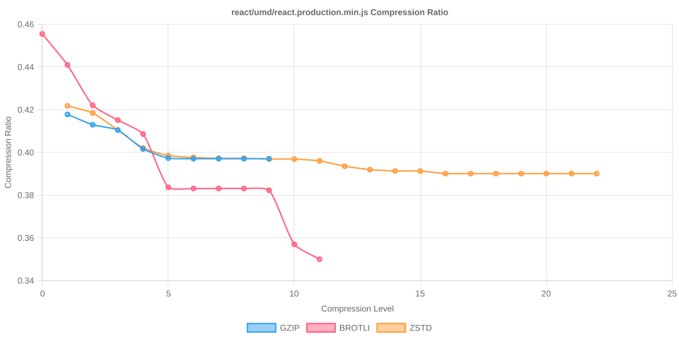

# Node Compression Benchmark

Last updated: 2025-10-14T08:57:34.679Z

This benchmark measures compression time, output size, and compression ratios for several popular npm packages across all gzip, Brotli, and Zstandard compression levels.

## jquery/dist/jquery.min.js

- Original size: 87533 bytes
- Chart: 

| Algorithm | Level | Time (ms) | Size (bytes) | Compression Ratio |
| --- | --- | --- | --- | --- |
| gzip | 1 | 1.900 | 34291 | 0.3917 |
| gzip | 2 | 1.162 | 33282 | 0.3802 |
| gzip | 3 | 1.297 | 32802 | 0.3747 |
| gzip | 4 | 1.510 | 31363 | 0.3583 |
| gzip | 5 | 1.856 | 30525 | 0.3487 |
| gzip | 6 | 2.014 | 30406 | 0.3474 |
| gzip | 7 | 2.143 | 30358 | 0.3468 |
| gzip | 8 | 2.371 | 30342 | 0.3466 |
| gzip | 9 | 2.626 | 30342 | 0.3466 |
| brotli | 0 | 8.675 | 36492 | 0.4169 |
| brotli | 1 | 0.817 | 35042 | 0.4003 |
| brotli | 2 | 11.336 | 32435 | 0.3705 |
| brotli | 3 | 1.212 | 32156 | 0.3674 |
| brotli | 4 | 1.874 | 31402 | 0.3587 |
| brotli | 5 | 2.808 | 29763 | 0.3400 |
| brotli | 6 | 3.454 | 29595 | 0.3381 |
| brotli | 7 | 4.852 | 29534 | 0.3374 |
| brotli | 8 | 8.507 | 29497 | 0.3370 |
| brotli | 9 | 12.713 | 29478 | 0.3368 |
| brotli | 10 | 56.450 | 27918 | 0.3189 |
| brotli | 11 | 129.592 | 27445 | 0.3135 |
| zstd | 1 | 19.050 | 34450 | 0.3936 |
| zstd | 2 | 0.573 | 33281 | 0.3802 |
| zstd | 3 | 0.540 | 32250 | 0.3684 |
| zstd | 4 | 0.653 | 32190 | 0.3677 |
| zstd | 5 | 5.749 | 31247 | 0.3570 |
| zstd | 6 | 1.536 | 30417 | 0.3475 |
| zstd | 7 | 2.415 | 30146 | 0.3444 |
| zstd | 8 | 2.121 | 29980 | 0.3425 |
| zstd | 9 | 2.191 | 29839 | 0.3409 |
| zstd | 10 | 2.347 | 29761 | 0.3400 |
| zstd | 11 | 4.318 | 29660 | 0.3388 |
| zstd | 12 | 4.622 | 29659 | 0.3388 |
| zstd | 13 | 10.416 | 29522 | 0.3373 |
| zstd | 14 | 10.794 | 29032 | 0.3317 |
| zstd | 15 | 11.068 | 29030 | 0.3316 |
| zstd | 16 | 12.805 | 28947 | 0.3307 |
| zstd | 17 | 13.583 | 28947 | 0.3307 |
| zstd | 18 | 13.068 | 28947 | 0.3307 |
| zstd | 19 | 25.821 | 28896 | 0.3301 |
| zstd | 20 | 24.742 | 28896 | 0.3301 |
| zstd | 21 | 25.810 | 28896 | 0.3301 |
| zstd | 22 | 26.242 | 28896 | 0.3301 |

## @expo-google-fonts/noto-sans-jp/NotoSansJP_400Regular.ttf

- Original size: 4548208 bytes
- Chart: 

| Algorithm | Level | Time (ms) | Size (bytes) | Compression Ratio |
| --- | --- | --- | --- | --- |
| gzip | 1 | 101.816 | 3944954 | 0.8674 |
| gzip | 2 | 102.327 | 3940832 | 0.8665 |
| gzip | 3 | 102.740 | 3939509 | 0.8662 |
| gzip | 4 | 107.287 | 3932798 | 0.8647 |
| gzip | 5 | 112.133 | 3927840 | 0.8636 |
| gzip | 6 | 113.229 | 3927057 | 0.8634 |
| gzip | 7 | 115.748 | 3926816 | 0.8634 |
| gzip | 8 | 129.564 | 3926489 | 0.8633 |
| gzip | 9 | 142.839 | 3926321 | 0.8633 |
| brotli | 0 | 13.537 | 4151807 | 0.9128 |
| brotli | 1 | 16.533 | 4096540 | 0.9007 |
| brotli | 2 | 28.959 | 4050843 | 0.8906 |
| brotli | 3 | 32.611 | 4041605 | 0.8886 |
| brotli | 4 | 60.996 | 4019269 | 0.8837 |
| brotli | 5 | 153.570 | 3913415 | 0.8604 |
| brotli | 6 | 288.305 | 3876835 | 0.8524 |
| brotli | 7 | 548.933 | 3845814 | 0.8456 |
| brotli | 8 | 655.720 | 3837329 | 0.8437 |
| brotli | 9 | 1499.366 | 3704181 | 0.8144 |
| brotli | 10 | 9022.256 | 3433866 | 0.7550 |
| brotli | 11 | 17460.186 | 3387424 | 0.7448 |
| zstd | 1 | 7.987 | 4090494 | 0.8994 |
| zstd | 2 | 9.849 | 4072473 | 0.8954 |
| zstd | 3 | 25.895 | 3989261 | 0.8771 |
| zstd | 4 | 43.171 | 3936029 | 0.8654 |
| zstd | 5 | 65.979 | 3895281 | 0.8564 |
| zstd | 6 | 67.747 | 3892818 | 0.8559 |
| zstd | 7 | 77.205 | 3849781 | 0.8464 |
| zstd | 8 | 78.553 | 3848338 | 0.8461 |
| zstd | 9 | 102.577 | 3807365 | 0.8371 |
| zstd | 10 | 127.318 | 3784634 | 0.8321 |
| zstd | 11 | 243.513 | 3783880 | 0.8319 |
| zstd | 12 | 295.641 | 3783346 | 0.8318 |
| zstd | 13 | 536.149 | 3782508 | 0.8316 |
| zstd | 14 | 463.526 | 3781552 | 0.8314 |
| zstd | 15 | 464.904 | 3780212 | 0.8311 |
| zstd | 16 | 577.558 | 3757245 | 0.8261 |
| zstd | 17 | 724.895 | 3678921 | 0.8089 |
| zstd | 18 | 944.769 | 3620307 | 0.7960 |
| zstd | 19 | 961.855 | 3619532 | 0.7958 |
| zstd | 20 | 923.105 | 3619532 | 0.7958 |
| zstd | 21 | 1024.161 | 3619517 | 0.7958 |
| zstd | 22 | 1059.232 | 3619510 | 0.7958 |

## react/umd/react.production.min.js

- Original size: 10,751 bytes
- Chart: 

Benchmark results will be updated after the next run of `npm run benchmark`.

## moment/min/moment.min.js

- Original size: 58890 bytes
- Chart: 

| Algorithm | Level | Time (ms) | Size (bytes) | Compression Ratio |
| --- | --- | --- | --- | --- |
| gzip | 1 | 0.713 | 21216 | 0.3603 |
| gzip | 2 | 0.672 | 20666 | 0.3509 |
| gzip | 3 | 0.709 | 20354 | 0.3456 |
| gzip | 4 | 0.835 | 19475 | 0.3307 |
| gzip | 5 | 1.035 | 18991 | 0.3225 |
| gzip | 6 | 1.227 | 18892 | 0.3208 |
| gzip | 7 | 1.327 | 18860 | 0.3203 |
| gzip | 8 | 1.466 | 18845 | 0.3200 |
| gzip | 9 | 1.486 | 18845 | 0.3200 |
| brotli | 0 | 0.300 | 22733 | 0.3860 |
| brotli | 1 | 0.340 | 22170 | 0.3765 |
| brotli | 2 | 0.589 | 20291 | 0.3446 |
| brotli | 3 | 0.736 | 20119 | 0.3416 |
| brotli | 4 | 1.199 | 19713 | 0.3347 |
| brotli | 5 | 2.082 | 18447 | 0.3132 |
| brotli | 6 | 2.199 | 18343 | 0.3115 |
| brotli | 7 | 2.586 | 18239 | 0.3097 |
| brotli | 8 | 2.618 | 18216 | 0.3093 |
| brotli | 9 | 2.897 | 18172 | 0.3086 |
| brotli | 10 | 27.795 | 17405 | 0.2956 |
| brotli | 11 | 77.356 | 17004 | 0.2887 |
| zstd | 1 | 0.302 | 21483 | 0.3648 |
| zstd | 2 | 0.285 | 20806 | 0.3533 |
| zstd | 3 | 0.378 | 20298 | 0.3447 |
| zstd | 4 | 0.399 | 19924 | 0.3383 |
| zstd | 5 | 0.728 | 19309 | 0.3279 |
| zstd | 6 | 0.927 | 18919 | 0.3213 |
| zstd | 7 | 1.167 | 18815 | 0.3195 |
| zstd | 8 | 1.197 | 18708 | 0.3177 |
| zstd | 9 | 1.356 | 18638 | 0.3165 |
| zstd | 10 | 1.522 | 18583 | 0.3156 |
| zstd | 11 | 2.791 | 18520 | 0.3145 |
| zstd | 12 | 2.690 | 18517 | 0.3144 |
| zstd | 13 | 3.981 | 18417 | 0.3127 |
| zstd | 14 | 5.764 | 17955 | 0.3049 |
| zstd | 15 | 5.623 | 17942 | 0.3047 |
| zstd | 16 | 8.157 | 17892 | 0.3038 |
| zstd | 17 | 8.403 | 17892 | 0.3038 |
| zstd | 18 | 8.385 | 17892 | 0.3038 |
| zstd | 19 | 16.078 | 17845 | 0.3030 |
| zstd | 20 | 16.589 | 17845 | 0.3030 |
| zstd | 21 | 16.043 | 17845 | 0.3030 |
| zstd | 22 | 16.309 | 17845 | 0.3030 |

## vue/dist/vue.global.prod.js

- Original size: 159632 bytes
- Chart: 

| Algorithm | Level | Time (ms) | Size (bytes) | Compression Ratio |
| --- | --- | --- | --- | --- |
| gzip | 1 | 1.975 | 65356 | 0.4094 |
| gzip | 2 | 2.143 | 63714 | 0.3991 |
| gzip | 3 | 2.289 | 62869 | 0.3938 |
| gzip | 4 | 2.543 | 60555 | 0.3793 |
| gzip | 5 | 3.304 | 59000 | 0.3696 |
| gzip | 6 | 3.950 | 58718 | 0.3678 |
| gzip | 7 | 4.313 | 58679 | 0.3676 |
| gzip | 8 | 4.593 | 58664 | 0.3675 |
| gzip | 9 | 4.603 | 58664 | 0.3675 |
| brotli | 0 | 0.675 | 69659 | 0.4364 |
| brotli | 1 | 0.896 | 66737 | 0.4181 |
| brotli | 2 | 1.646 | 61654 | 0.3862 |
| brotli | 3 | 1.920 | 61073 | 0.3826 |
| brotli | 4 | 2.911 | 59860 | 0.3750 |
| brotli | 5 | 5.647 | 56680 | 0.3551 |
| brotli | 6 | 6.211 | 56313 | 0.3528 |
| brotli | 7 | 8.077 | 56043 | 0.3511 |
| brotli | 8 | 8.493 | 55935 | 0.3504 |
| brotli | 9 | 9.445 | 55876 | 0.3500 |
| brotli | 10 | 101.224 | 53247 | 0.3336 |
| brotli | 11 | 255.873 | 52239 | 0.3272 |
| zstd | 1 | 0.700 | 64755 | 0.4057 |
| zstd | 2 | 0.859 | 61864 | 0.3875 |
| zstd | 3 | 1.638 | 61375 | 0.3845 |
| zstd | 4 | 1.888 | 59500 | 0.3727 |
| zstd | 5 | 2.351 | 59001 | 0.3696 |
| zstd | 6 | 3.379 | 58197 | 0.3646 |
| zstd | 7 | 3.839 | 57387 | 0.3595 |
| zstd | 8 | 4.150 | 56930 | 0.3566 |
| zstd | 9 | 4.657 | 56664 | 0.3550 |
| zstd | 10 | 6.387 | 56551 | 0.3543 |
| zstd | 11 | 10.733 | 56308 | 0.3527 |
| zstd | 12 | 12.451 | 56282 | 0.3526 |
| zstd | 13 | 17.664 | 55299 | 0.3464 |
| zstd | 14 | 22.687 | 54885 | 0.3438 |
| zstd | 15 | 21.116 | 54873 | 0.3437 |
| zstd | 16 | 27.166 | 54712 | 0.3427 |
| zstd | 17 | 28.125 | 54712 | 0.3427 |
| zstd | 18 | 48.677 | 54641 | 0.3423 |
| zstd | 19 | 49.227 | 54641 | 0.3423 |
| zstd | 20 | 47.845 | 54641 | 0.3423 |
| zstd | 21 | 46.939 | 54641 | 0.3423 |
| zstd | 22 | 47.661 | 54641 | 0.3423 |

## lodash/lodash.min.js

- Original size: 73015 bytes
- Chart: 

| Algorithm | Level | Time (ms) | Size (bytes) | Compression Ratio |
| --- | --- | --- | --- | --- |
| gzip | 1 | 0.890 | 28848 | 0.3951 |
| gzip | 2 | 0.872 | 28250 | 0.3869 |
| gzip | 3 | 0.984 | 27778 | 0.3804 |
| gzip | 4 | 1.127 | 27025 | 0.3701 |
| gzip | 5 | 1.430 | 26172 | 0.3584 |
| gzip | 6 | 1.747 | 26014 | 0.3563 |
| gzip | 7 | 1.950 | 25988 | 0.3559 |
| gzip | 8 | 2.558 | 25968 | 0.3557 |
| gzip | 9 | 2.537 | 25968 | 0.3557 |
| brotli | 0 | 0.318 | 31067 | 0.4255 |
| brotli | 1 | 0.440 | 29876 | 0.4092 |
| brotli | 2 | 0.754 | 27471 | 0.3762 |
| brotli | 3 | 0.830 | 27246 | 0.3732 |
| brotli | 4 | 1.464 | 26751 | 0.3664 |
| brotli | 5 | 2.428 | 25220 | 0.3454 |
| brotli | 6 | 2.734 | 25102 | 0.3438 |
| brotli | 7 | 3.146 | 24969 | 0.3420 |
| brotli | 8 | 7.090 | 24946 | 0.3417 |
| brotli | 9 | 11.374 | 24897 | 0.3410 |
| brotli | 10 | 40.389 | 23428 | 0.3209 |
| brotli | 11 | 104.121 | 23089 | 0.3162 |
| zstd | 1 | 0.352 | 29043 | 0.3978 |
| zstd | 2 | 0.348 | 28094 | 0.3848 |
| zstd | 3 | 0.406 | 27523 | 0.3769 |
| zstd | 4 | 0.622 | 27149 | 0.3718 |
| zstd | 5 | 0.900 | 26575 | 0.3640 |
| zstd | 6 | 1.196 | 25888 | 0.3546 |
| zstd | 7 | 1.383 | 25718 | 0.3522 |
| zstd | 8 | 1.528 | 25598 | 0.3506 |
| zstd | 9 | 1.765 | 25509 | 0.3494 |
| zstd | 10 | 1.985 | 25448 | 0.3485 |
| zstd | 11 | 3.700 | 25374 | 0.3475 |
| zstd | 12 | 4.196 | 25374 | 0.3475 |
| zstd | 13 | 5.630 | 25232 | 0.3456 |
| zstd | 14 | 8.487 | 24674 | 0.3379 |
| zstd | 15 | 8.449 | 24659 | 0.3377 |
| zstd | 16 | 11.106 | 24543 | 0.3361 |
| zstd | 17 | 11.160 | 24543 | 0.3361 |
| zstd | 18 | 10.850 | 24543 | 0.3361 |
| zstd | 19 | 20.307 | 24504 | 0.3356 |
| zstd | 20 | 20.302 | 24504 | 0.3356 |
| zstd | 21 | 21.263 | 24504 | 0.3356 |
| zstd | 22 | 22.021 | 24504 | 0.3356 |

## normalize.css/normalize.css

- Original size: 6138 bytes
- Chart: 

| Algorithm | Level | Time (ms) | Size (bytes) | Compression Ratio |
| --- | --- | --- | --- | --- |
| gzip | 1 | 0.281 | 1915 | 0.3120 |
| gzip | 2 | 0.113 | 1866 | 0.3040 |
| gzip | 3 | 0.092 | 1845 | 0.3006 |
| gzip | 4 | 0.095 | 1758 | 0.2864 |
| gzip | 5 | 0.099 | 1722 | 0.2805 |
| gzip | 6 | 0.092 | 1722 | 0.2805 |
| gzip | 7 | 0.083 | 1722 | 0.2805 |
| gzip | 8 | 0.086 | 1720 | 0.2802 |
| gzip | 9 | 0.074 | 1720 | 0.2802 |
| brotli | 0 | 0.104 | 2089 | 0.3403 |
| brotli | 1 | 0.055 | 2056 | 0.3350 |
| brotli | 2 | 0.109 | 1909 | 0.3110 |
| brotli | 3 | 0.108 | 1834 | 0.2988 |
| brotli | 4 | 0.247 | 1694 | 0.2760 |
| brotli | 5 | 0.238 | 1557 | 0.2537 |
| brotli | 6 | 0.221 | 1559 | 0.2540 |
| brotli | 7 | 0.286 | 1555 | 0.2533 |
| brotli | 8 | 0.260 | 1555 | 0.2533 |
| brotli | 9 | 8.989 | 1557 | 0.2537 |
| brotli | 10 | 3.346 | 1431 | 0.2331 |
| brotli | 11 | 8.086 | 1398 | 0.2278 |
| zstd | 1 | 0.159 | 1906 | 0.3105 |
| zstd | 2 | 0.059 | 1941 | 0.3162 |
| zstd | 3 | 0.082 | 1853 | 0.3019 |
| zstd | 4 | 0.081 | 1752 | 0.2854 |
| zstd | 5 | 0.098 | 1743 | 0.2840 |
| zstd | 6 | 0.110 | 1730 | 0.2819 |
| zstd | 7 | 0.101 | 1729 | 0.2817 |
| zstd | 8 | 0.095 | 1729 | 0.2817 |
| zstd | 9 | 0.207 | 1728 | 0.2815 |
| zstd | 10 | 0.189 | 1728 | 0.2815 |
| zstd | 11 | 0.340 | 1722 | 0.2805 |
| zstd | 12 | 0.422 | 1718 | 0.2799 |
| zstd | 13 | 0.617 | 1703 | 0.2775 |
| zstd | 14 | 0.620 | 1700 | 0.2770 |
| zstd | 15 | 0.755 | 1700 | 0.2770 |
| zstd | 16 | 1.148 | 1696 | 0.2763 |
| zstd | 17 | 1.359 | 1697 | 0.2765 |
| zstd | 18 | 1.922 | 1697 | 0.2765 |
| zstd | 19 | 1.466 | 1697 | 0.2765 |
| zstd | 20 | 1.436 | 1697 | 0.2765 |
| zstd | 21 | 1.418 | 1697 | 0.2765 |
| zstd | 22 | 1.444 | 1697 | 0.2765 |

## bootstrap/dist/css/bootstrap.min.css

- Original size: 232111 bytes
- Chart: 

| Algorithm | Level | Time (ms) | Size (bytes) | Compression Ratio |
| --- | --- | --- | --- | --- |
| gzip | 1 | 1.270 | 41452 | 0.1786 |
| gzip | 2 | 1.229 | 38418 | 0.1655 |
| gzip | 3 | 1.368 | 36152 | 0.1558 |
| gzip | 4 | 1.618 | 33830 | 0.1457 |
| gzip | 5 | 2.079 | 31408 | 0.1353 |
| gzip | 6 | 2.722 | 30823 | 0.1328 |
| gzip | 7 | 3.263 | 30680 | 0.1322 |
| gzip | 8 | 4.312 | 30670 | 0.1321 |
| gzip | 9 | 4.350 | 30669 | 0.1321 |
| brotli | 0 | 0.485 | 43268 | 0.1864 |
| brotli | 1 | 0.664 | 39941 | 0.1721 |
| brotli | 2 | 1.264 | 36514 | 0.1573 |
| brotli | 3 | 1.397 | 34781 | 0.1498 |
| brotli | 4 | 2.098 | 33048 | 0.1424 |
| brotli | 5 | 3.295 | 28253 | 0.1217 |
| brotli | 6 | 3.591 | 27431 | 0.1182 |
| brotli | 7 | 5.138 | 26971 | 0.1162 |
| brotli | 8 | 6.145 | 26813 | 0.1155 |
| brotli | 9 | 16.883 | 26569 | 0.1145 |
| brotli | 10 | 104.177 | 23482 | 0.1012 |
| brotli | 11 | 325.166 | 22970 | 0.0990 |
| zstd | 1 | 0.713 | 35549 | 0.1532 |
| zstd | 2 | 0.681 | 34301 | 0.1478 |
| zstd | 3 | 0.753 | 34393 | 0.1482 |
| zstd | 4 | 1.568 | 30973 | 0.1334 |
| zstd | 5 | 2.207 | 29744 | 0.1281 |
| zstd | 6 | 2.909 | 29727 | 0.1281 |
| zstd | 7 | 3.377 | 29710 | 0.1280 |
| zstd | 8 | 3.717 | 28645 | 0.1234 |
| zstd | 9 | 4.162 | 28235 | 0.1216 |
| zstd | 10 | 4.970 | 28044 | 0.1208 |
| zstd | 11 | 9.824 | 27895 | 0.1202 |
| zstd | 12 | 12.889 | 27805 | 0.1198 |
| zstd | 13 | 20.623 | 27283 | 0.1175 |
| zstd | 14 | 24.479 | 26828 | 0.1156 |
| zstd | 15 | 30.405 | 26465 | 0.1140 |
| zstd | 16 | 51.699 | 26071 | 0.1123 |
| zstd | 17 | 56.719 | 26041 | 0.1122 |
| zstd | 18 | 76.870 | 26008 | 0.1120 |
| zstd | 19 | 85.400 | 26015 | 0.1121 |
| zstd | 20 | 86.556 | 26014 | 0.1121 |
| zstd | 21 | 87.371 | 26014 | 0.1121 |
| zstd | 22 | 88.119 | 26014 | 0.1121 |

## tailwindcss/stubs/config.full.js

- Original size: 24958 bytes
- Chart: 

| Algorithm | Level | Time (ms) | Size (bytes) | Compression Ratio |
| --- | --- | --- | --- | --- |
| gzip | 1 | 0.246 | 5347 | 0.2142 |
| gzip | 2 | 0.207 | 5209 | 0.2087 |
| gzip | 3 | 0.196 | 5129 | 0.2055 |
| gzip | 4 | 0.238 | 4798 | 0.1922 |
| gzip | 5 | 0.295 | 4607 | 0.1846 |
| gzip | 6 | 0.356 | 4567 | 0.1830 |
| gzip | 7 | 0.394 | 4544 | 0.1821 |
| gzip | 8 | 0.699 | 4548 | 0.1822 |
| gzip | 9 | 0.741 | 4548 | 0.1822 |
| brotli | 0 | 0.142 | 5742 | 0.2301 |
| brotli | 1 | 0.122 | 5634 | 0.2257 |
| brotli | 2 | 0.221 | 4904 | 0.1965 |
| brotli | 3 | 0.231 | 4796 | 0.1922 |
| brotli | 4 | 0.446 | 4682 | 0.1876 |
| brotli | 5 | 0.606 | 4270 | 0.1711 |
| brotli | 6 | 0.610 | 4247 | 0.1702 |
| brotli | 7 | 0.709 | 4230 | 0.1695 |
| brotli | 8 | 0.728 | 4221 | 0.1691 |
| brotli | 9 | 8.265 | 4189 | 0.1678 |
| brotli | 10 | 8.676 | 3941 | 0.1579 |
| brotli | 11 | 27.117 | 3833 | 0.1536 |
| zstd | 1 | 0.182 | 5175 | 0.2073 |
| zstd | 2 | 0.105 | 5125 | 0.2053 |
| zstd | 3 | 0.135 | 4958 | 0.1987 |
| zstd | 4 | 0.129 | 4910 | 0.1967 |
| zstd | 5 | 0.229 | 4600 | 0.1843 |
| zstd | 6 | 0.318 | 4461 | 0.1787 |
| zstd | 7 | 0.362 | 4431 | 0.1775 |
| zstd | 8 | 0.381 | 4409 | 0.1767 |
| zstd | 9 | 0.437 | 4407 | 0.1766 |
| zstd | 10 | 0.492 | 4394 | 0.1761 |
| zstd | 11 | 0.999 | 4382 | 0.1756 |
| zstd | 12 | 1.228 | 4372 | 0.1752 |
| zstd | 13 | 1.585 | 4427 | 0.1774 |
| zstd | 14 | 2.208 | 4242 | 0.1700 |
| zstd | 15 | 2.559 | 4228 | 0.1694 |
| zstd | 16 | 3.666 | 4207 | 0.1686 |
| zstd | 17 | 4.717 | 4205 | 0.1685 |
| zstd | 18 | 5.655 | 4205 | 0.1685 |
| zstd | 19 | 9.268 | 4177 | 0.1674 |
| zstd | 20 | 11.233 | 4177 | 0.1674 |
| zstd | 21 | 11.204 | 4177 | 0.1674 |
| zstd | 22 | 16.352 | 4176 | 0.1673 |
