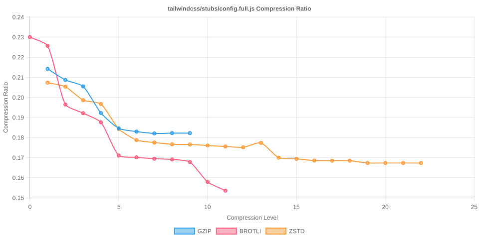

# Node Compression Benchmark

Last updated: 2025-10-14T09:12:26.209Z

This benchmark measures compression time, output size, and compression ratios for several popular npm packages across all gzip, Brotli, and Zstandard compression levels.

## jquery/dist/jquery.min.js

- Original size: 87533 bytes
- Chart: 

| Algorithm | Level | Time (ms) | Size (bytes) | Compression Ratio |
| --- | --- | --- | --- | --- |
| gzip | 1 | 1.872 | 34291 | 0.3917 |
| gzip | 2 | 1.175 | 33282 | 0.3802 |
| gzip | 3 | 1.323 | 32802 | 0.3747 |
| gzip | 4 | 1.500 | 31363 | 0.3583 |
| gzip | 5 | 1.806 | 30525 | 0.3487 |
| gzip | 6 | 2.053 | 30406 | 0.3474 |
| gzip | 7 | 2.265 | 30358 | 0.3468 |
| gzip | 8 | 2.538 | 30342 | 0.3466 |
| gzip | 9 | 2.774 | 30342 | 0.3466 |
| brotli | 0 | 10.451 | 36492 | 0.4169 |
| brotli | 1 | 0.827 | 35042 | 0.4003 |
| brotli | 2 | 14.359 | 32435 | 0.3705 |
| brotli | 3 | 1.331 | 32156 | 0.3674 |
| brotli | 4 | 2.077 | 31402 | 0.3587 |
| brotli | 5 | 2.793 | 29763 | 0.3400 |
| brotli | 6 | 3.443 | 29595 | 0.3381 |
| brotli | 7 | 3.543 | 29534 | 0.3374 |
| brotli | 8 | 4.629 | 29497 | 0.3370 |
| brotli | 9 | 6.163 | 29478 | 0.3368 |
| brotli | 10 | 46.517 | 27918 | 0.3189 |
| brotli | 11 | 119.535 | 27445 | 0.3135 |
| zstd | 1 | 22.157 | 34450 | 0.3936 |
| zstd | 2 | 0.683 | 33281 | 0.3802 |
| zstd | 3 | 0.619 | 32250 | 0.3684 |
| zstd | 4 | 0.677 | 32190 | 0.3677 |
| zstd | 5 | 5.732 | 31247 | 0.3570 |
| zstd | 6 | 1.527 | 30417 | 0.3475 |
| zstd | 7 | 1.778 | 30146 | 0.3444 |
| zstd | 8 | 2.018 | 29980 | 0.3425 |
| zstd | 9 | 2.167 | 29839 | 0.3409 |
| zstd | 10 | 2.388 | 29761 | 0.3400 |
| zstd | 11 | 4.095 | 29660 | 0.3388 |
| zstd | 12 | 4.312 | 29659 | 0.3388 |
| zstd | 13 | 10.806 | 29522 | 0.3373 |
| zstd | 14 | 10.041 | 29032 | 0.3317 |
| zstd | 15 | 9.549 | 29030 | 0.3316 |
| zstd | 16 | 12.891 | 28947 | 0.3307 |
| zstd | 17 | 13.704 | 28947 | 0.3307 |
| zstd | 18 | 13.103 | 28947 | 0.3307 |
| zstd | 19 | 26.264 | 28896 | 0.3301 |
| zstd | 20 | 25.343 | 28896 | 0.3301 |
| zstd | 21 | 25.913 | 28896 | 0.3301 |
| zstd | 22 | 25.279 | 28896 | 0.3301 |

## @expo-google-fonts/noto-sans-jp/NotoSansJP_400Regular.ttf

- Original size: 4548208 bytes
- Chart: 

| Algorithm | Level | Time (ms) | Size (bytes) | Compression Ratio |
| --- | --- | --- | --- | --- |
| gzip | 1 | 102.690 | 3944954 | 0.8674 |
| gzip | 2 | 103.530 | 3940832 | 0.8665 |
| gzip | 3 | 102.975 | 3939509 | 0.8662 |
| gzip | 4 | 110.308 | 3932798 | 0.8647 |
| gzip | 5 | 114.113 | 3927840 | 0.8636 |
| gzip | 6 | 115.993 | 3927057 | 0.8634 |
| gzip | 7 | 119.062 | 3926816 | 0.8634 |
| gzip | 8 | 134.484 | 3926489 | 0.8633 |
| gzip | 9 | 145.538 | 3926321 | 0.8633 |
| brotli | 0 | 14.282 | 4151807 | 0.9128 |
| brotli | 1 | 15.419 | 4096540 | 0.9007 |
| brotli | 2 | 28.694 | 4050843 | 0.8906 |
| brotli | 3 | 34.530 | 4041605 | 0.8886 |
| brotli | 4 | 50.226 | 4019269 | 0.8837 |
| brotli | 5 | 140.530 | 3913415 | 0.8604 |
| brotli | 6 | 213.852 | 3876835 | 0.8524 |
| brotli | 7 | 319.021 | 3845814 | 0.8456 |
| brotli | 8 | 371.580 | 3837329 | 0.8437 |
| brotli | 9 | 950.792 | 3704181 | 0.8144 |
| brotli | 10 | 7681.682 | 3433866 | 0.7550 |
| brotli | 11 | 17141.092 | 3387424 | 0.7448 |
| zstd | 1 | 7.648 | 4090494 | 0.8994 |
| zstd | 2 | 9.621 | 4072473 | 0.8954 |
| zstd | 3 | 28.434 | 3989261 | 0.8771 |
| zstd | 4 | 38.712 | 3936029 | 0.8654 |
| zstd | 5 | 64.092 | 3895281 | 0.8564 |
| zstd | 6 | 67.964 | 3892818 | 0.8559 |
| zstd | 7 | 70.716 | 3849781 | 0.8464 |
| zstd | 8 | 72.033 | 3848338 | 0.8461 |
| zstd | 9 | 76.686 | 3807365 | 0.8371 |
| zstd | 10 | 78.886 | 3784634 | 0.8321 |
| zstd | 11 | 96.906 | 3783880 | 0.8319 |
| zstd | 12 | 125.576 | 3783346 | 0.8318 |
| zstd | 13 | 248.703 | 3782508 | 0.8316 |
| zstd | 14 | 290.624 | 3781552 | 0.8314 |
| zstd | 15 | 325.856 | 3780212 | 0.8311 |
| zstd | 16 | 338.912 | 3757245 | 0.8261 |
| zstd | 17 | 457.371 | 3678921 | 0.8089 |
| zstd | 18 | 606.048 | 3620307 | 0.7960 |
| zstd | 19 | 649.500 | 3619532 | 0.7958 |
| zstd | 20 | 699.641 | 3619532 | 0.7958 |
| zstd | 21 | 758.016 | 3619517 | 0.7958 |
| zstd | 22 | 772.619 | 3619510 | 0.7958 |

## react/umd/react.production.min.js

- Original size: 10751 bytes
- Chart: 

| Algorithm | Level | Time (ms) | Size (bytes) | Compression Ratio |
| --- | --- | --- | --- | --- |
| gzip | 1 | 0.186 | 143 | 0.7526 |
| gzip | 2 | 0.039 | 143 | 0.7526 |
| gzip | 3 | 0.060 | 143 | 0.7526 |
| gzip | 4 | 0.040 | 143 | 0.7526 |
| gzip | 5 | 0.030 | 143 | 0.7526 |
| gzip | 6 | 0.023 | 143 | 0.7526 |
| gzip | 7 | 0.025 | 143 | 0.7526 |
| gzip | 8 | 0.019 | 143 | 0.7526 |
| gzip | 9 | 0.017 | 143 | 0.7526 |
| brotli | 0 | 0.038 | 194 | 1.0211 |
| brotli | 1 | 0.025 | 145 | 0.7632 |
| brotli | 2 | 0.021 | 140 | 0.7368 |
| brotli | 3 | 0.023 | 121 | 0.6368 |
| brotli | 4 | 0.044 | 119 | 0.6263 |
| brotli | 5 | 0.039 | 112 | 0.5895 |
| brotli | 6 | 0.035 | 112 | 0.5895 |
| brotli | 7 | 0.031 | 112 | 0.5895 |
| brotli | 8 | 0.030 | 112 | 0.5895 |
| brotli | 9 | 0.030 | 112 | 0.5895 |
| brotli | 10 | 0.689 | 115 | 0.6053 |
| brotli | 11 | 0.753 | 114 | 0.6000 |
| zstd | 1 | 0.050 | 134 | 0.7053 |
| zstd | 2 | 0.023 | 134 | 0.7053 |
| zstd | 3 | 0.021 | 130 | 0.6842 |
| zstd | 4 | 0.020 | 130 | 0.6842 |
| zstd | 5 | 0.021 | 130 | 0.6842 |
| zstd | 6 | 0.020 | 130 | 0.6842 |
| zstd | 7 | 0.019 | 130 | 0.6842 |
| zstd | 8 | 0.018 | 130 | 0.6842 |
| zstd | 9 | 0.021 | 130 | 0.6842 |
| zstd | 10 | 0.019 | 130 | 0.6842 |
| zstd | 11 | 0.025 | 130 | 0.6842 |
| zstd | 12 | 0.024 | 130 | 0.6842 |
| zstd | 13 | 0.029 | 128 | 0.6737 |
| zstd | 14 | 0.034 | 128 | 0.6737 |
| zstd | 15 | 0.035 | 128 | 0.6737 |
| zstd | 16 | 0.044 | 128 | 0.6737 |
| zstd | 17 | 0.045 | 128 | 0.6737 |
| zstd | 18 | 0.044 | 128 | 0.6737 |
| zstd | 19 | 0.044 | 128 | 0.6737 |
| zstd | 20 | 0.043 | 128 | 0.6737 |
| zstd | 21 | 0.043 | 128 | 0.6737 |
| zstd | 22 | 0.043 | 128 | 0.6737 |

## moment/min/moment.min.js

- Original size: 58890 bytes
- Chart: 

| Algorithm | Level | Time (ms) | Size (bytes) | Compression Ratio |
| --- | --- | --- | --- | --- |
| gzip | 1 | 0.694 | 21216 | 0.3603 |
| gzip | 2 | 0.635 | 20666 | 0.3509 |
| gzip | 3 | 0.769 | 20354 | 0.3456 |
| gzip | 4 | 0.844 | 19475 | 0.3307 |
| gzip | 5 | 1.056 | 18991 | 0.3225 |
| gzip | 6 | 1.243 | 18892 | 0.3208 |
| gzip | 7 | 1.399 | 18860 | 0.3203 |
| gzip | 8 | 1.622 | 18845 | 0.3200 |
| gzip | 9 | 1.634 | 18845 | 0.3200 |
| brotli | 0 | 0.257 | 22733 | 0.3860 |
| brotli | 1 | 0.319 | 22170 | 0.3765 |
| brotli | 2 | 0.572 | 20291 | 0.3446 |
| brotli | 3 | 0.681 | 20119 | 0.3416 |
| brotli | 4 | 1.171 | 19713 | 0.3347 |
| brotli | 5 | 1.648 | 18447 | 0.3132 |
| brotli | 6 | 1.861 | 18343 | 0.3115 |
| brotli | 7 | 2.087 | 18239 | 0.3097 |
| brotli | 8 | 2.161 | 18216 | 0.3093 |
| brotli | 9 | 2.460 | 18172 | 0.3086 |
| brotli | 10 | 26.452 | 17405 | 0.2956 |
| brotli | 11 | 75.298 | 17004 | 0.2887 |
| zstd | 1 | 0.268 | 21483 | 0.3648 |
| zstd | 2 | 0.262 | 20806 | 0.3533 |
| zstd | 3 | 0.294 | 20298 | 0.3447 |
| zstd | 4 | 0.347 | 19924 | 0.3383 |
| zstd | 5 | 0.651 | 19309 | 0.3279 |
| zstd | 6 | 0.862 | 18919 | 0.3213 |
| zstd | 7 | 1.137 | 18815 | 0.3195 |
| zstd | 8 | 1.189 | 18708 | 0.3177 |
| zstd | 9 | 1.256 | 18638 | 0.3165 |
| zstd | 10 | 1.449 | 18583 | 0.3156 |
| zstd | 11 | 2.539 | 18520 | 0.3145 |
| zstd | 12 | 2.543 | 18517 | 0.3144 |
| zstd | 13 | 3.717 | 18417 | 0.3127 |
| zstd | 14 | 5.296 | 17955 | 0.3049 |
| zstd | 15 | 5.584 | 17942 | 0.3047 |
| zstd | 16 | 8.664 | 17892 | 0.3038 |
| zstd | 17 | 8.956 | 17892 | 0.3038 |
| zstd | 18 | 8.854 | 17892 | 0.3038 |
| zstd | 19 | 17.673 | 17845 | 0.3030 |
| zstd | 20 | 17.443 | 17845 | 0.3030 |
| zstd | 21 | 17.430 | 17845 | 0.3030 |
| zstd | 22 | 17.418 | 17845 | 0.3030 |

## vue/dist/vue.global.prod.js

- Original size: 159632 bytes
- Chart: 

| Algorithm | Level | Time (ms) | Size (bytes) | Compression Ratio |
| --- | --- | --- | --- | --- |
| gzip | 1 | 2.628 | 65356 | 0.4094 |
| gzip | 2 | 2.127 | 63714 | 0.3991 |
| gzip | 3 | 2.343 | 62869 | 0.3938 |
| gzip | 4 | 2.600 | 60555 | 0.3793 |
| gzip | 5 | 3.465 | 59000 | 0.3696 |
| gzip | 6 | 4.203 | 58718 | 0.3678 |
| gzip | 7 | 4.562 | 58679 | 0.3676 |
| gzip | 8 | 4.911 | 58664 | 0.3675 |
| gzip | 9 | 4.860 | 58664 | 0.3675 |
| brotli | 0 | 0.704 | 69659 | 0.4364 |
| brotli | 1 | 0.937 | 66737 | 0.4181 |
| brotli | 2 | 1.656 | 61654 | 0.3862 |
| brotli | 3 | 1.970 | 61073 | 0.3826 |
| brotli | 4 | 3.100 | 59860 | 0.3750 |
| brotli | 5 | 4.954 | 56680 | 0.3551 |
| brotli | 6 | 5.316 | 56313 | 0.3528 |
| brotli | 7 | 6.447 | 56043 | 0.3511 |
| brotli | 8 | 7.203 | 55935 | 0.3504 |
| brotli | 9 | 10.957 | 55876 | 0.3500 |
| brotli | 10 | 97.704 | 53247 | 0.3336 |
| brotli | 11 | 251.692 | 52239 | 0.3272 |
| zstd | 1 | 0.716 | 64755 | 0.4057 |
| zstd | 2 | 0.812 | 61864 | 0.3875 |
| zstd | 3 | 1.027 | 61375 | 0.3845 |
| zstd | 4 | 1.821 | 59500 | 0.3727 |
| zstd | 5 | 2.147 | 59001 | 0.3696 |
| zstd | 6 | 2.547 | 58197 | 0.3646 |
| zstd | 7 | 3.010 | 57387 | 0.3595 |
| zstd | 8 | 3.710 | 56930 | 0.3566 |
| zstd | 9 | 4.189 | 56664 | 0.3550 |
| zstd | 10 | 4.971 | 56551 | 0.3543 |
| zstd | 11 | 8.850 | 56308 | 0.3527 |
| zstd | 12 | 10.038 | 56282 | 0.3526 |
| zstd | 13 | 16.439 | 55299 | 0.3464 |
| zstd | 14 | 18.422 | 54885 | 0.3438 |
| zstd | 15 | 17.874 | 54873 | 0.3437 |
| zstd | 16 | 25.101 | 54712 | 0.3427 |
| zstd | 17 | 24.678 | 54712 | 0.3427 |
| zstd | 18 | 42.684 | 54641 | 0.3423 |
| zstd | 19 | 42.740 | 54641 | 0.3423 |
| zstd | 20 | 43.117 | 54641 | 0.3423 |
| zstd | 21 | 43.036 | 54641 | 0.3423 |
| zstd | 22 | 44.352 | 54641 | 0.3423 |

## lodash/lodash.min.js

- Original size: 73015 bytes
- Chart: 

| Algorithm | Level | Time (ms) | Size (bytes) | Compression Ratio |
| --- | --- | --- | --- | --- |
| gzip | 1 | 1.010 | 28848 | 0.3951 |
| gzip | 2 | 0.897 | 28250 | 0.3869 |
| gzip | 3 | 1.001 | 27778 | 0.3804 |
| gzip | 4 | 1.121 | 27025 | 0.3701 |
| gzip | 5 | 1.419 | 26172 | 0.3584 |
| gzip | 6 | 1.805 | 26014 | 0.3563 |
| gzip | 7 | 2.112 | 25988 | 0.3559 |
| gzip | 8 | 2.873 | 25968 | 0.3557 |
| gzip | 9 | 2.876 | 25968 | 0.3557 |
| brotli | 0 | 0.349 | 31067 | 0.4255 |
| brotli | 1 | 0.411 | 29876 | 0.4092 |
| brotli | 2 | 0.726 | 27471 | 0.3762 |
| brotli | 3 | 0.843 | 27246 | 0.3732 |
| brotli | 4 | 1.486 | 26751 | 0.3664 |
| brotli | 5 | 2.286 | 25220 | 0.3454 |
| brotli | 6 | 2.403 | 25102 | 0.3438 |
| brotli | 7 | 3.012 | 24969 | 0.3420 |
| brotli | 8 | 4.847 | 24946 | 0.3417 |
| brotli | 9 | 6.223 | 24897 | 0.3410 |
| brotli | 10 | 39.598 | 23428 | 0.3209 |
| brotli | 11 | 103.691 | 23089 | 0.3162 |
| zstd | 1 | 0.359 | 29043 | 0.3978 |
| zstd | 2 | 0.324 | 28094 | 0.3848 |
| zstd | 3 | 0.407 | 27523 | 0.3769 |
| zstd | 4 | 0.493 | 27149 | 0.3718 |
| zstd | 5 | 0.909 | 26575 | 0.3640 |
| zstd | 6 | 1.278 | 25888 | 0.3546 |
| zstd | 7 | 1.398 | 25718 | 0.3522 |
| zstd | 8 | 1.563 | 25598 | 0.3506 |
| zstd | 9 | 1.682 | 25509 | 0.3494 |
| zstd | 10 | 1.956 | 25448 | 0.3485 |
| zstd | 11 | 3.310 | 25374 | 0.3475 |
| zstd | 12 | 3.424 | 25374 | 0.3475 |
| zstd | 13 | 5.542 | 25232 | 0.3456 |
| zstd | 14 | 7.642 | 24674 | 0.3379 |
| zstd | 15 | 8.229 | 24659 | 0.3377 |
| zstd | 16 | 10.851 | 24543 | 0.3361 |
| zstd | 17 | 10.977 | 24543 | 0.3361 |
| zstd | 18 | 11.048 | 24543 | 0.3361 |
| zstd | 19 | 20.632 | 24504 | 0.3356 |
| zstd | 20 | 20.624 | 24504 | 0.3356 |
| zstd | 21 | 21.053 | 24504 | 0.3356 |
| zstd | 22 | 20.818 | 24504 | 0.3356 |

## normalize.css/normalize.css

- Original size: 6138 bytes
- Chart: 

| Algorithm | Level | Time (ms) | Size (bytes) | Compression Ratio |
| --- | --- | --- | --- | --- |
| gzip | 1 | 0.124 | 1915 | 0.3120 |
| gzip | 2 | 0.086 | 1866 | 0.3040 |
| gzip | 3 | 0.108 | 1845 | 0.3006 |
| gzip | 4 | 0.097 | 1758 | 0.2864 |
| gzip | 5 | 0.118 | 1722 | 0.2805 |
| gzip | 6 | 0.100 | 1722 | 0.2805 |
| gzip | 7 | 0.092 | 1722 | 0.2805 |
| gzip | 8 | 0.089 | 1720 | 0.2802 |
| gzip | 9 | 0.077 | 1720 | 0.2802 |
| brotli | 0 | 0.066 | 2089 | 0.3403 |
| brotli | 1 | 0.055 | 2056 | 0.3350 |
| brotli | 2 | 0.089 | 1909 | 0.3110 |
| brotli | 3 | 0.095 | 1834 | 0.2988 |
| brotli | 4 | 0.211 | 1694 | 0.2760 |
| brotli | 5 | 0.230 | 1557 | 0.2537 |
| brotli | 6 | 0.198 | 1559 | 0.2540 |
| brotli | 7 | 0.220 | 1555 | 0.2533 |
| brotli | 8 | 0.205 | 1555 | 0.2533 |
| brotli | 9 | 3.026 | 1557 | 0.2537 |
| brotli | 10 | 3.274 | 1431 | 0.2331 |
| brotli | 11 | 7.876 | 1398 | 0.2278 |
| zstd | 1 | 0.097 | 1906 | 0.3105 |
| zstd | 2 | 0.053 | 1941 | 0.3162 |
| zstd | 3 | 0.056 | 1853 | 0.3019 |
| zstd | 4 | 0.072 | 1752 | 0.2854 |
| zstd | 5 | 0.087 | 1743 | 0.2840 |
| zstd | 6 | 0.104 | 1730 | 0.2819 |
| zstd | 7 | 0.104 | 1729 | 0.2817 |
| zstd | 8 | 0.089 | 1729 | 0.2817 |
| zstd | 9 | 0.192 | 1728 | 0.2815 |
| zstd | 10 | 0.200 | 1728 | 0.2815 |
| zstd | 11 | 0.309 | 1722 | 0.2805 |
| zstd | 12 | 0.415 | 1718 | 0.2799 |
| zstd | 13 | 0.667 | 1703 | 0.2775 |
| zstd | 14 | 0.707 | 1700 | 0.2770 |
| zstd | 15 | 0.880 | 1700 | 0.2770 |
| zstd | 16 | 1.286 | 1696 | 0.2763 |
| zstd | 17 | 1.563 | 1697 | 0.2765 |
| zstd | 18 | 2.067 | 1697 | 0.2765 |
| zstd | 19 | 1.688 | 1697 | 0.2765 |
| zstd | 20 | 1.673 | 1697 | 0.2765 |
| zstd | 21 | 1.659 | 1697 | 0.2765 |
| zstd | 22 | 1.652 | 1697 | 0.2765 |

## bootstrap/dist/css/bootstrap.min.css

- Original size: 232111 bytes
- Chart: 

| Algorithm | Level | Time (ms) | Size (bytes) | Compression Ratio |
| --- | --- | --- | --- | --- |
| gzip | 1 | 1.257 | 41452 | 0.1786 |
| gzip | 2 | 1.192 | 38418 | 0.1655 |
| gzip | 3 | 1.381 | 36152 | 0.1558 |
| gzip | 4 | 1.761 | 33830 | 0.1457 |
| gzip | 5 | 2.193 | 31408 | 0.1353 |
| gzip | 6 | 2.933 | 30823 | 0.1328 |
| gzip | 7 | 3.595 | 30680 | 0.1322 |
| gzip | 8 | 4.787 | 30670 | 0.1321 |
| gzip | 9 | 4.859 | 30669 | 0.1321 |
| brotli | 0 | 0.481 | 43268 | 0.1864 |
| brotli | 1 | 0.658 | 39941 | 0.1721 |
| brotli | 2 | 1.201 | 36514 | 0.1573 |
| brotli | 3 | 1.470 | 34781 | 0.1498 |
| brotli | 4 | 2.182 | 33048 | 0.1424 |
| brotli | 5 | 2.968 | 28253 | 0.1217 |
| brotli | 6 | 3.361 | 27431 | 0.1182 |
| brotli | 7 | 4.190 | 26971 | 0.1162 |
| brotli | 8 | 4.813 | 26813 | 0.1155 |
| brotli | 9 | 8.652 | 26569 | 0.1145 |
| brotli | 10 | 100.722 | 23482 | 0.1012 |
| brotli | 11 | 323.681 | 22970 | 0.0990 |
| zstd | 1 | 0.594 | 35549 | 0.1532 |
| zstd | 2 | 0.601 | 34301 | 0.1478 |
| zstd | 3 | 0.665 | 34393 | 0.1482 |
| zstd | 4 | 1.561 | 30973 | 0.1334 |
| zstd | 5 | 1.886 | 29744 | 0.1281 |
| zstd | 6 | 2.425 | 29727 | 0.1281 |
| zstd | 7 | 2.310 | 29710 | 0.1280 |
| zstd | 8 | 3.493 | 28645 | 0.1234 |
| zstd | 9 | 4.535 | 28235 | 0.1216 |
| zstd | 10 | 4.477 | 28044 | 0.1208 |
| zstd | 11 | 8.450 | 27895 | 0.1202 |
| zstd | 12 | 10.235 | 27805 | 0.1198 |
| zstd | 13 | 17.800 | 27283 | 0.1175 |
| zstd | 14 | 21.588 | 26828 | 0.1156 |
| zstd | 15 | 28.714 | 26465 | 0.1140 |
| zstd | 16 | 56.888 | 26071 | 0.1123 |
| zstd | 17 | 63.806 | 26041 | 0.1122 |
| zstd | 18 | 85.579 | 26008 | 0.1120 |
| zstd | 19 | 96.794 | 26015 | 0.1121 |
| zstd | 20 | 100.884 | 26014 | 0.1121 |
| zstd | 21 | 101.650 | 26014 | 0.1121 |
| zstd | 22 | 101.807 | 26014 | 0.1121 |

## tailwindcss/stubs/config.full.js

- Original size: 24958 bytes
- Chart: 

| Algorithm | Level | Time (ms) | Size (bytes) | Compression Ratio |
| --- | --- | --- | --- | --- |
| gzip | 1 | 0.237 | 5347 | 0.2142 |
| gzip | 2 | 0.191 | 5209 | 0.2087 |
| gzip | 3 | 0.199 | 5129 | 0.2055 |
| gzip | 4 | 0.280 | 4798 | 0.1922 |
| gzip | 5 | 0.325 | 4607 | 0.1846 |
| gzip | 6 | 0.371 | 4567 | 0.1830 |
| gzip | 7 | 0.412 | 4544 | 0.1821 |
| gzip | 8 | 0.705 | 4548 | 0.1822 |
| gzip | 9 | 0.735 | 4548 | 0.1822 |
| brotli | 0 | 0.117 | 5742 | 0.2301 |
| brotli | 1 | 0.116 | 5634 | 0.2257 |
| brotli | 2 | 0.203 | 4904 | 0.1965 |
| brotli | 3 | 0.226 | 4796 | 0.1922 |
| brotli | 4 | 0.435 | 4682 | 0.1876 |
| brotli | 5 | 0.530 | 4270 | 0.1711 |
| brotli | 6 | 0.558 | 4247 | 0.1702 |
| brotli | 7 | 0.650 | 4230 | 0.1695 |
| brotli | 8 | 0.668 | 4221 | 0.1691 |
| brotli | 9 | 3.502 | 4189 | 0.1678 |
| brotli | 10 | 8.441 | 3941 | 0.1579 |
| brotli | 11 | 26.878 | 3833 | 0.1536 |
| zstd | 1 | 0.124 | 5175 | 0.2073 |
| zstd | 2 | 0.098 | 5125 | 0.2053 |
| zstd | 3 | 0.105 | 4958 | 0.1987 |
| zstd | 4 | 0.131 | 4910 | 0.1967 |
| zstd | 5 | 0.272 | 4600 | 0.1843 |
| zstd | 6 | 0.348 | 4461 | 0.1787 |
| zstd | 7 | 0.412 | 4431 | 0.1775 |
| zstd | 8 | 0.415 | 4409 | 0.1767 |
| zstd | 9 | 0.418 | 4407 | 0.1766 |
| zstd | 10 | 0.501 | 4394 | 0.1761 |
| zstd | 11 | 0.898 | 4382 | 0.1756 |
| zstd | 12 | 1.113 | 4372 | 0.1752 |
| zstd | 13 | 1.504 | 4427 | 0.1774 |
| zstd | 14 | 2.182 | 4242 | 0.1700 |
| zstd | 15 | 2.540 | 4228 | 0.1694 |
| zstd | 16 | 3.999 | 4207 | 0.1686 |
| zstd | 17 | 5.675 | 4205 | 0.1685 |
| zstd | 18 | 7.272 | 4205 | 0.1685 |
| zstd | 19 | 11.192 | 4177 | 0.1674 |
| zstd | 20 | 14.304 | 4177 | 0.1674 |
| zstd | 21 | 14.301 | 4177 | 0.1674 |
| zstd | 22 | 22.919 | 4176 | 0.1673 |
