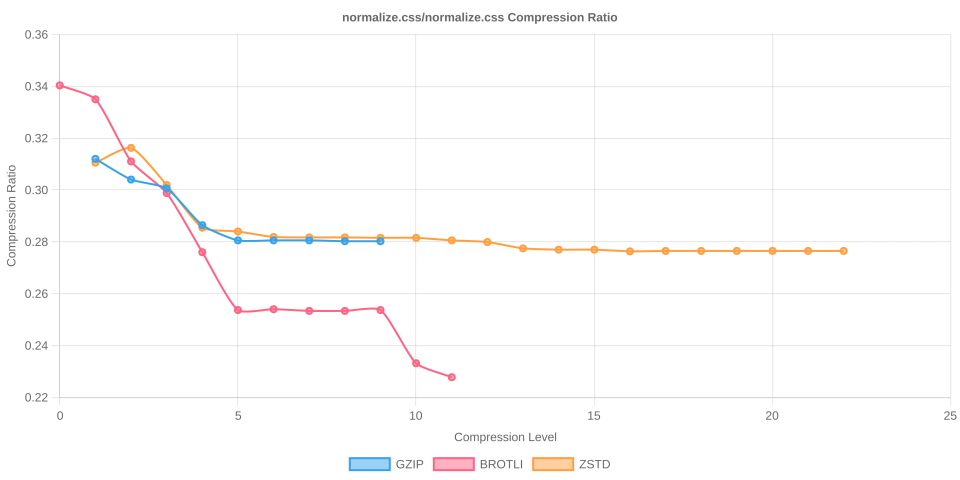

# Node Compression Benchmark

Last updated: 2026-02-23T22:49:32.699Z

This benchmark measures compression time, output size, and compression ratios for several popular npm packages across all gzip, Brotli, and Zstandard compression levels.

## jquery/dist/jquery.min.js

- Original size: 78,748 bytes
- Chart: 

| Algorithm | Level | Time (ms) | Size (bytes) | Compression Ratio |
| --- | --- | --- | --- | --- |
| gzip | 1 | 0.968 | 31,033 | 0.3941 |
| gzip | 2 | 0.970 | 30,134 | 0.3827 |
| gzip | 3 | 1.081 | 29,671 | 0.3768 |
| gzip | 4 | 1.252 | 28,457 | 0.3614 |
| gzip | 5 | 1.579 | 27,721 | 0.3520 |
| gzip | 6 | 1.860 | 27,584 | 0.3503 |
| gzip | 7 | 2.035 | 27,547 | 0.3498 |
| gzip | 8 | 2.331 | 27,530 | 0.3496 |
| gzip | 9 | 2.343 | 27,530 | 0.3496 |
| brotli | 0 | 0.319 | 33,111 | 0.4205 |
| brotli | 1 | 0.463 | 31,803 | 0.4039 |
| brotli | 2 | 0.801 | 29,394 | 0.3733 |
| brotli | 3 | 0.918 | 29,072 | 0.3692 |
| brotli | 4 | 1.505 | 28,392 | 0.3605 |
| brotli | 5 | 2.133 | 27,013 | 0.3430 |
| brotli | 6 | 2.275 | 26,844 | 0.3409 |
| brotli | 7 | 2.642 | 26,773 | 0.3400 |
| brotli | 8 | 2.815 | 26,725 | 0.3394 |
| brotli | 9 | 5.670 | 26,711 | 0.3392 |
| brotli | 10 | 34.736 | 25,340 | 0.3218 |
| brotli | 11 | 104.855 | 24,992 | 0.3174 |
| zstd | 1 | 0.305 | 31,062 | 0.3944 |
| zstd | 2 | 0.369 | 30,069 | 0.3818 |
| zstd | 3 | 0.416 | 29,214 | 0.3710 |
| zstd | 4 | 0.541 | 29,108 | 0.3696 |
| zstd | 5 | 1.307 | 28,349 | 0.3600 |
| zstd | 6 | 1.595 | 27,592 | 0.3504 |
| zstd | 7 | 1.904 | 27,383 | 0.3477 |
| zstd | 8 | 1.997 | 27,237 | 0.3459 |
| zstd | 9 | 2.204 | 27,118 | 0.3444 |
| zstd | 10 | 2.438 | 27,062 | 0.3437 |
| zstd | 11 | 4.236 | 26,969 | 0.3425 |
| zstd | 12 | 4.562 | 26,970 | 0.3425 |
| zstd | 13 | 6.387 | 26,867 | 0.3412 |
| zstd | 14 | 8.948 | 26,432 | 0.3357 |
| zstd | 15 | 9.062 | 26,420 | 0.3355 |
| zstd | 16 | 12.239 | 26,336 | 0.3344 |
| zstd | 17 | 12.184 | 26,336 | 0.3344 |
| zstd | 18 | 12.246 | 26,336 | 0.3344 |
| zstd | 19 | 23.234 | 26,282 | 0.3337 |
| zstd | 20 | 23.067 | 26,282 | 0.3337 |
| zstd | 21 | 23.130 | 26,282 | 0.3337 |
| zstd | 22 | 23.101 | 26,282 | 0.3337 |

## @expo-google-fonts/noto-sans-jp/400Regular/NotoSansJP_400Regular.ttf

- Original size: 5,472,784 bytes
- Chart: 

| Algorithm | Level | Time (ms) | Size (bytes) | Compression Ratio |
| --- | --- | --- | --- | --- |
| gzip | 1 | 84.325 | 3,332,519 | 0.6089 |
| gzip | 2 | 87.267 | 3,287,937 | 0.6008 |
| gzip | 3 | 92.046 | 3,262,028 | 0.5960 |
| gzip | 4 | 104.379 | 3,213,095 | 0.5871 |
| gzip | 5 | 119.527 | 3,166,204 | 0.5785 |
| gzip | 6 | 134.502 | 3,156,147 | 0.5767 |
| gzip | 7 | 142.758 | 3,154,131 | 0.5763 |
| gzip | 8 | 160.435 | 3,153,066 | 0.5761 |
| gzip | 9 | 171.981 | 3,153,021 | 0.5761 |
| brotli | 0 | 19.636 | 3,488,111 | 0.6374 |
| brotli | 1 | 28.332 | 3,325,102 | 0.6076 |
| brotli | 2 | 47.893 | 3,247,965 | 0.5935 |
| brotli | 3 | 61.358 | 3,210,322 | 0.5866 |
| brotli | 4 | 88.584 | 3,052,068 | 0.5577 |
| brotli | 5 | 232.083 | 2,942,981 | 0.5377 |
| brotli | 6 | 335.384 | 2,886,204 | 0.5274 |
| brotli | 7 | 505.410 | 2,841,359 | 0.5192 |
| brotli | 8 | 619.582 | 2,823,303 | 0.5159 |
| brotli | 9 | 809.380 | 2,793,428 | 0.5104 |
| brotli | 10 | 6098.529 | 2,728,891 | 0.4986 |
| brotli | 11 | 13196.142 | 2,651,692 | 0.4845 |
| zstd | 1 | 18.395 | 3,342,771 | 0.6108 |
| zstd | 2 | 22.949 | 3,233,695 | 0.5909 |
| zstd | 3 | 36.754 | 3,139,155 | 0.5736 |
| zstd | 4 | 39.520 | 3,084,237 | 0.5636 |
| zstd | 5 | 65.749 | 3,021,906 | 0.5522 |
| zstd | 6 | 78.224 | 2,994,480 | 0.5472 |
| zstd | 7 | 84.855 | 2,946,701 | 0.5384 |
| zstd | 8 | 98.496 | 2,941,269 | 0.5374 |
| zstd | 9 | 97.661 | 2,901,056 | 0.5301 |
| zstd | 10 | 123.714 | 2,879,072 | 0.5261 |
| zstd | 11 | 147.757 | 2,868,731 | 0.5242 |
| zstd | 12 | 191.293 | 2,866,083 | 0.5237 |
| zstd | 13 | 372.134 | 2,864,062 | 0.5233 |
| zstd | 14 | 439.305 | 2,852,038 | 0.5211 |
| zstd | 15 | 503.344 | 2,844,247 | 0.5197 |
| zstd | 16 | 670.827 | 2,803,911 | 0.5123 |
| zstd | 17 | 822.466 | 2,756,112 | 0.5036 |
| zstd | 18 | 1142.615 | 2,713,297 | 0.4958 |
| zstd | 19 | 1224.170 | 2,710,797 | 0.4953 |
| zstd | 20 | 1246.185 | 2,710,797 | 0.4953 |
| zstd | 21 | 1278.565 | 2,710,761 | 0.4953 |
| zstd | 22 | 1270.494 | 2,710,761 | 0.4953 |

## react/cjs/react.production.js

- Original size: 17,217 bytes
- Chart: 

| Algorithm | Level | Time (ms) | Size (bytes) | Compression Ratio |
| --- | --- | --- | --- | --- |
| gzip | 1 | 0.138 | 4,987 | 0.2897 |
| gzip | 2 | 0.132 | 4,874 | 0.2831 |
| gzip | 3 | 0.149 | 4,806 | 0.2791 |
| gzip | 4 | 0.193 | 4,530 | 0.2631 |
| gzip | 5 | 0.237 | 4,441 | 0.2579 |
| gzip | 6 | 0.274 | 4,425 | 0.2570 |
| gzip | 7 | 0.316 | 4,418 | 0.2566 |
| gzip | 8 | 0.458 | 4,419 | 0.2567 |
| gzip | 9 | 0.462 | 4,419 | 0.2567 |
| brotli | 0 | 0.071 | 5,235 | 0.3041 |
| brotli | 1 | 0.071 | 5,134 | 0.2982 |
| brotli | 2 | 0.141 | 4,741 | 0.2754 |
| brotli | 3 | 0.170 | 4,650 | 0.2701 |
| brotli | 4 | 0.285 | 4,555 | 0.2646 |
| brotli | 5 | 0.368 | 4,276 | 0.2484 |
| brotli | 6 | 0.366 | 4,275 | 0.2483 |
| brotli | 7 | 0.449 | 4,264 | 0.2477 |
| brotli | 8 | 0.471 | 4,257 | 0.2473 |
| brotli | 9 | 0.544 | 4,244 | 0.2465 |
| brotli | 10 | 6.976 | 3,969 | 0.2305 |
| brotli | 11 | 20.443 | 3,872 | 0.2249 |
| zstd | 1 | 0.064 | 4,923 | 0.2859 |
| zstd | 2 | 0.072 | 4,868 | 0.2827 |
| zstd | 3 | 0.096 | 4,717 | 0.2740 |
| zstd | 4 | 0.102 | 4,679 | 0.2718 |
| zstd | 5 | 0.225 | 4,519 | 0.2625 |
| zstd | 6 | 0.261 | 4,437 | 0.2577 |
| zstd | 7 | 0.297 | 4,437 | 0.2577 |
| zstd | 8 | 0.328 | 4,426 | 0.2571 |
| zstd | 9 | 0.372 | 4,420 | 0.2567 |
| zstd | 10 | 0.388 | 4,410 | 0.2561 |
| zstd | 11 | 0.660 | 4,393 | 0.2552 |
| zstd | 12 | 0.680 | 4,391 | 0.2550 |
| zstd | 13 | 0.927 | 4,382 | 0.2545 |
| zstd | 14 | 1.459 | 4,307 | 0.2502 |
| zstd | 15 | 1.559 | 4,303 | 0.2499 |
| zstd | 16 | 2.546 | 4,282 | 0.2487 |
| zstd | 17 | 2.713 | 4,281 | 0.2486 |
| zstd | 18 | 2.701 | 4,281 | 0.2486 |
| zstd | 19 | 5.288 | 4,264 | 0.2477 |
| zstd | 20 | 5.280 | 4,264 | 0.2477 |
| zstd | 21 | 5.281 | 4,264 | 0.2477 |
| zstd | 22 | 5.284 | 4,264 | 0.2477 |

## moment/min/moment.min.js

- Original size: 58,890 bytes
- Chart: 

| Algorithm | Level | Time (ms) | Size (bytes) | Compression Ratio |
| --- | --- | --- | --- | --- |
| gzip | 1 | 0.554 | 21,216 | 0.3603 |
| gzip | 2 | 0.613 | 20,666 | 0.3509 |
| gzip | 3 | 0.677 | 20,354 | 0.3456 |
| gzip | 4 | 0.794 | 19,475 | 0.3307 |
| gzip | 5 | 1.002 | 18,991 | 0.3225 |
| gzip | 6 | 1.210 | 18,892 | 0.3208 |
| gzip | 7 | 1.365 | 18,860 | 0.3203 |
| gzip | 8 | 1.601 | 18,845 | 0.3200 |
| gzip | 9 | 1.603 | 18,845 | 0.3200 |
| brotli | 0 | 0.202 | 22,733 | 0.3860 |
| brotli | 1 | 0.276 | 22,170 | 0.3765 |
| brotli | 2 | 0.516 | 20,291 | 0.3446 |
| brotli | 3 | 0.612 | 20,119 | 0.3416 |
| brotli | 4 | 0.972 | 19,713 | 0.3347 |
| brotli | 5 | 1.428 | 18,447 | 0.3132 |
| brotli | 6 | 1.486 | 18,343 | 0.3115 |
| brotli | 7 | 1.818 | 18,239 | 0.3097 |
| brotli | 8 | 1.975 | 18,216 | 0.3093 |
| brotli | 9 | 2.197 | 18,172 | 0.3086 |
| brotli | 10 | 25.721 | 17,405 | 0.2956 |
| brotli | 11 | 75.001 | 17,004 | 0.2887 |
| zstd | 1 | 0.206 | 21,483 | 0.3648 |
| zstd | 2 | 0.232 | 20,806 | 0.3533 |
| zstd | 3 | 0.274 | 20,298 | 0.3447 |
| zstd | 4 | 0.343 | 19,924 | 0.3383 |
| zstd | 5 | 0.751 | 19,309 | 0.3279 |
| zstd | 6 | 0.871 | 18,919 | 0.3213 |
| zstd | 7 | 1.118 | 18,815 | 0.3195 |
| zstd | 8 | 1.181 | 18,708 | 0.3177 |
| zstd | 9 | 1.273 | 18,638 | 0.3165 |
| zstd | 10 | 1.493 | 18,583 | 0.3156 |
| zstd | 11 | 2.525 | 18,520 | 0.3145 |
| zstd | 12 | 2.552 | 18,517 | 0.3144 |
| zstd | 13 | 3.699 | 18,417 | 0.3127 |
| zstd | 14 | 5.231 | 17,955 | 0.3049 |
| zstd | 15 | 5.625 | 17,942 | 0.3047 |
| zstd | 16 | 8.532 | 17,892 | 0.3038 |
| zstd | 17 | 8.778 | 17,892 | 0.3038 |
| zstd | 18 | 8.887 | 17,892 | 0.3038 |
| zstd | 19 | 17.327 | 17,845 | 0.3030 |
| zstd | 20 | 17.312 | 17,845 | 0.3030 |
| zstd | 21 | 17.261 | 17,845 | 0.3030 |
| zstd | 22 | 17.349 | 17,845 | 0.3030 |

## vue/dist/vue.global.prod.js

- Original size: 162,107 bytes
- Chart: 

| Algorithm | Level | Time (ms) | Size (bytes) | Compression Ratio |
| --- | --- | --- | --- | --- |
| gzip | 1 | 1.873 | 66,047 | 0.4074 |
| gzip | 2 | 2.011 | 64,458 | 0.3976 |
| gzip | 3 | 2.269 | 63,517 | 0.3918 |
| gzip | 4 | 2.572 | 61,223 | 0.3777 |
| gzip | 5 | 3.410 | 59,594 | 0.3676 |
| gzip | 6 | 4.212 | 59,322 | 0.3659 |
| gzip | 7 | 4.579 | 59,287 | 0.3657 |
| gzip | 8 | 4.936 | 59,272 | 0.3656 |
| gzip | 9 | 4.954 | 59,272 | 0.3656 |
| brotli | 0 | 0.622 | 70,300 | 0.4337 |
| brotli | 1 | 0.867 | 67,457 | 0.4161 |
| brotli | 2 | 1.584 | 62,271 | 0.3841 |
| brotli | 3 | 1.897 | 61,644 | 0.3803 |
| brotli | 4 | 2.889 | 60,526 | 0.3734 |
| brotli | 5 | 4.699 | 57,211 | 0.3529 |
| brotli | 6 | 5.109 | 56,859 | 0.3507 |
| brotli | 7 | 6.000 | 56,588 | 0.3491 |
| brotli | 8 | 6.648 | 56,512 | 0.3486 |
| brotli | 9 | 7.853 | 56,424 | 0.3481 |
| brotli | 10 | 97.883 | 53,759 | 0.3316 |
| brotli | 11 | 260.974 | 52,713 | 0.3252 |
| zstd | 1 | 0.615 | 65,369 | 0.4032 |
| zstd | 2 | 0.788 | 62,476 | 0.3854 |
| zstd | 3 | 1.001 | 61,988 | 0.3824 |
| zstd | 4 | 1.954 | 60,125 | 0.3709 |
| zstd | 5 | 2.053 | 59,624 | 0.3678 |
| zstd | 6 | 2.667 | 58,750 | 0.3624 |
| zstd | 7 | 2.956 | 57,945 | 0.3574 |
| zstd | 8 | 3.721 | 57,480 | 0.3546 |
| zstd | 9 | 4.329 | 57,220 | 0.3530 |
| zstd | 10 | 5.168 | 57,112 | 0.3523 |
| zstd | 11 | 9.230 | 56,843 | 0.3507 |
| zstd | 12 | 8.611 | 56,833 | 0.3506 |
| zstd | 13 | 14.675 | 55,857 | 0.3446 |
| zstd | 14 | 17.260 | 55,433 | 0.3420 |
| zstd | 15 | 18.860 | 55,405 | 0.3418 |
| zstd | 16 | 25.343 | 55,232 | 0.3407 |
| zstd | 17 | 25.124 | 55,232 | 0.3407 |
| zstd | 18 | 43.097 | 55,158 | 0.3403 |
| zstd | 19 | 42.977 | 55,158 | 0.3403 |
| zstd | 20 | 43.071 | 55,158 | 0.3403 |
| zstd | 21 | 43.063 | 55,158 | 0.3403 |
| zstd | 22 | 43.189 | 55,158 | 0.3403 |

## lodash/lodash.min.js

- Original size: 73,320 bytes
- Chart: 

| Algorithm | Level | Time (ms) | Size (bytes) | Compression Ratio |
| --- | --- | --- | --- | --- |
| gzip | 1 | 0.804 | 28,961 | 0.3950 |
| gzip | 2 | 0.859 | 28,338 | 0.3865 |
| gzip | 3 | 0.982 | 27,864 | 0.3800 |
| gzip | 4 | 1.107 | 27,117 | 0.3698 |
| gzip | 5 | 1.427 | 26,252 | 0.3580 |
| gzip | 6 | 1.793 | 26,089 | 0.3558 |
| gzip | 7 | 2.115 | 26,063 | 0.3555 |
| gzip | 8 | 2.870 | 26,045 | 0.3552 |
| gzip | 9 | 2.870 | 26,045 | 0.3552 |
| brotli | 0 | 0.274 | 31,176 | 0.4252 |
| brotli | 1 | 0.380 | 29,968 | 0.4087 |
| brotli | 2 | 0.682 | 27,578 | 0.3761 |
| brotli | 3 | 0.798 | 27,378 | 0.3734 |
| brotli | 4 | 1.311 | 26,850 | 0.3662 |
| brotli | 5 | 1.974 | 25,310 | 0.3452 |
| brotli | 6 | 2.096 | 25,195 | 0.3436 |
| brotli | 7 | 2.516 | 25,070 | 0.3419 |
| brotli | 8 | 2.698 | 25,038 | 0.3415 |
| brotli | 9 | 3.196 | 25,002 | 0.3410 |
| brotli | 10 | 38.035 | 23,593 | 0.3218 |
| brotli | 11 | 102.891 | 23,117 | 0.3153 |
| zstd | 1 | 0.259 | 29,125 | 0.3972 |
| zstd | 2 | 0.299 | 28,182 | 0.3844 |
| zstd | 3 | 0.362 | 27,635 | 0.3769 |
| zstd | 4 | 0.469 | 27,244 | 0.3716 |
| zstd | 5 | 0.955 | 26,643 | 0.3634 |
| zstd | 6 | 1.132 | 25,965 | 0.3541 |
| zstd | 7 | 1.384 | 25,807 | 0.3520 |
| zstd | 8 | 1.498 | 25,693 | 0.3504 |
| zstd | 9 | 1.691 | 25,603 | 0.3492 |
| zstd | 10 | 1.987 | 25,540 | 0.3483 |
| zstd | 11 | 3.251 | 25,466 | 0.3473 |
| zstd | 12 | 3.419 | 25,466 | 0.3473 |
| zstd | 13 | 5.439 | 25,330 | 0.3455 |
| zstd | 14 | 7.695 | 24,764 | 0.3378 |
| zstd | 15 | 7.980 | 24,754 | 0.3376 |
| zstd | 16 | 10.971 | 24,629 | 0.3359 |
| zstd | 17 | 10.831 | 24,629 | 0.3359 |
| zstd | 18 | 10.832 | 24,629 | 0.3359 |
| zstd | 19 | 20.687 | 24,592 | 0.3354 |
| zstd | 20 | 20.731 | 24,592 | 0.3354 |
| zstd | 21 | 20.753 | 24,592 | 0.3354 |
| zstd | 22 | 20.849 | 24,592 | 0.3354 |

## normalize.css/normalize.css

- Original size: 6,138 bytes
- Chart: 

| Algorithm | Level | Time (ms) | Size (bytes) | Compression Ratio |
| --- | --- | --- | --- | --- |
| gzip | 1 | 0.065 | 1,915 | 0.3120 |
| gzip | 2 | 0.043 | 1,866 | 0.3040 |
| gzip | 3 | 0.050 | 1,845 | 0.3006 |
| gzip | 4 | 0.069 | 1,758 | 0.2864 |
| gzip | 5 | 0.072 | 1,722 | 0.2805 |
| gzip | 6 | 0.064 | 1,722 | 0.2805 |
| gzip | 7 | 0.062 | 1,722 | 0.2805 |
| gzip | 8 | 0.063 | 1,720 | 0.2802 |
| gzip | 9 | 0.078 | 1,720 | 0.2802 |
| brotli | 0 | 0.026 | 2,089 | 0.3403 |
| brotli | 1 | 0.034 | 2,056 | 0.3350 |
| brotli | 2 | 0.060 | 1,909 | 0.3110 |
| brotli | 3 | 0.067 | 1,834 | 0.2988 |
| brotli | 4 | 0.119 | 1,694 | 0.2760 |
| brotli | 5 | 0.143 | 1,557 | 0.2537 |
| brotli | 6 | 0.130 | 1,559 | 0.2540 |
| brotli | 7 | 0.159 | 1,555 | 0.2533 |
| brotli | 8 | 0.144 | 1,555 | 0.2533 |
| brotli | 9 | 0.181 | 1,557 | 0.2537 |
| brotli | 10 | 3.002 | 1,431 | 0.2331 |
| brotli | 11 | 7.827 | 1,398 | 0.2278 |
| zstd | 1 | 0.039 | 1,906 | 0.3105 |
| zstd | 2 | 0.034 | 1,941 | 0.3162 |
| zstd | 3 | 0.042 | 1,853 | 0.3019 |
| zstd | 4 | 0.059 | 1,752 | 0.2854 |
| zstd | 5 | 0.072 | 1,743 | 0.2840 |
| zstd | 6 | 0.109 | 1,730 | 0.2819 |
| zstd | 7 | 0.071 | 1,729 | 0.2817 |
| zstd | 8 | 0.062 | 1,729 | 0.2817 |
| zstd | 9 | 0.153 | 1,728 | 0.2815 |
| zstd | 10 | 0.146 | 1,728 | 0.2815 |
| zstd | 11 | 0.298 | 1,722 | 0.2805 |
| zstd | 12 | 0.391 | 1,718 | 0.2799 |
| zstd | 13 | 0.628 | 1,703 | 0.2775 |
| zstd | 14 | 0.654 | 1,700 | 0.2770 |
| zstd | 15 | 0.837 | 1,700 | 0.2770 |
| zstd | 16 | 1.262 | 1,696 | 0.2763 |
| zstd | 17 | 1.516 | 1,697 | 0.2765 |
| zstd | 18 | 1.638 | 1,697 | 0.2765 |
| zstd | 19 | 1.651 | 1,697 | 0.2765 |
| zstd | 20 | 1.653 | 1,697 | 0.2765 |
| zstd | 21 | 1.634 | 1,697 | 0.2765 |
| zstd | 22 | 1.639 | 1,697 | 0.2765 |

## bootstrap/dist/css/bootstrap.min.css

- Original size: 232,111 bytes
- Chart: 

| Algorithm | Level | Time (ms) | Size (bytes) | Compression Ratio |
| --- | --- | --- | --- | --- |
| gzip | 1 | 1.091 | 41,452 | 0.1786 |
| gzip | 2 | 1.140 | 38,418 | 0.1655 |
| gzip | 3 | 1.332 | 36,152 | 0.1558 |
| gzip | 4 | 1.751 | 33,830 | 0.1457 |
| gzip | 5 | 2.188 | 31,408 | 0.1353 |
| gzip | 6 | 2.946 | 30,823 | 0.1328 |
| gzip | 7 | 3.562 | 30,680 | 0.1322 |
| gzip | 8 | 4.755 | 30,670 | 0.1321 |
| gzip | 9 | 4.823 | 30,669 | 0.1321 |
| brotli | 0 | 0.436 | 43,268 | 0.1864 |
| brotli | 1 | 0.628 | 39,941 | 0.1721 |
| brotli | 2 | 1.162 | 36,514 | 0.1573 |
| brotli | 3 | 1.405 | 34,781 | 0.1498 |
| brotli | 4 | 1.987 | 33,048 | 0.1424 |
| brotli | 5 | 2.859 | 28,253 | 0.1217 |
| brotli | 6 | 3.167 | 27,431 | 0.1182 |
| brotli | 7 | 3.942 | 26,971 | 0.1162 |
| brotli | 8 | 4.428 | 26,813 | 0.1155 |
| brotli | 9 | 5.373 | 26,569 | 0.1145 |
| brotli | 10 | 97.994 | 23,482 | 0.1012 |
| brotli | 11 | 323.291 | 22,970 | 0.0990 |
| zstd | 1 | 0.485 | 35,549 | 0.1532 |
| zstd | 2 | 0.551 | 34,301 | 0.1478 |
| zstd | 3 | 0.582 | 34,393 | 0.1482 |
| zstd | 4 | 2.139 | 30,973 | 0.1334 |
| zstd | 5 | 2.019 | 29,744 | 0.1281 |
| zstd | 6 | 2.378 | 29,727 | 0.1281 |
| zstd | 7 | 2.743 | 29,710 | 0.1280 |
| zstd | 8 | 2.967 | 28,645 | 0.1234 |
| zstd | 9 | 3.430 | 28,235 | 0.1216 |
| zstd | 10 | 4.561 | 28,044 | 0.1208 |
| zstd | 11 | 8.128 | 27,895 | 0.1202 |
| zstd | 12 | 9.985 | 27,805 | 0.1198 |
| zstd | 13 | 17.327 | 27,283 | 0.1175 |
| zstd | 14 | 21.428 | 26,828 | 0.1156 |
| zstd | 15 | 27.795 | 26,465 | 0.1140 |
| zstd | 16 | 56.634 | 26,071 | 0.1123 |
| zstd | 17 | 64.079 | 26,041 | 0.1122 |
| zstd | 18 | 84.853 | 26,008 | 0.1120 |
| zstd | 19 | 96.848 | 26,015 | 0.1121 |
| zstd | 20 | 101.426 | 26,014 | 0.1121 |
| zstd | 21 | 101.459 | 26,014 | 0.1121 |
| zstd | 22 | 101.306 | 26,014 | 0.1121 |

## cities.json/cities.json

- Original size: 21,953,388 bytes
- Chart: 

| Algorithm | Level | Time (ms) | Size (bytes) | Compression Ratio |
| --- | --- | --- | --- | --- |
| gzip | 1 | 89.439 | 3,751,261 | 0.1709 |
| gzip | 2 | 89.565 | 3,528,967 | 0.1607 |
| gzip | 3 | 108.478 | 3,370,979 | 0.1536 |
| gzip | 4 | 143.638 | 3,328,999 | 0.1516 |
| gzip | 5 | 168.814 | 3,081,077 | 0.1403 |
| gzip | 6 | 214.824 | 3,020,114 | 0.1376 |
| gzip | 7 | 320.199 | 2,903,542 | 0.1323 |
| gzip | 8 | 902.475 | 2,794,554 | 0.1273 |
| gzip | 9 | 1202.852 | 2,783,224 | 0.1268 |
| brotli | 0 | 42.259 | 4,059,162 | 0.1849 |
| brotli | 1 | 58.167 | 3,701,732 | 0.1686 |
| brotli | 2 | 105.593 | 3,357,390 | 0.1529 |
| brotli | 3 | 127.421 | 3,265,779 | 0.1488 |
| brotli | 4 | 162.827 | 3,125,451 | 0.1424 |
| brotli | 5 | 330.233 | 2,774,227 | 0.1264 |
| brotli | 6 | 405.929 | 2,738,409 | 0.1247 |
| brotli | 7 | 534.366 | 2,707,850 | 0.1233 |
| brotli | 8 | 666.296 | 2,687,842 | 0.1224 |
| brotli | 9 | 909.925 | 2,673,141 | 0.1218 |
| brotli | 10 | 12719.525 | 2,315,778 | 0.1055 |
| brotli | 11 | 39324.219 | 2,180,828 | 0.0993 |
| zstd | 1 | 44.007 | 3,380,894 | 0.1540 |
| zstd | 2 | 54.210 | 3,402,497 | 0.1550 |
| zstd | 3 | 67.481 | 3,449,952 | 0.1571 |
| zstd | 4 | 70.345 | 3,454,596 | 0.1574 |
| zstd | 5 | 154.405 | 3,140,901 | 0.1431 |
| zstd | 6 | 218.384 | 2,932,855 | 0.1336 |
| zstd | 7 | 236.256 | 2,887,559 | 0.1315 |
| zstd | 8 | 291.069 | 2,785,481 | 0.1269 |
| zstd | 9 | 300.018 | 2,795,218 | 0.1273 |
| zstd | 10 | 391.328 | 2,753,222 | 0.1254 |
| zstd | 11 | 587.641 | 2,720,543 | 0.1239 |
| zstd | 12 | 635.852 | 2,720,412 | 0.1239 |
| zstd | 13 | 785.265 | 2,680,256 | 0.1221 |
| zstd | 14 | 1015.001 | 2,654,484 | 0.1209 |
| zstd | 15 | 1302.836 | 2,651,235 | 0.1208 |
| zstd | 16 | 3088.756 | 2,535,036 | 0.1155 |
| zstd | 17 | 3445.314 | 2,466,410 | 0.1123 |
| zstd | 18 | 5054.261 | 2,453,943 | 0.1118 |
| zstd | 19 | 9228.111 | 2,384,554 | 0.1086 |
| zstd | 20 | 9457.127 | 2,382,448 | 0.1085 |
| zstd | 21 | 9471.666 | 2,382,300 | 0.1085 |
| zstd | 22 | 9892.124 | 2,378,818 | 0.1084 |

## tailwindcss/theme.css

- Original size: 19,480 bytes
- Chart: 

| Algorithm | Level | Time (ms) | Size (bytes) | Compression Ratio |
| --- | --- | --- | --- | --- |
| gzip | 1 | 0.137 | 5,506 | 0.2826 |
| gzip | 2 | 0.155 | 5,424 | 0.2784 |
| gzip | 3 | 0.173 | 5,356 | 0.2749 |
| gzip | 4 | 0.216 | 5,145 | 0.2641 |
| gzip | 5 | 0.275 | 4,896 | 0.2513 |
| gzip | 6 | 0.377 | 4,884 | 0.2507 |
| gzip | 7 | 0.489 | 4,857 | 0.2493 |
| gzip | 8 | 0.674 | 4,859 | 0.2494 |
| gzip | 9 | 0.640 | 4,859 | 0.2494 |
| brotli | 0 | 0.063 | 6,028 | 0.3094 |
| brotli | 1 | 0.086 | 5,737 | 0.2945 |
| brotli | 2 | 0.153 | 4,944 | 0.2538 |
| brotli | 3 | 0.183 | 4,930 | 0.2531 |
| brotli | 4 | 0.292 | 4,898 | 0.2514 |
| brotli | 5 | 0.440 | 4,581 | 0.2352 |
| brotli | 6 | 0.513 | 4,570 | 0.2346 |
| brotli | 7 | 0.596 | 4,564 | 0.2343 |
| brotli | 8 | 0.669 | 4,561 | 0.2341 |
| brotli | 9 | 0.788 | 4,553 | 0.2337 |
| brotli | 10 | 7.646 | 3,934 | 0.2020 |
| brotli | 11 | 23.775 | 3,824 | 0.1963 |
| zstd | 1 | 0.067 | 5,379 | 0.2761 |
| zstd | 2 | 0.081 | 5,176 | 0.2657 |
| zstd | 3 | 0.098 | 5,169 | 0.2653 |
| zstd | 4 | 0.100 | 5,154 | 0.2646 |
| zstd | 5 | 0.185 | 5,074 | 0.2605 |
| zstd | 6 | 0.262 | 4,797 | 0.2463 |
| zstd | 7 | 0.308 | 4,702 | 0.2414 |
| zstd | 8 | 0.341 | 4,696 | 0.2411 |
| zstd | 9 | 0.416 | 4,690 | 0.2408 |
| zstd | 10 | 0.500 | 4,691 | 0.2408 |
| zstd | 11 | 0.638 | 4,689 | 0.2407 |
| zstd | 12 | 0.698 | 4,687 | 0.2406 |
| zstd | 13 | 1.026 | 4,806 | 0.2467 |
| zstd | 14 | 1.814 | 4,447 | 0.2283 |
| zstd | 15 | 1.923 | 4,446 | 0.2282 |
| zstd | 16 | 2.934 | 4,367 | 0.2242 |
| zstd | 17 | 2.933 | 4,367 | 0.2242 |
| zstd | 18 | 2.935 | 4,367 | 0.2242 |
| zstd | 19 | 5.717 | 4,348 | 0.2232 |
| zstd | 20 | 5.756 | 4,348 | 0.2232 |
| zstd | 21 | 5.782 | 4,348 | 0.2232 |
| zstd | 22 | 5.766 | 4,348 | 0.2232 |
