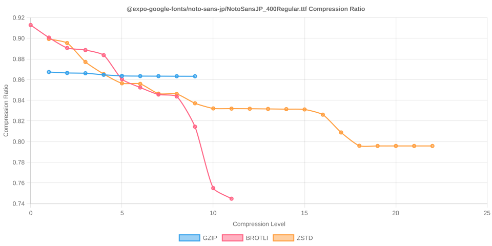

# Node Compression Benchmark

Last updated: 2025-10-14T09:14:23.310Z

This benchmark measures compression time, output size, and compression ratios for several popular npm packages across all gzip, Brotli, and Zstandard compression levels.

## jquery/dist/jquery.min.js

- Original size: 87533 bytes
- Chart: 

| Algorithm | Level | Time (ms) | Size (bytes) | Compression Ratio |
| --- | --- | --- | --- | --- |
| gzip | 1 | 1.881 | 34291 | 0.3917 |
| gzip | 2 | 1.120 | 33282 | 0.3802 |
| gzip | 3 | 1.302 | 32802 | 0.3747 |
| gzip | 4 | 1.475 | 31363 | 0.3583 |
| gzip | 5 | 1.816 | 30525 | 0.3487 |
| gzip | 6 | 2.043 | 30406 | 0.3474 |
| gzip | 7 | 2.246 | 30358 | 0.3468 |
| gzip | 8 | 2.671 | 30342 | 0.3466 |
| gzip | 9 | 2.803 | 30342 | 0.3466 |
| brotli | 0 | 10.423 | 36492 | 0.4169 |
| brotli | 1 | 0.846 | 35042 | 0.4003 |
| brotli | 2 | 16.214 | 32435 | 0.3705 |
| brotli | 3 | 1.320 | 32156 | 0.3674 |
| brotli | 4 | 2.026 | 31402 | 0.3587 |
| brotli | 5 | 2.725 | 29763 | 0.3400 |
| brotli | 6 | 3.064 | 29595 | 0.3381 |
| brotli | 7 | 4.346 | 29534 | 0.3374 |
| brotli | 8 | 5.522 | 29497 | 0.3370 |
| brotli | 9 | 6.946 | 29478 | 0.3368 |
| brotli | 10 | 53.767 | 27918 | 0.3189 |
| brotli | 11 | 119.110 | 27445 | 0.3135 |
| zstd | 1 | 26.307 | 34450 | 0.3936 |
| zstd | 2 | 0.553 | 33281 | 0.3802 |
| zstd | 3 | 0.694 | 32250 | 0.3684 |
| zstd | 4 | 0.699 | 32190 | 0.3677 |
| zstd | 5 | 5.714 | 31247 | 0.3570 |
| zstd | 6 | 1.543 | 30417 | 0.3475 |
| zstd | 7 | 1.927 | 30146 | 0.3444 |
| zstd | 8 | 1.808 | 29980 | 0.3425 |
| zstd | 9 | 2.147 | 29839 | 0.3409 |
| zstd | 10 | 2.402 | 29761 | 0.3400 |
| zstd | 11 | 4.037 | 29660 | 0.3388 |
| zstd | 12 | 4.305 | 29659 | 0.3388 |
| zstd | 13 | 11.934 | 29522 | 0.3373 |
| zstd | 14 | 9.868 | 29032 | 0.3317 |
| zstd | 15 | 9.427 | 29030 | 0.3316 |
| zstd | 16 | 14.098 | 28947 | 0.3307 |
| zstd | 17 | 13.690 | 28947 | 0.3307 |
| zstd | 18 | 12.948 | 28947 | 0.3307 |
| zstd | 19 | 25.952 | 28896 | 0.3301 |
| zstd | 20 | 25.172 | 28896 | 0.3301 |
| zstd | 21 | 26.984 | 28896 | 0.3301 |
| zstd | 22 | 25.884 | 28896 | 0.3301 |

## @expo-google-fonts/noto-sans-jp/NotoSansJP_400Regular.ttf

- Original size: 4548208 bytes
- Chart: 

| Algorithm | Level | Time (ms) | Size (bytes) | Compression Ratio |
| --- | --- | --- | --- | --- |
| gzip | 1 | 100.966 | 3944954 | 0.8674 |
| gzip | 2 | 102.571 | 3940832 | 0.8665 |
| gzip | 3 | 103.315 | 3939509 | 0.8662 |
| gzip | 4 | 110.462 | 3932798 | 0.8647 |
| gzip | 5 | 113.926 | 3927840 | 0.8636 |
| gzip | 6 | 116.356 | 3927057 | 0.8634 |
| gzip | 7 | 119.105 | 3926816 | 0.8634 |
| gzip | 8 | 133.945 | 3926489 | 0.8633 |
| gzip | 9 | 149.108 | 3926321 | 0.8633 |
| brotli | 0 | 14.875 | 4151807 | 0.9128 |
| brotli | 1 | 15.625 | 4096540 | 0.9007 |
| brotli | 2 | 27.900 | 4050843 | 0.8906 |
| brotli | 3 | 35.708 | 4041605 | 0.8886 |
| brotli | 4 | 45.955 | 4019269 | 0.8837 |
| brotli | 5 | 146.671 | 3913415 | 0.8604 |
| brotli | 6 | 216.036 | 3876835 | 0.8524 |
| brotli | 7 | 330.774 | 3845814 | 0.8456 |
| brotli | 8 | 363.619 | 3837329 | 0.8437 |
| brotli | 9 | 950.173 | 3704181 | 0.8144 |
| brotli | 10 | 7767.820 | 3433866 | 0.7550 |
| brotli | 11 | 17149.095 | 3387424 | 0.7448 |
| zstd | 1 | 7.501 | 4090494 | 0.8994 |
| zstd | 2 | 9.389 | 4072473 | 0.8954 |
| zstd | 3 | 31.522 | 3989261 | 0.8771 |
| zstd | 4 | 41.656 | 3936029 | 0.8654 |
| zstd | 5 | 66.984 | 3895281 | 0.8564 |
| zstd | 6 | 67.346 | 3892818 | 0.8559 |
| zstd | 7 | 69.129 | 3849781 | 0.8464 |
| zstd | 8 | 72.482 | 3848338 | 0.8461 |
| zstd | 9 | 71.152 | 3807365 | 0.8371 |
| zstd | 10 | 79.720 | 3784634 | 0.8321 |
| zstd | 11 | 92.856 | 3783880 | 0.8319 |
| zstd | 12 | 124.671 | 3783346 | 0.8318 |
| zstd | 13 | 254.791 | 3782508 | 0.8316 |
| zstd | 14 | 301.536 | 3781552 | 0.8314 |
| zstd | 15 | 317.362 | 3780212 | 0.8311 |
| zstd | 16 | 317.419 | 3757245 | 0.8261 |
| zstd | 17 | 429.697 | 3678921 | 0.8089 |
| zstd | 18 | 608.327 | 3620307 | 0.7960 |
| zstd | 19 | 657.878 | 3619532 | 0.7958 |
| zstd | 20 | 787.824 | 3619532 | 0.7958 |
| zstd | 21 | 843.709 | 3619517 | 0.7958 |
| zstd | 22 | 832.442 | 3619510 | 0.7958 |

## react/umd/react.production.min.js

- Original size: 10751 bytes
- Chart: 

| Algorithm | Level | Time (ms) | Size (bytes) | Compression Ratio |
| --- | --- | --- | --- | --- |
| gzip | 1 | 0.340 | 4492 | 0.4178 |
| gzip | 2 | 0.167 | 4440 | 0.4130 |
| gzip | 3 | 0.151 | 4413 | 0.4105 |
| gzip | 4 | 0.179 | 4318 | 0.4016 |
| gzip | 5 | 0.212 | 4272 | 0.3974 |
| gzip | 6 | 0.193 | 4269 | 0.3971 |
| gzip | 7 | 0.188 | 4269 | 0.3971 |
| gzip | 8 | 0.188 | 4269 | 0.3971 |
| gzip | 9 | 0.177 | 4269 | 0.3971 |
| brotli | 0 | 0.085 | 4897 | 0.4555 |
| brotli | 1 | 0.101 | 4741 | 0.4410 |
| brotli | 2 | 0.135 | 4538 | 0.4221 |
| brotli | 3 | 0.154 | 4463 | 0.4151 |
| brotli | 4 | 0.365 | 4393 | 0.4086 |
| brotli | 5 | 0.491 | 4125 | 0.3837 |
| brotli | 6 | 0.440 | 4119 | 0.3831 |
| brotli | 7 | 0.518 | 4119 | 0.3831 |
| brotli | 8 | 0.537 | 4119 | 0.3831 |
| brotli | 9 | 3.735 | 4110 | 0.3823 |
| brotli | 10 | 5.076 | 3838 | 0.3570 |
| brotli | 11 | 12.685 | 3763 | 0.3500 |
| zstd | 1 | 0.122 | 4535 | 0.4218 |
| zstd | 2 | 0.082 | 4499 | 0.4185 |
| zstd | 3 | 0.084 | 4413 | 0.4105 |
| zstd | 4 | 0.134 | 4323 | 0.4021 |
| zstd | 5 | 0.166 | 4285 | 0.3986 |
| zstd | 6 | 0.210 | 4275 | 0.3976 |
| zstd | 7 | 0.212 | 4271 | 0.3973 |
| zstd | 8 | 0.205 | 4271 | 0.3973 |
| zstd | 9 | 0.338 | 4267 | 0.3969 |
| zstd | 10 | 0.340 | 4267 | 0.3969 |
| zstd | 11 | 0.566 | 4258 | 0.3961 |
| zstd | 12 | 0.773 | 4231 | 0.3935 |
| zstd | 13 | 1.068 | 4214 | 0.3920 |
| zstd | 14 | 1.204 | 4207 | 0.3913 |
| zstd | 15 | 1.148 | 4207 | 0.3913 |
| zstd | 16 | 2.083 | 4194 | 0.3901 |
| zstd | 17 | 2.186 | 4194 | 0.3901 |
| zstd | 18 | 2.135 | 4194 | 0.3901 |
| zstd | 19 | 2.124 | 4194 | 0.3901 |
| zstd | 20 | 2.138 | 4194 | 0.3901 |
| zstd | 21 | 2.142 | 4194 | 0.3901 |
| zstd | 22 | 2.193 | 4194 | 0.3901 |

## moment/min/moment.min.js

- Original size: 58890 bytes
- Chart: 

| Algorithm | Level | Time (ms) | Size (bytes) | Compression Ratio |
| --- | --- | --- | --- | --- |
| gzip | 1 | 0.661 | 21216 | 0.3603 |
| gzip | 2 | 0.650 | 20666 | 0.3509 |
| gzip | 3 | 0.737 | 20354 | 0.3456 |
| gzip | 4 | 0.829 | 19475 | 0.3307 |
| gzip | 5 | 1.049 | 18991 | 0.3225 |
| gzip | 6 | 1.226 | 18892 | 0.3208 |
| gzip | 7 | 1.373 | 18860 | 0.3203 |
| gzip | 8 | 1.627 | 18845 | 0.3200 |
| gzip | 9 | 1.628 | 18845 | 0.3200 |
| brotli | 0 | 0.259 | 22733 | 0.3860 |
| brotli | 1 | 0.343 | 22170 | 0.3765 |
| brotli | 2 | 1.475 | 20291 | 0.3446 |
| brotli | 3 | 0.960 | 20119 | 0.3416 |
| brotli | 4 | 1.633 | 19713 | 0.3347 |
| brotli | 5 | 1.688 | 18447 | 0.3132 |
| brotli | 6 | 1.756 | 18343 | 0.3115 |
| brotli | 7 | 2.261 | 18239 | 0.3097 |
| brotli | 8 | 2.329 | 18216 | 0.3093 |
| brotli | 9 | 5.388 | 18172 | 0.3086 |
| brotli | 10 | 28.863 | 17405 | 0.2956 |
| brotli | 11 | 81.141 | 17004 | 0.2887 |
| zstd | 1 | 0.290 | 21483 | 0.3648 |
| zstd | 2 | 0.265 | 20806 | 0.3533 |
| zstd | 3 | 0.323 | 20298 | 0.3447 |
| zstd | 4 | 0.396 | 19924 | 0.3383 |
| zstd | 5 | 0.852 | 19309 | 0.3279 |
| zstd | 6 | 1.014 | 18919 | 0.3213 |
| zstd | 7 | 1.157 | 18815 | 0.3195 |
| zstd | 8 | 1.171 | 18708 | 0.3177 |
| zstd | 9 | 1.301 | 18638 | 0.3165 |
| zstd | 10 | 1.492 | 18583 | 0.3156 |
| zstd | 11 | 2.580 | 18520 | 0.3145 |
| zstd | 12 | 2.728 | 18517 | 0.3144 |
| zstd | 13 | 3.818 | 18417 | 0.3127 |
| zstd | 14 | 5.525 | 17955 | 0.3049 |
| zstd | 15 | 5.886 | 17942 | 0.3047 |
| zstd | 16 | 10.521 | 17892 | 0.3038 |
| zstd | 17 | 9.164 | 17892 | 0.3038 |
| zstd | 18 | 9.167 | 17892 | 0.3038 |
| zstd | 19 | 17.581 | 17845 | 0.3030 |
| zstd | 20 | 17.564 | 17845 | 0.3030 |
| zstd | 21 | 21.544 | 17845 | 0.3030 |
| zstd | 22 | 23.225 | 17845 | 0.3030 |

## vue/dist/vue.global.prod.js

- Original size: 159632 bytes
- Chart: 

| Algorithm | Level | Time (ms) | Size (bytes) | Compression Ratio |
| --- | --- | --- | --- | --- |
| gzip | 1 | 2.057 | 65356 | 0.4094 |
| gzip | 2 | 2.069 | 63714 | 0.3991 |
| gzip | 3 | 2.316 | 62869 | 0.3938 |
| gzip | 4 | 2.582 | 60555 | 0.3793 |
| gzip | 5 | 3.409 | 59000 | 0.3696 |
| gzip | 6 | 4.161 | 58718 | 0.3678 |
| gzip | 7 | 4.503 | 58679 | 0.3676 |
| gzip | 8 | 4.838 | 58664 | 0.3675 |
| gzip | 9 | 4.841 | 58664 | 0.3675 |
| brotli | 0 | 0.694 | 69659 | 0.4364 |
| brotli | 1 | 0.936 | 66737 | 0.4181 |
| brotli | 2 | 1.667 | 61654 | 0.3862 |
| brotli | 3 | 1.959 | 61073 | 0.3826 |
| brotli | 4 | 3.153 | 59860 | 0.3750 |
| brotli | 5 | 4.974 | 56680 | 0.3551 |
| brotli | 6 | 5.462 | 56313 | 0.3528 |
| brotli | 7 | 7.324 | 56043 | 0.3511 |
| brotli | 8 | 7.816 | 55935 | 0.3504 |
| brotli | 9 | 8.669 | 55876 | 0.3500 |
| brotli | 10 | 97.379 | 53247 | 0.3336 |
| brotli | 11 | 251.772 | 52239 | 0.3272 |
| zstd | 1 | 0.692 | 64755 | 0.4057 |
| zstd | 2 | 0.824 | 61864 | 0.3875 |
| zstd | 3 | 1.035 | 61375 | 0.3845 |
| zstd | 4 | 2.038 | 59500 | 0.3727 |
| zstd | 5 | 2.131 | 59001 | 0.3696 |
| zstd | 6 | 2.654 | 58197 | 0.3646 |
| zstd | 7 | 3.066 | 57387 | 0.3595 |
| zstd | 8 | 3.701 | 56930 | 0.3566 |
| zstd | 9 | 4.273 | 56664 | 0.3550 |
| zstd | 10 | 4.996 | 56551 | 0.3543 |
| zstd | 11 | 8.548 | 56308 | 0.3527 |
| zstd | 12 | 8.762 | 56282 | 0.3526 |
| zstd | 13 | 14.791 | 55299 | 0.3464 |
| zstd | 14 | 17.668 | 54885 | 0.3438 |
| zstd | 15 | 18.505 | 54873 | 0.3437 |
| zstd | 16 | 25.103 | 54712 | 0.3427 |
| zstd | 17 | 24.506 | 54712 | 0.3427 |
| zstd | 18 | 42.333 | 54641 | 0.3423 |
| zstd | 19 | 42.473 | 54641 | 0.3423 |
| zstd | 20 | 42.854 | 54641 | 0.3423 |
| zstd | 21 | 45.893 | 54641 | 0.3423 |
| zstd | 22 | 42.793 | 54641 | 0.3423 |

## lodash/lodash.min.js

- Original size: 73015 bytes
- Chart: 

| Algorithm | Level | Time (ms) | Size (bytes) | Compression Ratio |
| --- | --- | --- | --- | --- |
| gzip | 1 | 0.858 | 28848 | 0.3951 |
| gzip | 2 | 0.892 | 28250 | 0.3869 |
| gzip | 3 | 1.005 | 27778 | 0.3804 |
| gzip | 4 | 1.118 | 27025 | 0.3701 |
| gzip | 5 | 1.441 | 26172 | 0.3584 |
| gzip | 6 | 1.799 | 26014 | 0.3563 |
| gzip | 7 | 2.124 | 25988 | 0.3559 |
| gzip | 8 | 2.865 | 25968 | 0.3557 |
| gzip | 9 | 2.862 | 25968 | 0.3557 |
| brotli | 0 | 0.348 | 31067 | 0.4255 |
| brotli | 1 | 0.439 | 29876 | 0.4092 |
| brotli | 2 | 0.755 | 27471 | 0.3762 |
| brotli | 3 | 0.846 | 27246 | 0.3732 |
| brotli | 4 | 1.545 | 26751 | 0.3664 |
| brotli | 5 | 2.311 | 25220 | 0.3454 |
| brotli | 6 | 2.722 | 25102 | 0.3438 |
| brotli | 7 | 3.237 | 24969 | 0.3420 |
| brotli | 8 | 3.619 | 24946 | 0.3417 |
| brotli | 9 | 6.871 | 24897 | 0.3410 |
| brotli | 10 | 40.359 | 23428 | 0.3209 |
| brotli | 11 | 103.846 | 23089 | 0.3162 |
| zstd | 1 | 0.356 | 29043 | 0.3978 |
| zstd | 2 | 0.331 | 28094 | 0.3848 |
| zstd | 3 | 0.419 | 27523 | 0.3769 |
| zstd | 4 | 0.572 | 27149 | 0.3718 |
| zstd | 5 | 0.967 | 26575 | 0.3640 |
| zstd | 6 | 1.232 | 25888 | 0.3546 |
| zstd | 7 | 1.415 | 25718 | 0.3522 |
| zstd | 8 | 1.510 | 25598 | 0.3506 |
| zstd | 9 | 1.658 | 25509 | 0.3494 |
| zstd | 10 | 2.000 | 25448 | 0.3485 |
| zstd | 11 | 3.522 | 25374 | 0.3475 |
| zstd | 12 | 3.574 | 25374 | 0.3475 |
| zstd | 13 | 5.502 | 25232 | 0.3456 |
| zstd | 14 | 7.907 | 24674 | 0.3379 |
| zstd | 15 | 7.841 | 24659 | 0.3377 |
| zstd | 16 | 11.137 | 24543 | 0.3361 |
| zstd | 17 | 10.952 | 24543 | 0.3361 |
| zstd | 18 | 10.995 | 24543 | 0.3361 |
| zstd | 19 | 20.990 | 24504 | 0.3356 |
| zstd | 20 | 21.066 | 24504 | 0.3356 |
| zstd | 21 | 20.930 | 24504 | 0.3356 |
| zstd | 22 | 20.921 | 24504 | 0.3356 |

## normalize.css/normalize.css

- Original size: 6138 bytes
- Chart: 

| Algorithm | Level | Time (ms) | Size (bytes) | Compression Ratio |
| --- | --- | --- | --- | --- |
| gzip | 1 | 0.131 | 1915 | 0.3120 |
| gzip | 2 | 0.087 | 1866 | 0.3040 |
| gzip | 3 | 0.081 | 1845 | 0.3006 |
| gzip | 4 | 0.092 | 1758 | 0.2864 |
| gzip | 5 | 0.099 | 1722 | 0.2805 |
| gzip | 6 | 0.119 | 1722 | 0.2805 |
| gzip | 7 | 0.095 | 1722 | 0.2805 |
| gzip | 8 | 0.089 | 1720 | 0.2802 |
| gzip | 9 | 0.076 | 1720 | 0.2802 |
| brotli | 0 | 0.063 | 2089 | 0.3403 |
| brotli | 1 | 0.057 | 2056 | 0.3350 |
| brotli | 2 | 0.091 | 1909 | 0.3110 |
| brotli | 3 | 0.098 | 1834 | 0.2988 |
| brotli | 4 | 0.214 | 1694 | 0.2760 |
| brotli | 5 | 0.228 | 1557 | 0.2537 |
| brotli | 6 | 0.201 | 1559 | 0.2540 |
| brotli | 7 | 0.214 | 1555 | 0.2533 |
| brotli | 8 | 0.212 | 1555 | 0.2533 |
| brotli | 9 | 2.991 | 1557 | 0.2537 |
| brotli | 10 | 3.368 | 1431 | 0.2331 |
| brotli | 11 | 7.934 | 1398 | 0.2278 |
| zstd | 1 | 0.086 | 1906 | 0.3105 |
| zstd | 2 | 0.054 | 1941 | 0.3162 |
| zstd | 3 | 0.052 | 1853 | 0.3019 |
| zstd | 4 | 0.071 | 1752 | 0.2854 |
| zstd | 5 | 0.089 | 1743 | 0.2840 |
| zstd | 6 | 0.104 | 1730 | 0.2819 |
| zstd | 7 | 0.105 | 1729 | 0.2817 |
| zstd | 8 | 0.090 | 1729 | 0.2817 |
| zstd | 9 | 0.193 | 1728 | 0.2815 |
| zstd | 10 | 0.198 | 1728 | 0.2815 |
| zstd | 11 | 0.308 | 1722 | 0.2805 |
| zstd | 12 | 0.417 | 1718 | 0.2799 |
| zstd | 13 | 0.698 | 1703 | 0.2775 |
| zstd | 14 | 0.702 | 1700 | 0.2770 |
| zstd | 15 | 0.875 | 1700 | 0.2770 |
| zstd | 16 | 1.291 | 1696 | 0.2763 |
| zstd | 17 | 1.558 | 1697 | 0.2765 |
| zstd | 18 | 1.678 | 1697 | 0.2765 |
| zstd | 19 | 1.647 | 1697 | 0.2765 |
| zstd | 20 | 1.685 | 1697 | 0.2765 |
| zstd | 21 | 1.640 | 1697 | 0.2765 |
| zstd | 22 | 1.634 | 1697 | 0.2765 |

## bootstrap/dist/css/bootstrap.min.css

- Original size: 232111 bytes
- Chart: 

| Algorithm | Level | Time (ms) | Size (bytes) | Compression Ratio |
| --- | --- | --- | --- | --- |
| gzip | 1 | 1.294 | 41452 | 0.1786 |
| gzip | 2 | 1.245 | 38418 | 0.1655 |
| gzip | 3 | 1.392 | 36152 | 0.1558 |
| gzip | 4 | 1.815 | 33830 | 0.1457 |
| gzip | 5 | 2.212 | 31408 | 0.1353 |
| gzip | 6 | 2.964 | 30823 | 0.1328 |
| gzip | 7 | 3.638 | 30680 | 0.1322 |
| gzip | 8 | 4.817 | 30670 | 0.1321 |
| gzip | 9 | 5.024 | 30669 | 0.1321 |
| brotli | 0 | 0.491 | 43268 | 0.1864 |
| brotli | 1 | 0.677 | 39941 | 0.1721 |
| brotli | 2 | 1.283 | 36514 | 0.1573 |
| brotli | 3 | 1.475 | 34781 | 0.1498 |
| brotli | 4 | 2.205 | 33048 | 0.1424 |
| brotli | 5 | 3.028 | 28253 | 0.1217 |
| brotli | 6 | 3.364 | 27431 | 0.1182 |
| brotli | 7 | 4.240 | 26971 | 0.1162 |
| brotli | 8 | 4.822 | 26813 | 0.1155 |
| brotli | 9 | 8.377 | 26569 | 0.1145 |
| brotli | 10 | 100.473 | 23482 | 0.1012 |
| brotli | 11 | 323.095 | 22970 | 0.0990 |
| zstd | 1 | 0.587 | 35549 | 0.1532 |
| zstd | 2 | 0.606 | 34301 | 0.1478 |
| zstd | 3 | 0.667 | 34393 | 0.1482 |
| zstd | 4 | 2.398 | 30973 | 0.1334 |
| zstd | 5 | 2.075 | 29744 | 0.1281 |
| zstd | 6 | 2.442 | 29727 | 0.1281 |
| zstd | 7 | 2.596 | 29710 | 0.1280 |
| zstd | 8 | 3.152 | 28645 | 0.1234 |
| zstd | 9 | 3.372 | 28235 | 0.1216 |
| zstd | 10 | 4.499 | 28044 | 0.1208 |
| zstd | 11 | 8.478 | 27895 | 0.1202 |
| zstd | 12 | 10.316 | 27805 | 0.1198 |
| zstd | 13 | 17.900 | 27283 | 0.1175 |
| zstd | 14 | 22.077 | 26828 | 0.1156 |
| zstd | 15 | 28.843 | 26465 | 0.1140 |
| zstd | 16 | 56.554 | 26071 | 0.1123 |
| zstd | 17 | 64.348 | 26041 | 0.1122 |
| zstd | 18 | 85.894 | 26008 | 0.1120 |
| zstd | 19 | 98.157 | 26015 | 0.1121 |
| zstd | 20 | 102.467 | 26014 | 0.1121 |
| zstd | 21 | 102.523 | 26014 | 0.1121 |
| zstd | 22 | 103.751 | 26014 | 0.1121 |

## tailwindcss/stubs/config.full.js

- Original size: 24958 bytes
- Chart: 

| Algorithm | Level | Time (ms) | Size (bytes) | Compression Ratio |
| --- | --- | --- | --- | --- |
| gzip | 1 | 0.246 | 5347 | 0.2142 |
| gzip | 2 | 0.199 | 5209 | 0.2087 |
| gzip | 3 | 0.217 | 5129 | 0.2055 |
| gzip | 4 | 0.251 | 4798 | 0.1922 |
| gzip | 5 | 0.309 | 4607 | 0.1846 |
| gzip | 6 | 0.363 | 4567 | 0.1830 |
| gzip | 7 | 0.419 | 4544 | 0.1821 |
| gzip | 8 | 0.698 | 4548 | 0.1822 |
| gzip | 9 | 0.710 | 4548 | 0.1822 |
| brotli | 0 | 0.117 | 5742 | 0.2301 |
| brotli | 1 | 0.132 | 5634 | 0.2257 |
| brotli | 2 | 0.205 | 4904 | 0.1965 |
| brotli | 3 | 0.229 | 4796 | 0.1922 |
| brotli | 4 | 0.417 | 4682 | 0.1876 |
| brotli | 5 | 0.551 | 4270 | 0.1711 |
| brotli | 6 | 0.542 | 4247 | 0.1702 |
| brotli | 7 | 0.632 | 4230 | 0.1695 |
| brotli | 8 | 0.665 | 4221 | 0.1691 |
| brotli | 9 | 3.595 | 4189 | 0.1678 |
| brotli | 10 | 8.469 | 3941 | 0.1579 |
| brotli | 11 | 26.955 | 3833 | 0.1536 |
| zstd | 1 | 0.128 | 5175 | 0.2073 |
| zstd | 2 | 0.103 | 5125 | 0.2053 |
| zstd | 3 | 0.109 | 4958 | 0.1987 |
| zstd | 4 | 0.119 | 4910 | 0.1967 |
| zstd | 5 | 0.207 | 4600 | 0.1843 |
| zstd | 6 | 0.365 | 4461 | 0.1787 |
| zstd | 7 | 0.348 | 4431 | 0.1775 |
| zstd | 8 | 0.373 | 4409 | 0.1767 |
| zstd | 9 | 0.414 | 4407 | 0.1766 |
| zstd | 10 | 0.477 | 4394 | 0.1761 |
| zstd | 11 | 0.921 | 4382 | 0.1756 |
| zstd | 12 | 1.142 | 4372 | 0.1752 |
| zstd | 13 | 1.556 | 4427 | 0.1774 |
| zstd | 14 | 2.175 | 4242 | 0.1700 |
| zstd | 15 | 2.558 | 4228 | 0.1694 |
| zstd | 16 | 4.031 | 4207 | 0.1686 |
| zstd | 17 | 5.714 | 4205 | 0.1685 |
| zstd | 18 | 7.246 | 4205 | 0.1685 |
| zstd | 19 | 11.230 | 4177 | 0.1674 |
| zstd | 20 | 14.318 | 4177 | 0.1674 |
| zstd | 21 | 14.633 | 4177 | 0.1674 |
| zstd | 22 | 23.009 | 4176 | 0.1673 |
