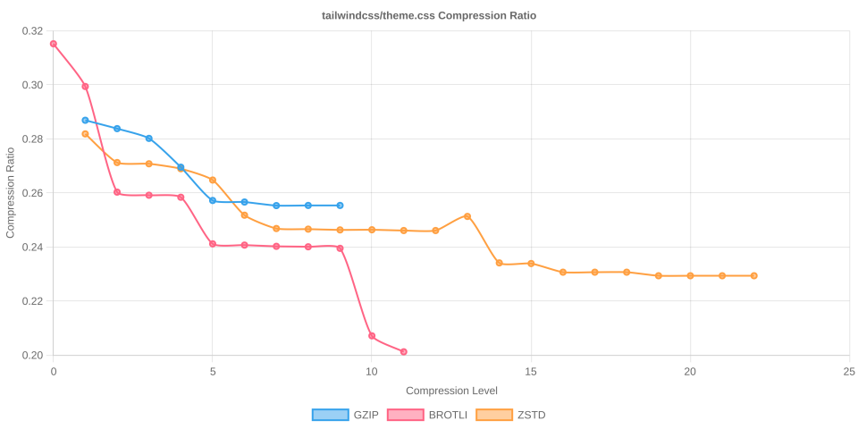

# Node Compression Benchmark

Last updated: 2026-02-18T21:24:18.207Z

This benchmark measures compression time, output size, and compression ratios for several popular npm packages across all gzip, Brotli, and Zstandard compression levels.

## jquery/dist/jquery.min.js

- Original size: 78,748 bytes
- Chart: 

| Algorithm | Level | Time (ms) | Size (bytes) | Compression Ratio |
| --- | --- | --- | --- | --- |
| gzip | 1 | 1.390 | 31,033 | 0.3941 |
| gzip | 2 | 1.451 | 30,134 | 0.3827 |
| gzip | 3 | 1.556 | 29,671 | 0.3768 |
| gzip | 4 | 1.799 | 28,457 | 0.3614 |
| gzip | 5 | 2.229 | 27,721 | 0.3520 |
| gzip | 6 | 2.562 | 27,584 | 0.3503 |
| gzip | 7 | 2.731 | 27,547 | 0.3498 |
| gzip | 8 | 3.120 | 27,530 | 0.3496 |
| gzip | 9 | 3.092 | 27,530 | 0.3496 |
| brotli | 0 | 0.326 | 33,111 | 0.4205 |
| brotli | 1 | 0.487 | 31,803 | 0.4039 |
| brotli | 2 | 0.756 | 29,394 | 0.3733 |
| brotli | 3 | 0.905 | 29,072 | 0.3692 |
| brotli | 4 | 1.481 | 28,392 | 0.3605 |
| brotli | 5 | 2.117 | 27,013 | 0.3430 |
| brotli | 6 | 2.243 | 26,844 | 0.3409 |
| brotli | 7 | 2.720 | 26,773 | 0.3400 |
| brotli | 8 | 2.980 | 26,725 | 0.3394 |
| brotli | 9 | 6.574 | 26,711 | 0.3392 |
| brotli | 10 | 35.874 | 25,340 | 0.3218 |
| brotli | 11 | 110.929 | 24,992 | 0.3174 |
| zstd | 1 | 0.302 | 31,062 | 0.3944 |
| zstd | 2 | 0.442 | 30,069 | 0.3818 |
| zstd | 3 | 0.465 | 29,214 | 0.3710 |
| zstd | 4 | 0.549 | 29,108 | 0.3696 |
| zstd | 5 | 1.364 | 28,349 | 0.3600 |
| zstd | 6 | 1.685 | 27,592 | 0.3504 |
| zstd | 7 | 1.951 | 27,383 | 0.3477 |
| zstd | 8 | 2.079 | 27,237 | 0.3459 |
| zstd | 9 | 2.263 | 27,118 | 0.3444 |
| zstd | 10 | 2.510 | 27,062 | 0.3437 |
| zstd | 11 | 4.377 | 26,969 | 0.3425 |
| zstd | 12 | 4.733 | 26,970 | 0.3425 |
| zstd | 13 | 6.697 | 26,867 | 0.3412 |
| zstd | 14 | 9.204 | 26,432 | 0.3357 |
| zstd | 15 | 9.498 | 26,420 | 0.3355 |
| zstd | 16 | 12.711 | 26,336 | 0.3344 |
| zstd | 17 | 12.682 | 26,336 | 0.3344 |
| zstd | 18 | 12.630 | 26,336 | 0.3344 |
| zstd | 19 | 23.804 | 26,282 | 0.3337 |
| zstd | 20 | 23.759 | 26,282 | 0.3337 |
| zstd | 21 | 24.172 | 26,282 | 0.3337 |
| zstd | 22 | 23.817 | 26,282 | 0.3337 |

## @expo-google-fonts/noto-sans-jp/400Regular/NotoSansJP_400Regular.ttf

- Original size: 5,472,784 bytes
- Chart: 

| Algorithm | Level | Time (ms) | Size (bytes) | Compression Ratio |
| --- | --- | --- | --- | --- |
| gzip | 1 | 84.185 | 3,332,519 | 0.6089 |
| gzip | 2 | 87.533 | 3,287,937 | 0.6008 |
| gzip | 3 | 92.377 | 3,262,028 | 0.5960 |
| gzip | 4 | 104.346 | 3,213,095 | 0.5871 |
| gzip | 5 | 119.743 | 3,166,204 | 0.5785 |
| gzip | 6 | 134.116 | 3,156,147 | 0.5767 |
| gzip | 7 | 143.192 | 3,154,131 | 0.5763 |
| gzip | 8 | 159.969 | 3,153,066 | 0.5761 |
| gzip | 9 | 172.212 | 3,153,021 | 0.5761 |
| brotli | 0 | 20.241 | 3,488,111 | 0.6374 |
| brotli | 1 | 28.525 | 3,325,102 | 0.6076 |
| brotli | 2 | 48.773 | 3,247,965 | 0.5935 |
| brotli | 3 | 62.017 | 3,210,322 | 0.5866 |
| brotli | 4 | 97.689 | 3,052,068 | 0.5577 |
| brotli | 5 | 249.409 | 2,942,981 | 0.5377 |
| brotli | 6 | 343.202 | 2,886,204 | 0.5274 |
| brotli | 7 | 567.226 | 2,841,359 | 0.5192 |
| brotli | 8 | 767.025 | 2,823,303 | 0.5159 |
| brotli | 9 | 1012.707 | 2,793,428 | 0.5104 |
| brotli | 10 | 7080.159 | 2,728,891 | 0.4986 |
| brotli | 11 | 13751.323 | 2,651,692 | 0.4845 |
| zstd | 1 | 18.477 | 3,342,771 | 0.6108 |
| zstd | 2 | 22.787 | 3,233,695 | 0.5909 |
| zstd | 3 | 36.494 | 3,139,155 | 0.5736 |
| zstd | 4 | 40.001 | 3,084,237 | 0.5636 |
| zstd | 5 | 67.778 | 3,021,906 | 0.5522 |
| zstd | 6 | 80.259 | 2,994,480 | 0.5472 |
| zstd | 7 | 85.983 | 2,946,701 | 0.5384 |
| zstd | 8 | 101.796 | 2,941,269 | 0.5374 |
| zstd | 9 | 111.570 | 2,901,056 | 0.5301 |
| zstd | 10 | 137.163 | 2,879,072 | 0.5261 |
| zstd | 11 | 201.864 | 2,868,731 | 0.5242 |
| zstd | 12 | 232.551 | 2,866,083 | 0.5237 |
| zstd | 13 | 537.519 | 2,864,062 | 0.5233 |
| zstd | 14 | 541.620 | 2,852,038 | 0.5211 |
| zstd | 15 | 640.919 | 2,844,247 | 0.5197 |
| zstd | 16 | 826.954 | 2,803,911 | 0.5123 |
| zstd | 17 | 1047.371 | 2,756,112 | 0.5036 |
| zstd | 18 | 1374.904 | 2,713,297 | 0.4958 |
| zstd | 19 | 1456.499 | 2,710,797 | 0.4953 |
| zstd | 20 | 1424.817 | 2,710,797 | 0.4953 |
| zstd | 21 | 1517.680 | 2,710,761 | 0.4953 |
| zstd | 22 | 1448.632 | 2,710,761 | 0.4953 |

## react/cjs/react.production.js

- Original size: 17,217 bytes
- Chart: 

| Algorithm | Level | Time (ms) | Size (bytes) | Compression Ratio |
| --- | --- | --- | --- | --- |
| gzip | 1 | 0.134 | 4,987 | 0.2897 |
| gzip | 2 | 0.141 | 4,874 | 0.2831 |
| gzip | 3 | 0.165 | 4,806 | 0.2791 |
| gzip | 4 | 0.190 | 4,530 | 0.2631 |
| gzip | 5 | 0.230 | 4,441 | 0.2579 |
| gzip | 6 | 0.277 | 4,425 | 0.2570 |
| gzip | 7 | 0.316 | 4,418 | 0.2566 |
| gzip | 8 | 0.463 | 4,419 | 0.2567 |
| gzip | 9 | 0.470 | 4,419 | 0.2567 |
| brotli | 0 | 0.058 | 5,235 | 0.3041 |
| brotli | 1 | 0.080 | 5,134 | 0.2982 |
| brotli | 2 | 0.146 | 4,741 | 0.2754 |
| brotli | 3 | 0.166 | 4,650 | 0.2701 |
| brotli | 4 | 0.286 | 4,555 | 0.2646 |
| brotli | 5 | 0.376 | 4,276 | 0.2484 |
| brotli | 6 | 0.368 | 4,275 | 0.2483 |
| brotli | 7 | 0.450 | 4,264 | 0.2477 |
| brotli | 8 | 0.461 | 4,257 | 0.2473 |
| brotli | 9 | 0.547 | 4,244 | 0.2465 |
| brotli | 10 | 7.080 | 3,969 | 0.2305 |
| brotli | 11 | 20.794 | 3,872 | 0.2249 |
| zstd | 1 | 0.071 | 4,923 | 0.2859 |
| zstd | 2 | 0.079 | 4,868 | 0.2827 |
| zstd | 3 | 0.106 | 4,717 | 0.2740 |
| zstd | 4 | 0.114 | 4,679 | 0.2718 |
| zstd | 5 | 0.233 | 4,519 | 0.2625 |
| zstd | 6 | 0.276 | 4,437 | 0.2577 |
| zstd | 7 | 0.316 | 4,437 | 0.2577 |
| zstd | 8 | 0.346 | 4,426 | 0.2571 |
| zstd | 9 | 0.378 | 4,420 | 0.2567 |
| zstd | 10 | 0.425 | 4,410 | 0.2561 |
| zstd | 11 | 0.662 | 4,393 | 0.2552 |
| zstd | 12 | 0.691 | 4,391 | 0.2550 |
| zstd | 13 | 0.957 | 4,382 | 0.2545 |
| zstd | 14 | 1.467 | 4,307 | 0.2502 |
| zstd | 15 | 1.572 | 4,303 | 0.2499 |
| zstd | 16 | 2.566 | 4,282 | 0.2487 |
| zstd | 17 | 2.754 | 4,281 | 0.2486 |
| zstd | 18 | 2.720 | 4,281 | 0.2486 |
| zstd | 19 | 5.338 | 4,264 | 0.2477 |
| zstd | 20 | 5.304 | 4,264 | 0.2477 |
| zstd | 21 | 5.326 | 4,264 | 0.2477 |
| zstd | 22 | 5.337 | 4,264 | 0.2477 |

## moment/min/moment.min.js

- Original size: 58,890 bytes
- Chart: 

| Algorithm | Level | Time (ms) | Size (bytes) | Compression Ratio |
| --- | --- | --- | --- | --- |
| gzip | 1 | 0.556 | 21,216 | 0.3603 |
| gzip | 2 | 0.604 | 20,666 | 0.3509 |
| gzip | 3 | 0.681 | 20,354 | 0.3456 |
| gzip | 4 | 0.801 | 19,475 | 0.3307 |
| gzip | 5 | 1.019 | 18,991 | 0.3225 |
| gzip | 6 | 1.234 | 18,892 | 0.3208 |
| gzip | 7 | 1.368 | 18,860 | 0.3203 |
| gzip | 8 | 1.605 | 18,845 | 0.3200 |
| gzip | 9 | 1.614 | 18,845 | 0.3200 |
| brotli | 0 | 0.217 | 22,733 | 0.3860 |
| brotli | 1 | 0.285 | 22,170 | 0.3765 |
| brotli | 2 | 0.516 | 20,291 | 0.3446 |
| brotli | 3 | 0.618 | 20,119 | 0.3416 |
| brotli | 4 | 0.977 | 19,713 | 0.3347 |
| brotli | 5 | 1.419 | 18,447 | 0.3132 |
| brotli | 6 | 1.488 | 18,343 | 0.3115 |
| brotli | 7 | 1.794 | 18,239 | 0.3097 |
| brotli | 8 | 1.907 | 18,216 | 0.3093 |
| brotli | 9 | 2.226 | 18,172 | 0.3086 |
| brotli | 10 | 26.363 | 17,405 | 0.2956 |
| brotli | 11 | 75.951 | 17,004 | 0.2887 |
| zstd | 1 | 0.212 | 21,483 | 0.3648 |
| zstd | 2 | 0.233 | 20,806 | 0.3533 |
| zstd | 3 | 0.280 | 20,298 | 0.3447 |
| zstd | 4 | 0.345 | 19,924 | 0.3383 |
| zstd | 5 | 0.758 | 19,309 | 0.3279 |
| zstd | 6 | 0.898 | 18,919 | 0.3213 |
| zstd | 7 | 1.051 | 18,815 | 0.3195 |
| zstd | 8 | 1.169 | 18,708 | 0.3177 |
| zstd | 9 | 1.262 | 18,638 | 0.3165 |
| zstd | 10 | 1.485 | 18,583 | 0.3156 |
| zstd | 11 | 2.523 | 18,520 | 0.3145 |
| zstd | 12 | 2.522 | 18,517 | 0.3144 |
| zstd | 13 | 3.841 | 18,417 | 0.3127 |
| zstd | 14 | 5.531 | 17,955 | 0.3049 |
| zstd | 15 | 5.617 | 17,942 | 0.3047 |
| zstd | 16 | 8.635 | 17,892 | 0.3038 |
| zstd | 17 | 8.846 | 17,892 | 0.3038 |
| zstd | 18 | 8.812 | 17,892 | 0.3038 |
| zstd | 19 | 17.613 | 17,845 | 0.3030 |
| zstd | 20 | 17.506 | 17,845 | 0.3030 |
| zstd | 21 | 17.506 | 17,845 | 0.3030 |
| zstd | 22 | 17.462 | 17,845 | 0.3030 |

## vue/dist/vue.global.prod.js

- Original size: 162,107 bytes
- Chart: 

| Algorithm | Level | Time (ms) | Size (bytes) | Compression Ratio |
| --- | --- | --- | --- | --- |
| gzip | 1 | 1.849 | 66,047 | 0.4074 |
| gzip | 2 | 2.005 | 64,458 | 0.3976 |
| gzip | 3 | 2.328 | 63,517 | 0.3918 |
| gzip | 4 | 2.612 | 61,223 | 0.3777 |
| gzip | 5 | 3.452 | 59,594 | 0.3676 |
| gzip | 6 | 4.215 | 59,322 | 0.3659 |
| gzip | 7 | 4.622 | 59,287 | 0.3657 |
| gzip | 8 | 4.976 | 59,272 | 0.3656 |
| gzip | 9 | 4.919 | 59,272 | 0.3656 |
| brotli | 0 | 0.638 | 70,300 | 0.4337 |
| brotli | 1 | 0.863 | 67,457 | 0.4161 |
| brotli | 2 | 1.596 | 62,271 | 0.3841 |
| brotli | 3 | 1.927 | 61,644 | 0.3803 |
| brotli | 4 | 2.993 | 60,526 | 0.3734 |
| brotli | 5 | 4.694 | 57,211 | 0.3529 |
| brotli | 6 | 5.134 | 56,859 | 0.3507 |
| brotli | 7 | 6.284 | 56,588 | 0.3491 |
| brotli | 8 | 7.517 | 56,512 | 0.3486 |
| brotli | 9 | 8.120 | 56,424 | 0.3481 |
| brotli | 10 | 99.977 | 53,759 | 0.3316 |
| brotli | 11 | 261.798 | 52,713 | 0.3252 |
| zstd | 1 | 0.627 | 65,369 | 0.4032 |
| zstd | 2 | 0.785 | 62,476 | 0.3854 |
| zstd | 3 | 0.997 | 61,988 | 0.3824 |
| zstd | 4 | 2.039 | 60,125 | 0.3709 |
| zstd | 5 | 2.104 | 59,624 | 0.3678 |
| zstd | 6 | 2.614 | 58,750 | 0.3624 |
| zstd | 7 | 3.012 | 57,945 | 0.3574 |
| zstd | 8 | 3.722 | 57,480 | 0.3546 |
| zstd | 9 | 4.275 | 57,220 | 0.3530 |
| zstd | 10 | 5.289 | 57,112 | 0.3523 |
| zstd | 11 | 8.463 | 56,843 | 0.3507 |
| zstd | 12 | 8.670 | 56,833 | 0.3506 |
| zstd | 13 | 14.862 | 55,857 | 0.3446 |
| zstd | 14 | 17.536 | 55,433 | 0.3420 |
| zstd | 15 | 18.935 | 55,405 | 0.3418 |
| zstd | 16 | 25.878 | 55,232 | 0.3407 |
| zstd | 17 | 25.812 | 55,232 | 0.3407 |
| zstd | 18 | 44.182 | 55,158 | 0.3403 |
| zstd | 19 | 44.499 | 55,158 | 0.3403 |
| zstd | 20 | 44.043 | 55,158 | 0.3403 |
| zstd | 21 | 43.817 | 55,158 | 0.3403 |
| zstd | 22 | 43.503 | 55,158 | 0.3403 |

## lodash/lodash.min.js

- Original size: 73,320 bytes
- Chart: 

| Algorithm | Level | Time (ms) | Size (bytes) | Compression Ratio |
| --- | --- | --- | --- | --- |
| gzip | 1 | 0.783 | 28,961 | 0.3950 |
| gzip | 2 | 0.857 | 28,338 | 0.3865 |
| gzip | 3 | 0.990 | 27,864 | 0.3800 |
| gzip | 4 | 1.099 | 27,117 | 0.3698 |
| gzip | 5 | 1.412 | 26,252 | 0.3580 |
| gzip | 6 | 1.792 | 26,089 | 0.3558 |
| gzip | 7 | 2.119 | 26,063 | 0.3555 |
| gzip | 8 | 2.870 | 26,045 | 0.3552 |
| gzip | 9 | 2.889 | 26,045 | 0.3552 |
| brotli | 0 | 0.272 | 31,176 | 0.4252 |
| brotli | 1 | 0.378 | 29,968 | 0.4087 |
| brotli | 2 | 0.684 | 27,578 | 0.3761 |
| brotli | 3 | 0.803 | 27,378 | 0.3734 |
| brotli | 4 | 1.325 | 26,850 | 0.3662 |
| brotli | 5 | 2.000 | 25,310 | 0.3452 |
| brotli | 6 | 2.102 | 25,195 | 0.3436 |
| brotli | 7 | 2.547 | 25,070 | 0.3419 |
| brotli | 8 | 2.726 | 25,038 | 0.3415 |
| brotli | 9 | 3.430 | 25,002 | 0.3410 |
| brotli | 10 | 38.457 | 23,593 | 0.3218 |
| brotli | 11 | 104.072 | 23,117 | 0.3153 |
| zstd | 1 | 0.267 | 29,125 | 0.3972 |
| zstd | 2 | 0.309 | 28,182 | 0.3844 |
| zstd | 3 | 0.365 | 27,635 | 0.3769 |
| zstd | 4 | 0.494 | 27,244 | 0.3716 |
| zstd | 5 | 0.958 | 26,643 | 0.3634 |
| zstd | 6 | 1.196 | 25,965 | 0.3541 |
| zstd | 7 | 1.400 | 25,807 | 0.3520 |
| zstd | 8 | 1.549 | 25,693 | 0.3504 |
| zstd | 9 | 1.696 | 25,603 | 0.3492 |
| zstd | 10 | 2.016 | 25,540 | 0.3483 |
| zstd | 11 | 3.342 | 25,466 | 0.3473 |
| zstd | 12 | 3.549 | 25,466 | 0.3473 |
| zstd | 13 | 5.496 | 25,330 | 0.3455 |
| zstd | 14 | 7.615 | 24,764 | 0.3378 |
| zstd | 15 | 7.816 | 24,754 | 0.3376 |
| zstd | 16 | 10.907 | 24,629 | 0.3359 |
| zstd | 17 | 10.908 | 24,629 | 0.3359 |
| zstd | 18 | 10.925 | 24,629 | 0.3359 |
| zstd | 19 | 20.723 | 24,592 | 0.3354 |
| zstd | 20 | 20.934 | 24,592 | 0.3354 |
| zstd | 21 | 20.913 | 24,592 | 0.3354 |
| zstd | 22 | 20.871 | 24,592 | 0.3354 |

## normalize.css/normalize.css

- Original size: 6,138 bytes
- Chart: 

| Algorithm | Level | Time (ms) | Size (bytes) | Compression Ratio |
| --- | --- | --- | --- | --- |
| gzip | 1 | 0.059 | 1,915 | 0.3120 |
| gzip | 2 | 0.042 | 1,866 | 0.3040 |
| gzip | 3 | 0.044 | 1,845 | 0.3006 |
| gzip | 4 | 0.062 | 1,758 | 0.2864 |
| gzip | 5 | 0.064 | 1,722 | 0.2805 |
| gzip | 6 | 0.063 | 1,722 | 0.2805 |
| gzip | 7 | 0.060 | 1,722 | 0.2805 |
| gzip | 8 | 0.061 | 1,720 | 0.2802 |
| gzip | 9 | 0.071 | 1,720 | 0.2802 |
| brotli | 0 | 0.031 | 2,089 | 0.3403 |
| brotli | 1 | 0.034 | 2,056 | 0.3350 |
| brotli | 2 | 0.062 | 1,909 | 0.3110 |
| brotli | 3 | 0.064 | 1,834 | 0.2988 |
| brotli | 4 | 0.120 | 1,694 | 0.2760 |
| brotli | 5 | 0.139 | 1,557 | 0.2537 |
| brotli | 6 | 0.126 | 1,559 | 0.2540 |
| brotli | 7 | 0.153 | 1,555 | 0.2533 |
| brotli | 8 | 0.144 | 1,555 | 0.2533 |
| brotli | 9 | 0.179 | 1,557 | 0.2537 |
| brotli | 10 | 2.998 | 1,431 | 0.2331 |
| brotli | 11 | 7.789 | 1,398 | 0.2278 |
| zstd | 1 | 0.037 | 1,906 | 0.3105 |
| zstd | 2 | 0.035 | 1,941 | 0.3162 |
| zstd | 3 | 0.044 | 1,853 | 0.3019 |
| zstd | 4 | 0.060 | 1,752 | 0.2854 |
| zstd | 5 | 0.061 | 1,743 | 0.2840 |
| zstd | 6 | 0.085 | 1,730 | 0.2819 |
| zstd | 7 | 0.085 | 1,729 | 0.2817 |
| zstd | 8 | 0.097 | 1,729 | 0.2817 |
| zstd | 9 | 0.164 | 1,728 | 0.2815 |
| zstd | 10 | 0.149 | 1,728 | 0.2815 |
| zstd | 11 | 0.290 | 1,722 | 0.2805 |
| zstd | 12 | 0.394 | 1,718 | 0.2799 |
| zstd | 13 | 0.643 | 1,703 | 0.2775 |
| zstd | 14 | 0.653 | 1,700 | 0.2770 |
| zstd | 15 | 0.846 | 1,700 | 0.2770 |
| zstd | 16 | 1.255 | 1,696 | 0.2763 |
| zstd | 17 | 1.510 | 1,697 | 0.2765 |
| zstd | 18 | 1.643 | 1,697 | 0.2765 |
| zstd | 19 | 1.630 | 1,697 | 0.2765 |
| zstd | 20 | 1.634 | 1,697 | 0.2765 |
| zstd | 21 | 1.636 | 1,697 | 0.2765 |
| zstd | 22 | 1.631 | 1,697 | 0.2765 |

## bootstrap/dist/css/bootstrap.min.css

- Original size: 232,111 bytes
- Chart: 

| Algorithm | Level | Time (ms) | Size (bytes) | Compression Ratio |
| --- | --- | --- | --- | --- |
| gzip | 1 | 1.103 | 41,452 | 0.1786 |
| gzip | 2 | 1.143 | 38,418 | 0.1655 |
| gzip | 3 | 1.319 | 36,152 | 0.1558 |
| gzip | 4 | 1.724 | 33,830 | 0.1457 |
| gzip | 5 | 2.165 | 31,408 | 0.1353 |
| gzip | 6 | 2.905 | 30,823 | 0.1328 |
| gzip | 7 | 3.559 | 30,680 | 0.1322 |
| gzip | 8 | 4.753 | 30,670 | 0.1321 |
| gzip | 9 | 4.800 | 30,669 | 0.1321 |
| brotli | 0 | 0.432 | 43,268 | 0.1864 |
| brotli | 1 | 0.613 | 39,941 | 0.1721 |
| brotli | 2 | 1.168 | 36,514 | 0.1573 |
| brotli | 3 | 1.399 | 34,781 | 0.1498 |
| brotli | 4 | 2.010 | 33,048 | 0.1424 |
| brotli | 5 | 2.873 | 28,253 | 0.1217 |
| brotli | 6 | 3.184 | 27,431 | 0.1182 |
| brotli | 7 | 3.935 | 26,971 | 0.1162 |
| brotli | 8 | 4.729 | 26,813 | 0.1155 |
| brotli | 9 | 5.944 | 26,569 | 0.1145 |
| brotli | 10 | 103.396 | 23,482 | 0.1012 |
| brotli | 11 | 327.156 | 22,970 | 0.0990 |
| zstd | 1 | 0.487 | 35,549 | 0.1532 |
| zstd | 2 | 0.546 | 34,301 | 0.1478 |
| zstd | 3 | 0.603 | 34,393 | 0.1482 |
| zstd | 4 | 1.888 | 30,973 | 0.1334 |
| zstd | 5 | 2.143 | 29,744 | 0.1281 |
| zstd | 6 | 2.777 | 29,727 | 0.1281 |
| zstd | 7 | 2.984 | 29,710 | 0.1280 |
| zstd | 8 | 2.916 | 28,645 | 0.1234 |
| zstd | 9 | 3.701 | 28,235 | 0.1216 |
| zstd | 10 | 4.750 | 28,044 | 0.1208 |
| zstd | 11 | 8.414 | 27,895 | 0.1202 |
| zstd | 12 | 10.474 | 27,805 | 0.1198 |
| zstd | 13 | 17.883 | 27,283 | 0.1175 |
| zstd | 14 | 22.145 | 26,828 | 0.1156 |
| zstd | 15 | 28.433 | 26,465 | 0.1140 |
| zstd | 16 | 58.109 | 26,071 | 0.1123 |
| zstd | 17 | 65.255 | 26,041 | 0.1122 |
| zstd | 18 | 88.032 | 26,008 | 0.1120 |
| zstd | 19 | 99.472 | 26,015 | 0.1121 |
| zstd | 20 | 104.019 | 26,014 | 0.1121 |
| zstd | 21 | 104.157 | 26,014 | 0.1121 |
| zstd | 22 | 103.501 | 26,014 | 0.1121 |

## cities.json/cities.json

- Original size: 21,953,388 bytes
- Chart: 

| Algorithm | Level | Time (ms) | Size (bytes) | Compression Ratio |
| --- | --- | --- | --- | --- |
| gzip | 1 | 90.030 | 3,751,261 | 0.1709 |
| gzip | 2 | 89.582 | 3,528,967 | 0.1607 |
| gzip | 3 | 108.324 | 3,370,979 | 0.1536 |
| gzip | 4 | 144.575 | 3,328,999 | 0.1516 |
| gzip | 5 | 169.910 | 3,081,077 | 0.1403 |
| gzip | 6 | 215.213 | 3,020,114 | 0.1376 |
| gzip | 7 | 322.064 | 2,903,542 | 0.1323 |
| gzip | 8 | 904.311 | 2,794,554 | 0.1273 |
| gzip | 9 | 1207.880 | 2,783,224 | 0.1268 |
| brotli | 0 | 42.736 | 4,059,162 | 0.1849 |
| brotli | 1 | 58.832 | 3,701,732 | 0.1686 |
| brotli | 2 | 108.893 | 3,357,390 | 0.1529 |
| brotli | 3 | 130.451 | 3,265,779 | 0.1488 |
| brotli | 4 | 176.434 | 3,125,451 | 0.1424 |
| brotli | 5 | 356.816 | 2,774,227 | 0.1264 |
| brotli | 6 | 424.485 | 2,738,409 | 0.1247 |
| brotli | 7 | 584.278 | 2,707,850 | 0.1233 |
| brotli | 8 | 753.176 | 2,687,842 | 0.1224 |
| brotli | 9 | 1005.102 | 2,673,141 | 0.1218 |
| brotli | 10 | 14131.359 | 2,315,778 | 0.1055 |
| brotli | 11 | 40009.431 | 2,180,828 | 0.0993 |
| zstd | 1 | 44.150 | 3,380,894 | 0.1540 |
| zstd | 2 | 54.359 | 3,402,497 | 0.1550 |
| zstd | 3 | 67.274 | 3,449,952 | 0.1571 |
| zstd | 4 | 69.907 | 3,454,596 | 0.1574 |
| zstd | 5 | 171.017 | 3,140,901 | 0.1431 |
| zstd | 6 | 215.462 | 2,932,855 | 0.1336 |
| zstd | 7 | 249.534 | 2,887,559 | 0.1315 |
| zstd | 8 | 324.619 | 2,785,481 | 0.1269 |
| zstd | 9 | 367.859 | 2,795,218 | 0.1273 |
| zstd | 10 | 439.142 | 2,753,222 | 0.1254 |
| zstd | 11 | 650.929 | 2,720,543 | 0.1239 |
| zstd | 12 | 724.035 | 2,720,412 | 0.1239 |
| zstd | 13 | 912.312 | 2,680,256 | 0.1221 |
| zstd | 14 | 1191.808 | 2,654,484 | 0.1209 |
| zstd | 15 | 1600.750 | 2,651,235 | 0.1208 |
| zstd | 16 | 3476.308 | 2,535,036 | 0.1155 |
| zstd | 17 | 4000.550 | 2,466,410 | 0.1123 |
| zstd | 18 | 5660.315 | 2,453,943 | 0.1118 |
| zstd | 19 | 10093.626 | 2,384,554 | 0.1086 |
| zstd | 20 | 10342.492 | 2,382,448 | 0.1085 |
| zstd | 21 | 10329.548 | 2,382,300 | 0.1085 |
| zstd | 22 | 10806.080 | 2,378,818 | 0.1084 |

## tailwindcss/theme.css

- Original size: 19,480 bytes
- Chart: 

| Algorithm | Level | Time (ms) | Size (bytes) | Compression Ratio |
| --- | --- | --- | --- | --- |
| gzip | 1 | 0.147 | 5,506 | 0.2826 |
| gzip | 2 | 0.144 | 5,424 | 0.2784 |
| gzip | 3 | 0.169 | 5,356 | 0.2749 |
| gzip | 4 | 0.214 | 5,145 | 0.2641 |
| gzip | 5 | 0.270 | 4,896 | 0.2513 |
| gzip | 6 | 0.362 | 4,884 | 0.2507 |
| gzip | 7 | 0.484 | 4,857 | 0.2493 |
| gzip | 8 | 0.642 | 4,859 | 0.2494 |
| gzip | 9 | 0.639 | 4,859 | 0.2494 |
| brotli | 0 | 0.067 | 6,028 | 0.3094 |
| brotli | 1 | 0.079 | 5,737 | 0.2945 |
| brotli | 2 | 0.146 | 4,944 | 0.2538 |
| brotli | 3 | 0.177 | 4,930 | 0.2531 |
| brotli | 4 | 0.306 | 4,898 | 0.2514 |
| brotli | 5 | 0.436 | 4,581 | 0.2352 |
| brotli | 6 | 0.462 | 4,570 | 0.2346 |
| brotli | 7 | 0.591 | 4,564 | 0.2343 |
| brotli | 8 | 0.654 | 4,561 | 0.2341 |
| brotli | 9 | 0.791 | 4,553 | 0.2337 |
| brotli | 10 | 7.478 | 3,934 | 0.2020 |
| brotli | 11 | 23.906 | 3,824 | 0.1963 |
| zstd | 1 | 0.077 | 5,379 | 0.2761 |
| zstd | 2 | 0.085 | 5,176 | 0.2657 |
| zstd | 3 | 0.104 | 5,169 | 0.2653 |
| zstd | 4 | 0.104 | 5,154 | 0.2646 |
| zstd | 5 | 0.197 | 5,074 | 0.2605 |
| zstd | 6 | 0.258 | 4,797 | 0.2463 |
| zstd | 7 | 0.312 | 4,702 | 0.2414 |
| zstd | 8 | 0.351 | 4,696 | 0.2411 |
| zstd | 9 | 0.415 | 4,690 | 0.2408 |
| zstd | 10 | 0.520 | 4,691 | 0.2408 |
| zstd | 11 | 0.654 | 4,689 | 0.2407 |
| zstd | 12 | 0.682 | 4,687 | 0.2406 |
| zstd | 13 | 1.014 | 4,806 | 0.2467 |
| zstd | 14 | 1.815 | 4,447 | 0.2283 |
| zstd | 15 | 1.928 | 4,446 | 0.2282 |
| zstd | 16 | 2.951 | 4,367 | 0.2242 |
| zstd | 17 | 2.932 | 4,367 | 0.2242 |
| zstd | 18 | 2.930 | 4,367 | 0.2242 |
| zstd | 19 | 5.770 | 4,348 | 0.2232 |
| zstd | 20 | 5.798 | 4,348 | 0.2232 |
| zstd | 21 | 5.771 | 4,348 | 0.2232 |
| zstd | 22 | 5.764 | 4,348 | 0.2232 |
