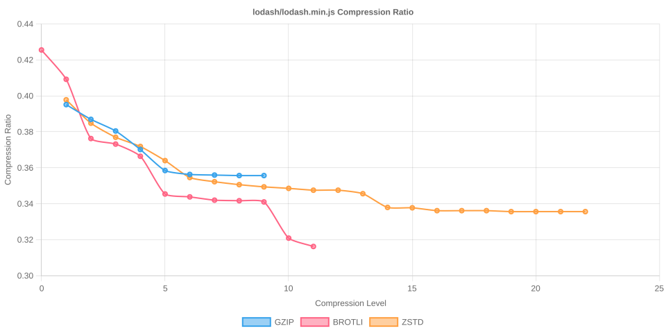

# Node Compression Benchmark

Last updated: 2026-02-24T21:23:21.800Z

This benchmark measures compression time, output size, and compression ratios for several popular npm packages across all gzip, Brotli, and Zstandard compression levels.

## jquery/dist/jquery.min.js

- Original size: 78,748 bytes
- Chart: 

| Algorithm | Level | Time (ms) | Size (bytes) | Compression Ratio |
| --- | --- | --- | --- | --- |
| gzip | 1 | 0.928 | 31,033 | 0.3941 |
| gzip | 2 | 1.032 | 30,134 | 0.3827 |
| gzip | 3 | 1.093 | 29,671 | 0.3768 |
| gzip | 4 | 1.230 | 28,457 | 0.3614 |
| gzip | 5 | 1.582 | 27,721 | 0.3520 |
| gzip | 6 | 1.847 | 27,584 | 0.3503 |
| gzip | 7 | 2.006 | 27,547 | 0.3498 |
| gzip | 8 | 2.317 | 27,530 | 0.3496 |
| gzip | 9 | 2.316 | 27,530 | 0.3496 |
| brotli | 0 | 0.350 | 33,111 | 0.4205 |
| brotli | 1 | 0.502 | 31,803 | 0.4039 |
| brotli | 2 | 0.849 | 29,394 | 0.3733 |
| brotli | 3 | 0.941 | 29,072 | 0.3692 |
| brotli | 4 | 1.497 | 28,392 | 0.3605 |
| brotli | 5 | 2.112 | 27,013 | 0.3430 |
| brotli | 6 | 2.228 | 26,844 | 0.3409 |
| brotli | 7 | 4.008 | 26,773 | 0.3400 |
| brotli | 8 | 2.747 | 26,725 | 0.3394 |
| brotli | 9 | 6.912 | 26,711 | 0.3392 |
| brotli | 10 | 34.593 | 25,340 | 0.3218 |
| brotli | 11 | 104.570 | 24,992 | 0.3174 |
| zstd | 1 | 0.340 | 31,062 | 0.3944 |
| zstd | 2 | 0.421 | 30,069 | 0.3818 |
| zstd | 3 | 0.429 | 29,214 | 0.3710 |
| zstd | 4 | 0.534 | 29,108 | 0.3696 |
| zstd | 5 | 1.048 | 28,349 | 0.3600 |
| zstd | 6 | 1.616 | 27,592 | 0.3504 |
| zstd | 7 | 1.889 | 27,383 | 0.3477 |
| zstd | 8 | 1.991 | 27,237 | 0.3459 |
| zstd | 9 | 2.180 | 27,118 | 0.3444 |
| zstd | 10 | 2.425 | 27,062 | 0.3437 |
| zstd | 11 | 4.190 | 26,969 | 0.3425 |
| zstd | 12 | 4.441 | 26,970 | 0.3425 |
| zstd | 13 | 6.437 | 26,867 | 0.3412 |
| zstd | 14 | 8.863 | 26,432 | 0.3357 |
| zstd | 15 | 9.047 | 26,420 | 0.3355 |
| zstd | 16 | 12.279 | 26,336 | 0.3344 |
| zstd | 17 | 12.323 | 26,336 | 0.3344 |
| zstd | 18 | 12.322 | 26,336 | 0.3344 |
| zstd | 19 | 23.105 | 26,282 | 0.3337 |
| zstd | 20 | 23.129 | 26,282 | 0.3337 |
| zstd | 21 | 23.298 | 26,282 | 0.3337 |
| zstd | 22 | 23.172 | 26,282 | 0.3337 |

## @expo-google-fonts/noto-sans-jp/400Regular/NotoSansJP_400Regular.ttf

- Original size: 5,472,784 bytes
- Chart: 

| Algorithm | Level | Time (ms) | Size (bytes) | Compression Ratio |
| --- | --- | --- | --- | --- |
| gzip | 1 | 84.377 | 3,332,519 | 0.6089 |
| gzip | 2 | 87.469 | 3,287,937 | 0.6008 |
| gzip | 3 | 92.352 | 3,262,028 | 0.5960 |
| gzip | 4 | 104.836 | 3,213,095 | 0.5871 |
| gzip | 5 | 119.470 | 3,166,204 | 0.5785 |
| gzip | 6 | 134.076 | 3,156,147 | 0.5767 |
| gzip | 7 | 142.703 | 3,154,131 | 0.5763 |
| gzip | 8 | 163.083 | 3,153,066 | 0.5761 |
| gzip | 9 | 172.170 | 3,153,021 | 0.5761 |
| brotli | 0 | 19.729 | 3,488,111 | 0.6374 |
| brotli | 1 | 27.440 | 3,325,102 | 0.6076 |
| brotli | 2 | 48.460 | 3,247,965 | 0.5935 |
| brotli | 3 | 61.043 | 3,210,322 | 0.5866 |
| brotli | 4 | 91.158 | 3,052,068 | 0.5577 |
| brotli | 5 | 232.031 | 2,942,981 | 0.5377 |
| brotli | 6 | 321.610 | 2,886,204 | 0.5274 |
| brotli | 7 | 496.187 | 2,841,359 | 0.5192 |
| brotli | 8 | 611.745 | 2,823,303 | 0.5159 |
| brotli | 9 | 767.196 | 2,793,428 | 0.5104 |
| brotli | 10 | 6112.367 | 2,728,891 | 0.4986 |
| brotli | 11 | 13100.625 | 2,651,692 | 0.4845 |
| zstd | 1 | 18.293 | 3,342,771 | 0.6108 |
| zstd | 2 | 22.847 | 3,233,695 | 0.5909 |
| zstd | 3 | 36.531 | 3,139,155 | 0.5736 |
| zstd | 4 | 39.407 | 3,084,237 | 0.5636 |
| zstd | 5 | 65.948 | 3,021,906 | 0.5522 |
| zstd | 6 | 78.576 | 2,994,480 | 0.5472 |
| zstd | 7 | 85.003 | 2,946,701 | 0.5384 |
| zstd | 8 | 98.494 | 2,941,269 | 0.5374 |
| zstd | 9 | 95.760 | 2,901,056 | 0.5301 |
| zstd | 10 | 126.541 | 2,879,072 | 0.5261 |
| zstd | 11 | 148.201 | 2,868,731 | 0.5242 |
| zstd | 12 | 184.946 | 2,866,083 | 0.5237 |
| zstd | 13 | 379.755 | 2,864,062 | 0.5233 |
| zstd | 14 | 426.254 | 2,852,038 | 0.5211 |
| zstd | 15 | 503.994 | 2,844,247 | 0.5197 |
| zstd | 16 | 643.127 | 2,803,911 | 0.5123 |
| zstd | 17 | 791.132 | 2,756,112 | 0.5036 |
| zstd | 18 | 1131.314 | 2,713,297 | 0.4958 |
| zstd | 19 | 1247.936 | 2,710,797 | 0.4953 |
| zstd | 20 | 1285.139 | 2,710,797 | 0.4953 |
| zstd | 21 | 1322.355 | 2,710,761 | 0.4953 |
| zstd | 22 | 1327.069 | 2,710,761 | 0.4953 |

## react/cjs/react.production.js

- Original size: 17,217 bytes
- Chart: 

| Algorithm | Level | Time (ms) | Size (bytes) | Compression Ratio |
| --- | --- | --- | --- | --- |
| gzip | 1 | 0.134 | 4,987 | 0.2897 |
| gzip | 2 | 0.145 | 4,874 | 0.2831 |
| gzip | 3 | 0.152 | 4,806 | 0.2791 |
| gzip | 4 | 0.188 | 4,530 | 0.2631 |
| gzip | 5 | 0.235 | 4,441 | 0.2579 |
| gzip | 6 | 0.271 | 4,425 | 0.2570 |
| gzip | 7 | 0.310 | 4,418 | 0.2566 |
| gzip | 8 | 0.457 | 4,419 | 0.2567 |
| gzip | 9 | 0.467 | 4,419 | 0.2567 |
| brotli | 0 | 0.064 | 5,235 | 0.3041 |
| brotli | 1 | 0.077 | 5,134 | 0.2982 |
| brotli | 2 | 0.139 | 4,741 | 0.2754 |
| brotli | 3 | 0.170 | 4,650 | 0.2701 |
| brotli | 4 | 0.277 | 4,555 | 0.2646 |
| brotli | 5 | 0.368 | 4,276 | 0.2484 |
| brotli | 6 | 0.374 | 4,275 | 0.2483 |
| brotli | 7 | 0.451 | 4,264 | 0.2477 |
| brotli | 8 | 0.469 | 4,257 | 0.2473 |
| brotli | 9 | 0.552 | 4,244 | 0.2465 |
| brotli | 10 | 6.971 | 3,969 | 0.2305 |
| brotli | 11 | 20.502 | 3,872 | 0.2249 |
| zstd | 1 | 0.064 | 4,923 | 0.2859 |
| zstd | 2 | 0.072 | 4,868 | 0.2827 |
| zstd | 3 | 0.091 | 4,717 | 0.2740 |
| zstd | 4 | 0.095 | 4,679 | 0.2718 |
| zstd | 5 | 0.184 | 4,519 | 0.2625 |
| zstd | 6 | 0.240 | 4,437 | 0.2577 |
| zstd | 7 | 0.303 | 4,437 | 0.2577 |
| zstd | 8 | 0.305 | 4,426 | 0.2571 |
| zstd | 9 | 0.353 | 4,420 | 0.2567 |
| zstd | 10 | 0.387 | 4,410 | 0.2561 |
| zstd | 11 | 0.661 | 4,393 | 0.2552 |
| zstd | 12 | 0.686 | 4,391 | 0.2550 |
| zstd | 13 | 0.926 | 4,382 | 0.2545 |
| zstd | 14 | 1.467 | 4,307 | 0.2502 |
| zstd | 15 | 1.554 | 4,303 | 0.2499 |
| zstd | 16 | 2.544 | 4,282 | 0.2487 |
| zstd | 17 | 2.718 | 4,281 | 0.2486 |
| zstd | 18 | 2.697 | 4,281 | 0.2486 |
| zstd | 19 | 5.306 | 4,264 | 0.2477 |
| zstd | 20 | 5.308 | 4,264 | 0.2477 |
| zstd | 21 | 5.285 | 4,264 | 0.2477 |
| zstd | 22 | 5.298 | 4,264 | 0.2477 |

## moment/min/moment.min.js

- Original size: 58,890 bytes
- Chart: 

| Algorithm | Level | Time (ms) | Size (bytes) | Compression Ratio |
| --- | --- | --- | --- | --- |
| gzip | 1 | 0.558 | 21,216 | 0.3603 |
| gzip | 2 | 0.609 | 20,666 | 0.3509 |
| gzip | 3 | 0.676 | 20,354 | 0.3456 |
| gzip | 4 | 0.796 | 19,475 | 0.3307 |
| gzip | 5 | 1.012 | 18,991 | 0.3225 |
| gzip | 6 | 1.219 | 18,892 | 0.3208 |
| gzip | 7 | 1.361 | 18,860 | 0.3203 |
| gzip | 8 | 1.621 | 18,845 | 0.3200 |
| gzip | 9 | 1.610 | 18,845 | 0.3200 |
| brotli | 0 | 0.214 | 22,733 | 0.3860 |
| brotli | 1 | 0.277 | 22,170 | 0.3765 |
| brotli | 2 | 0.524 | 20,291 | 0.3446 |
| brotli | 3 | 0.625 | 20,119 | 0.3416 |
| brotli | 4 | 0.972 | 19,713 | 0.3347 |
| brotli | 5 | 1.440 | 18,447 | 0.3132 |
| brotli | 6 | 1.500 | 18,343 | 0.3115 |
| brotli | 7 | 1.874 | 18,239 | 0.3097 |
| brotli | 8 | 2.014 | 18,216 | 0.3093 |
| brotli | 9 | 2.174 | 18,172 | 0.3086 |
| brotli | 10 | 25.871 | 17,405 | 0.2956 |
| brotli | 11 | 75.242 | 17,004 | 0.2887 |
| zstd | 1 | 0.214 | 21,483 | 0.3648 |
| zstd | 2 | 0.232 | 20,806 | 0.3533 |
| zstd | 3 | 0.284 | 20,298 | 0.3447 |
| zstd | 4 | 0.354 | 19,924 | 0.3383 |
| zstd | 5 | 0.743 | 19,309 | 0.3279 |
| zstd | 6 | 0.870 | 18,919 | 0.3213 |
| zstd | 7 | 1.055 | 18,815 | 0.3195 |
| zstd | 8 | 1.130 | 18,708 | 0.3177 |
| zstd | 9 | 1.269 | 18,638 | 0.3165 |
| zstd | 10 | 1.400 | 18,583 | 0.3156 |
| zstd | 11 | 2.444 | 18,520 | 0.3145 |
| zstd | 12 | 2.477 | 18,517 | 0.3144 |
| zstd | 13 | 3.715 | 18,417 | 0.3127 |
| zstd | 14 | 5.224 | 17,955 | 0.3049 |
| zstd | 15 | 5.561 | 17,942 | 0.3047 |
| zstd | 16 | 8.531 | 17,892 | 0.3038 |
| zstd | 17 | 8.821 | 17,892 | 0.3038 |
| zstd | 18 | 8.790 | 17,892 | 0.3038 |
| zstd | 19 | 17.357 | 17,845 | 0.3030 |
| zstd | 20 | 17.391 | 17,845 | 0.3030 |
| zstd | 21 | 17.415 | 17,845 | 0.3030 |
| zstd | 22 | 17.372 | 17,845 | 0.3030 |

## vue/dist/vue.global.prod.js

- Original size: 162,235 bytes
- Chart: 

| Algorithm | Level | Time (ms) | Size (bytes) | Compression Ratio |
| --- | --- | --- | --- | --- |
| gzip | 1 | 1.862 | 66,049 | 0.4071 |
| gzip | 2 | 2.008 | 64,487 | 0.3975 |
| gzip | 3 | 2.278 | 63,533 | 0.3916 |
| gzip | 4 | 2.715 | 61,240 | 0.3775 |
| gzip | 5 | 3.614 | 59,615 | 0.3675 |
| gzip | 6 | 4.390 | 59,346 | 0.3658 |
| gzip | 7 | 4.741 | 59,312 | 0.3656 |
| gzip | 8 | 4.940 | 59,292 | 0.3655 |
| gzip | 9 | 4.951 | 59,292 | 0.3655 |
| brotli | 0 | 0.633 | 70,293 | 0.4333 |
| brotli | 1 | 0.874 | 67,491 | 0.4160 |
| brotli | 2 | 1.603 | 62,288 | 0.3839 |
| brotli | 3 | 1.915 | 61,705 | 0.3803 |
| brotli | 4 | 2.919 | 60,550 | 0.3732 |
| brotli | 5 | 4.666 | 57,219 | 0.3527 |
| brotli | 6 | 5.129 | 56,833 | 0.3503 |
| brotli | 7 | 6.259 | 56,611 | 0.3489 |
| brotli | 8 | 6.736 | 56,544 | 0.3485 |
| brotli | 9 | 7.580 | 56,451 | 0.3480 |
| brotli | 10 | 96.814 | 53,770 | 0.3314 |
| brotli | 11 | 259.656 | 52,805 | 0.3255 |
| zstd | 1 | 0.657 | 65,400 | 0.4031 |
| zstd | 2 | 0.785 | 62,496 | 0.3852 |
| zstd | 3 | 0.998 | 62,016 | 0.3823 |
| zstd | 4 | 1.985 | 60,147 | 0.3707 |
| zstd | 5 | 2.169 | 59,645 | 0.3676 |
| zstd | 6 | 2.626 | 58,769 | 0.3622 |
| zstd | 7 | 2.986 | 57,955 | 0.3572 |
| zstd | 8 | 3.629 | 57,497 | 0.3544 |
| zstd | 9 | 4.219 | 57,239 | 0.3528 |
| zstd | 10 | 5.074 | 57,126 | 0.3521 |
| zstd | 11 | 8.375 | 56,864 | 0.3505 |
| zstd | 12 | 8.570 | 56,852 | 0.3504 |
| zstd | 13 | 14.711 | 55,876 | 0.3444 |
| zstd | 14 | 17.384 | 55,459 | 0.3418 |
| zstd | 15 | 18.820 | 55,419 | 0.3416 |
| zstd | 16 | 24.897 | 55,254 | 0.3406 |
| zstd | 17 | 24.984 | 55,254 | 0.3406 |
| zstd | 18 | 43.422 | 55,173 | 0.3401 |
| zstd | 19 | 44.585 | 55,173 | 0.3401 |
| zstd | 20 | 42.998 | 55,173 | 0.3401 |
| zstd | 21 | 43.206 | 55,173 | 0.3401 |
| zstd | 22 | 43.143 | 55,173 | 0.3401 |

## lodash/lodash.min.js

- Original size: 73,320 bytes
- Chart: 

| Algorithm | Level | Time (ms) | Size (bytes) | Compression Ratio |
| --- | --- | --- | --- | --- |
| gzip | 1 | 0.779 | 28,961 | 0.3950 |
| gzip | 2 | 0.846 | 28,338 | 0.3865 |
| gzip | 3 | 0.968 | 27,864 | 0.3800 |
| gzip | 4 | 1.092 | 27,117 | 0.3698 |
| gzip | 5 | 1.418 | 26,252 | 0.3580 |
| gzip | 6 | 1.789 | 26,089 | 0.3558 |
| gzip | 7 | 2.109 | 26,063 | 0.3555 |
| gzip | 8 | 2.860 | 26,045 | 0.3552 |
| gzip | 9 | 2.865 | 26,045 | 0.3552 |
| brotli | 0 | 0.273 | 31,176 | 0.4252 |
| brotli | 1 | 0.376 | 29,968 | 0.4087 |
| brotli | 2 | 0.677 | 27,578 | 0.3761 |
| brotli | 3 | 0.802 | 27,378 | 0.3734 |
| brotli | 4 | 1.319 | 26,850 | 0.3662 |
| brotli | 5 | 2.008 | 25,310 | 0.3452 |
| brotli | 6 | 2.125 | 25,195 | 0.3436 |
| brotli | 7 | 2.565 | 25,070 | 0.3419 |
| brotli | 8 | 2.747 | 25,038 | 0.3415 |
| brotli | 9 | 3.225 | 25,002 | 0.3410 |
| brotli | 10 | 38.102 | 23,593 | 0.3218 |
| brotli | 11 | 103.124 | 23,117 | 0.3153 |
| zstd | 1 | 0.266 | 29,125 | 0.3972 |
| zstd | 2 | 0.303 | 28,182 | 0.3844 |
| zstd | 3 | 0.363 | 27,635 | 0.3769 |
| zstd | 4 | 0.466 | 27,244 | 0.3716 |
| zstd | 5 | 0.883 | 26,643 | 0.3634 |
| zstd | 6 | 1.125 | 25,965 | 0.3541 |
| zstd | 7 | 1.355 | 25,807 | 0.3520 |
| zstd | 8 | 1.484 | 25,693 | 0.3504 |
| zstd | 9 | 1.652 | 25,603 | 0.3492 |
| zstd | 10 | 1.961 | 25,540 | 0.3483 |
| zstd | 11 | 3.260 | 25,466 | 0.3473 |
| zstd | 12 | 3.440 | 25,466 | 0.3473 |
| zstd | 13 | 5.327 | 25,330 | 0.3455 |
| zstd | 14 | 7.566 | 24,764 | 0.3378 |
| zstd | 15 | 7.846 | 24,754 | 0.3376 |
| zstd | 16 | 10.901 | 24,629 | 0.3359 |
| zstd | 17 | 10.881 | 24,629 | 0.3359 |
| zstd | 18 | 10.869 | 24,629 | 0.3359 |
| zstd | 19 | 20.685 | 24,592 | 0.3354 |
| zstd | 20 | 20.736 | 24,592 | 0.3354 |
| zstd | 21 | 20.751 | 24,592 | 0.3354 |
| zstd | 22 | 20.714 | 24,592 | 0.3354 |

## normalize.css/normalize.css

- Original size: 6,138 bytes
- Chart: 

| Algorithm | Level | Time (ms) | Size (bytes) | Compression Ratio |
| --- | --- | --- | --- | --- |
| gzip | 1 | 0.051 | 1,915 | 0.3120 |
| gzip | 2 | 0.053 | 1,866 | 0.3040 |
| gzip | 3 | 0.046 | 1,845 | 0.3006 |
| gzip | 4 | 0.063 | 1,758 | 0.2864 |
| gzip | 5 | 0.067 | 1,722 | 0.2805 |
| gzip | 6 | 0.058 | 1,722 | 0.2805 |
| gzip | 7 | 0.062 | 1,722 | 0.2805 |
| gzip | 8 | 0.064 | 1,720 | 0.2802 |
| gzip | 9 | 0.058 | 1,720 | 0.2802 |
| brotli | 0 | 0.031 | 2,089 | 0.3403 |
| brotli | 1 | 0.033 | 2,056 | 0.3350 |
| brotli | 2 | 0.059 | 1,909 | 0.3110 |
| brotli | 3 | 0.070 | 1,834 | 0.2988 |
| brotli | 4 | 0.121 | 1,694 | 0.2760 |
| brotli | 5 | 0.135 | 1,557 | 0.2537 |
| brotli | 6 | 0.123 | 1,559 | 0.2540 |
| brotli | 7 | 0.156 | 1,555 | 0.2533 |
| brotli | 8 | 0.144 | 1,555 | 0.2533 |
| brotli | 9 | 0.178 | 1,557 | 0.2537 |
| brotli | 10 | 2.971 | 1,431 | 0.2331 |
| brotli | 11 | 7.792 | 1,398 | 0.2278 |
| zstd | 1 | 0.038 | 1,906 | 0.3105 |
| zstd | 2 | 0.039 | 1,941 | 0.3162 |
| zstd | 3 | 0.043 | 1,853 | 0.3019 |
| zstd | 4 | 0.054 | 1,752 | 0.2854 |
| zstd | 5 | 0.073 | 1,743 | 0.2840 |
| zstd | 6 | 0.084 | 1,730 | 0.2819 |
| zstd | 7 | 0.087 | 1,729 | 0.2817 |
| zstd | 8 | 0.081 | 1,729 | 0.2817 |
| zstd | 9 | 0.170 | 1,728 | 0.2815 |
| zstd | 10 | 0.141 | 1,728 | 0.2815 |
| zstd | 11 | 0.285 | 1,722 | 0.2805 |
| zstd | 12 | 0.379 | 1,718 | 0.2799 |
| zstd | 13 | 0.627 | 1,703 | 0.2775 |
| zstd | 14 | 0.660 | 1,700 | 0.2770 |
| zstd | 15 | 0.846 | 1,700 | 0.2770 |
| zstd | 16 | 1.257 | 1,696 | 0.2763 |
| zstd | 17 | 1.524 | 1,697 | 0.2765 |
| zstd | 18 | 1.626 | 1,697 | 0.2765 |
| zstd | 19 | 1.627 | 1,697 | 0.2765 |
| zstd | 20 | 1.623 | 1,697 | 0.2765 |
| zstd | 21 | 1.626 | 1,697 | 0.2765 |
| zstd | 22 | 1.627 | 1,697 | 0.2765 |

## bootstrap/dist/css/bootstrap.min.css

- Original size: 232,111 bytes
- Chart: 

| Algorithm | Level | Time (ms) | Size (bytes) | Compression Ratio |
| --- | --- | --- | --- | --- |
| gzip | 1 | 1.080 | 41,452 | 0.1786 |
| gzip | 2 | 1.136 | 38,418 | 0.1655 |
| gzip | 3 | 1.322 | 36,152 | 0.1558 |
| gzip | 4 | 1.719 | 33,830 | 0.1457 |
| gzip | 5 | 2.169 | 31,408 | 0.1353 |
| gzip | 6 | 2.891 | 30,823 | 0.1328 |
| gzip | 7 | 3.538 | 30,680 | 0.1322 |
| gzip | 8 | 4.715 | 30,670 | 0.1321 |
| gzip | 9 | 4.774 | 30,669 | 0.1321 |
| brotli | 0 | 0.433 | 43,268 | 0.1864 |
| brotli | 1 | 0.608 | 39,941 | 0.1721 |
| brotli | 2 | 1.146 | 36,514 | 0.1573 |
| brotli | 3 | 1.400 | 34,781 | 0.1498 |
| brotli | 4 | 2.009 | 33,048 | 0.1424 |
| brotli | 5 | 2.888 | 28,253 | 0.1217 |
| brotli | 6 | 3.184 | 27,431 | 0.1182 |
| brotli | 7 | 3.977 | 26,971 | 0.1162 |
| brotli | 8 | 4.491 | 26,813 | 0.1155 |
| brotli | 9 | 5.483 | 26,569 | 0.1145 |
| brotli | 10 | 98.656 | 23,482 | 0.1012 |
| brotli | 11 | 324.735 | 22,970 | 0.0990 |
| zstd | 1 | 0.497 | 35,549 | 0.1532 |
| zstd | 2 | 0.541 | 34,301 | 0.1478 |
| zstd | 3 | 0.592 | 34,393 | 0.1482 |
| zstd | 4 | 1.717 | 30,973 | 0.1334 |
| zstd | 5 | 1.953 | 29,744 | 0.1281 |
| zstd | 6 | 2.383 | 29,727 | 0.1281 |
| zstd | 7 | 2.428 | 29,710 | 0.1280 |
| zstd | 8 | 2.872 | 28,645 | 0.1234 |
| zstd | 9 | 3.501 | 28,235 | 0.1216 |
| zstd | 10 | 4.609 | 28,044 | 0.1208 |
| zstd | 11 | 8.197 | 27,895 | 0.1202 |
| zstd | 12 | 10.031 | 27,805 | 0.1198 |
| zstd | 13 | 17.330 | 27,283 | 0.1175 |
| zstd | 14 | 21.683 | 26,828 | 0.1156 |
| zstd | 15 | 27.791 | 26,465 | 0.1140 |
| zstd | 16 | 56.376 | 26,071 | 0.1123 |
| zstd | 17 | 64.342 | 26,041 | 0.1122 |
| zstd | 18 | 85.339 | 26,008 | 0.1120 |
| zstd | 19 | 96.636 | 26,015 | 0.1121 |
| zstd | 20 | 100.910 | 26,014 | 0.1121 |
| zstd | 21 | 101.079 | 26,014 | 0.1121 |
| zstd | 22 | 101.167 | 26,014 | 0.1121 |

## cities.json/cities.json

- Original size: 21,953,388 bytes
- Chart: 

| Algorithm | Level | Time (ms) | Size (bytes) | Compression Ratio |
| --- | --- | --- | --- | --- |
| gzip | 1 | 89.271 | 3,751,261 | 0.1709 |
| gzip | 2 | 89.552 | 3,528,967 | 0.1607 |
| gzip | 3 | 107.875 | 3,370,979 | 0.1536 |
| gzip | 4 | 143.548 | 3,328,999 | 0.1516 |
| gzip | 5 | 168.916 | 3,081,077 | 0.1403 |
| gzip | 6 | 214.000 | 3,020,114 | 0.1376 |
| gzip | 7 | 320.214 | 2,903,542 | 0.1323 |
| gzip | 8 | 903.367 | 2,794,554 | 0.1273 |
| gzip | 9 | 1200.930 | 2,783,224 | 0.1268 |
| brotli | 0 | 42.361 | 4,059,162 | 0.1849 |
| brotli | 1 | 58.255 | 3,701,732 | 0.1686 |
| brotli | 2 | 107.271 | 3,357,390 | 0.1529 |
| brotli | 3 | 128.494 | 3,265,779 | 0.1488 |
| brotli | 4 | 165.937 | 3,125,451 | 0.1424 |
| brotli | 5 | 335.270 | 2,774,227 | 0.1264 |
| brotli | 6 | 405.799 | 2,738,409 | 0.1247 |
| brotli | 7 | 533.945 | 2,707,850 | 0.1233 |
| brotli | 8 | 672.034 | 2,687,842 | 0.1224 |
| brotli | 9 | 931.146 | 2,673,141 | 0.1218 |
| brotli | 10 | 12842.963 | 2,315,778 | 0.1055 |
| brotli | 11 | 39351.553 | 2,180,828 | 0.0993 |
| zstd | 1 | 44.073 | 3,380,894 | 0.1540 |
| zstd | 2 | 54.262 | 3,402,497 | 0.1550 |
| zstd | 3 | 67.211 | 3,449,952 | 0.1571 |
| zstd | 4 | 69.946 | 3,454,596 | 0.1574 |
| zstd | 5 | 158.834 | 3,140,901 | 0.1431 |
| zstd | 6 | 205.754 | 2,932,855 | 0.1336 |
| zstd | 7 | 230.577 | 2,887,559 | 0.1315 |
| zstd | 8 | 288.533 | 2,785,481 | 0.1269 |
| zstd | 9 | 300.438 | 2,795,218 | 0.1273 |
| zstd | 10 | 402.420 | 2,753,222 | 0.1254 |
| zstd | 11 | 575.789 | 2,720,543 | 0.1239 |
| zstd | 12 | 628.133 | 2,720,412 | 0.1239 |
| zstd | 13 | 795.787 | 2,680,256 | 0.1221 |
| zstd | 14 | 1026.663 | 2,654,484 | 0.1209 |
| zstd | 15 | 1298.976 | 2,651,235 | 0.1208 |
| zstd | 16 | 3121.136 | 2,535,036 | 0.1155 |
| zstd | 17 | 3493.526 | 2,466,410 | 0.1123 |
| zstd | 18 | 5079.230 | 2,453,943 | 0.1118 |
| zstd | 19 | 9298.901 | 2,384,554 | 0.1086 |
| zstd | 20 | 9514.174 | 2,382,448 | 0.1085 |
| zstd | 21 | 9553.808 | 2,382,300 | 0.1085 |
| zstd | 22 | 9963.571 | 2,378,818 | 0.1084 |

## tailwindcss/theme.css

- Original size: 19,480 bytes
- Chart: 

| Algorithm | Level | Time (ms) | Size (bytes) | Compression Ratio |
| --- | --- | --- | --- | --- |
| gzip | 1 | 0.138 | 5,506 | 0.2826 |
| gzip | 2 | 0.152 | 5,424 | 0.2784 |
| gzip | 3 | 0.173 | 5,356 | 0.2749 |
| gzip | 4 | 0.210 | 5,145 | 0.2641 |
| gzip | 5 | 0.269 | 4,896 | 0.2513 |
| gzip | 6 | 0.363 | 4,884 | 0.2507 |
| gzip | 7 | 0.482 | 4,857 | 0.2493 |
| gzip | 8 | 0.637 | 4,859 | 0.2494 |
| gzip | 9 | 0.640 | 4,859 | 0.2494 |
| brotli | 0 | 0.068 | 6,028 | 0.3094 |
| brotli | 1 | 0.078 | 5,737 | 0.2945 |
| brotli | 2 | 0.146 | 4,944 | 0.2538 |
| brotli | 3 | 0.179 | 4,930 | 0.2531 |
| brotli | 4 | 0.298 | 4,898 | 0.2514 |
| brotli | 5 | 0.448 | 4,581 | 0.2352 |
| brotli | 6 | 0.503 | 4,570 | 0.2346 |
| brotli | 7 | 0.601 | 4,564 | 0.2343 |
| brotli | 8 | 0.658 | 4,561 | 0.2341 |
| brotli | 9 | 0.792 | 4,553 | 0.2337 |
| brotli | 10 | 7.365 | 3,934 | 0.2020 |
| brotli | 11 | 23.653 | 3,824 | 0.1963 |
| zstd | 1 | 0.068 | 5,379 | 0.2761 |
| zstd | 2 | 0.079 | 5,176 | 0.2657 |
| zstd | 3 | 0.097 | 5,169 | 0.2653 |
| zstd | 4 | 0.104 | 5,154 | 0.2646 |
| zstd | 5 | 0.234 | 5,074 | 0.2605 |
| zstd | 6 | 0.282 | 4,797 | 0.2463 |
| zstd | 7 | 0.314 | 4,702 | 0.2414 |
| zstd | 8 | 0.357 | 4,696 | 0.2411 |
| zstd | 9 | 0.411 | 4,690 | 0.2408 |
| zstd | 10 | 0.541 | 4,691 | 0.2408 |
| zstd | 11 | 0.631 | 4,689 | 0.2407 |
| zstd | 12 | 0.682 | 4,687 | 0.2406 |
| zstd | 13 | 1.026 | 4,806 | 0.2467 |
| zstd | 14 | 1.813 | 4,447 | 0.2283 |
| zstd | 15 | 1.914 | 4,446 | 0.2282 |
| zstd | 16 | 2.942 | 4,367 | 0.2242 |
| zstd | 17 | 2.925 | 4,367 | 0.2242 |
| zstd | 18 | 2.927 | 4,367 | 0.2242 |
| zstd | 19 | 5.715 | 4,348 | 0.2232 |
| zstd | 20 | 5.786 | 4,348 | 0.2232 |
| zstd | 21 | 5.777 | 4,348 | 0.2232 |
| zstd | 22 | 5.760 | 4,348 | 0.2232 |
